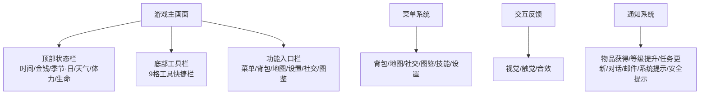
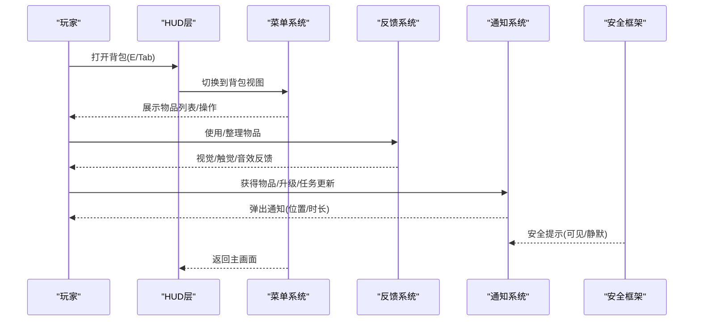
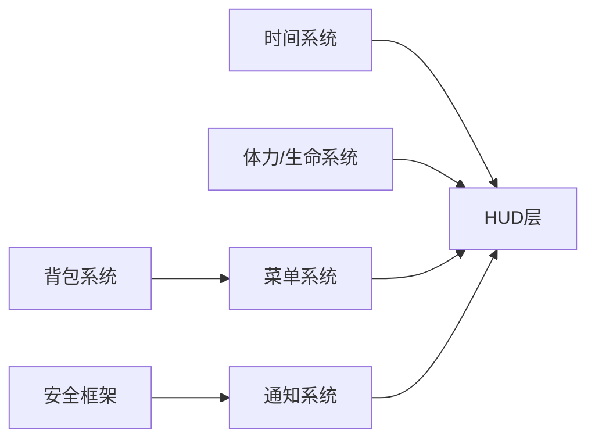

# UI/UX设计规范

<cite>
**本文引用的文件**   
- [gdd.md](file://gdd.md)
</cite>

## 目录
1. [引言](#引言)
2. [项目结构](#项目结构)
3. [核心组件](#核心组件)
4. [架构总览](#架构总览)
5. [详细组件分析](#详细组件分析)
6. [依赖分析](#依赖分析)
7. [性能考虑](#性能考虑)
8. [故障排查指南](#故障排查指南)
9. [结论](#结论)
10. [附录](#附录)

## 引言
本规范面向《山野小村》的UI/UX设计与实现，目标是为设计师与开发者提供一致的设计语言、交互标准与可访问性要求。文档基于游戏设计文档（GDD）中“第六部分：UI/UX 设计规范”及相关系统约束进行提炼与扩展，覆盖HUD布局、界面元素规范、交互反馈、像素美术风格统一、响应式适配、触屏与键鼠统一体验、颜色无障碍支持、字体可读性与界面可访问性、组件设计规范、动画过渡标准、用户引导流程、多语言支持与本地化等关键主题。

## 项目结构
本项目仓库包含一个核心设计文档 gdd.md，其中定义了游戏的整体规则与UI/UX规范。UI/UX相关章节集中在“第六部分”，并与时间、体力、背包、菜单、通知、安全提示等系统紧密关联。

图表来源
- [gdd.md:1300-1318](file://gdd.md#L1300-L1318)
- [gdd.md:1320-1345](file://gdd.md#L1320-L1345)
- [gdd.md:1361-1404](file://gdd.md#L1361-L1404)

章节来源
- [gdd.md:1300-1318](file://gdd.md#L1300-L1318)
- [gdd.md:1320-1345](file://gdd.md#L1320-L1345)
- [gdd.md:1361-1404](file://gdd.md#L1361-L1404)

## 核心组件
本节聚焦UI/UX的核心组件与规范要点，确保在PC与移动端保持一致体验。

- HUD布局
  - 顶部状态栏：显示时间、金钱、季节·日、天气、体力条、生命值。
  - 底部工具栏：9格工具快捷栏，当前选中高亮。
  - 功能入口栏：菜单、背包、地图、设置、社交、图鉴。
- 菜单系统
  - 快捷键映射：E/Tab（背包）、M（地图）、F（社交）、B（图鉴）、Esc（设置）、K（技能）。
  - 状态流转：从主画面进入各子菜单后返回；读档/退出需确认。
- 交互系统
  - 键鼠：WASD移动、左键/E确认、右键/Esc取消、滚轮/数字键切换工具、Shift奔跑、Esc打开菜单。
  - 触屏：虚拟摇杆/点击移动、点击确认、双指点击取消、工具栏点击切换、双击摇杆奔跑、专用按钮打开菜单。
  - 手柄：左摇杆移动、A确认、B取消、Y背包、方向键上地图、X使用工具、LB/RB切换工具、左摇杆按下奔跑、Start打开菜单。
- 交互反馈规范
  - 视觉：翻地土块粒子、浇水水滴、收获弹出图标、砍树木屑、采矿碎石、战斗命中闪光+伤害数字、钓鱼波纹+感叹号、拾取飞入背包、UI点击高亮。
  - 触觉（手机）：短震动/轻触/强震动按操作强度分级。
- 通知系统
  - 类型与位置：右下角物品获得、屏幕中央等级提升、左侧任务栏持续、对话框按需、信封图标邮件、屏幕上方系统提示、红色边框+日志的安全提示。
  - 持续时间：2s/3s/按需/5s等。
- 安全提示规范
  - 可见类：存档损坏并恢复、网络连接断开并重连、时间跳跃异常已修正。
  - 静默类：帧时间超限已跳过、渲染裁剪已触发、速率限制已生效、数值边界已截断。

章节来源
- [gdd.md:1300-1318](file://gdd.md#L1300-L1318)
- [gdd.md:1320-1345](file://gdd.md#L1320-L1345)
- [gdd.md:1347-1360](file://gdd.md#L1347-L1360)
- [gdd.md:1361-1404](file://gdd.md#L1361-L1404)

## 架构总览
UI/UX子系统围绕“主画面—菜单—反馈—通知”的闭环展开，同时与安全框架联动，确保异常时以明确方式提示或静默保护。

图表来源
- [gdd.md:1320-1345](file://gdd.md#L1320-L1345)
- [gdd.md:1361-1404](file://gdd.md#L1361-L1404)

## 详细组件分析

### HUD布局与区域划分
- 顶部状态栏
  - 内容：时间、金钱、季节·日、天气、体力条、生命值。
  - 行为：随时间系统推进实时更新；体力/生命变化即时刷新。
- 底部工具栏
  - 9格工具快捷栏，当前选中高亮；支持数字键/滚轮切换。
- 功能入口栏
  - 菜单/背包/地图/设置/社交/图鉴；对应快捷键与触屏按钮。

章节来源
- [gdd.md:1300-1318](file://gdd.md#L1300-L1318)

### 菜单系统与状态流转
- 快捷键映射与触屏/手柄对应关系。
- 状态流转：主画面→各子菜单→返回；读档/退出需二次确认。
- 安全关联：设置涉及存档与安全防护开关。

章节来源
- [gdd.md:1320-1345](file://gdd.md#L1320-L1345)

### 交互系统（键鼠/触屏/手柄）
- 移动：WASD/虚拟摇杆/左摇杆。
- 确认/取消：左键/E/A vs 右键/Esc/B。
- 背包/地图/社交/图鉴/技能/设置：统一快捷键与触屏/手柄映射。
- 使用工具：左键/点击目标/X键。
- 切换工具：滚轮/数字键/工具栏点击/LB/RB。
- 奔跑：左Shift/双击摇杆/左摇杆按下。
- 菜单：Esc/菜单按钮/Start键。

章节来源
- [gdd.md:1347-1360](file://gdd.md#L1347-L1360)

### 交互反馈规范
- 视觉反馈：动作对应的粒子、图标弹出、命中闪光、波纹等。
- 触觉反馈：按操作强度分级（短震/轻触/强震）。
- 音效配合：UI点击、工具使用、战斗命中、钓鱼上钩等。

章节来源
- [gdd.md:1361-1375](file://gdd.md#L1361-L1375)

### 通知系统与安全提示
- 通知类型与位置：物品获得（右下）、等级提升（中央）、任务更新（左侧）、对话（对话框）、邮件（信封）、系统提示（上方）、安全提示（红框+日志）。
- 持续时间：2s/3s/按需/5s。
- 安全提示分类：可见类（存档/网络/时间异常）与静默类（帧时间/渲染/速率/数值边界）。

章节来源
- [gdd.md:1376-1404](file://gdd.md#L1376-L1404)

### 像素美术风格统一要求
- Tile基准：16×16像素为地图最小单位。
- 有限色板：遵循全局色板约束，保持风格一致性。
- 手绘风格准则：线条清晰、细节适度、避免过度复杂纹理。
- 资源命名与加载：遵循音频/资源命名规范，避免重复与冲突。

章节来源
- [gdd.md:2103](file://gdd.md#L2103)
- [gdd.md:1425-1448](file://gdd.md#L1425-L1448)

### 响应式设计适配与统一体验
- 平台：PC（Tauri）与手机（Capacitor）共用一套代码。
- 输入统一：键鼠/触屏/手柄映射一致，保证操作等效。
- 布局自适应：HUD与菜单在不同分辨率下保持可读性与可用性。
- 性能目标：PC/手机均稳定60fps，加载时间合理。

章节来源
- [gdd.md:41-42](file://gdd.md#L41-L42)
- [gdd.md:1347-1360](file://gdd.md#L1347-L1360)
- [gdd.md:1773-1779](file://gdd.md#L1773-L1779)

### 颜色无障碍支持与字体可读性
- 色盲模式：UI颜色方案可切换（红绿/蓝黄/全色）。
- 文字大小：S/M/L三档缩放。
- 字幕：所有对话与音效提示有字幕。
- 阅读速度：对话手动翻页，不自动消失。

章节来源
- [gdd.md:1989-2000](file://gdd.md#L1989-L2000)

### 界面可访问性设计
- 可重映射键位：所有键鼠操作自定义绑定。
- 操作简化：“一键操作”长按执行连续动作。
- 闪屏警告：片头光敏性癫痫警告。
- 震动反馈：手机端支持。

章节来源
- [gdd.md:1989-2000](file://gdd.md#L1989-L2000)

### 组件设计规范
- 按钮与面板：统一圆角/阴影/描边风格，符合像素风；点击高亮与音效反馈。
- 图标与Sprite：遵循16×16 Tile基准，有限色板，手绘风格。
- 文本与排版：字号分级（标题/正文/提示），行距适中，对比度充足。
- 动效与过渡：淡入淡出、滑动、缩放；时长控制在150–300ms，缓动曲线自然。
- 状态指示：启用/禁用/加载中/错误态均有明确视觉差异。

章节来源
- [gdd.md:1361-1404](file://gdd.md#L1361-L1404)
- [gdd.md:1425-1448](file://gdd.md#L1425-L1448)

### 动画过渡标准
- 菜单切换：淡入淡出+轻微位移，时长约200ms。
- 通知弹出：向上滑入+渐显，时长约150ms。
- 工具使用：命中闪光/粒子爆发，时长约100–200ms。
- 页面返回：反向过渡，时长约200ms。
- 缓冲与回弹：避免过强弹性，保持舒适节奏。

章节来源
- [gdd.md:1361-1404](file://gdd.md#L1361-L1404)

### 用户引导流程
- 第一天引导：到达农场→认识工具→第一次翻地/播种/浇水→认识体力条→认识时间→第一次睡觉（自动保存说明）。
- 后续渐进引导：首次进小镇/砍树/采矿/钓鱼/战斗/动物/工匠设备/节日/等级5专精选择/社区中心献祭。
- 原则：不强制、渐进式、做中学、尊重老手（可跳过基础教程）。

章节来源
- [gdd.md:1681-1717](file://gdd.md#L1681-L1717)

### 多语言支持与本地化
- 首发语言：简体中文。
- 后续扩展：英文视市场反馈。
- 本地化考虑：文本外置、占位符规范、日期/货币/单位格式化、UI空间预留（长文本换行）。

章节来源
- [gdd.md:2002-2008](file://gdd.md#L2002-L2008)

## 依赖分析
UI/UX子系统与以下系统存在直接依赖关系：
- 时间系统：驱动HUD时间与昼夜氛围。
- 体力/生命系统：驱动状态条与提示。
- 背包系统：驱动物品管理与快速栏。
- 菜单系统：驱动各子界面与状态流转。
- 安全框架：驱动安全提示与静默保护。

图表来源
- [gdd.md:1300-1318](file://gdd.md#L1300-L1318)
- [gdd.md:1320-1345](file://gdd.md#L1320-L1345)
- [gdd.md:1376-1404](file://gdd.md#L1376-L1404)

章节来源
- [gdd.md:1300-1318](file://gdd.md#L1300-L1318)
- [gdd.md:1320-1345](file://gdd.md#L1320-L1345)
- [gdd.md:1376-1404](file://gdd.md#L1376-L1404)

## 性能考虑
- 目标帧率：PC/手机均为60fps。
- 加载时间：PC < 3s，手机 < 5s。
- 内存占用：PC < 500MB，手机 < 200MB。
- 包体大小：< 50MB。
- 优化策略：减少不必要的重绘、控制粒子/动画数量、延迟加载非关键资源。

章节来源
- [gdd.md:1773-1779](file://gdd.md#L1773-L1779)

## 故障排查指南
- 常见UI问题
  - 通知未显示：检查通知队列与可见/静默分类配置。
  - 菜单无法返回：检查状态流转与确认逻辑。
  - 触控无反馈：检查触屏映射与震动权限。
- 安全提示处理
  - 可见类：根据提示进行存档恢复/网络重连/时间修正。
  - 静默类：查看日志通道（safety/performance/network/save）定位根因。
- 日志与诊断
  - 日志级别：debug/info/warn/error/fatal。
  - 通道：gameplay/network/safety/performance/save。
  - 安全日志条目：包含时间戳、防护ID、触发值、阈值、动作、系统状态。

章节来源
- [gdd.md:1947-1969](file://gdd.md#L1947-L1969)

## 结论
本规范将HUD布局、菜单与交互反馈、像素美术风格、响应式适配、无障碍与本地化等关键维度整合为一套可执行的设计语言与实现指南。通过明确的组件规范、动画过渡标准与用户引导流程，确保PC与移动端的一致体验，并在安全框架支持下提供稳健的UI/UX表现。

## 附录
- 术语表（节选）
  - Tile：地图最小单位（16×16px）。
  - HUD：抬头显示界面。
  - Client Prediction：客户端预测。
  - Circuit Breaker：熔断保护机制。

章节来源
- [gdd.md:2099-2115](file://gdd.md#L2099-L2115)