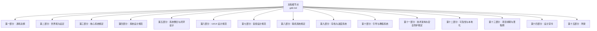
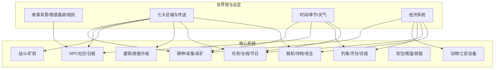
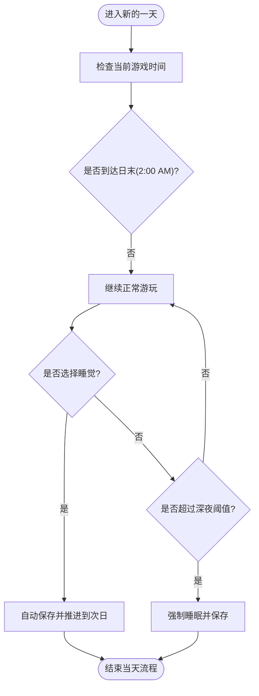
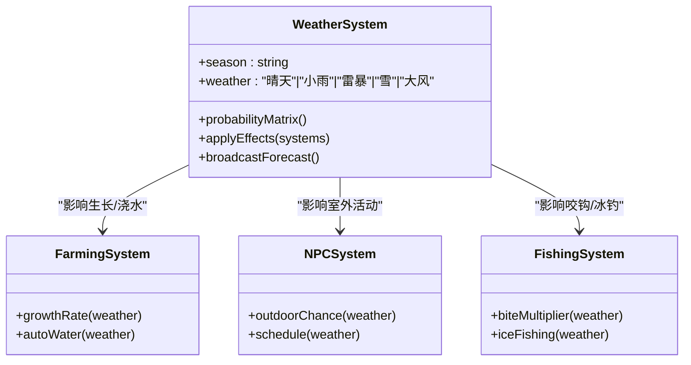
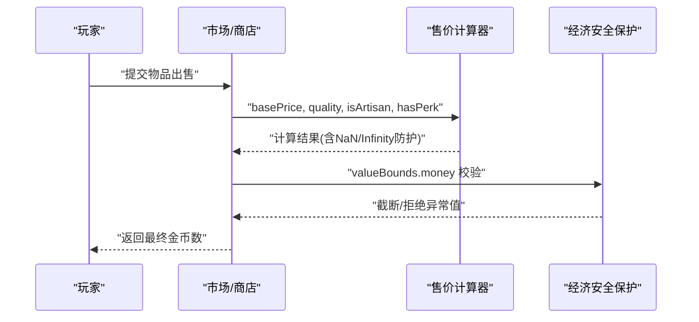
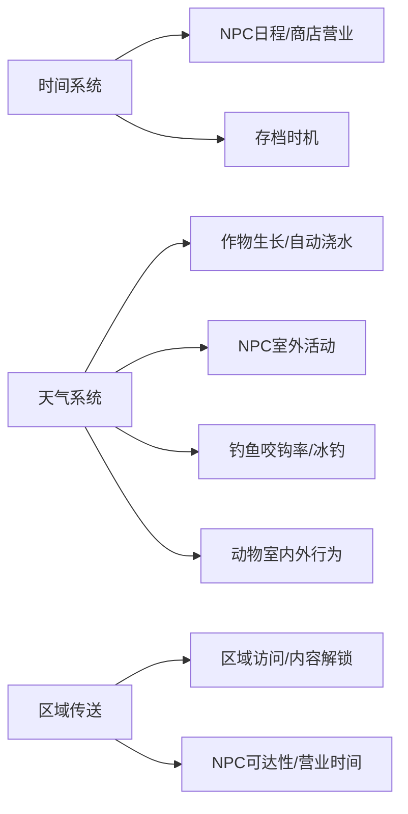
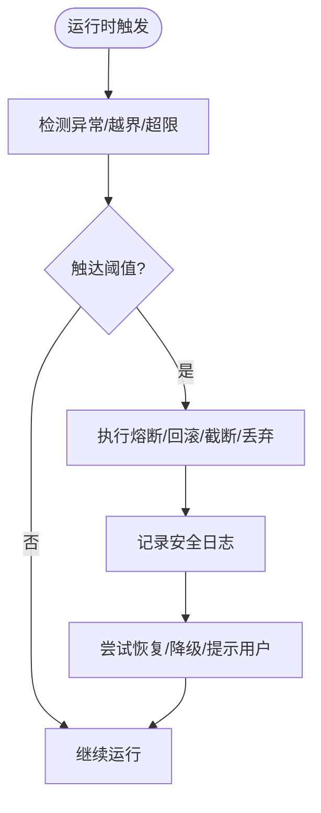

# 世界观与设定

<cite>
**本文引用的文件**   
- [gdd.md](file://gdd.md)
</cite>

## 目录
1. [引言](#引言)
2. [项目结构](#项目结构)
3. [核心组件](#核心组件)
4. [架构总览](#架构总览)
5. [详细组件分析](#详细组件分析)
6. [依赖关系分析](#依赖关系分析)
7. [性能与安全考量](#性能与安全考量)
8. [故障排查指南](#故障排查指南)
9. [结论](#结论)
10. [附录：数据模型与接口定义](#附录数据模型与接口定义)

## 引言
本章节聚焦《山野小村》的世界观与设定，系统化阐述故事背景、情感基调与世界观规则；完整描述七大地图区域的功能定位、大小规格与解锁条件；明确时间系统、季节变化、天气系统与经济系统的硬性规定；说明区域间传送机制、关键地点NPC关联与营业时间；并提供可直接用于实现的数据模型与TypeScript接口路径，解释安全保护措施如何确保设定的稳定性。

## 项目结构
本项目为游戏设计文档（GDD），以单一文档形式组织全部设计与规范，便于开发与验收对照。文档采用“章节+交叉引用”的结构，所有数值与规则均标注来源，避免歧义与需求蔓延。

**图表来源** 
- [gdd.md:1-20](file://gdd.md#L1-L20)

**章节来源**
- [gdd.md:1-20](file://gdd.md#L1-L20)

## 核心组件
- 世界观与叙事：故事背景、情感基调、世界观规则
- 地图与区域：青溪农场、青溪镇中心、青溪林、翠屏山、银沙湾、金沙谷、雾岛
- 时间与气候：时间系统、季节变化、天气系统
- 经济与资源：货币、售价计算、收入曲线、通胀保护
- 区域交互：传送方式与时耗、关键地点与NPC、营业时间
- 安全护栏：七维熔断保护、状态机校验、边界约束

**章节来源**
- [gdd.md:107-176](file://gdd.md#L107-L176)
- [gdd.md:180-235](file://gdd.md#L180-L235)
- [gdd.md:237-332](file://gdd.md#L237-L332)
- [gdd.md:345-372](file://gdd.md#L345-L372)
- [gdd.md:1780-1888](file://gdd.md#L1780-L1888)

## 架构总览
下图展示世界观与设定在整体系统中的位置，以及与其他核心系统的耦合关系。

[此图为概念性架构图，不直接映射具体源码文件，故不提供图表来源]

## 详细组件分析

### 故事背景与情感基调
- 故事背景：玩家从城市来到远房亲戚留下的老房子与田地，开启重建生活的旅程。
- 情感基调：温暖、治愈、慢生活，带轻微奇幻色彩但不喧宾夺主。
- 设计影响：无强制失败、无时间限制、无惩罚性随机，强调舒适循环与内容密度。

**章节来源**
- [gdd.md:109-123](file://gdd.md#L109-L123)
- [gdd.md:22-46](file://gdd.md#L22-L46)

### 世界观规则
- 时代：现代（有手机、电脑、网络），小镇保留传统生活方式。
- 奇幻度：轻度（存在神秘生物，但无魔法战斗与龙）。
- 季节：四季分明，每季28天，作物按季节区分。
- 天气：晴/雨/雷暴/雪/风，影响作物、NPC活动与钓鱼等。
- 经济：金币制，自给自足+出售剩余产品。
- 人口：约20名常住居民，外加季节性流动商贩。

**章节来源**
- [gdd.md:124-134](file://gdd.md#L124-L134)

### 七大地图区域设定
下表汇总各区域功能定位、大小规格与解锁条件，并给出连接区域与传送点位置。

| 区域 | 中文名 | 核心功能 | 预计大小(tile) | 解锁条件 | 连接区域 | 传送点位置 |
|------|--------|----------|:--------------:|----------|----------|------------|
| 农场 | 青溪农场 | 种田、养殖、建造、居住 | 60×50 | 初始可用 | 小镇、森林 | 南→小镇，西→森林 |
| 小镇 | 青溪镇中心 | NPC聚集、商店、社区中心、诊所 | 80×60 | 初始可用 | 农场、森林、山脚、沙滩 | 北→农场，东→森林，西→山脚，南→沙滩 |
| 森林 | 青溪林 | 采集、秘密区域、木匠小屋 | 100×80 | 初始可用 | 农场、小镇、山脚 | 东→农场，西→小镇，北→山脚 |
| 山脚 | 翠屏山 | 矿洞入口、温泉 | 50×40 | 初始可用 | 小镇、森林 | 东→小镇，南→森林 |
| 沙滩 | 银沙湾 | 钓鱼、码头、鱼店 | 60×30 | 初始可用 | 小镇 | 北→小镇 |
| 沙漠 | 金沙谷 | 稀有资源、高级矿洞、商人 | 80×60 | 修复巴士后 | 小镇（巴士站） | 巴士站→小镇 |
| 岛屿 | 雾岛 | 终局内容、稀有作物 | 100×80 | 主线完成后 | 银沙湾（码头） | 码头→沙滩 |

**章节来源**
- [gdd.md:135-146](file://gdd.md#L135-L146)

#### 区域间传送耗时
- 步行：农场↔小镇约15分钟（现实~10s）、农场↔森林约10分钟（~7s）、小镇↔森林约10分钟（~7s）、小镇↔山脚约10分钟（~7s）、小镇↔沙滩约20分钟（~14s）。
- 特殊交通：小镇↔沙漠（巴士）约30分钟（动画+5s加载）、沙滩↔岛屿（船）约45分钟（动画+8s加载）。

**章节来源**
- [gdd.md:164-175](file://gdd.md#L164-L175)

#### 关键地点、NPC关联与营业时间
以下为部分关键地点的NPC关联与营业时间示例：
- 小镇：杂货店（林婶，09:00-17:00）、诊所（顾医生，10:00-16:00）、社区中心（全天室内）、铁匠铺（老铁、石头，10:00-17:00）、餐厅（陈姨、小暖，08:00-22:00）、图书馆（灵溪，10:00-18:00）、花店（小鹿，09:00-17:00）。
- 森林：木匠小屋（阿木，09:00-17:00）。
- 山脚：矿洞入口（全天）、温泉（06:00-22:00）。
- 沙滩：鱼店（威利，08:00-17:00）、码头（全天）。

**章节来源**
- [gdd.md:147-163](file://gdd.md#L147-L163)

### 时间系统（硬性规定）
- 每日时长：约14分钟现实时间；起始6:00 AM，截止凌晨2:00 AM。
- 季节长度：每季28天，每年112天。
- 存档时机：睡觉时自动保存。
- 暂停规则：打开菜单/对话/背包时暂停。
- 联机时间控制：主机控制时间流速。
- 昏迷惩罚：丢失一定比例金钱且有上限。

**图表来源** 
- [gdd.md:180-235](file://gdd.md#L180-L235)

**章节来源**
- [gdd.md:180-235](file://gdd.md#L180-L235)

### 季节变化与天气系统
- 季节天气概率矩阵：春/夏/秋/冬各有不同晴天、小雨、雷暴、雪、大风概率。
- 天气对系统的影响矩阵：影响作物生长、NPC室外活动、钓鱼咬钩率、采集物出现、动物室内外行为、矿洞正常进行。
- 天气预报：电视每晚7:00播报次日天气，准确率90%，联机模式同一天气。

**图表来源** 
- [gdd.md:345-372](file://gdd.md#L345-L372)

**章节来源**
- [gdd.md:345-372](file://gdd.md#L345-L372)

### 经济系统（硬性规定）
- 唯一货币：金币（Gold/g），无任何内购/兑换/充值，初始资金500g。
- 经济曲线目标：初期/发展期/成长期/成熟期/自由期的日均收入与累计收入目标。
- 售价计算规则：基础价格×品质倍率×工匠专精倍率，输出受边界保护。
- 经济安全保护：单件最高价、日收入上限、种子最低成本、通胀检查、金钱上限。

**图表来源** 
- [gdd.md:237-332](file://gdd.md#L237-L332)

**章节来源**
- [gdd.md:237-332](file://gdd.md#L237-L332)

### 区域间传送机制与关键地点NPC关联
- 传送方式与时耗：步行与特殊交通（巴士/船）对应不同耗时与加载动画。
- 关键地点与NPC：各区域关键地点提供特定服务（商店、诊所、社区中心、铁匠铺、餐厅、图书馆、花店、木匠、鱼店、矿洞入口、温泉、码头），并附带营业时间。
- 传送点位置：每个区域标注了主要传送方向与位置，便于导航与关卡设计。

**章节来源**
- [gdd.md:135-175](file://gdd.md#L135-L175)

## 依赖关系分析
- 区域与系统耦合：
  - 青溪农场：耕种、养殖、建筑、居住，与工匠设备、通用合成、背包系统强相关。
  - 青溪镇中心：NPC社交、商店交易、社区中心献祭、主线推进，与经济系统、任务系统紧密联动。
  - 青溪林：采集、秘密区域、木匠小屋，与采集系统、工匠设备、建筑系统相关。
  - 翠屏山：矿洞入口、温泉，与战斗系统、体力恢复、工具升级相关。
  - 银沙湾：钓鱼、码头、鱼店，与钓鱼系统、烹饪系统、经济系统相关。
  - 金沙谷：稀有资源、高级矿洞、商人，与战斗系统、经济系统、后期内容相关。
  - 雾岛：终局内容、稀有作物，与主线完成、收集系统、经济系统相关。
- 时间与天气对多系统的影响：
  - 时间系统驱动NPC日程、商店营业、存档时机。
  - 天气系统影响作物生长、NPC室外活动、钓鱼咬钩率、动物室内外行为。

[此图为概念性依赖图，不直接映射具体源码文件，故不提供图表来源]

**章节来源**
- [gdd.md:135-175](file://gdd.md#L135-L175)
- [gdd.md:180-235](file://gdd.md#L180-L235)
- [gdd.md:345-372](file://gdd.md#L345-L372)

## 性能与安全考量
- 渲染安全：精灵上限、粒子上限、纹理内存限制、瓦片裁剪。
- 网络通信安全：速率限制、消息大小限制、连接超时、状态校验。
- 内存与资源安全：场景切换清理、资源加载超时、缓存上限、对象池上限。
- 存档与数据安全：原子写入、备份、完整性校验、数值边界、恢复策略。
- 状态机与逻辑安全：非法状态转移回滚、NPC日程回退、任务一致性检查、ID校验。
- 联机安全专项：最大人数、主机负载保护、消息队列保护、作弊预防。

**图表来源** 
- [gdd.md:1780-1888](file://gdd.md#L1780-L1888)

**章节来源**
- [gdd.md:1780-1888](file://gdd.md#L1780-L1888)

## 故障排查指南
- 存档异常：校验失败→提示恢复备份或创建新档，使用自动存档回退。
- 网络异常：超时/心跳丢失/连接拒绝→自动重连或提示重试，支持离线模式。
- 资源加载异常：超时/HTTP错误/解码错误→跳过并使用占位资源或回退纹理。
- 渲染异常：WebGL上下文丢失/内存不足→重启渲染器/降低质量/重载场景。
- 任务状态异常：目标计数不一致/前置缺失/完成标记缺失→自动修复或重置到检查点。
- 玩家位置异常：超出地图/碰撞内/低于地面→传送到出生点或最近安全点。
- 时间系统异常：时间倒退/跳跃/跳过天数→回退到最近有效时间或强制睡眠保存。

**章节来源**
- [gdd.md:1890-1945](file://gdd.md#L1890-L1945)

## 结论
《山野小村》的世界观与设定围绕“舒适循环、内容密度、有机整合”三大理念展开，通过严谨的时间、季节、天气与经济规则，结合七大区域的差异化功能与解锁条件，构建出稳定且富有深度的乡村生活模拟体验。配套的安全防护措施确保系统在极端情况下仍能保持稳定与可恢复性，为后续开发、联机和发布提供坚实保障。

## 附录：数据模型与接口定义
以下列出与世界观与设定相关的核心数据结构与接口，供实现参考（仅列路径，不粘贴代码内容）：
- 时间系统常量与保护：[gdd.md:193-235](file://gdd.md#L193-L235)
- 经济系统售价计算与保护：[gdd.md:256-332](file://gdd.md#L256-L332)
- 天气系统影响矩阵与预报：[gdd.md:345-372](file://gdd.md#L345-L372)
- 区域与关键地点信息：[gdd.md:135-163](file://gdd.md#L135-L163)
- 存档数据结构（包含世界状态、区域解锁、天气等）：[gdd.md:1606-1650](file://gdd.md#L1606-L1650)
- 安全防护机制（七维熔断保护）：[gdd.md:1780-1888](file://gdd.md#L1780-L1888)

**章节来源**
- [gdd.md:193-235](file://gdd.md#L193-L235)
- [gdd.md:256-332](file://gdd.md#L256-L332)
- [gdd.md:345-372](file://gdd.md#L345-L372)
- [gdd.md:135-163](file://gdd.md#L135-L163)
- [gdd.md:1606-1650](file://gdd.md#L1606-L1650)
- [gdd.md:1780-1888](file://gdd.md#L1780-L1888)