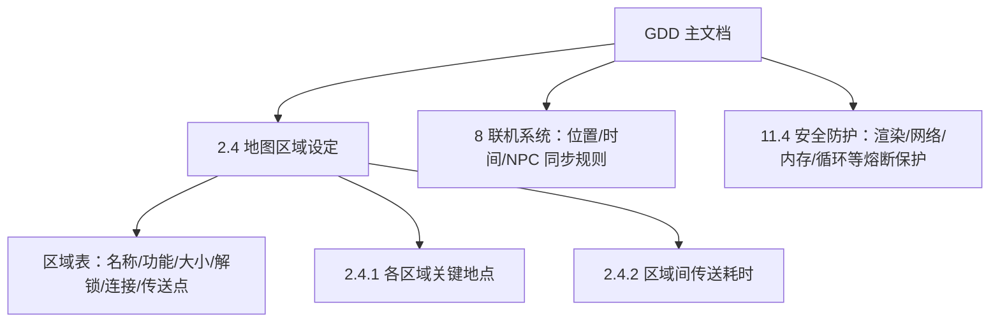
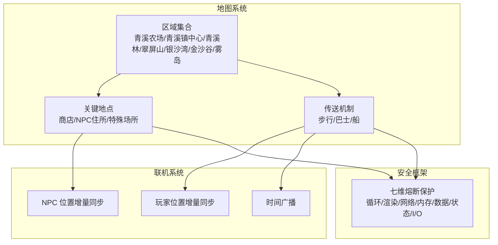
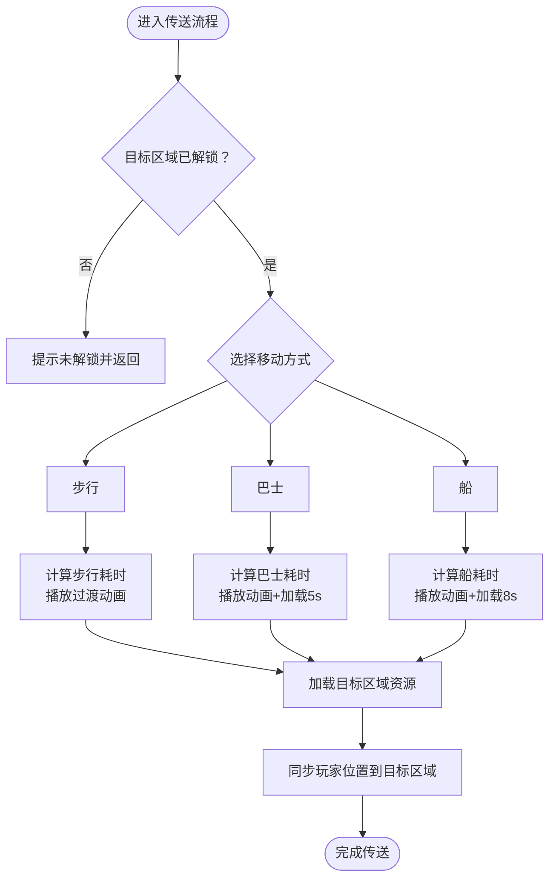
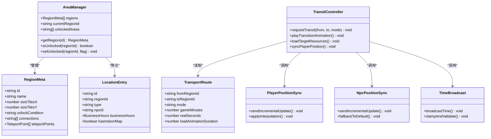

# 地图区域设定

<cite>
**本文引用的文件**   
- [gdd.md](file://gdd.md)
</cite>

## 目录
1. [引言](#引言)
2. [项目结构](#项目结构)
3. [核心组件](#核心组件)
4. [架构总览](#架构总览)
5. [详细区域分析](#详细区域分析)
6. [依赖与连接关系分析](#依赖与连接关系分析)
7. [性能与加载考虑](#性能与加载考虑)
8. [故障排查指南](#故障排查指南)
9. [结论](#结论)
10. [附录：TypeScript 数据结构与实现要点](#附录typescript-数据结构与实现要点)

## 引言
本文件围绕《山野小村》的地图区域设定，系统化梳理七大核心区域的定位、规格、解锁条件与连接关系；细化各区域关键地点（商店、NPC住所、特殊场所）的功能与室内场景配置；说明区域间传送机制（步行耗时、交通工具使用条件、加载动画设计）；并提供可直接用于实现的 TypeScript 数据结构定义，覆盖地图区域管理、传送逻辑与区域状态同步；最后给出安全保护措施，确保地图系统稳定运行。

## 项目结构
本项目为游戏设计文档驱动型仓库，当前以单一 GDD 文档为核心依据。地图区域相关的设计规范集中于“第二部分：世界观与设定”的“2.4 地图区域设定”，以及后续章节对传送耗时、联机同步、安全防护等的补充规定。

图表来源
- [gdd.md:135-176](file://gdd.md#L135-L176)
- [gdd.md:1466-1476](file://gdd.md#L1466-L1476)
- [gdd.md:1780-1888](file://gdd.md#L1780-L1888)

章节来源
- [gdd.md:135-176](file://gdd.md#L135-L176)

## 核心组件
- 区域元数据：包含区域标识、中文名称、核心功能、tile 尺寸、解锁条件、连接区域、传送点位置等。
- 关键地点：每个区域的关键建筑/设施、关联 NPC、营业时间、功能描述、是否含室内场景。
- 传送机制：区域间移动方式（步行/巴士/船）、耗时（游戏内与现实时间）、加载动画与加载时长。
- 状态同步：联机模式下玩家位置、NPC 位置、时间广播等增量同步策略。
- 安全护栏：帧时间限制、渲染裁剪、数值边界、存档校验、状态机回退等。

章节来源
- [gdd.md:135-176](file://gdd.md#L135-L176)
- [gdd.md:1466-1476](file://gdd.md#L1466-L1476)
- [gdd.md:1780-1888](file://gdd.md#L1780-L1888)

## 架构总览
下图展示地图区域在整体系统中的角色与交互：区域作为空间容器承载关键地点与事件；传送机制负责区域切换；联机层保证多端一致；安全框架保障稳定性。

图表来源
- [gdd.md:135-176](file://gdd.md#L135-L176)
- [gdd.md:1466-1476](file://gdd.md#L1466-L1476)
- [gdd.md:1780-1888](file://gdd.md#L1780-L1888)

## 详细区域分析

### 青溪农场（60×50 tile）
- 功能定位：种田、养殖、建造、居住的核心区域。
- 大小规格：60×50 tile。
- 解锁条件：初始可用。
- 连接关系：
  - 南→小镇
  - 西→森林
- 传送点位置：南出口至小镇，西出口至森林。
- 关键地点：
  - 玩家住宅（房屋升级路径见建筑系统）。
  - 动物建筑（鸡舍、畜棚等）与工匠设备（蛋黄酱机、酿酒桶等）。
  - 仓库/箱子用于物品存储。
- 室内场景：房屋内部、各类建筑内部均有独立室内地图。

章节来源
- [gdd.md:135-146](file://gdd.md#L135-L146)
- [gdd.md:863-888](file://gdd.md#L863-L888)

### 青溪镇中心（80×60 tile）
- 功能定位：NPC 聚集地、商店、社区中心、诊所等公共服务集中区。
- 大小规格：80×60 tile。
- 解锁条件：初始可用。
- 连接关系：
  - 北→农场
  - 东→森林
  - 西→山脚
  - 南→沙滩
- 传送点位置：四向出口分别对应农场、森林、山脚、沙滩。
- 关键地点：
  - 杂货店（林婶，09:00-17:00，买种子/基础材料，有室内地图）
  - 诊所（顾医生，10:00-16:00，看病/买药/体力恢复，有室内地图）
  - 社区中心（全天室内，主线献祭提交点，有室内地图）
  - 铁匠铺（老铁、石头，10:00-17:00，工具升级/矿石买卖，有室内地图）
  - 餐厅（陈姨、小暖，08:00-22:00，买料理/接取支线，有室内地图）
  - 图书馆（灵溪，10:00-18:00，看书/接任务，有室内地图）
  - 花店（小鹿，09:00-17:00，买花/种子，有室内地图）
- 室内场景：上述商店与服务场所均具备室内地图。

章节来源
- [gdd.md:135-146](file://gdd.md#L135-L146)
- [gdd.md:147-163](file://gdd.md#L147-L163)

### 青溪林（100×80 tile）
- 功能定位：采集、秘密区域、木匠小屋所在。
- 大小规格：100×80 tile。
- 解锁条件：初始可用。
- 连接关系：
  - 东→农场
  - 西→小镇
  - 北→山脚
- 传送点位置：东/西/北三向出口。
- 关键地点：
  - 木匠小屋（阿木，09:00-17:00，建造建筑/家具，有室内地图）
  - 采集资源点（树木、硬木、树液等）
- 室内场景：木匠小屋具备室内地图。

章节来源
- [gdd.md:135-146](file://gdd.md#L135-L146)
- [gdd.md:147-163](file://gdd.md#L147-L163)

### 翠屏山（50×40 tile）
- 功能定位：矿洞入口、温泉。
- 大小规格：50×40 tile。
- 解锁条件：初始可用。
- 连接关系：
  - 东→小镇
  - 南→森林
- 传送点位置：东/南两向出口。
- 关键地点：
  - 矿洞入口（全天，下矿战斗，无室内，直接进入矿洞）
  - 温泉（06:00-22:00，体力缓慢恢复，有室内地图）
- 室内场景：温泉具备室内地图。

章节来源
- [gdd.md:135-146](file://gdd.md#L135-L146)
- [gdd.md:147-163](file://gdd.md#L147-L163)

### 银沙湾（60×30 tile）
- 功能定位：钓鱼、码头、鱼店。
- 大小规格：60×30 tile。
- 解锁条件：初始可用。
- 连接关系：
  - 北→小镇
- 传送点位置：北向出口至小镇。
- 关键地点：
  - 鱼店（威利，08:00-17:00，鱼竿/鱼饵/卖鱼，有室内地图）
  - 码头（全天，终局出海，无室内）
- 室内场景：鱼店具备室内地图。

章节来源
- [gdd.md:135-146](file://gdd.md#L135-L146)
- [gdd.md:147-163](file://gdd.md#L147-L163)

### 金沙谷（80×60 tile）
- 功能定位：稀有资源、高级矿洞、商人。
- 大小规格：80×60 tile。
- 解锁条件：修复巴士后解锁。
- 连接关系：
  - 通过巴士站与小镇相连（巴士站↔小镇）
- 传送点位置：巴士站 ↔ 小镇。
- 关键地点：
  - 巴士站（触发区域传送）
  - 高级矿洞入口（与战斗系统联动）
  - 商人摊位（周期性出现或常驻）
- 室内场景：根据具体建筑配置，通常不含大型室内场景。

章节来源
- [gdd.md:135-146](file://gdd.md#L135-L146)

### 雾岛（100×80 tile）
- 功能定位：终局内容、稀有作物。
- 大小规格：100×80 tile。
- 解锁条件：主线完成后解锁。
- 连接关系：
  - 通过码头与银沙湾相连（码头↔沙滩）
- 传送点位置：码头 ↔ 沙滩。
- 关键地点：
  - 码头（终局出海入口）
  - 稀有作物种植区/探索点
- 室内场景：视剧情与建筑而定，通常为户外为主。

章节来源
- [gdd.md:135-146](file://gdd.md#L135-L146)

## 依赖与连接关系分析
- 区域连通性：
  - 农场↔小镇（步行，15分钟游戏内≈10s现实）
  - 农场↔森林（步行，10分钟游戏内≈7s现实）
  - 小镇↔森林（步行，10分钟游戏内≈7s现实）
  - 小镇↔山脚（步行，10分钟游戏内≈7s现实）
  - 小镇↔沙滩（步行，20分钟游戏内≈14s现实）
  - 小镇↔沙漠（巴士，30分钟游戏内+动画+5s加载）
  - 沙滩↔岛屿（船，45分钟游戏内+动画+8s加载）
- 解锁门控：
  - 金沙谷需“修复巴士”后解锁。
  - 雾岛需“主线完成”后解锁。
- 联机同步：
  - 玩家位置增量同步（10Hz），NPC 位置增量同步（2Hz），时间广播（1Hz）。
  - 所有玩家在同一时间流下体验一致。

图表来源
- [gdd.md:164-176](file://gdd.md#L164-L176)
- [gdd.md:1466-1476](file://gdd.md#L1466-L1476)

章节来源
- [gdd.md:164-176](file://gdd.md#L164-L176)
- [gdd.md:1466-1476](file://gdd.md#L1466-L1476)

## 性能与加载考虑
- 渲染安全：
  - 最大活跃精灵数、粒子发射器上限、纹理内存限制、Tile 裁剪范围。
- 加载优化：
  - 非关键资源延迟加载；区域切换时清理纹理缓存、声音实例、补间池，必要时触发垃圾回收。
- 帧率与内存指标：
  - PC/手机目标 60fps；加载时间 < 3s（PC）/< 5s（手机）；内存占用 < 500MB（PC）/< 200MB（手机）。

章节来源
- [gdd.md:1780-1888](file://gdd.md#L1780-L1888)

## 故障排查指南
- 常见问题与恢复策略：
  - 存档损坏：sha256 校验失败→自动恢复备份或创建新档。
  - 网络断开：心跳丢失→自动重连或提示重试，支持离线模式继续。
  - 资源加载失败：超时/解码错误→跳过并使用占位纹理，最多重试一次。
  - 渲染崩溃：WebGL 上下文丢失/内存不足→重启渲染器或降低质量并重载场景。
  - 任务状态不一致：目标计数不匹配/前置缺失→自动修复或重置到检查点。
  - 玩家位置异常：越界/碰撞/掉出地面→传送出生点或最近安全点。
  - 时间系统异常：时间倒流/跳跃过大→回滚到最近有效值或强制睡觉保存。
- 日志与诊断：
  - 安全通道默认开启，记录触发阈值、动作与系统状态，便于回溯。

章节来源
- [gdd.md:1890-1969](file://gdd.md#L1890-L1969)

## 结论
七大区域构成从日常农耕到终局探索的完整空间闭环。通过明确的解锁条件、清晰的连接关系与稳定的传送机制，配合联机同步与安全护栏，地图系统在内容与体验上形成有机整合，既满足休闲节奏，又提供持续目标与深度内容。

## 附录：TypeScript 数据结构与实现要点

以下为可直接用于实现的类型定义建议，涵盖区域管理、传送逻辑与区域状态同步。注意：以下类型为基于 GDD 的结构化抽象，便于开发落地。

- 区域与地点模型
  - RegionMeta：区域元数据（id、name、sizeTiles、unlockCondition、connections、teleportPoints）
  - LocationEntry：关键地点（id、regionId、type、npcId、businessHours、hasIndoorMap）
  - TransportRoute：传送路线（fromRegionId、toRegionId、mode、gameMinutes、realSeconds、loadAnimationDuration）

- 区域管理与传送
  - AreaManager：维护区域列表、解锁状态、当前区域、传送队列
  - TransitController：处理步行/巴士/船的耗时与加载流程，触发资源加载与位置同步
  - UnlockGate：根据进度标记（如“修复巴士”“主线完成”）控制区域解锁

- 区域状态同步（联机）
  - PlayerPositionSync：增量同步玩家位置（10Hz）
  - NpcPositionSync：增量同步 NPC 位置（2Hz）
  - TimeBroadcast：时间广播（1Hz），主机控制时间流速

- 安全护栏集成
  - RenderGuard：精灵/粒子/纹理上限与裁剪
  - NetworkGuard：速率限制、消息大小限制、状态校验
  - DataGuard：数值边界（金钱/体力/好感度/堆叠数量）、存档完整性校验
  - StateGuard：状态机转换守卫、日程回退、任务一致性检查

图表来源
- [gdd.md:135-176](file://gdd.md#L135-L176)
- [gdd.md:1466-1476](file://gdd.md#L1466-L1476)
- [gdd.md:1780-1888](file://gdd.md#L1780-L1888)

章节来源
- [gdd.md:135-176](file://gdd.md#L135-L176)
- [gdd.md:1466-1476](file://gdd.md#L1466-L1476)
- [gdd.md:1780-1888](file://gdd.md#L1780-L1888)