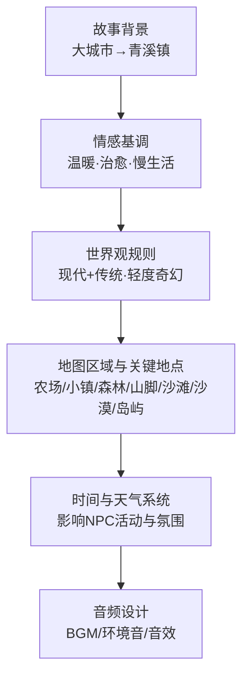
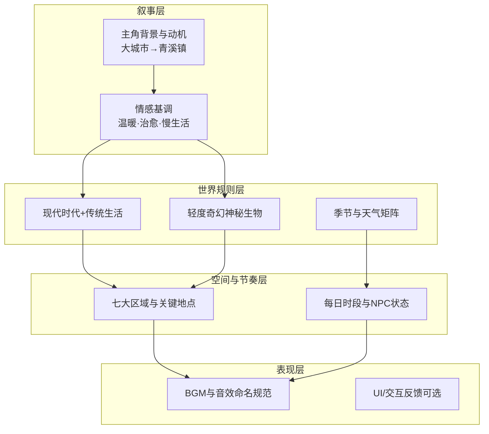
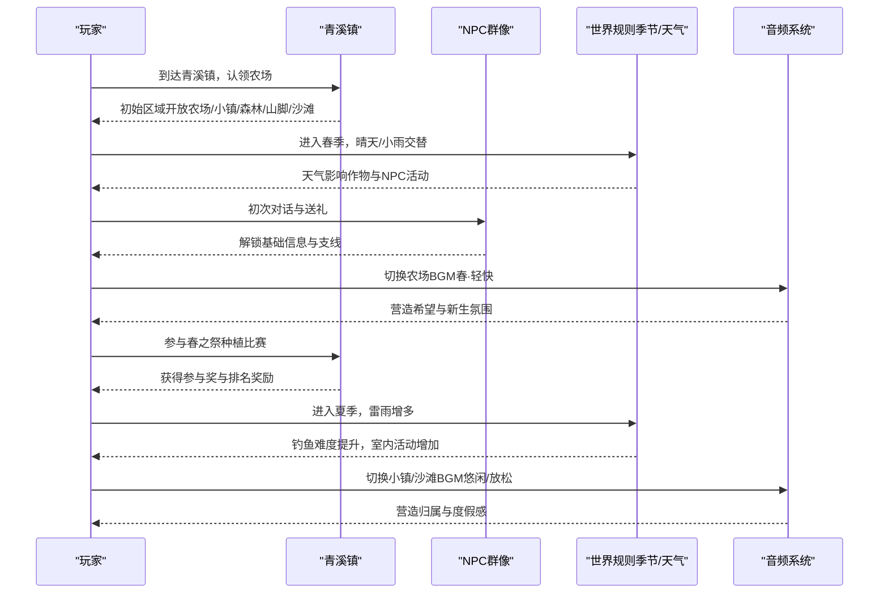
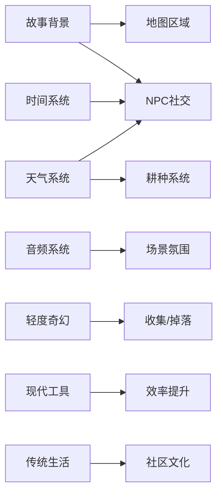

# 故事背景与情感基调

<cite>
**本文引用的文件**   
- [gdd.md](file://gdd.md)
</cite>

## 目录
1. [引言](#引言)
2. [项目结构](#项目结构)
3. [核心组件](#核心组件)
4. [架构总览](#架构总览)
5. [详细组件分析](#详细组件分析)
6. [依赖关系分析](#依赖关系分析)
7. [性能与体验考量](#性能与体验考量)
8. [排障指南](#排障指南)
9. [结论](#结论)
10. [附录](#附录)

## 引言
本章节聚焦《山野小村》的故事背景与情感基调，围绕“从大城市辞职到青溪镇继承废弃农场”的完整叙事线展开，解释主角背景、离开城市的原因、抵达小镇后的心理变化过程；并阐述游戏的情感基调（温暖、治愈、慢生活）如何通过叙事、美术、音乐等元素营造田园诗歌般的氛围。同时说明轻度奇幻色彩的融入方式与现代时代背景与传统生活方式的结合规则，并提供场景与角色示例，帮助团队在实现中统一表达。

## 项目结构
本项目为像素风格乡村生活模拟游戏的GDD文档，包含世界观、系统设计与技术安全规范等。与“故事背景与情感基调”直接相关的设定位于文档的世界观与音频设计部分，涵盖：
- 故事背景与情感基调定义
- 世界观规则（现代时代+传统生活、轻度奇幻）
- 地图区域与关键地点（用于承载叙事与情感）
- 时间/天气/季节对氛围的影响
- 音频设计（BGM与音效命名规范）

图表来源
- [gdd.md:109-134](file://gdd.md#L109-L134)
- [gdd.md:135-175](file://gdd.md#L135-L175)
- [gdd.md:180-235](file://gdd.md#L180-L235)
- [gdd.md:345-372](file://gdd.md#L345-L372)
- [gdd.md:1410-1448](file://gdd.md#L1410-L1448)

章节来源
- [gdd.md:109-134](file://gdd.md#L109-L134)
- [gdd.md:135-175](file://gdd.md#L135-L175)
- [gdd.md:180-235](file://gdd.md#L180-L235)
- [gdd.md:345-372](file://gdd.md#L345-L372)
- [gdd.md:1410-1448](file://gdd.md#L1410-L1448)

## 核心组件
- 故事背景与情感基调
  - 背景：在大城市过着不痛不痒的工作，收到远房亲戚来信后辞掉工作，来到青溪镇继承老房子与地。
  - 情感基调：温暖、治愈、慢生活，带一点田园诗歌感，轻度奇幻但不喧宾夺主。
- 世界观规则
  - 时代：现代（手机、电脑、网络），但小镇保留传统生活方式。
  - 奇幻度：轻度（有神秘生物，无魔法战斗、无龙）。
  - 季节与天气：四季分明，天气影响作物与NPC活动。
  - 经济：金币制，自给自足+出售剩余产品。
  - 人口：约20名常住居民，外加季节性流动商贩。
- 地图区域与关键地点
  - 农场、小镇、森林、山脚、沙滩、沙漠、岛屿七大区域，各有关键地点与NPC关联，支撑日常社交与主线推进。
- 时间与天气系统
  - 每日时段划分（清晨至深夜）对应不同氛围与NPC状态，引导玩家节奏。
  - 天气矩阵影响作物生长、NPC外出概率、钓鱼难度等，增强沉浸感。
- 音频设计
  - 分场景BGM（春/夏/秋/冬农场、矿洞、小镇、森林、沙滩、节日、雷暴等）与音效命名规范，确保情绪一致性与资源可维护性。

章节来源
- [gdd.md:109-134](file://gdd.md#L109-L134)
- [gdd.md:135-175](file://gdd.md#L135-L175)
- [gdd.md:180-235](file://gdd.md#L180-L235)
- [gdd.md:345-372](file://gdd.md#L345-L372)
- [gdd.md:1410-1448](file://gdd.md#L1410-L1448)

## 架构总览
以下图展示“故事背景—情感基调—世界规则—地图—时间天气—音频”的整体联动关系，体现叙事与玩法如何共同塑造“田园诗般”的氛围。

图表来源
- [gdd.md:109-134](file://gdd.md#L109-L134)
- [gdd.md:135-175](file://gdd.md#L135-L175)
- [gdd.md:180-235](file://gdd.md#L180-L235)
- [gdd.md:345-372](file://gdd.md#L345-L372)
- [gdd.md:1410-1448](file://gdd.md#L1410-L1448)

## 详细组件分析

### 主角故事线与心理变化
- 背景设定
  - 在大城市做一份不痛不痒的工作，通勤、外卖、加班构成日常。
  - 收到远房亲戚来信，提及山脚下老房子与地无人打理，愿意留给主角。
- 离开城市的原因
  - 对重复与压力的厌倦，渴望回归自然与真实的生活节奏。
  - 信件成为契机，促使主角做出辞职决定。
- 到达小镇后的心理变化
  - 初到青溪镇的陌生与不安，逐渐被小镇人情与自然节律安抚。
  - 通过耕种、养殖、与NPC互动、探索区域，重建自我价值与生活秩序。
  - 随着社区中心修复与节日参与，逐步建立归属感与新的目标。

章节来源
- [gdd.md:109-114](file://gdd.md#L109-L114)
- [gdd.md:135-175](file://gdd.md#L135-L175)
- [gdd.md:180-235](file://gdd.md#L180-L235)

### 情感基调的具体表现方式
- 叙事层面
  - 以“重建生活”为主线，强调成长与陪伴，避免焦虑与惩罚性机制。
  - 通过社区中心修复、节日活动、NPC日程与对话，构建“小而美”的日常史诗。
- 美术层面
  - 像素风格统一，16×16 Tile基准，有限色板，手绘质感，强化田园诗意。
- 音乐与音效
  - 分场景BGM（春/夏/秋/冬农场、小镇、森林、沙滩、矿洞、节日、雷暴等）配合昼夜与天气，营造宁静或活力的情绪。
  - 音效命名规范清晰，便于统一管理，保证反馈一致性与沉浸感。
- 节奏与系统
  - 无强制失败、无时间限制，玩家按自己的节奏游玩。
  - 每日时段与天气矩阵影响NPC活动与玩法选择，形成“慢生活”的自然节拍。

章节来源
- [gdd.md:116-122](file://gdd.md#L116-L122)
- [gdd.md:180-235](file://gdd.md#L180-L235)
- [gdd.md:345-372](file://gdd.md#L345-L372)
- [gdd.md:1410-1448](file://gdd.md#L1410-L1448)

### 轻度奇幻色彩的融入方式
- 奇幻度定位
  - 轻度奇幻：存在神秘生物，但没有魔法战斗、没有龙，保持现实基调。
- 融入策略
  - 通过特定区域（如森林深处、矿洞深层）与稀有采集物/掉落物暗示神秘感。
  - 借助天气与夜晚氛围（星空、路灯、雷暴）提升神秘而不惊悚的体验。
  - 与NPC特殊身份（法师、隐士、神秘商人）结合，提供线索与任务，但不喧宾夺主。

章节来源
- [gdd.md:124-134](file://gdd.md#L124-L134)
- [gdd.md:135-175](file://gdd.md#L135-L175)
- [gdd.md:345-372](file://gdd.md#L345-L372)

### 世界观规则的实现：现代时代与传统生活方式的结合
- 现代元素
  - 手机、电脑、网络可用；电视播报次日天气预报；联机存档与网络通信。
- 传统生活方式
  - 农耕、手工加工、邻里社交、节庆仪式、温泉疗养等。
- 结合方式
  - 用现代工具提升效率（洒水器、种子机、避雷针），但保留手工与自然的仪式感。
  - 通过社区中心修复与节日活动，将现代便利与传统社区文化融合。

章节来源
- [gdd.md:124-134](file://gdd.md#L124-L134)
- [gdd.md:180-235](file://gdd.md#L180-L235)
- [gdd.md:1106-1173](file://gdd.md#L1106-L1173)

### 具体场景描述与角色设定示例
- 场景示例
  - 清晨农场：日出鸟鸣，轻快BGM，适合浇水与采集，NPC刚起床，节奏舒缓。
  - 傍晚小镇：日落暖色调，NPC陆续回家，适合收尾与准备回家，氛围温馨。
  - 深夜矿洞：深蓝与黑暗，低沉BGM，探索与紧张并存，适合收集高级矿石。
- 角色示例
  - 小鹿（花店女孩）：温柔爱花，生日礼物偏好玫瑰与草莓蛋糕，营业与休息日程明确。
  - 阿杰（护林员）：沉默寡言，巡逻森林，赠送烤红薯、山药汤提升好感。
  - 灵溪（图书馆员）：知性爱书，蓝莓酱与果酒是偏好礼物，晚间常在广场散步。
  - 石头（铁匠学徒）：内向踏实，金锭与钻石是偏好礼物，白天打铁与营业。
  - 小暖（餐厅服务员）：开朗爱笑，披萨与蛋糕是偏好礼物，早晚在餐厅工作。
  - 渔夫（沙滩渔夫）：自由奔放，海鲜料理是偏好礼物，清晨出海捕鱼。

章节来源
- [gdd.md:180-235](file://gdd.md#L180-L235)
- [gdd.md:553-656](file://gdd.md#L553-L656)

### 叙事流程与情感递进序列

图表来源
- [gdd.md:135-175](file://gdd.md#L135-L175)
- [gdd.md:180-235](file://gdd.md#L180-L235)
- [gdd.md:345-372](file://gdd.md#L345-L372)
- [gdd.md:1106-1173](file://gdd.md#L1106-L1173)
- [gdd.md:1410-1448](file://gdd.md#L1410-L1448)

## 依赖关系分析
- 叙事与系统耦合
  - 故事背景驱动地图区域开放与NPC社交，推动社区中心修复主线。
  - 时间与天气系统影响NPC日程与玩法选择，塑造慢生活节奏。
  - 音频系统与场景/天气联动，强化情感基调。
- 轻度奇幻与内容密度
  - 神秘生物与稀有物品作为点缀，服务于收集与剧情，不破坏现实基调。
- 现代与传统结合
  - 现代工具提升效率，传统工艺与社区文化维持温度与归属感。

图表来源
- [gdd.md:109-134](file://gdd.md#L109-L134)
- [gdd.md:135-175](file://gdd.md#L135-L175)
- [gdd.md:180-235](file://gdd.md#L180-L235)
- [gdd.md:345-372](file://gdd.md#L345-L372)
- [gdd.md:1410-1448](file://gdd.md#L1410-L1448)

## 性能与体验考量
- 帧率与加载
  - PC与手机目标60fps，加载时间控制在合理范围，保障慢生活的流畅体验。
- 渲染与内存
  - 控制活跃精灵与粒子数量，纹理缓存上限与场景切换清理，避免卡顿。
- 音频管理
  - 实例上限与交叉淡入淡出，环境音分层与动态混音，确保情绪稳定输出。
- 安全护栏
  - 循环/渲染/网络/数据/IO等多维熔断保护，防止异常导致崩溃或体验中断。

章节来源
- [gdd.md:1748-1779](file://gdd.md#L1748-L1779)
- [gdd.md:1780-1888](file://gdd.md#L1780-L1888)
- [gdd.md:1410-1448](file://gdd.md#L1410-L1448)

## 排障指南
- 常见异常与恢复
  - 存档损坏：校验失败提示恢复备份，自动回退最近有效存档。
  - 网络断开：自动重连与重试，必要时继续离线模式。
  - 资源加载失败：跳过并使用占位资源，必要时回退默认纹理。
  - 渲染异常：重启渲染器或降低质量，必要时重新加载场景。
  - 任务状态不一致：自动修复或重置到检查点，记录日志供排查。
  - 玩家位置异常：传送至出生点或最后安全位置，避免卡墙或穿地。
  - 时间系统异常：回滚到最近合法时间或强制睡觉保存，防止跳日。
- 诊断与日志
  - 分级日志与安全通道默认开启，支持旋转与大小限制，便于问题定位。

章节来源
- [gdd.md:1890-1969](file://gdd.md#L1890-L1969)

## 结论
《山野小村》以“从大城市到青溪镇”的叙事为核心，通过温暖、治愈、慢生活的情感基调，结合现代与传统的生活方式，以及轻度奇幻的点缀，营造出田园诗般的氛围。时间、天气、地图与音频系统的协同作用，使玩家在无压力节奏中重建生活、建立归属。开发过程中需严格遵循安全防护与性能优化原则，确保体验稳定与沉浸。

## 附录
- 术语表（节选）
  - Tile：地图最小单位（16×16px）
  - GDD：游戏设计文档
  - Listen Server：主机兼玩家的联机架构
  - Colyseus：游戏专用Node.js服务端框架
  - Client Prediction：客户端预测，先执行再同步
  - LERP：线性插值，平滑移动过渡
  - Circuit Breaker：熔断保护机制
  - NPC：非玩家角色
  - HUD：抬头显示界面
  - CRC：循环冗余校验（存档完整性）

章节来源
- [gdd.md:2099-2115](file://gdd.md#L2099-L2115)