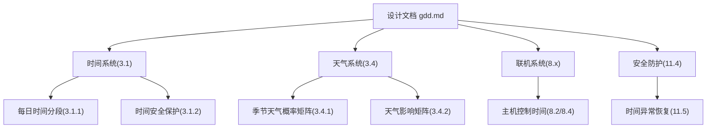
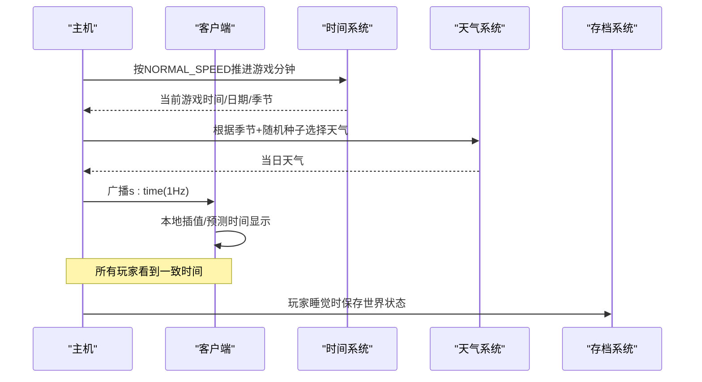
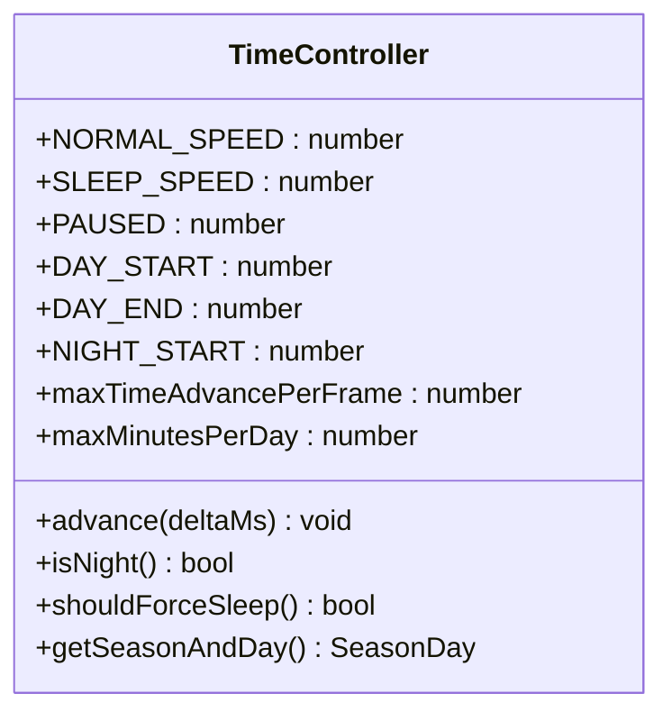
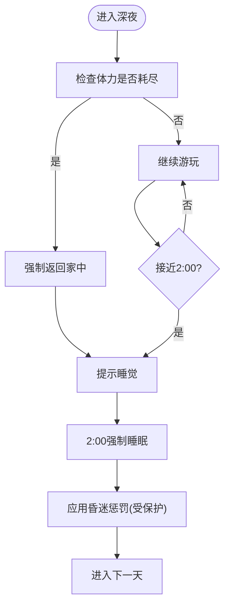
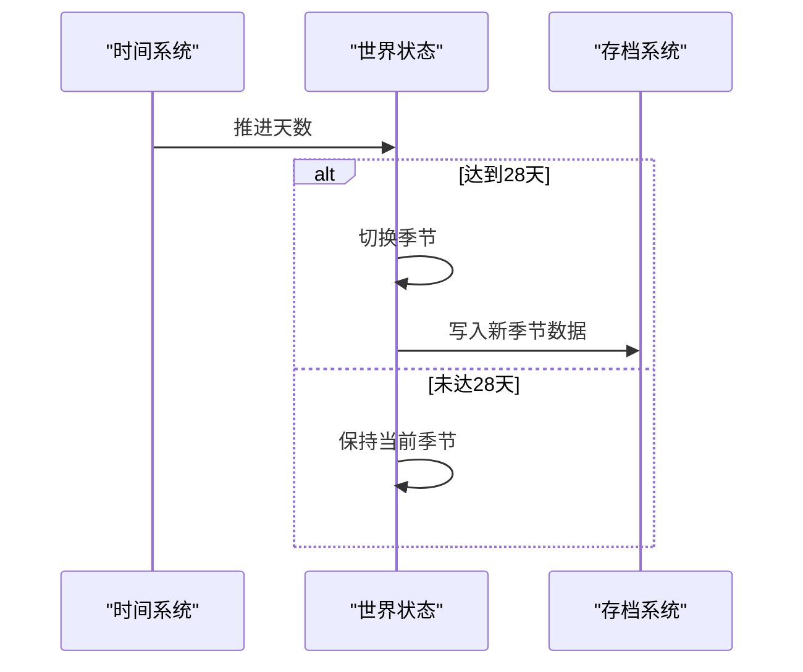
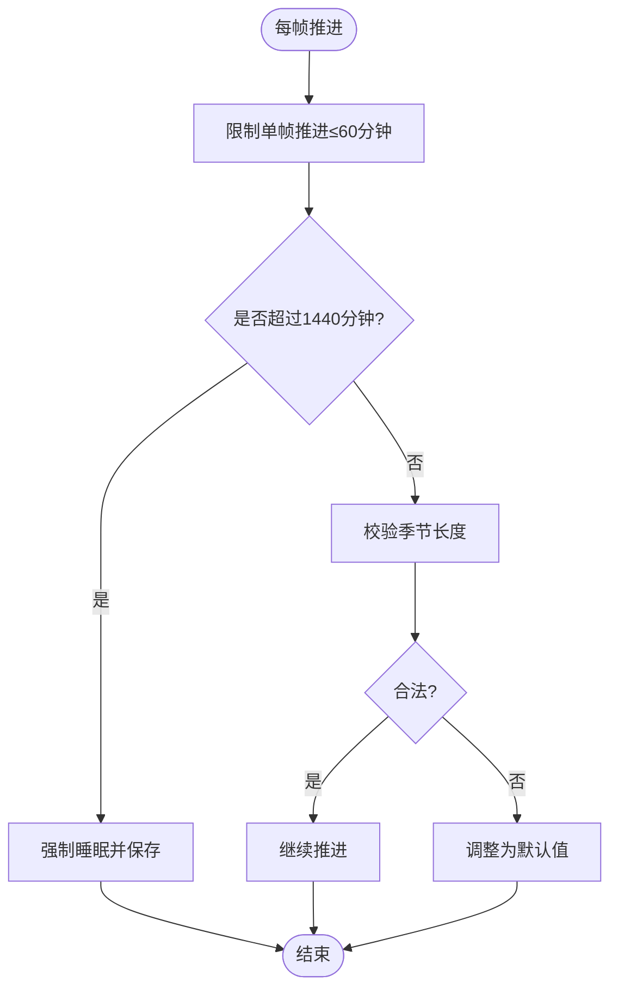
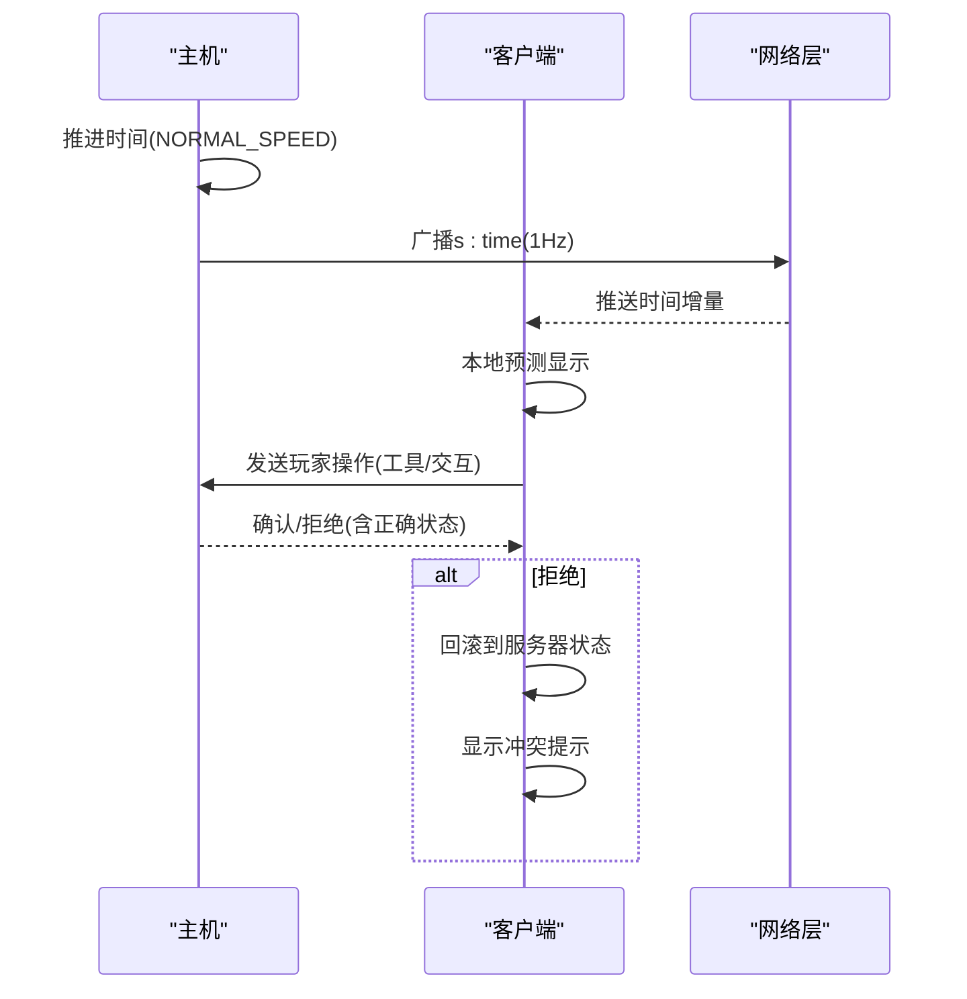
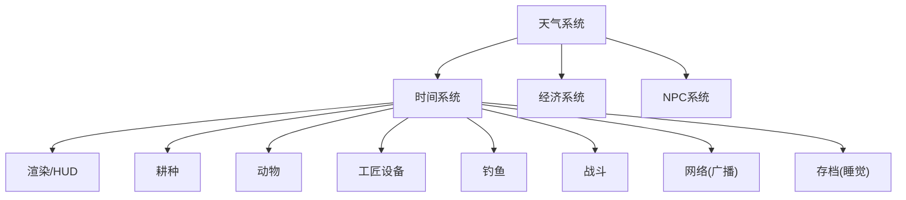

# 时间系统与季节变化

<cite>
**本文引用的文件**   
- [gdd.md](file://gdd.md)
</cite>

## 目录
1. [引言](#引言)
2. [项目结构](#项目结构)
3. [核心组件](#核心组件)
4. [架构总览](#架构总览)
5. [详细组件分析](#详细组件分析)
6. [依赖关系分析](#依赖关系分析)
7. [性能考量](#性能考量)
8. [故障排查指南](#故障排查指南)
9. [结论](#结论)
10. [附录](#附录)

## 引言
本章节聚焦《山野小村》的时间系统与季节变化，围绕硬性规定展开：每日约14分钟现实时间的精确控制、游戏日循环从6:00至凌晨2:00、每季28天每年112天的季节计算。文档将解释每日时间分段的设计（清晨到深夜的氛围与NPC状态转换）、四季变化的视觉表现与天气影响矩阵、经济系统的季节性调整，并提供可直接落地的TypeScript实现要点（时间流速控制、季节切换逻辑、天气概率计算、安全保护机制）。同时说明联机模式下主机如何控制时间同步，以及客户端预测如何处理时间相关操作的延迟。

## 项目结构
本项目为设计文档驱动型仓库，核心规则与数值定义集中于单一设计文档中。时间系统与季节变化相关内容主要分布在“第三部分：核心系统规定”的“3.1 时间系统”“3.4 天气系统”，并在“第八部分：联机系统规定”“第十一部分：安全防护机制”等章节提供网络与安全约束。

图表来源
- [gdd.md:180-235](file://gdd.md#L180-L235)
- [gdd.md:345-372](file://gdd.md#L345-L372)
- [gdd.md:1466-1546](file://gdd.md#L1466-L1546)
- [gdd.md:1938-1945](file://gdd.md#L1938-L1945)

章节来源
- [gdd.md:180-235](file://gdd.md#L180-L235)
- [gdd.md:345-372](file://gdd.md#L345-L372)
- [gdd.md:1466-1546](file://gdd.md#L1466-L1546)
- [gdd.md:1938-1945](file://gdd.md#L1938-L1945)

## 核心组件
- 时间流速与日边界
  - 正常速度、睡眠加速、暂停三种模式；日起始6:00、截止凌晨2:00；夜间困倦阈值用于行为提示。
- 每日时间分段
  - 清晨→上午→午后→下午→傍晚→夜晚→深夜，对应氛围、NPC状态与玩家活动建议。
- 季节与年长度
  - 每季28天，一年112天；存档在睡觉时触发。
- 天气系统
  - 季节天气概率矩阵与对作物/NPC/钓鱼/采集/动物/矿洞的影响矩阵；电视天气预报准确率90%。
- 安全保护
  - 单帧最大推进分钟数、单日最大分钟数校验、季节长度校验与回退策略；时间异常检测与恢复流程。

章节来源
- [gdd.md:180-235](file://gdd.md#L180-L235)
- [gdd.md:345-372](file://gdd.md#L345-L372)
- [gdd.md:1938-1945](file://gdd.md#L1938-L1945)

## 架构总览
时间系统作为全局时钟，驱动渲染、业务更新与网络广播；季节与天气由时间推进派生，并反向影响经济产出与内容解锁。

图表来源
- [gdd.md:180-235](file://gdd.md#L180-L235)
- [gdd.md:345-372](file://gdd.md#L345-L372)
- [gdd.md:1466-1546](file://gdd.md#L1466-L1546)
- [gdd.md:1595-1604](file://gdd.md#L1595-L1604)

## 详细组件分析

### 时间流速与日循环控制
- 关键常量
  - NORMAL_SPEED、SLEEP_SPEED、PAUSED
  - DAY_START=600（6:00）、DAY_END=2600（26:00即凌晨2:00）、NIGHT_START=2400
- 推进策略
  - 每帧推进 = deltaRealSec × NORMAL_SPEED（单位：游戏分钟）
  - 睡眠期间使用SLEEP_SPEED快速推进至次日
  - 打开菜单/对话/背包时PAUSED=0暂停推进
- 边界保护
  - maxTimeAdvancePerFrame限制单帧最大推进分钟数，超限则clamp并记录日志
  - maxMinutesPerDay=1440，超过则强制睡眠并保存

章节来源
- [gdd.md:193-235](file://gdd.md#L193-L235)

#### 类图（时间控制器）

图表来源
- [gdd.md:193-235](file://gdd.md#L193-L235)

### 每日时间分段与体验设计
- 时段划分与氛围
  - 清晨6:00-8:00、上午8:00-12:00、午后12:00-14:00、下午14:00-18:00、傍晚18:00-20:00、夜晚20:00-24:00、深夜24:00-2:00
- NPC状态
  - 营业/休息/回家/睡觉随时间段变化；商店关门后进入夜晚阶段
- 玩家活动建议
  - 清晨浇水采集、上午社交购物耕种、午后钓鱼采矿、傍晚收尾准备、夜晚整理烹饪、深夜必须睡觉
- 安全提醒
  - 体力耗尽强制返家；2:00强制昏迷惩罚（金钱损失上限受保护）

章节来源
- [gdd.md:211-222](file://gdd.md#L211-L222)
- [gdd.md:193-235](file://gdd.md#L193-L235)

#### 流程图（深夜强制睡眠）

图表来源
- [gdd.md:211-222](file://gdd.md#L211-L222)
- [gdd.md:193-235](file://gdd.md#L193-L235)

### 季节与年长度
- 每季28天，一年112天
- 季节切换时机：当累计天数达到28天时自动切换
- 存档时机：每天睡觉时自动保存，确保季节/天气/进度一致性

章节来源
- [gdd.md:180-192](file://gdd.md#L180-L192)
- [gdd.md:1595-1604](file://gdd.md#L1595-L1604)

#### 时序图（季节切换）

图表来源
- [gdd.md:180-192](file://gdd.md#L180-L192)
- [gdd.md:1595-1604](file://gdd.md#L1595-L1604)

### 天气系统与影响矩阵
- 季节天气概率矩阵
  - 春：晴58%、小雨25%、大风17%
  - 夏：晴55%、小雨25%、雷暴12%、大风8%
  - 秋：晴50%、小雨25%、雷暴5%、大风20%
  - 冬：晴45%、雪45%、大风10%
- 天气影响矩阵
  - 作物：雨天自动浇水、雪不生长、风倒伏+15%
  - NPC：雨天室外-50%、雷暴-80%、雪-60%、风-30%
  - 钓鱼：雨/雷提升咬钩率，雪冰洞钓鱼，风无法钓鱼
  - 采集：雨天蘑菇出现增加
  - 动物：雨雪风室内
  - 矿洞：不受天气影响
- 天气预报
  - 电视每晚7:00播报次日天气，准确率90%，联机同一天气

章节来源
- [gdd.md:345-372](file://gdd.md#L345-L372)

#### 表格：季节天气概率矩阵
| 季节 | 晴天 | 小雨 | 雷暴 | 雪 | 大风 |
|:----:|:----:|:----:|:----:|:--:|:----:|
| 春 | 58% | 25% | — | — | 17% |
| 夏 | 55% | 25% | 12% | — | 8% |
| 秋 | 50% | 25% | 5% | — | 20% |
| 冬 | 45% | — | — | 45% | 10% |

图表来源
- [gdd.md:345-372](file://gdd.md#L345-L372)

#### 表格：天气对系统的影响矩阵
| 系统 | 晴天 | 小雨 | 雷暴 | 雪 | 大风 |
|------|:----:|:----:|:----:|:--:|:----:|
| 作物 | 正常 | 自动浇水 | 自动浇水 | 不生长 | 倒伏+15% |
| NPC | 正常 | 室外-50% | 室外-80% | 室外-60% | 室外-30% |
| 钓鱼 | 正常 | 咬钩×1.3 | 咬钩×1.5 | 冰洞钓鱼 | 无法钓鱼 |
| 采集 | 正常 | 蘑菇出现+ | 无影响 | 冬季采集物 | 无影响 |
| 动物 | 室外 | 室内 | 室内 | 室内 | 室内 |
| 矿洞 | 正常 | 正常 | 正常 | 正常 | 正常 |

图表来源
- [gdd.md:345-372](file://gdd.md#L345-L372)

### 经济系统的季节性调整
- 基础售价公式统一，品质与工匠加成通过乘数叠加
- 季节影响体现在：
  - 作物生长与再生周期（不同季节作物表）
  - 天气对产量与品质的间接影响（如雨天自动浇水减少人工成本）
  - 节日与特殊事件带来的价格波动（丰收节等）
- 通胀保护与金额上限防止数值膨胀

章节来源
- [gdd.md:254-332](file://gdd.md#L254-L332)

### 时间相关的安全保护机制
- 单帧推进上限：maxTimeAdvancePerFrame=60分钟，超限clamp并记录
- 单日最大分钟：maxMinutesPerDay=1440，超限强制睡眠
- 季节长度校验：validateSeasonLength=true，无效时adjustToDefault
- 时间异常恢复：检测到时间倒退或大幅跳跃时，回滚到最近有效状态或强制睡眠保存

章节来源
- [gdd.md:223-235](file://gdd.md#L223-L235)
- [gdd.md:1938-1945](file://gdd.md#L1938-L1945)

#### 流程图（时间安全保护）

图表来源
- [gdd.md:223-235](file://gdd.md#L223-L235)

### 联机模式下的时间同步与客户端预测
- 主机掌控时间流速，所有玩家同步同一时间
- 时间广播频率1Hz，客户端进行平滑显示与预测
- 操作延迟处理：客户端先执行动作（预测），主机确认；冲突时回滚并反馈
- 平等原则：主机与客户端体验一致，不存在主机优势

章节来源
- [gdd.md:1466-1546](file://gdd.md#L1466-L1546)

#### 序列图（联机时间同步与预测）

图表来源
- [gdd.md:1466-1546](file://gdd.md#L1466-L1546)

## 依赖关系分析
- 时间系统依赖
  - 渲染系统：HUD显示时间与天气
  - 业务系统：耕种/动物/工匠设备/钓鱼/战斗等按时间推进更新
  - 网络系统：主机广播时间，客户端插值显示
  - 存档系统：睡觉时持久化世界状态
- 天气系统依赖
  - 时间系统：基于季节与日期生成天气
  - 经济系统：天气影响产出与效率
  - NPC系统：天气影响外出概率与日程

图表来源
- [gdd.md:180-235](file://gdd.md#L180-L235)
- [gdd.md:345-372](file://gdd.md#L345-L372)
- [gdd.md:1466-1546](file://gdd.md#L1466-L1546)
- [gdd.md:1595-1604](file://gdd.md#L1595-L1604)

## 性能考量
- 时间推进采用固定步长与上限保护，避免单帧卡顿导致时间跳跃过大
- 天气与季节切换为低频事件，避免频繁重算
- 网络广播1Hz，降低带宽占用
- 客户端预测减少感知延迟，但需保证回滚路径稳定

[本节为通用指导，无需具体文件引用]

## 故障排查指南
- 时间异常
  - 现象：时间倒退、大幅前跳、跳过一天
  - 处理：检测后回滚到最近有效状态或强制睡眠保存
- 网络异常
  - 现象：时间不同步、操作被拒绝
  - 处理：自动重连、重试、降级同步频率
- 资源加载异常
  - 现象：天气贴图缺失、UI显示错误
  - 处理：跳过并使用占位纹理，重试一次
- 任务状态不一致
  - 现象：目标计数不符、前置条件缺失
  - 处理：自动修复或重置到检查点

章节来源
- [gdd.md:1938-1945](file://gdd.md#L1938-L1945)

## 结论
《山野小村》的时间系统与季节变化以硬性规则为核心，确保体验的一致性与可预期性。通过严格的速度控制、分段氛围设计、天气影响矩阵与经济联动，形成稳定的日常节奏与长期目标。联机模式下主机权威与客户端预测结合，保障公平与流畅。安全保护贯穿时间推进、季节切换与异常恢复，确保系统在极端情况下仍能稳健运行。

[本节为总结，无需具体文件引用]

## 附录

### TypeScript实现要点（路径参考）
- 时间流速控制
  - 参考：[gdd.md:193-235](file://gdd.md#L193-L235)
- 季节切换逻辑
  - 参考：[gdd.md:180-192](file://gdd.md#L180-L192)
- 天气概率计算
  - 参考：[gdd.md:345-372](file://gdd.md#L345-L372)
- 时间相关安全保护
  - 参考：[gdd.md:223-235](file://gdd.md#L223-L235)
- 联机时间同步与客户端预测
  - 参考：[gdd.md:1466-1546](file://gdd.md#L1466-L1546)
- 存档时机与数据结构
  - 参考：[gdd.md:1595-1604](file://gdd.md#L1595-L1604)

[本节为索引，无需具体代码片段]