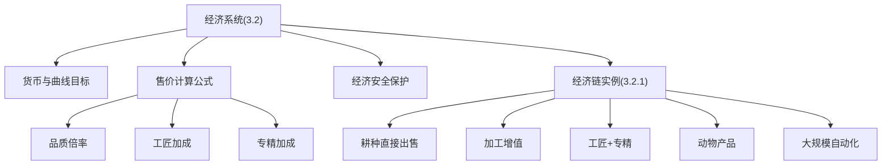
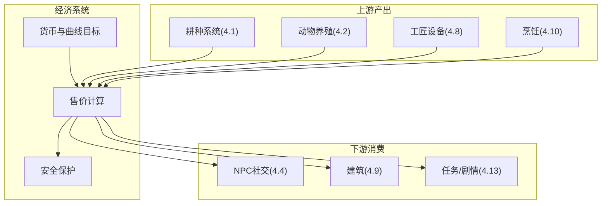
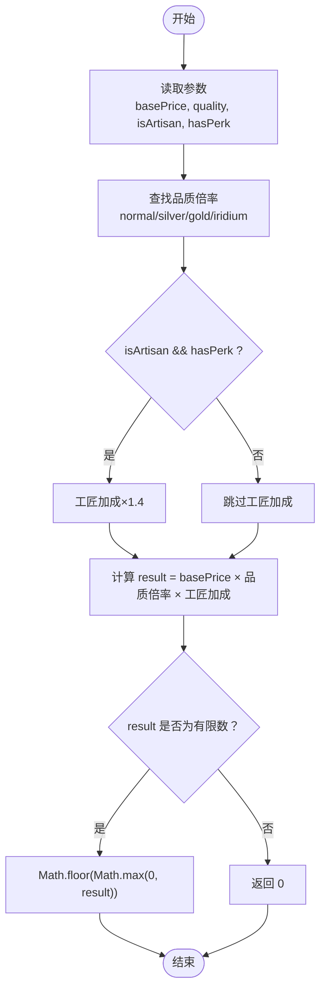
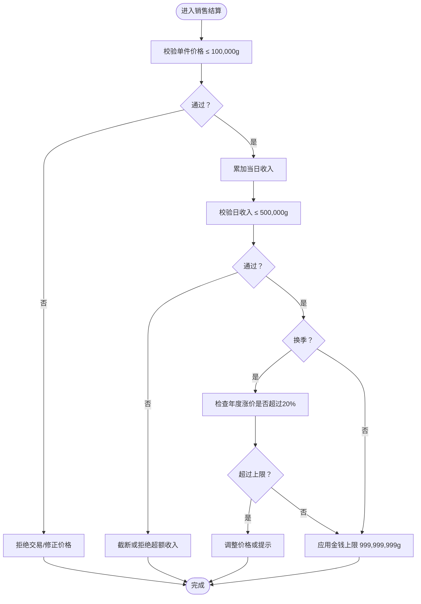
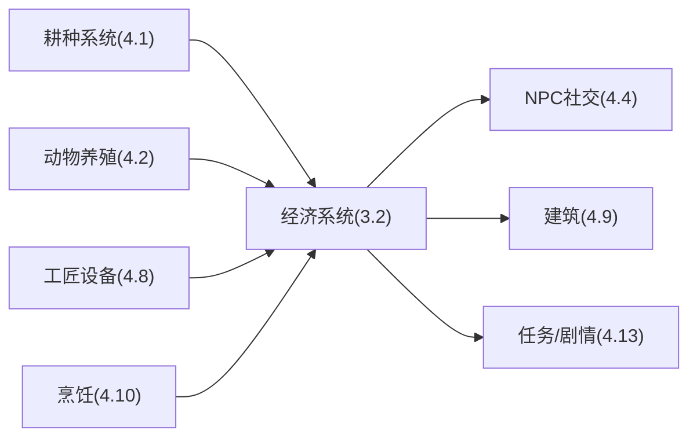

# 经济系统设计

<cite>
**本文引用的文件**   
- [gdd.md](file://gdd.md)
</cite>

## 目录
1. [引言](#引言)
2. [项目结构](#项目结构)
3. [核心组件](#核心组件)
4. [架构总览](#架构总览)
5. [详细组件分析](#详细组件分析)
6. [依赖分析](#依赖分析)
7. [性能考虑](#性能考虑)
8. [故障排查指南](#故障排查指南)
9. [结论](#结论)
10. [附录](#附录)

## 引言
本章节聚焦《山野小村》的经济系统，围绕唯一货币制度、初始资金、经济曲线目标、售价计算公式（品质倍率、工匠加成与专精加成）、阶段化经济策略、价格验证与安全保护机制，以及典型经济链实例进行系统化说明。文档以设计文档为依据，提供可直接落地的接口定义与算法流程，帮助开发与数值策划对齐实现。

## 项目结构
经济系统相关内容集中于设计规范文档的“第三部分：核心系统规定”中的“3.2 经济系统”，并与其他系统存在紧密耦合关系（如耕种、工匠设备、动物养殖、烹饪等）。整体结构如下：
- 货币与曲线目标：定义唯一货币、初始资金与经济曲线阶段目标
- 售价计算规则：统一公式与质量/工匠/专精乘区
- 安全保护：单件上限、日收入限制、通胀检查、金额上限
- 经济链示例：从初级到终局的收入来源与效率对比

图表来源
- [gdd.md:237-332](file://gdd.md#L237-L332)

章节来源
- [gdd.md:237-332](file://gdd.md#L237-L332)

## 核心组件
本节提炼经济系统的核心要素与可落地接口，便于开发直接引用。

- 唯一货币与初始资金
  - 唯一货币：金币（Gold），简称 g
  - 无内购/兑换/充值
  - 初始资金：500g

- 经济曲线目标（阶段划分）
  - 初期（春1-14）：日均 200-500g，累计约 5,000g
  - 发展期（春14-夏）：日均 1,000-5,000g，累计约 50,000g
  - 成长期（第1年秋）：日均 5,000-15,000g，累计约 300,000g
  - 成熟期（第2年）：日均 15,000-50,000g，累计约 1,500,000g
  - 自由期（第3年+）：日均 50,000g+，累计 5,000,000g+

- 售价计算公式（全局统一）
  - 输入：基础售价 basePrice、品质 quality、是否工匠 isArtisan、是否有专精 hasPerk
  - 输出：最终售价（整数，非负）
  - 关键乘区：
    - 品质倍率：normal=1.0，silver=1.25，gold=1.50，iridium=2.0
    - 工匠加成：isArtisan && hasPerk ? 1.4 : 1.0
  - 安全保护：结果需为有限数，且截断至非负整数

- 经济安全保护
  - 单件物品价格上限：100,000g
  - 日收入限制：500,000g
  - 最低种子成本：1g
  - 通胀检查：开启；年度最大涨幅 20%；在换季时检查
  - 金钱上限：999,999,999g

- 收入来源占比（目标）
  - 作物直接出售：初期 70%，成熟期 20%
  - 工匠产品：初期 5%，成熟期 40%
  - 动物产品：初期 5%，成熟期 20%
  - 采矿：初期 10%，成熟期 10%
  - 钓鱼：初期 5%，成熟期 5%
  - 采集/料理：初期 5%，成熟期 5%

章节来源
- [gdd.md:237-332](file://gdd.md#L237-L332)

## 架构总览
经济系统作为贯穿多玩法的核心回路，与耕种、工匠设备、动物养殖、烹饪等系统形成闭环。下图展示经济系统与相关系统的交互关系。

图表来源
- [gdd.md:237-332](file://gdd.md#L237-L332)
- [gdd.md:379-476](file://gdd.md#L379-L476)
- [gdd.md:478-515](file://gdd.md#L478-L515)
- [gdd.md:851-862](file://gdd.md#L851-L862)
- [gdd.md:889-963](file://gdd.md#L889-L963)
- [gdd.md:551-611](file://gdd.md#L551-L611)
- [gdd.md:863-888](file://gdd.md#L863-L888)
- [gdd.md:1017-1105](file://gdd.md#L1017-L1105)

## 详细组件分析

### 货币体系与初始资金
- 唯一货币：金币（g）
- 初始资金：500g
- 无内购/充值/兑换
- 金钱上限：999,999,999g（受数据边界保护）

章节来源
- [gdd.md:237-243](file://gdd.md#L237-L243)
- [gdd.md:318-332](file://gdd.md#L318-L332)

### 经济曲线目标与阶段策略
- 阶段目标：从初期的“勉强糊口”逐步过渡到“想买什么买什么”的自由期
- 阶段策略要点：
  - 初期：以直接出售作物为主，快速回笼资金
  - 发展期：引入基础加工设备，提升单位时间产值
  - 成长期：扩大自动化（洒水器、酿酒桶等），提高被动收入
  - 成熟期：多渠道收入（工匠产品、动物产品、种植高价值再生作物）
  - 自由期：大规模自动化与高价值产品组合，追求稳定高收益

章节来源
- [gdd.md:244-253](file://gdd.md#L244-L253)

### 售价计算公式与数学模型
- 公式构成：
  - 基础售价 × 品质倍率 × 工匠加成
- 品质倍率映射：
  - normal=1.0，silver=1.25，gold=1.50，iridium=2.0
- 工匠加成：
  - 当“是工匠产品”且“拥有对应专精”时，倍率为 1.4；否则为 1.0
- 安全处理：
  - 若结果为 NaN/Infinity，返回 0
  - 取整后确保非负

图表来源
- [gdd.md:254-274](file://gdd.md#L254-L274)

章节来源
- [gdd.md:254-274](file://gdd.md#L254-L274)

### 经济安全保护措施
- 单件物品价格上限：100,000g
- 日收入限制：500,000g
- 最低种子成本：1g
- 通胀检查：
  - 启用开关
  - 年度最大价格上涨幅度：20%
  - 触发时机：换季时检查
- 金钱上限：999,999,999g

图表来源
- [gdd.md:318-332](file://gdd.md#L318-L332)

章节来源
- [gdd.md:318-332](file://gdd.md#L318-L332)

### 经济链实例分析与优化策略
以下为设计文档中给出的四类经济链示例，用于对比不同玩法的价值与优化方向：

- 初级经济链（直接出售）
  - 防风草种子 20g → 种植4天 → 售价 35g → 利润 15g（日均 3.75g）
  - 适用场景：初期快速回本，低门槛入门

- 中级经济链（加工增值）
  - 番茄种子 30g → 种植11天 → 番茄售价 60g → 腌菜桶25天 → 腌番茄 120g
  - 利润 90g（日均 3.75g → 加工后等效 4.8g）
  - 适用场景：发展期引入加工设备，提升单位时间产出价值

- 高级经济链（工匠+专精）
  - 蓝莓种子 50g → 种植13天（再生4天）→ 一季收获4次（第13/17/21/25天）
  - 每次 80g × 酿酒桶6天 × 3.0倍率 = 240g/批
  - 4批全完成（最后一批跨季出桶，不影响）= 960g
  - 工匠专精×1.4 → 1,344g
  - 总利润 1,344 - 50 = 1,294g（按季节28天计，日均 46.2g）
  - 适用场景：成长期/成熟期，最大化高价值再生作物的加工收益

- 动物经济链
  - 鸡 800g + 鸡舍 3,000g = 3,800g 初始投入
  - 每天产蛋 1个（蛋基础价 100g）→ 蛋黄酱机3h → 蛋黄酱 180g（×1.8）
  - 日收入 180g → 回本周期 22天
  - 适用场景：稳定被动收入，配合工匠设备提升附加值

- 终局经济链（大规模自动化）
  - 铱洒水器覆盖 5×5 → 25格自动浇水
  - 每格种上古水果（再生7天）→ 酿酒桶 → 果酒
  - 每格日收入约 150g → 25格日收入 3,750g
  - 被动收入（只需收获+放桶）
  - 适用场景：成熟期/自由期，追求高规模、高稳定的被动收入

章节来源
- [gdd.md:276-305](file://gdd.md#L276-L305)

### TypeScript 接口定义（经济计算与价格验证）
以下接口与类型可直接用于实现经济计算与价格验证逻辑。

- 售价计算函数签名
  - calculateSellPrice(basePrice: number, quality: 'normal' | 'silver' | 'gold' | 'iridium', isArtisan: boolean, hasPerk: boolean): number

- 经济安全配置对象
  - ECONOMY_SAFEGUARDS: {
      maxSingleItemPrice: number;
      maxDailyIncome: number;
      minSeedCost: number;
      inflationCheck: {
        enabled: boolean;
        maxAnnualPriceIncrease: number;
        checkOnSeasonChange: boolean;
      };
      moneyCap: number;
    }

- 作物数据接口（用于经济链建模）
  - CropData: {
      id: string;
      name: string;
      season: 'spring' | 'summer' | 'fall' | 'winter';
      seedCost: number;
      growthDays: number;
      regrowDays: number | null;
      basePrice: number;
      sellToNpc: boolean;
      canBeGiant: boolean;
      description: string;
      color: string;
      category: 'vegetable' | 'fruit' | 'flower' | 'grain' | 'mushroom';
      giftPreference: 'love' | 'like' | 'neutral' | 'hate';
      cookingId: string | null;
      qualityChances: {
        normal: number;
        silver: number;
        gold: number;
        iridium: number;
      };
    }

- 动物好感度接口（影响产品质量与数量）
  - AnimalFriendship: {
      current: number;
      max: number;
      pet: number;
      fed: number;
      outside: number;
      missed: number;
      sick: number;
      productQuality: number;
      productAmount: number;
    }

- 工具能效映射（间接影响单位时间产出）
  - TOOL_ENERGY_COST: Record<string, number>

- 存档数据结构（含金钱字段）
  - SaveData.player.money: number（受 valueBounds 保护）

章节来源
- [gdd.md:254-274](file://gdd.md#L254-L274)
- [gdd.md:318-332](file://gdd.md#L318-L332)
- [gdd.md:389-413](file://gdd.md#L389-L413)
- [gdd.md:492-504](file://gdd.md#L492-L504)
- [gdd.md:543-549](file://gdd.md#L543-L549)
- [gdd.md:1608-1650](file://gdd.md#L1608-L1650)

## 依赖分析
经济系统与其他系统的依赖关系如下：
- 上游产出：
  - 耕种系统：提供作物与再生周期，决定基础售价与产出频率
  - 动物养殖：提供动物产品，结合工匠设备提升附加值
  - 工匠设备：对原料进行加工，放大售价倍率
  - 烹饪系统：将食材转化为料理，影响送礼偏好与潜在售价
- 下游消费：
  - NPC社交：礼物偏好影响社交收益，间接推动配方解锁与帮助
  - 建筑系统：设施容量与升级影响生产规模
  - 任务/剧情：社区中心献祭与节日活动提供阶段性目标与奖励

图表来源
- [gdd.md:379-476](file://gdd.md#L379-L476)
- [gdd.md:478-515](file://gdd.md#L478-L515)
- [gdd.md:851-862](file://gdd.md#L851-L862)
- [gdd.md:889-963](file://gdd.md#L889-L963)
- [gdd.md:551-611](file://gdd.md#L551-L611)
- [gdd.md:863-888](file://gdd.md#L863-L888)
- [gdd.md:1017-1105](file://gdd.md#L1017-L1105)

章节来源
- [gdd.md:379-476](file://gdd.md#L379-L476)
- [gdd.md:478-515](file://gdd.md#L478-L515)
- [gdd.md:851-862](file://gdd.md#L851-L862)
- [gdd.md:889-963](file://gdd.md#L889-L963)
- [gdd.md:551-611](file://gdd.md#L551-L611)
- [gdd.md:863-888](file://gdd.md#L863-L888)
- [gdd.md:1017-1105](file://gdd.md#L1017-L1105)

## 性能考虑
- 经济计算应轻量高效，避免在高频路径中进行复杂运算
- 批量结算（如每日收入汇总）建议分帧或异步处理，防止卡顿
- 通胀检查仅在换季时执行，减少频繁开销
- 价格上限与日收入限制应在结算入口集中校验，降低重复判断

[本节为通用指导，不直接分析具体文件]

## 故障排查指南
- 常见异常与修复
  - 单件价格超限：检查品质倍率与工匠加成是否正确应用；确认价格上限拦截生效
  - 日收入超限：核对当日所有收入来源的累加逻辑；确认上限截断策略
  - 通胀检查误报：确认换季触发条件与年度涨幅阈值设置
  - 金钱溢出：确认 moneyCap 与 valueBounds 的联动保护
- 日志与诊断
  - 记录触发安全保护的数值与阈值，便于回溯
  - 对异常交易进行标记与隔离，避免污染后续结算

章节来源
- [gdd.md:318-332](file://gdd.md#L318-L332)

## 结论
《山野小村》的经济系统以单一货币与清晰曲线为目标，通过统一的售价计算模型与严格的安全保护机制，确保从初期到终局的体验连贯与数值可控。开发者应优先实现核心公式与安全护栏，再逐步扩展经济链内容与自动化设施，以实现收入来源多元化与长期可玩性。

[本节为总结性内容，不直接分析具体文件]

## 附录
- 术语
  - 品质倍率：normal/silver/gold/iridium 对应的乘区
  - 工匠加成：isArtisan 且 hasPerk 时的额外倍率
  - 通胀检查：换季时对年度价格涨幅的限制
  - 日收入限制：单日总收入的上限保护
  - 金钱上限：玩家持有金币的最大值

[本节为补充说明，不直接分析具体文件]