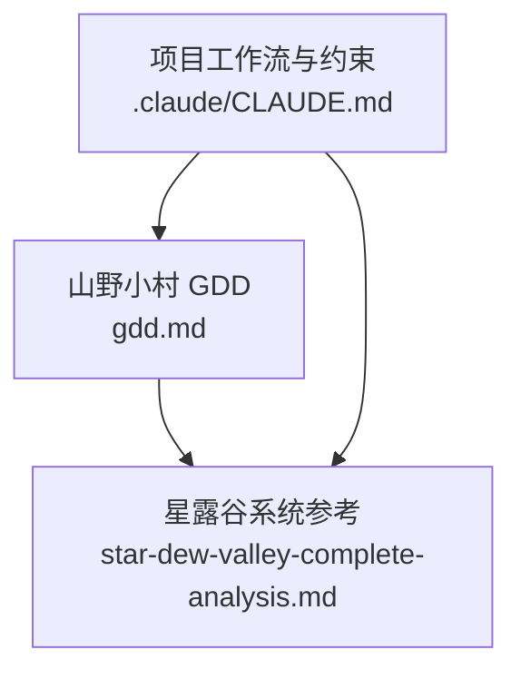
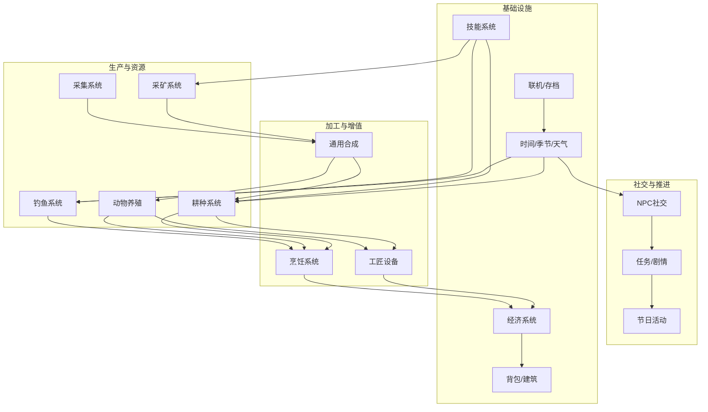
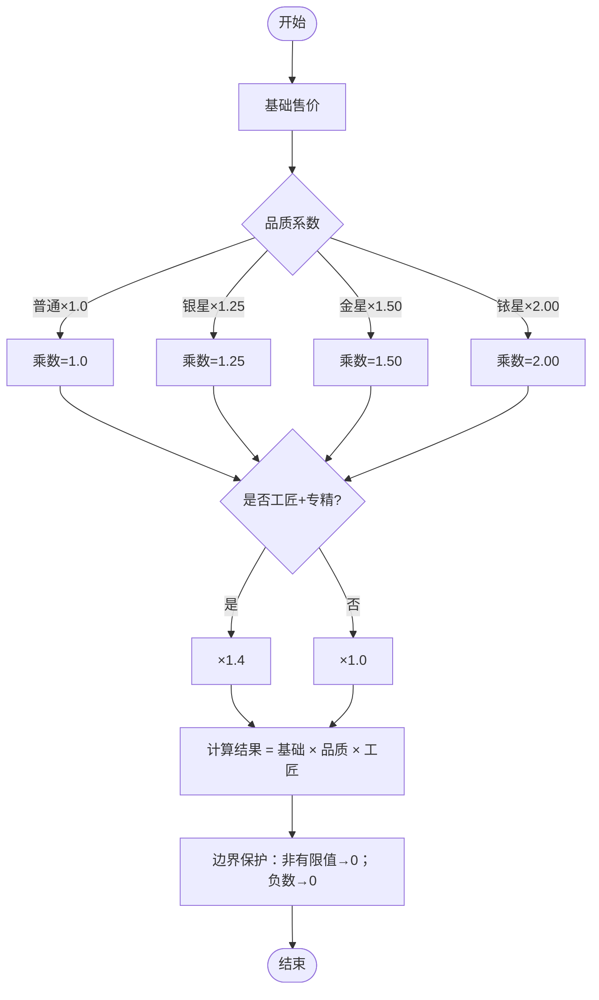
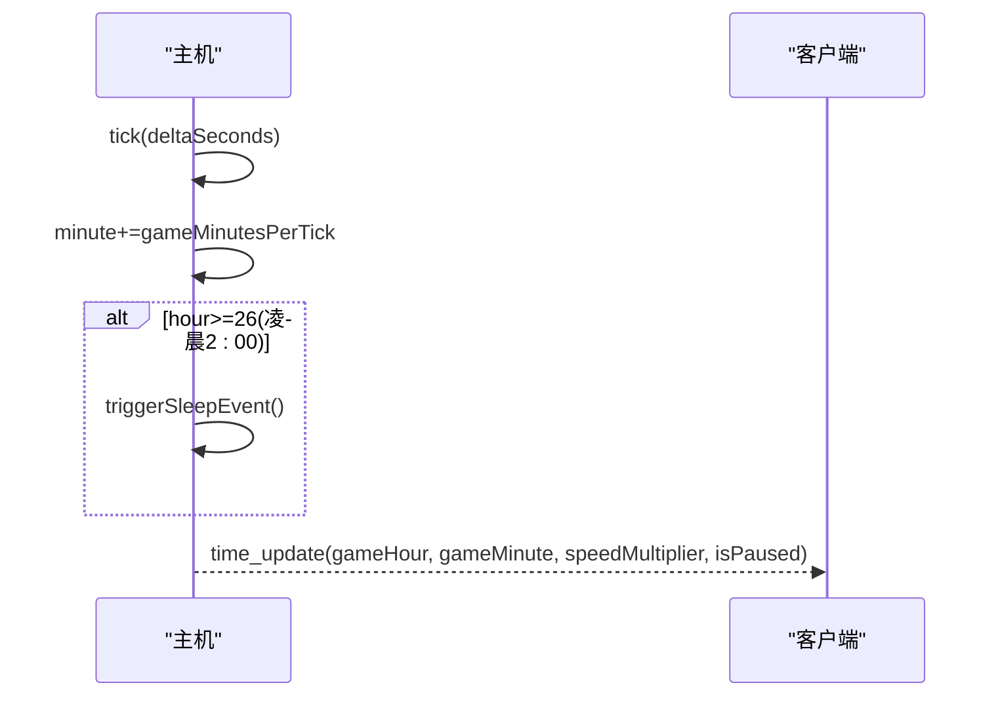
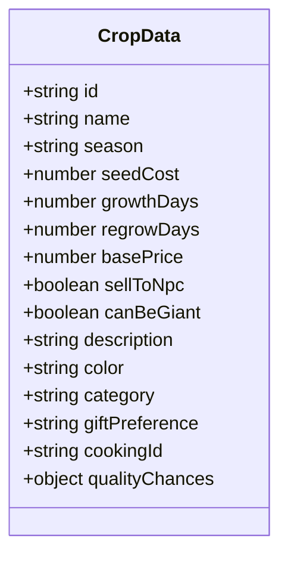
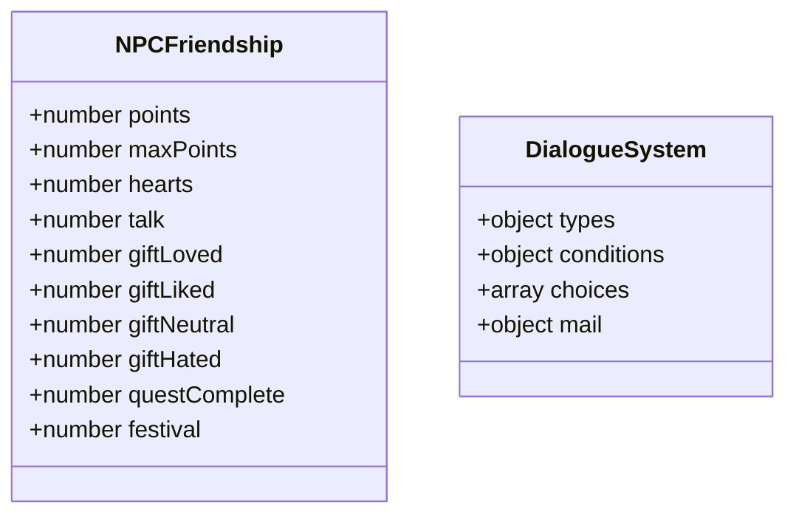
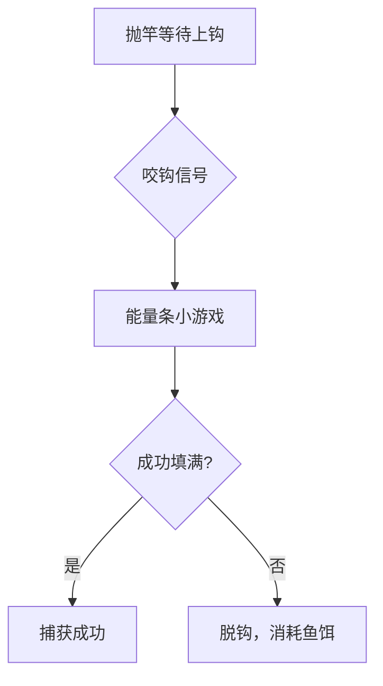
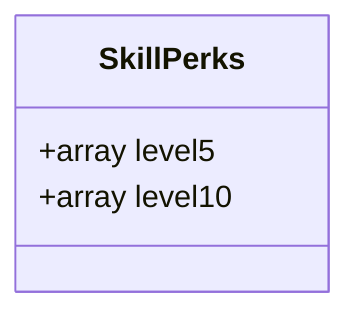
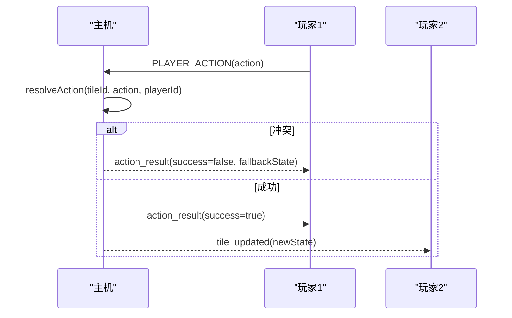
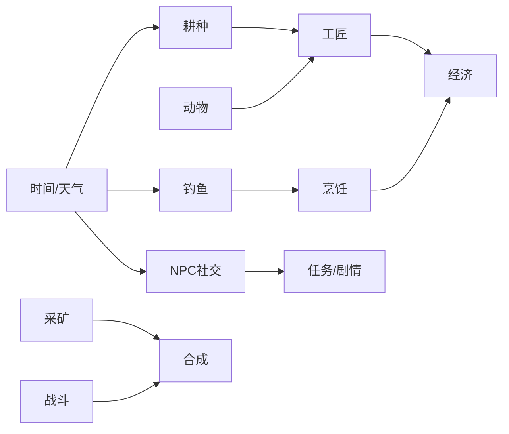

# 参考分析与学习

<cite>
**本文引用的文件**   
- [gdd.md](file://gdd.md)
- [star-dew-valley-complete-analysis.md](file://star-dew-valley-complete-analysis.md)
- [CLAUDE.md](file://.claude/CLAUDE.md)
</cite>

## 目录
1. [引言](#引言)
2. [项目结构](#项目结构)
3. [核心组件](#核心组件)
4. [架构总览](#架构总览)
5. [详细组件分析](#详细组件分析)
6. [依赖关系分析](#依赖关系分析)
7. [性能与体验优化](#性能与体验优化)
8. [故障排查与安全护栏](#故障排查与安全护栏)
9. [结论与建议](#结论与建议)
10. [附录：数值模拟、A/B测试与玩家调研方法](#附录数值模拟ab测试与玩家调研方法)

## 引言
本文件以《山野小村》游戏设计规范书（GDD）为唯一设计依据，结合《星露谷物语》完整系统拆解文档，对两款农场游戏的14个核心系统进行对比分析，提炼经济系统设计、NPC行为模式、内容解锁机制与长期留存策略，并给出差异化创新建议。同时提供系统拆解方法论、数据分析技巧与用户体验评估框架，帮助设计团队做出更明智的产品决策。

## 项目结构
仓库包含两个关键文档：
- gdd.md：《山野小村》的完整设计规范书，涵盖世界观、时间/经济/天气等核心系统、14个玩法系统、UI/UX、音频、联机、存档、安全护栏等。
- star-dew-valley-complete-analysis.md：《星露谷物语》的系统级拆解，覆盖地图、时间、耕种、动物、工匠、战斗、钓鱼、采集、技能、NPC、社区中心/主线、节日、建筑、任务、收集、多人、技术栈等。
- .claude/CLAUDE.md：项目工作流与约束说明，强调全栈TypeScript、显式类型、质量优先、性能不设限、联机不歧视等原则。

图表来源
- [gdd.md:1-100](file://gdd.md#L1-L100)
- [star-dew-valley-complete-analysis.md:1-120](file://star-dew-valley-complete-analysis.md#L1-L120)
- [CLAUDE.md:1-30](file://.claude/CLAUDE.md#L1-L30)

章节来源
- [gdd.md:1-120](file://gdd.md#L1-L120)
- [star-dew-valley-complete-analysis.md:1-120](file://star-dew-valley-complete-analysis.md#L1-L120)
- [CLAUDE.md:1-30](file://.claude/CLAUDE.md#L1-L30)

## 核心组件
基于GDD，《山野小村》的核心系统包括：
- 时间与季节系统：固定日长、季节长度、睡眠结算、天气预告
- 经济系统：金币制、收入曲线、售价公式、通胀检查、金额上限
- 体力与能量：工具消耗、恢复方式、昏迷惩罚
- 天气系统：概率矩阵、多系统影响、电视预报
- 耕种系统：流程、作物数据表、肥料、洒水器、安全保护
- 动物养殖：种类、好感度、数量上限
- 工具升级：等级、材料、范围加成
- NPC社交：名单、日程、好感度、结婚条件、对话数据结构
- 战斗系统：矿洞结构、战斗规则、武器类型、怪物掉落
- 钓鱼系统：规则、小游戏、鱼类分布
- 技能系统：列表、专精选择、不可重置
- 工匠设备：设备清单、加工链、倍率
- 建筑系统：可建造建筑、房屋升级路径
- 烹饪系统：规则、分类、食谱全表
- 通用合成：配方、用途、关联系统
- 背包系统：容量、堆叠、分类、快速切换
- 任务/剧情：主线、支线、求助、收集
- 节日系统：日程、详细玩法、通用规则
- UI/UX：HUD、菜单、交互反馈、通知
- 音频：音乐风格、音效命名、技术规范
- 联机系统：Listen Server、同步规则、消息类型、平等原则
- 存档系统：时机、槽位、安全保护

章节来源
- [gdd.md:180-373](file://gdd.md#L180-L373)
- [gdd.md:379-1173](file://gdd.md#L379-L1173)
- [gdd.md:1298-1449](file://gdd.md#L1298-L1449)
- [gdd.md:1451-1590](file://gdd.md#L1451-L1590)
- [gdd.md:1593-1600](file://gdd.md#L1593-L1600)

## 架构总览
下图展示《山野小村》各系统的整合闭环与正向反馈链，体现“内容密度 > 系统广度”和“有机整合”的设计哲学。

图表来源
- [gdd.md:1176-1295](file://gdd.md#L1176-L1295)

章节来源
- [gdd.md:1176-1295](file://gdd.md#L1176-L1295)

## 详细组件分析

### 经济与数值平衡
- 经济曲线目标：初期→发展期→成长期→成熟期→自由期，日均收入与标志性事件清晰。
- 售价计算：统一公式，考虑品质与工匠专精，输出受边界保护，防NaN/Infinity。
- 收入来源占比：随阶段变化，从作物直接出售逐步转向工匠产品与动物产品。
- 安全保护：单件价格上限、每日收入上限、种子最低成本、通胀检查、金额上限。

图表来源
- [gdd.md:254-274](file://gdd.md#L254-L274)
- [gdd.md:318-332](file://gdd.md#L318-L332)

章节来源
- [gdd.md:237-332](file://gdd.md#L237-L332)

### 时间/季节/天气
- 时间系统：1天约14分钟现实时间，6:00-凌晨2:00，睡觉自动保存，主机控制时间流速。
- 季节系统：每季28天，每年112天，不同季节作物/采集/鱼种/节日不同。
- 天气系统：概率矩阵影响作物/NPC/钓鱼/采集/动物，电视天气预报准确率90%。

图表来源
- [gdd.md:193-235](file://gdd.md#L193-L235)
- [gdd.md:345-373](file://gdd.md#L345-L373)

章节来源
- [gdd.md:180-235](file://gdd.md#L180-L235)
- [gdd.md:345-373](file://gdd.md#L345-L373)

### 耕种与自动化
- 流程：翻地→播种→浇水→生长→收获，雨天自动浇水。
- 作物数据：id/name/season/seedCost/growthDays/regrowDays/basePrice/sellToNpc/canBeGiant/description/color/category/giftPreference/cookingId/qualityChances。
- 肥料与洒水器：提升质量概率、保水、覆盖范围渐进解锁。
- 安全保护：地块上限、单次收获上限、生长进度校验。

图表来源
- [gdd.md:389-413](file://gdd.md#L389-L413)
- [gdd.md:448-476](file://gdd.md#L448-L476)

章节来源
- [gdd.md:379-476](file://gdd.md#L379-L476)

### 动物养殖与工匠设备
- 动物：鸡/鸭/牛/羊/猪，产蛋/奶/毛/松露，好感度影响产出质量与数量。
- 工匠设备：蛋黄酱机/奶酪压机/腌菜桶/酿酒桶/蜂箱/织布机/油榨机，加工链带来高倍率收益。
- 正向反馈：动物→工匠→经济→建筑→更多动物。

图表来源
- [gdd.md:478-515](file://gdd.md#L478-L515)
- [gdd.md:851-862](file://gdd.md#L851-L862)

章节来源
- [gdd.md:478-515](file://gdd.md#L478-L515)
- [gdd.md:851-862](file://gdd.md#L851-L862)

### NPC社交与日程
- 名单与定位：17名NPC，含可结婚对象与村民，生日/最爱礼物明确。
- 好感度：对话/送礼/任务/节日互动累计，心数里程碑解锁内容。
- 日程：工作日/周末/雨天/节日四套日程，位置由主机同步。
- 对话系统：类型/条件/回复选项/邮件系统数据结构。

图表来源
- [gdd.md:575-590](file://gdd.md#L575-L590)
- [gdd.md:669-711](file://gdd.md#L669-L711)

章节来源
- [gdd.md:551-711](file://gdd.md#L551-L711)

### 战斗与钓鱼
- 战斗：矿洞60层，随机生成，电梯每10层，怪物密度与掉落明确，死亡惩罚可控。
- 钓鱼：小游戏能量条控制，难度分级，蟹笼/鱼塘扩展，鱼类分布按区域/季节/天气/时间。

图表来源
- [gdd.md:713-767](file://gdd.md#L713-L767)
- [gdd.md:768-818](file://gdd.md#L768-L818)

章节来源
- [gdd.md:713-818](file://gdd.md#L713-L818)

### 技能与专精
- 技能：耕种/采矿/采集/钓鱼/战斗，升级方式与解锁内容明确。
- 专精：5级二选一，10级进阶分支，不可重置，形成差异化Build。

图表来源
- [gdd.md:831-839](file://gdd.md#L831-L839)

章节来源
- [gdd.md:819-850](file://gdd.md#L819-L850)

### 建筑与房屋升级
- 建筑：鸡舍/畜棚/筒仓/马厩/鱼塘/小屋等，容量与功能明确。
- 房屋升级：厨房/卧室扩大/地下室/顶层观景台，解锁烹饪/陈酿/终局能力。

章节来源
- [gdd.md:863-888](file://gdd.md#L863-L888)

### 烹饪与通用合成
- 烹饪：30+食谱，分类为体力恢复/属性增益/特殊效果/礼物，食材来源广泛。
- 通用合成：避雷针/炸弹/宝石复制机/树液采集器/稻草人/种子机等，设施/工具/装饰/消耗品齐全。

章节来源
- [gdd.md:889-994](file://gdd.md#L889-L994)

### 任务/剧情与节日
- 任务：主线修复社区中心，支线/求助/收集驱动探索与系统联动。
- 节日：春之祭/夏夜花火/丰收节/冬雪庆典，参与奖+名次奖，联机同享氛围。

章节来源
- [gdd.md:1017-1173](file://gdd.md#L1017-L1173)

### 联机系统与存档
- 架构：Listen Server，最大4人，局域网/互联网房间码连接，状态增量同步。
- 同步：玩家位置/地块状态/物品金钱/NPC位置/时间/聊天，频率与可靠性分层。
- 平等原则：操作延迟感知一致，本地预测+主机仲裁，冲突回滚。
- 存档：睡觉时自动保存，3手动+1自动槽位，安全写入。

图表来源
- [gdd.md:1451-1590](file://gdd.md#L1451-L1590)
- [gdd.md:1593-1600](file://gdd.md#L1593-L1600)

章节来源
- [gdd.md:1451-1600](file://gdd.md#L1451-L1600)

## 依赖关系分析
- 系统耦合与内聚：每个系统至少与另外两个系统有正向反馈循环，避免孤岛系统。
- 直接依赖：耕种→工匠→经济；动物→工匠→经济；采矿→合成→耕种/养殖；战斗→合成；钓鱼→烹饪→NPC送礼。
- 间接依赖：时间/天气影响所有户外系统；NPC社交推动任务与解锁；技能专精强化特定系统效率。
- 外部集成点：联机网络协议、存档IO、渲染/输入跨平台适配。

图表来源
- [gdd.md:1176-1295](file://gdd.md#L1176-L1295)

章节来源
- [gdd.md:1176-1295](file://gdd.md#L1176-L1295)

## 性能与体验优化
- 帧率与渲染：像素风天然向下兼容，纹理图集+对象池+视锥裁剪，手机端动态分辨率兜底。
- 网络带宽：像素农场极低（约2Kbps），手机4G/5G完全满足。
- 输入适配：触屏点击区域放大、智能目标选择、自动工具切换、长按连续操作。
- 安全护栏：七维熔断保护（渲染/网络/内存/循环/数值/状态/备份），异常自动修正与静默日志。

章节来源
- [gdd.md:1361-1404](file://gdd.md#L1361-L1404)
- [gdd.md:1451-1590](file://gdd.md#L1451-L1590)

## 故障排查与安全护栏
- 时间系统：maxTimeAdvancePerFrame限制、onExceededJump处理、maxMinutesPerDay强制睡眠。
- 经济系统：单件价格上限、每日收入上限、通胀检查、金额上限。
- 体力系统：体力归零拒绝操作、恢复不超过上限、昏迷惩罚上限保护。
- 存档系统：原子写入、备份槽位、读取一致性检查与自动修复。
- 联机系统：状态验证、速率限制、冲突回滚、断线重连保留状态。

章节来源
- [gdd.md:223-235](file://gdd.md#L223-L235)
- [gdd.md:318-332](file://gdd.md#L318-L332)
- [gdd.md:334-343](file://gdd.md#L334-L343)
- [gdd.md:1593-1600](file://gdd.md#L1593-L1600)
- [gdd.md:1466-1590](file://gdd.md#L1466-L1590)

## 结论与建议
- 《山野小村》在借鉴星露谷的基础上，强化了“舒适循环”“内容密度>系统广度”“有机整合”三大理念，并通过明确的数值边界与安全护栏保障稳定性。
- 差异化创新点：
  - 经济曲线更平滑，强调“无焦虑”的长期留存；
  - 天气与NPC日程深度联动，增强世界回应感；
  - 联机平等原则与本地预测确保公平体验；
  - 七维熔断保护降低崩溃风险，提升可玩性。
- 建议：
  - 持续完善系统整合闭环检查，确保新增内容不破坏正向反馈；
  - 建立数值监控仪表盘，跟踪通胀与收入分布；
  - 引入A/B测试与玩家调研，验证节日奖励与经济门槛；
  - 移动端优先优化触屏交互与性能档位。

[本节不直接分析具体文件，无需章节来源]

## 附录：数值模拟、A/B测试与玩家调研方法

### 数值模拟方法
- 目标：验证经济曲线与收入来源占比是否符合预期。
- 步骤：
  - 定义阶段指标：日均收入、累计收入、标志性事件触发时间。
  - 构建模拟器：按作物生长周期、加工倍率、技能专精、天气影响计算产出。
  - 运行蒙特卡洛：随机天气与掉落，统计均值与方差。
  - 阈值检查：单件价格上限、每日收入上限、通胀检查。
- 输出：收入曲线图、瓶颈节点、调整建议。

章节来源
- [gdd.md:244-332](file://gdd.md#L244-L332)

### A/B测试设计
- 场景：节日奖励梯度、经济门槛（种子价格）、工具升级费用。
- 分组：对照组（原方案）vs 实验组（调整参数）。
- 指标：次日留存、周留存、付费意愿（买断转化）、平均在线时长、系统使用率。
- 周期：至少一个完整季节（28天）观察稳定效应。
- 风险控制：设置熔断阈值，异常数据自动回滚至对照组。

章节来源
- [gdd.md:1106-1173](file://gdd.md#L1106-L1173)
- [gdd.md:318-332](file://gdd.md#L318-L332)

### 玩家调研方法
- 问卷：核心诉求（放松/成就感/陪伴感）、平台偏好、单次时长、付费意愿。
- 访谈：新手引导体验、系统理解度、情感共鸣点。
- 行为埋点：系统入口点击率、停留时长、失败重试次数。
- 可用性测试：触屏交互效率、菜单导航清晰度、通知可读性。

章节来源
- [gdd.md:47-58](file://gdd.md#L47-L58)
- [gdd.md:1361-1404](file://gdd.md#L1361-L1404)