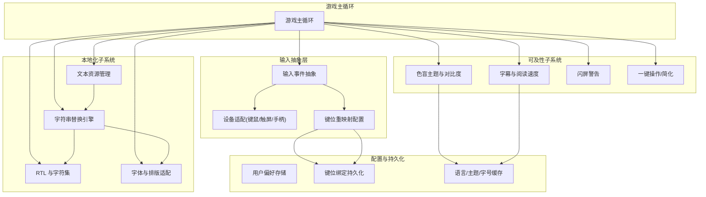
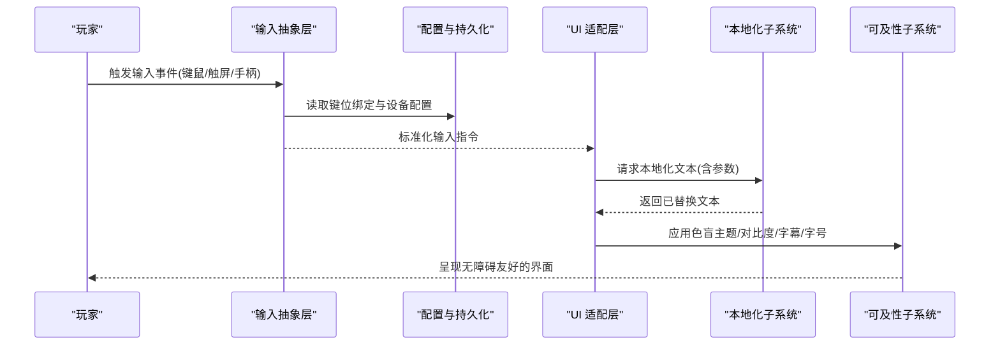
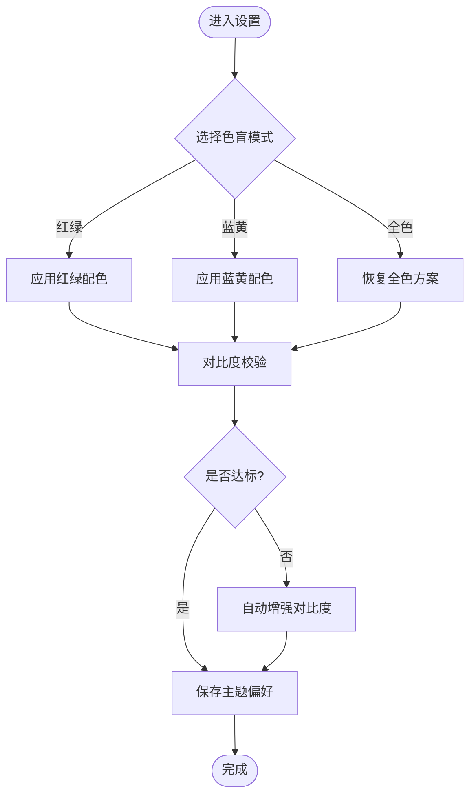
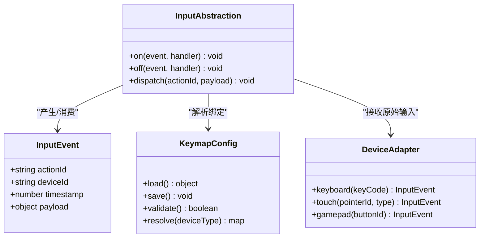
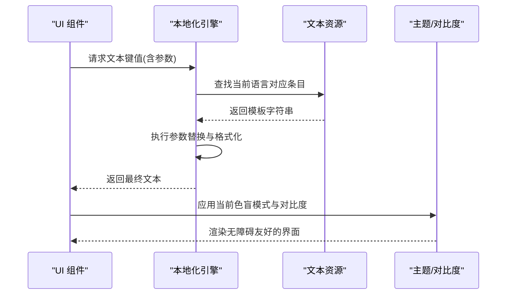
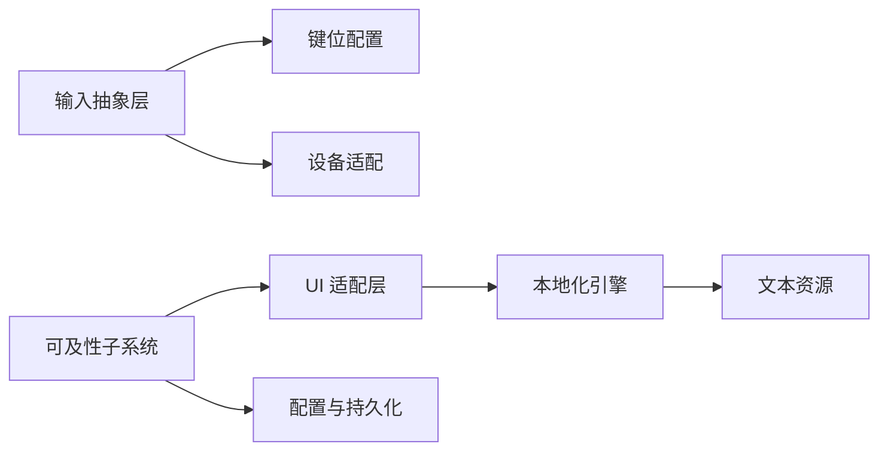

# 可及性与本地化

<cite>
**本文引用的文件**   
- [gdd.md](file://gdd.md)
</cite>

## 目录
1. [引言](#引言)
2. [项目结构](#项目结构)
3. [核心组件](#核心组件)
4. [架构总览](#架构总览)
5. [详细组件分析](#详细组件分析)
6. [依赖关系分析](#依赖关系分析)
7. [性能与体验考量](#性能与体验考量)
8. [故障排查指南](#故障排查指南)
9. [结论](#结论)
10. [附录](#附录)

## 引言
本文件面向《山野小村》的可及性与本地化实现，聚焦以下目标：
- 色盲模式、色彩对比度调整与视觉辅助功能的技术方案
- 可重映射键位系统的设计架构、输入事件抽象层与配置文件管理
- 多语言支持（文本资源管理、字符串替换机制、界面自适应布局）
- RTL 语言支持与字符集兼容性处理
- 可访问性测试方法、屏幕阅读器兼容性与键盘导航优化
- 本地化工作流程、翻译文件管理与版本同步策略
- 为开发团队提供完整的实现指南与最佳实践

说明：当前仓库以设计规范为主，尚未包含具体代码实现。本文基于规范文档中的相关条目进行系统化设计与落地建议，确保与既有设计原则一致。

章节来源
- [gdd.md:1986-2009](file://gdd.md#L1986-L2009)

## 项目结构
本项目目前以设计文档为核心资产，围绕“可及性与本地化”的落地，建议在后续工程阶段引入如下模块划分（概念性结构，便于理解）：
- 可及性子系统：色盲主题、对比度、字幕、按键重映射、操作简化、闪屏警告
- 输入抽象层：统一输入事件模型、设备适配（键鼠/触屏/手柄）、配置加载与校验
- 本地化子系统：文本资源、字符串替换、RTL 支持、字体与排版、区域设置
- 配置与持久化：用户偏好、键位绑定、语言与主题、存档联动
- UI 适配层：布局弹性、字号缩放、控件焦点与导航、无障碍标签

[此图为概念结构图，不直接映射到具体源码文件]

## 核心组件
本节从设计角度梳理关键能力与职责边界，确保与 GDD 中“可及性优先”的原则对齐。

- 色盲模式与对比度
  - 提供多套颜色方案（红绿/蓝黄/全色），运行时切换
  - 关键信息通过形状/纹理/图标等多通道编码，避免仅靠颜色传达
  - 对比度阈值检查，保证文字与背景满足可读性要求
- 可重映射键位
  - 所有交互动作均可自定义绑定，支持冲突检测与回退策略
  - 输入事件抽象层屏蔽设备差异，统一派发至业务逻辑
- 字幕与阅读速度
  - 对话与音效提示均有字幕；支持手动翻页与停留时长控制
- 闪屏警告
  - 启动时显示光敏性癫痫警告，允许跳过或延迟进入
- 一键操作
  - 长按执行连续动作，降低重复操作负担
- 本地化基础
  - 首发简体中文，预留英文扩展路径
  - 文本资源集中管理，字符串替换机制支持参数化与上下文
  - 布局自适应与 RTL 支持预留接口

章节来源
- [gdd.md:1986-2009](file://gdd.md#L1986-L2009)

## 架构总览
下图展示可及性与本地化在整体系统中的位置与交互关系。

[此图为概念流程图，不直接映射到具体源码文件]

## 详细组件分析

### 可及性子系统
- 色盲模式与对比度
  - 颜色方案：红绿/蓝黄/全色三套，运行时切换并即时生效
  - 非颜色编码：重要状态同时使用图标/形状/纹理区分
  - 对比度校验：对关键文本与背景进行对比度检查，必要时自动增强
- 字幕与阅读速度
  - 所有对话与音效提示均生成字幕
  - 支持手动翻页与停留时长控制，避免自动消失造成阅读压力
- 闪屏警告
  - 启动流程中加入光敏性癫痫警告，可选择跳过或延迟进入
- 一键操作
  - 长按执行连续动作，减少高频点击/按键带来的疲劳

[此图为概念流程图，不直接映射到具体源码文件]

章节来源
- [gdd.md:1986-2009](file://gdd.md#L1986-L2009)

### 可重映射键位系统与输入抽象层
- 输入事件抽象层
  - 统一输入事件模型，屏蔽键鼠/触屏/手柄差异
  - 将原始输入转换为语义化动作（如“确认/取消/移动/使用工具”）
- 键位重映射配置
  - 每个动作可绑定多个键位/手势，支持冲突检测与回退
  - 配置持久化，与存档分离，避免存档损坏影响键位设置
- 设备适配
  - 触屏虚拟摇杆、点击、长按等手势映射到统一动作
  - 手柄按钮映射与 PC 键位保持一致的语义

[此图为概念类图，不直接映射到具体源码文件]

章节来源
- [gdd.md:1986-2009](file://gdd.md#L1986-L2009)

### 本地化子系统
- 文本资源管理
  - 按语言分文件组织，键名采用层级命名（如 ui.menu.save）
  - 支持参数化替换（占位符），用于动态内容插入
- 字符串替换机制
  - 运行时根据当前语言与上下文选择对应文本
  - 缺失键值时提供回退策略（默认语言或占位提示）
- 界面自适应布局
  - 文本长度变化时自动换行与容器伸缩
  - 字号 S/M/L 三档缩放，保持布局稳定
- RTL 支持与字符集兼容
  - 预留 RTL 布局镜像与文本方向切换
  - 字符集覆盖常用拉丁、西里尔、阿拉伯、中日韩等

[此图为概念流程图，不直接映射到具体源码文件]

章节来源
- [gdd.md:1986-2009](file://gdd.md#L1986-L2009)

### 配置与持久化
- 用户偏好存储
  - 语言、主题、字号、字幕开关、震动反馈等
- 键位绑定持久化
  - 独立于存档，避免存档损坏导致键位丢失
- 缓存策略
  - 常用文本与主题资源预加载，减少运行时开销

章节来源
- [gdd.md:1986-2009](file://gdd.md#L1986-L2009)

## 依赖关系分析
- 耦合与内聚
  - 输入抽象层与键位配置高内聚，对外暴露统一动作接口
  - 本地化引擎与 UI 适配层解耦，通过键值与参数传递数据
  - 可及性子系统作为横切关注点，贯穿 UI 渲染与交互反馈
- 外部依赖
  - 平台输入 API（键鼠/触屏/手柄）
  - 文本资源文件系统或打包资源
  - 本地存储（浏览器/桌面/移动端）

[此图为概念依赖图，不直接映射到具体源码文件]

## 性能与体验考量
- 主题切换与对比度计算应在后台线程或异步队列中进行，避免阻塞主循环
- 文本替换与布局重排应批量合并，减少频繁重绘
- 字幕与对话框渲染需考虑帧率稳定性，必要时降级动画效果
- 键位配置校验与冲突检测应在保存前完成，避免运行时异常

[本节为通用指导，无需特定文件引用]

## 故障排查指南
- 色盲模式无效
  - 检查主题资源是否完整加载
  - 验证对比度校验逻辑是否被正确调用
- 键位冲突
  - 查看冲突检测日志，确认回退策略是否生效
  - 重置键位到默认配置后复测
- 文本缺失或乱码
  - 核对语言包完整性与字符集编码
  - 检查占位符数量与类型是否与模板匹配
- 字幕不同步
  - 检查字幕时间轴与音频播放进度对齐
  - 确认字幕渲染优先级与遮挡问题

[本节为通用指导，无需特定文件引用]

## 结论
通过将可及性与本地化纳入统一的架构设计，并在输入抽象、资源配置与 UI 适配层面建立清晰的职责边界，可在保障核心玩法的同时，显著提升游戏的包容性与国际化能力。建议在本项目后续工程阶段优先落地上述模块，并与安全框架与性能防护机制协同演进。

[本节为总结性内容，无需特定文件引用]

## 附录
- 术语
  - 色盲模式：针对色觉障碍用户的颜色方案切换
  - 对比度：前景与背景的亮度差，影响可读性
  - RTL：从右到左的语言排版方向
  - 输入抽象：屏蔽设备差异的统一输入模型
  - 本地化：将产品适配到不同语言与文化环境的过程

[本节为术语解释，无需特定文件引用]