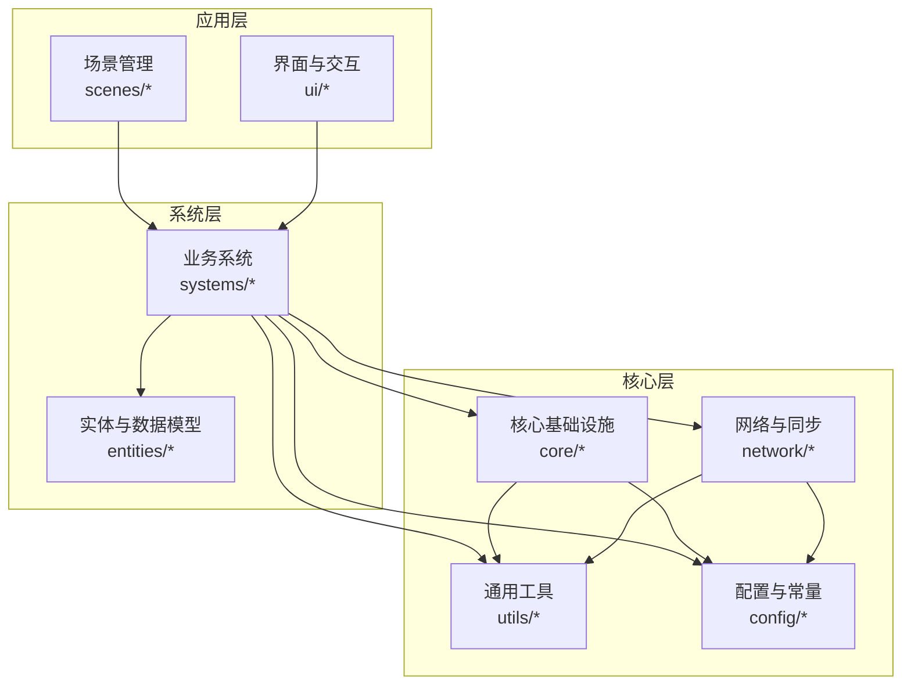
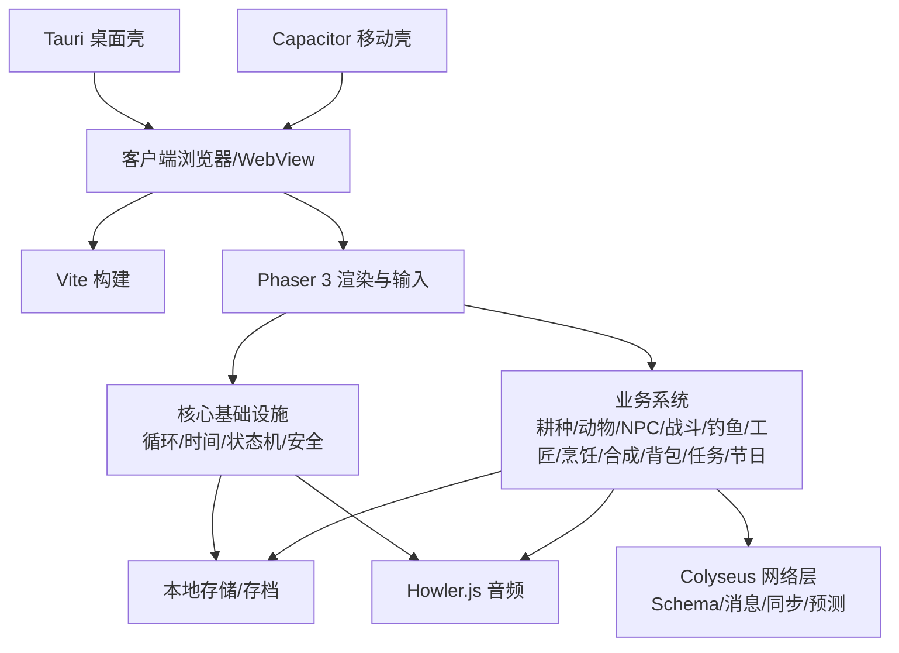
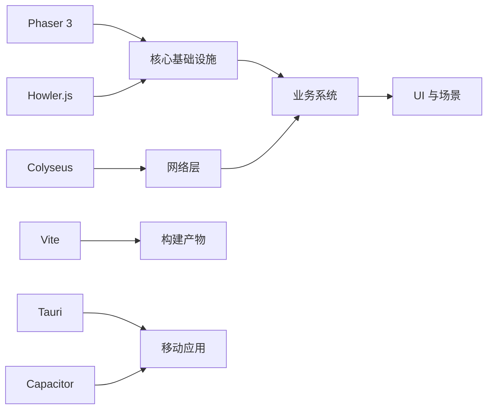

# 代码规范与标准

<cite>
**本文引用的文件**   
- [gdd.md](file://gdd.md)
- [CLAUDE.md](file://.claude/CLAUDE.md)
</cite>

## 目录
1. [引言](#引言)
2. [项目结构](#项目结构)
3. [核心组件](#核心组件)
4. [架构总览](#架构总览)
5. [详细组件分析](#详细组件分析)
6. [依赖分析](#依赖分析)
7. [性能考虑](#性能考虑)
8. [故障排查指南](#故障排查指南)
9. [结论](#结论)
10. [附录](#附录)

## 引言
本文件为《山野小村》项目的“代码规范与标准”文档，目标是为团队提供统一、可执行的编码约定与工程实践，覆盖 TypeScript 编程规范、命名与文件组织、类型定义最佳实践、注释与错误处理模式、安全编码实践、Git 工作流、Phaser 3 开发特定规范，以及质量工具配置建议。同时为新加入的开发者提供快速上手路径，确保风格一致与长期可维护性。

## 项目结构
当前仓库以设计文档为主，尚未包含源代码实现。因此，本节聚焦于基于现有文档所确定的技术栈与约束，给出推荐的工程结构与模块划分原则，便于后续落地实施。

- 技术栈（不可变更）
  - 渲染引擎：Phaser 3
  - 网络框架：Colyseus（含 @colyseus/schema）
  - 构建工具：Vite
  - 编程语言：TypeScript（strict 模式）
  - PC 打包：Tauri
  - 手机打包：Capacitor
  - 音频：Howler.js
  - 测试：Vitest

- 推荐目录结构（概念性）
  - src/
    - core/          # 游戏循环、时间系统、状态机、安全防护等核心基础设施
    - systems/       # 业务系统：耕种、动物、NPC、战斗、钓鱼、工匠设备、烹饪、合成、背包、任务、节日等
    - entities/      # 实体与数据模型：玩家、物品、地块、建筑、动物、NPC、配方等
    - scenes/        # Phaser 场景：主场景、地图、菜单、HUD、加载等
    - ui/            # UI 组件与交互：HUD、菜单、通知、设置等
    - network/       # 联机协议、消息类型、同步策略、客户端预测与仲裁
    - assets/        # 资源清单与引用映射（不直接存放二进制）
    - utils/         # 通用工具：校验、边界保护、日志、序列化等
    - config/        # 配置与常量：时间规则、经济规则、安全阈值等
    - tests/         # 单元测试与集成测试用例

[本图为概念性结构示意，不对应具体源码文件]

## 核心组件
本节从现有 GDD 中提取与“代码规范与标准”直接相关的约束与接口，作为后续工程化落地的依据。

- 语言与类型约束
  - 全栈 TypeScript，禁止 any，使用 unknown + 类型守卫
  - 所有变量/参数/返回值必须显式标注类型
  - 命名规范：camelCase（变量/函数），PascalCase（类/接口/类型）
  - 文件命名：kebab-case.ts
  - 单文件行数 ≤ 300；单函数行数 ≤ 50
  - 注释：中文，JSDoc 规范

- 关键数据结构（可直接作为类型定义参考）
  - 时间系统常量与保护
  - 经济系统与售价计算
  - 作物数据 CropData
  - 动物好感度 AnimalFriendship
  - NPC 社交与对话 DialogueSystem
  - 战斗规则 CombatRules
  - 钓鱼规则 FishingRules
  - 技能专精 SkillPerks
  - 食谱 Recipe
  - 任务 QuestData
  - 存档 SaveData
  - 各类安全护栏（GameLoopSafeguards、RenderSafeguards、NetworkSafeguards、MemorySafeguards、DataSafeguards、LogicSafeguards、IOSafeguards、MultiplayerSafeguards）

- 安全与防护
  - 七维熔断保护：游戏循环、渲染、网络、内存与资源、存档与数据、状态机与逻辑、文件系统与 I/O
  - 错误恢复流程：存档异常、网络异常、资源加载异常、渲染异常、任务状态异常、玩家位置异常、时间系统异常
  - 日志与诊断：分级日志、通道控制、轮转策略、安全事件记录

章节来源
- [gdd.md:1722-1746](file://gdd.md#L1722-L1746)
- [gdd.md:193-235](file://gdd.md#L193-L235)
- [gdd.md:256-332](file://gdd.md#L256-L332)
- [gdd.md:389-413](file://gdd.md#L389-L413)
- [gdd.md:493-515](file://gdd.md#L493-L515)
- [gdd.md:672-711](file://gdd.md#L672-L711)
- [gdd.md:728-745](file://gdd.md#L728-L745)
- [gdd.md:773-782](file://gdd.md#L773-L782)
- [gdd.md:834-839](file://gdd.md#L834-L839)
- [gdd.md:913-927](file://gdd.md#L913-L927)
- [gdd.md:1031-1067](file://gdd.md#L1031-L1067)
- [gdd.md:1609-1650](file://gdd.md#L1609-L1650)
- [gdd.md:1780-1888](file://gdd.md#L1780-L1888)
- [gdd.md:1890-1945](file://gdd.md#L1890-L1945)
- [gdd.md:1947-1969](file://gdd.md#L1947-L1969)

## 架构总览
本项目采用“核心基础设施 + 业务系统 + 场景与 UI”的分层架构，结合 Colyseus 的 Listen Server 模式进行多人联机。Phaser 3 负责渲染与输入，Vite 负责构建，Tauri/Capacitor 负责跨平台打包。

[本图为概念性架构示意，不对应具体源码文件]

## 详细组件分析

### TypeScript 编程规范
- 语言与类型
  - 强制 strict 模式，禁用 any，使用 unknown + 类型守卫
  - 所有变量/参数/返回值显式标注类型
  - 优先使用字面量联合类型与枚举表达领域语义
- 命名约定
  - 变量/函数：camelCase
  - 类/接口/类型：PascalCase
  - 文件：kebab-case.ts
- 文件与模块组织
  - 按功能域分层：core/systems/entities/scenes/ui/network/utils/config
  - 单一职责：每个文件不超过 300 行，函数不超过 50 行
- 类型定义最佳实践
  - 使用 GDD 中提供的接口作为类型基础（如 CropData、Recipe、QuestData、SaveData 等）
  - 对数值字段增加 valueBounds 校验，避免 NaN/Infinity/越界
  - 对外暴露的类型需具备最小必要字段，内部实现通过私有字段或工厂方法封装

章节来源
- [gdd.md:1735-1746](file://gdd.md#L1735-L1746)
- [gdd.md:389-413](file://gdd.md#L389-L413)
- [gdd.md:913-927](file://gdd.md#L913-L927)
- [gdd.md:1031-1067](file://gdd.md#L1031-L1067)
- [gdd.md:1609-1650](file://gdd.md#L1609-L1650)

### 代码注释规范
- 使用中文 JSDoc 注释
- 公共 API、复杂算法、边界条件、安全保护点必须注释
- 在关键类型与接口处补充用途说明与关联系统引用

章节来源
- [gdd.md:1735-1746](file://gdd.md#L1735-L1746)

### 错误处理与安全编码实践
- 安全护栏
  - 游戏循环：帧时间上限、迭代次数上限、看门狗定时器
  - 渲染：精灵上限、粒子上限、纹理内存限制、瓦片裁剪
  - 网络：速率限制、消息大小限制、连接超时、状态校验
  - 内存与资源：场景切换清理、资源加载超时、缓存上限、对象池上限
  - 存档与数据：原子写入、完整性校验、数值边界、自动恢复
  - 状态机与逻辑：状态转移保护、NPC 日程回退、任务一致性检查、ID 校验
  - 文件系统与 I/O：文件大小限制、白名单扩展名、设置文件校验与回退
  - 联机专项：最大人数、主机负载保护、消息队列保护、作弊预防
- 错误恢复流程
  - 存档损坏、网络断开、资源加载失败、渲染崩溃、任务状态不一致、玩家位置异常、时间跳跃异常等均有明确检测、恢复与降级策略

章节来源
- [gdd.md:1780-1888](file://gdd.md#L1780-L1888)
- [gdd.md:1890-1945](file://gdd.md#L1890-L1945)

### Git 提交信息格式与分支命名
- 提交信息格式（建议）
  - 类型：feat/fix/docs/style/refactor/perf/test/build/ci/chore/revert
  - 范围：模块/子系统（如 farming、npc、network、save）
  - 描述：简洁明了，动词开头，中文为主
  - 示例：feat(farming): 实现洒水器自动浇水逻辑
- 分支命名规则（建议）
  - feature/<模块>-<简述>
  - fix/<模块>-<简述>
  - docs/<模块>-<简述>
  - refactor/<模块>-<简述>
  - perf/<模块>-<简述>
  - test/<模块>-<简述>
  - 示例：feature/farming-sprinkler、fix/npc-schedule-fallback

[本节为通用工程实践建议，未直接分析具体源码文件]

### 代码审查检查清单
- 类型与接口
  - 是否全部显式标注类型？是否存在 any？
  - 新增/修改的类型是否与 GDD 保持一致？
- 安全与防护
  - 是否引入新的安全护栏或阈值？是否影响其他系统？
  - 数值是否受 valueBounds 保护？
- 性能与渲染
  - 是否超出精灵/粒子/纹理内存限制？
  - 是否触发瓦片裁剪与对象池回收？
- 网络与联机
  - 是否符合速率限制与消息大小限制？
  - 客户端预测与主机仲裁是否正确实现？
- 存档与数据
  - 是否保证原子写入与完整性校验？
  - 是否支持版本迁移与备份恢复？
- 可读性与可维护性
  - 单文件/单函数行数是否合规？
  - 是否添加必要的 JSDoc 注释？

[本节为通用工程实践建议，未直接分析具体源码文件]

### Phaser 3 游戏开发特定规范
- 精灵管理
  - 全局与每层精灵上限、粒子发射器上限、纹理内存上限
  - 使用对象池复用精灵与粒子，避免频繁创建/销毁
- 碰撞检测
  - 使用 TileMap 碰撞层与物理体分组，减少不必要的检测
  - 对大量单位启用空间分区与视锥剔除
- 状态机实现
  - 使用状态转移保护，非法状态转移时回滚并记录
  - NPC 日程缺失时使用默认位置回退
- 场景与资源
  - 场景切换时清理纹理缓存、声音实例、补间池，必要时触发垃圾回收
  - 资源加载设置超时与回退占位图

章节来源
- [gdd.md:1808-1817](file://gdd.md#L1808-L1817)
- [gdd.md:1830-1839](file://gdd.md#L1830-L1839)
- [gdd.md:1859-1868](file://gdd.md#L1859-L1868)

### 联机系统规范（Colyseus）
- 架构与平等原则
  - Listen Server 模式，主机掌控时间与状态
  - 客户端预测+主机仲裁，确保体验一致
- 消息与同步
  - 明确消息类型与 Schema 注册
  - 增量同步频率与可靠传输分类
- 安全与公平
  - 操作速率限制、消息大小限制、连接超时
  - 状态校验（位置、物品数量、金钱变化）

章节来源
- [gdd.md:1453-1505](file://gdd.md#L1453-L1505)
- [gdd.md:1507-1546](file://gdd.md#L1507-L1546)
- [gdd.md:1819-1828](file://gdd.md#L1819-L1828)

### 存档与进度系统规范
- 存档时机与槽位
  - 睡觉时自动保存，3 手动 + 1 自动
- 数据结构与兼容性
  - 版本号、时间戳、sha256 校验
  - 低版本自动升级填充默认值，高版本拒绝并提示更新
- 数据安全
  - 原子写入、备份、完整性校验、自动恢复

章节来源
- [gdd.md:1595-1675](file://gdd.md#L1595-L1675)
- [gdd.md:1841-1857](file://gdd.md#L1841-L1857)

### 经济与时间系统规范
- 时间系统
  - 固定流速、每日起止、季节长度、睡眠加速、暂停规则
  - 安全保护：每帧最大推进分钟数、日长上限、无效值修正
- 经济系统
  - 唯一货币金币，初始资金 500g
  - 售价计算公式统一，输出受 money 边界保护
  - 通胀检查、单日收入上限、种子最低成本

章节来源
- [gdd.md:193-235](file://gdd.md#L193-L235)
- [gdd.md:256-332](file://gdd.md#L256-L332)

## 依赖分析
- 外部依赖
  - Phaser 3：渲染、输入、TileMap、动画、粒子
  - Colyseus：网络、Schema、增量同步
  - Howler.js：音频播放与混音
  - Vite：构建与热重载
  - Tauri/Capacitor：跨平台打包
- 内部依赖关系
  - 业务系统依赖核心基础设施（循环、时间、状态机、安全）
  - 网络层依赖通用工具（校验、日志、配置）
  - 场景与 UI 依赖业务系统与核心层

[本图为概念性依赖示意，不对应具体源码文件]

## 性能考虑
- 目标指标
  - PC/手机均稳定 60fps
  - 加载时间：PC < 3s，手机 < 5s
  - 内存占用：PC < 500MB，手机 < 200MB
  - 包体大小：< 50MB
- 优化策略
  - 合理对象池与资源复用
  - 渲染裁剪与视锥剔除
  - 延迟加载非关键资源
  - 避免过度优化牺牲可读性

章节来源
- [gdd.md:1748-1779](file://gdd.md#L1748-L1779)

## 故障排查指南
- 常见问题定位
  - 存档损坏：检查 sha256 校验与备份恢复流程
  - 网络异常：查看速率限制与连接超时日志
  - 渲染卡顿：检查精灵/粒子上限与纹理内存
  - 任务状态不一致：运行一致性检查与自动修复
  - 玩家位置异常：检测越界与碰撞，执行回退或位移修正
  - 时间跳跃异常：回退到最近有效时间或强制睡眠保存
- 日志与诊断
  - 分级日志（debug/info/warn/error/fatal）
  - 通道控制（gameplay/network/safety/performance/save）
  - 安全事件记录（触发值、阈值、动作、系统状态）

章节来源
- [gdd.md:1890-1945](file://gdd.md#L1890-L1945)
- [gdd.md:1947-1969](file://gdd.md#L1947-L1969)

## 结论
本规范以 GDD 中的技术栈与约束为基础，明确了 TypeScript 编程约定、类型定义最佳实践、安全编码与错误恢复流程，并结合 Phaser 3 与 Colyseus 的特性给出了开发与联机的具体规范。配合 Git 工作流与代码审查清单，可有效提升团队协作效率与代码质量。建议在后续实现阶段逐步将上述规范落地到工程配置与自动化检查中。

## 附录

### 新开发者快速上手指南
- 环境准备
  - Node.js 与包管理器（pnpm/yarn/npm）
  - 安装依赖后使用 Vite 启动开发服务器
- 阅读顺序
  - 先读 GDD 的技术栈与代码规范章节
  - 再理解核心基础设施与业务系统边界
  - 最后根据任务选择对应模块进行实现
- 常用命令（建议）
  - 开发：vite dev
  - 构建：vite build
  - 测试：vitest
  - 打包：Tauri/Capacitor 对应命令
- 注意事项
  - 严格遵循命名与类型规范
  - 新增逻辑必须配套安全护栏与日志
  - 涉及数值与状态的变更需进行一致性检查

[本节为通用工程实践建议，未直接分析具体源码文件]

### 质量工具配置建议（ESLint、Prettier、TypeScript 编译器选项）
- ESLint 规则建议
  - 禁用 any，启用 unknown 类型守卫
  - 强制显式类型标注
  - 限制函数与文件行数
  - 统一导入排序与格式化
- Prettier 配置建议
  - 单引号、分号、尾逗号、换行符统一
  - 与 ESLint 规则对齐，避免冲突
- TypeScript 编译器选项建议
  - strict: true
  - noImplicitAny: true
  - exactOptionalPropertyTypes: true
  - esModuleInterop: true
  - target/module 与构建工具匹配

[本节为通用工程实践建议，未直接分析具体源码文件]