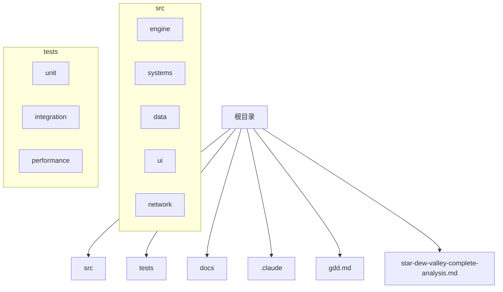
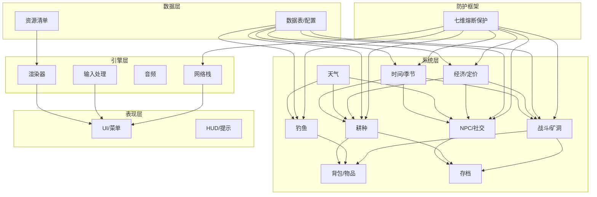
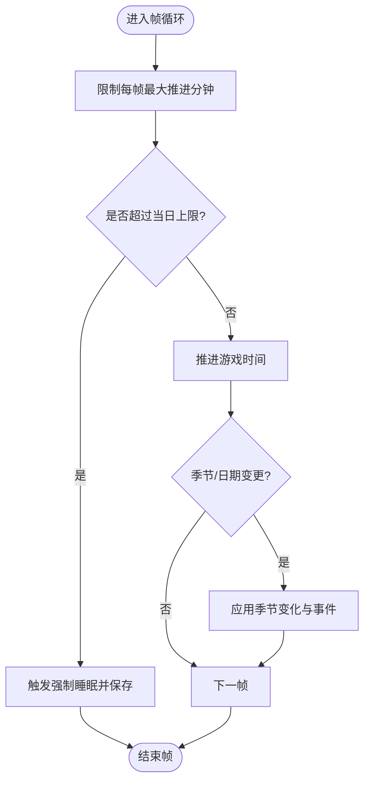
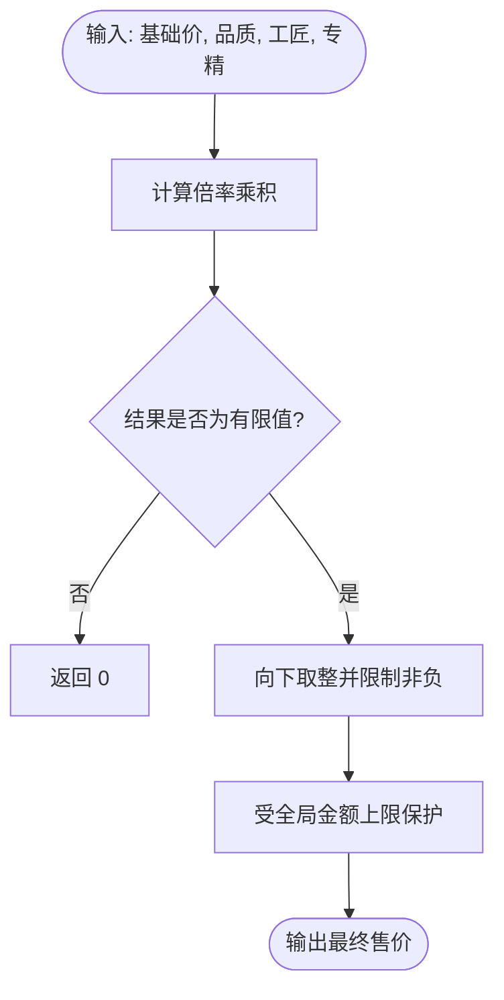
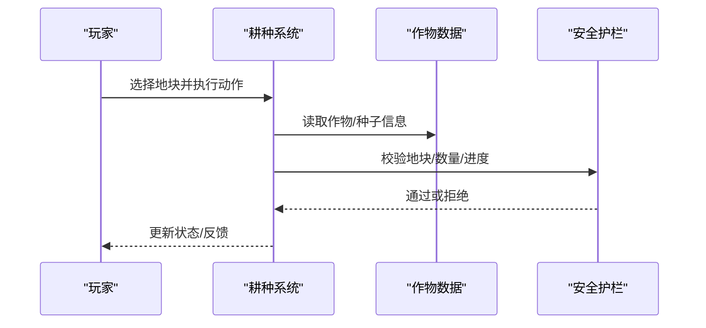
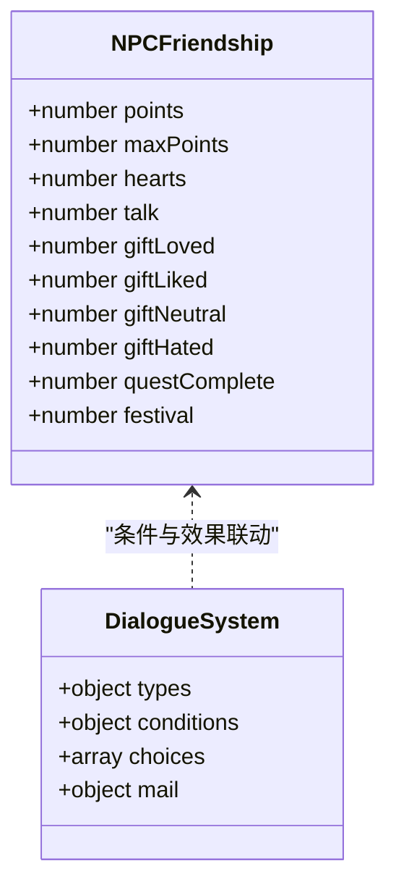
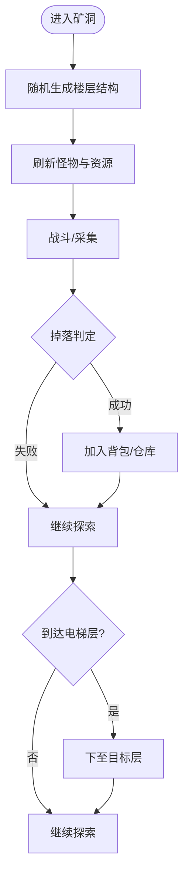
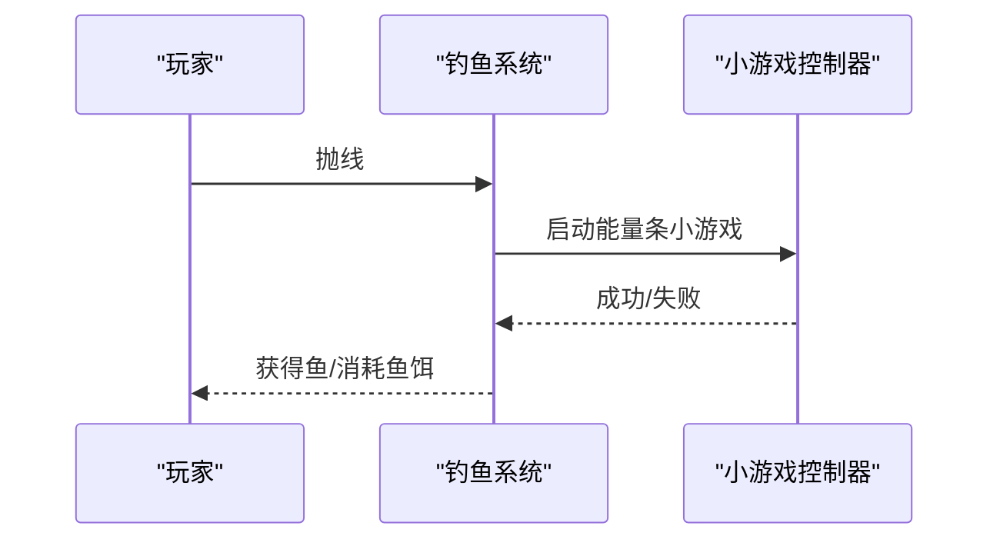
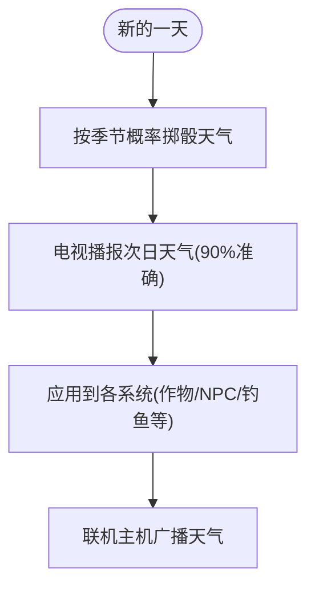
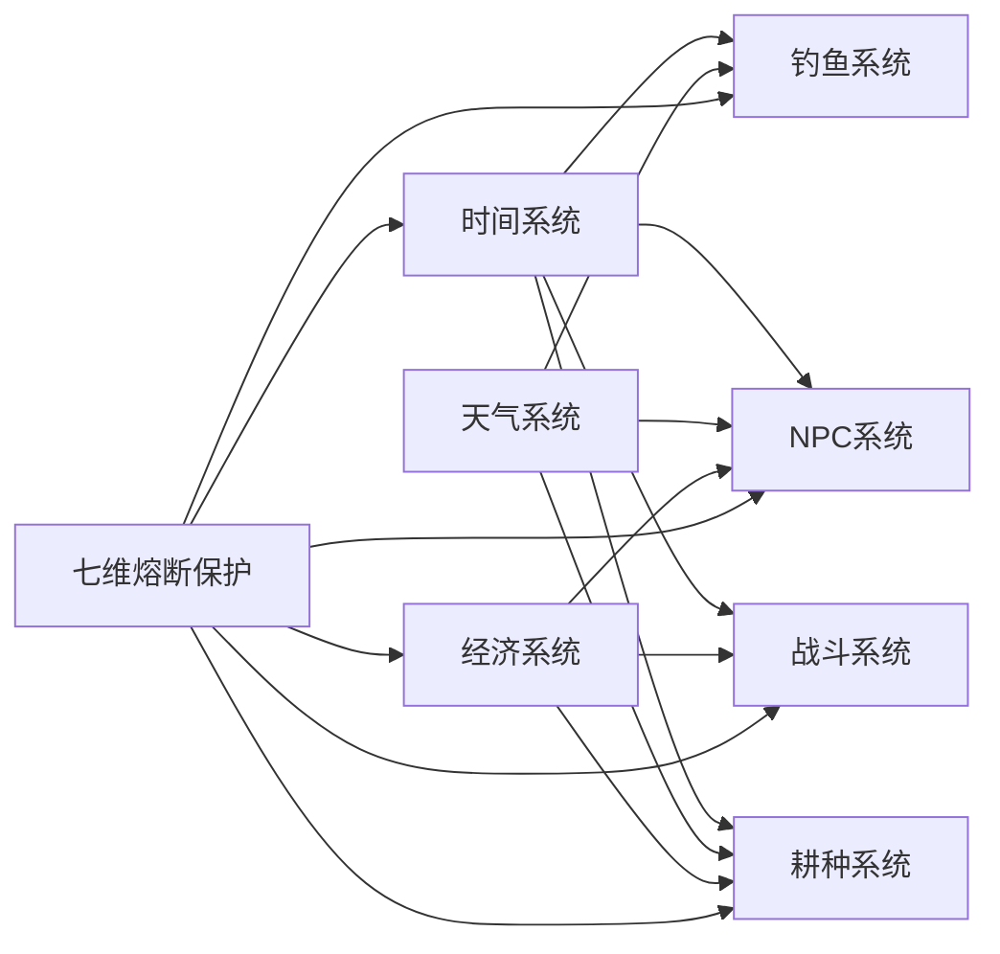

# 开发指南与规范

<cite>
**本文引用的文件**   
- [gdd.md](file://gdd.md)
- [star-dew-valley-complete-analysis.md](file://star-dew-valley-complete-analysis.md)
- [CLAUDE.md](file://claude/CLAUDE.md)
</cite>

## 目录
1. [引言](#引言)
2. [项目结构](#项目结构)
3. [核心组件](#核心组件)
4. [架构总览](#架构总览)
5. [详细组件分析](#详细组件分析)
6. [依赖分析](#依赖分析)
7. [性能考虑](#性能考虑)
8. [故障排查指南](#故障排查指南)
9. [结论](#结论)
10. [附录](#附录)

## 引言
本指南面向《山野小村》项目的开发与维护团队，目标是建立统一的代码质量标准、TypeScript 编程规范、测试策略与质量保证流程、Git 工作流与分支管理、代码审查流程、开发环境搭建与构建配置、调试与性能分析工具、持续集成与自动化部署、发布管理以及新成员快速上手路径。文档同时结合游戏设计规范书（GDD）与参考文档中的系统约束，确保设计与实现一致。

## 项目结构
当前仓库处于早期阶段，主要包含设计文档与通用规则说明。建议后续按“功能域 + 分层”组织源码，例如：
- src/engine：渲染、输入、音频、网络等引擎层
- src/systems：时间、经济、耕种、NPC、战斗、钓鱼等系统
- src/data：数据表、配置、资源清单
- src/ui：界面与交互
- src/network：联机协议、主机仲裁、客户端预测
- src/tests：单元测试、集成测试、性能基准
- docs：设计文档、API 文档、运维手册

[本节为概念性结构规划，不直接分析具体源文件]

## 核心组件
基于 GDD 的硬性规定与系统设计规范，以下为核心子系统与关键约束要点：
- 时间与季节：固定日长、起止时刻、季节长度、存档时机；提供帧级推进上限与异常回退保护
- 经济与定价：统一售价公式、通胀检查、金额上限、每日收入上限
- 体力与能量：消耗/恢复规则、状态机保护、操作拒绝而非崩溃
- 天气：概率矩阵、对多系统影响矩阵、电视预告机制
- 耕种：翻地→播种→浇水→生长→收获闭环；作物数据接口与安全护栏
- NPC 社交：好感度、日程、对话、邮件、结婚条件
- 战斗与矿洞：层数、怪物、掉落、死亡惩罚、安全限制
- 钓鱼：鱼竿等级、小游戏规则、蟹笼/鱼塘扩展点
- 联机：Listen Server、主机仲裁、客户端预测、体验一致性

上述内容在 GDD 中均有明确数值与类型定义，可直接作为 TypeScript 类型与常量使用。

**章节来源**
- [gdd.md:180-235](file://gdd.md#L180-L235)
- [gdd.md:237-332](file://gdd.md#L237-L332)
- [gdd.md:379-476](file://gdd.md#L379-L476)
- [gdd.md:478-515](file://gdd.md#L478-L515)
- [gdd.md:517-549](file://gdd.md#L517-L549)
- [gdd.md:551-711](file://gdd.md#L551-L711)
- [gdd.md:713-767](file://gdd.md#L713-L767)
- [gdd.md:768-800](file://gdd.md#L768-L800)

## 架构总览
整体采用“引擎 + 系统 + 数据 + UI + 网络”的分层架构，配合七维熔断保护框架保障稳定性与一致性。

**图表来源**
- [gdd.md:180-235](file://gdd.md#L180-L235)
- [gdd.md:237-332](file://gdd.md#L237-L332)
- [gdd.md:379-476](file://gdd.md#L379-L476)
- [gdd.md:551-711](file://gdd.md#L551-L711)
- [gdd.md:713-767](file://gdd.md#L713-L767)
- [gdd.md:768-800](file://gdd.md#L768-L800)

## 详细组件分析

### 时间系统
- 日长、起止时刻、季节长度、存档时机均为硬性规定
- 帧级推进上限、越界回退、强制睡眠等安全措施
- 睡觉倍速、暂停状态、联机主机控制时间流速

**图表来源**
- [gdd.md:180-235](file://gdd.md#L180-L235)

**章节来源**
- [gdd.md:180-235](file://gdd.md#L180-L235)

### 经济系统与定价
- 统一售价公式，质量倍率、工匠加成、整数化与边界保护
- 通胀检查、单件价格上限、每日收入上限、货币封顶
- 典型经济链示例用于验证曲线合理性

**图表来源**
- [gdd.md:237-332](file://gdd.md#L237-L332)

**章节来源**
- [gdd.md:237-332](file://gdd.md#L237-L332)

### 耕种系统
- 标准流程：翻地→播种→浇水→生长→收获
- 作物数据结构可直接作为 TS 接口
- 肥料与洒水器规则、安全护栏（地块上限、单次收获上限、进度校验）

**图表来源**
- [gdd.md:379-476](file://gdd.md#L379-L476)

**章节来源**
- [gdd.md:379-476](file://gdd.md#L379-L476)

### NPC 社交系统
- 好感度范围、礼物/任务/节日影响、心数解锁内容
- 日程四套模板（工作日/周末/雨天/节日），缺省位置兜底
- 对话结构与条件、邮件系统

**图表来源**
- [gdd.md:551-711](file://gdd.md#L551-L711)

**章节来源**
- [gdd.md:551-711](file://gdd.md#L551-L711)

### 战斗与矿洞
- 主矿洞层数、随机生成、电梯、怪物密度、矿石分布
- 战斗规则：HP、伤害、死亡惩罚、掉落限制
- 武器类型与特性

**图表来源**
- [gdd.md:713-767](file://gdd.md#L713-L767)

**章节来源**
- [gdd.md:713-767](file://gdd.md#L713-L767)

### 钓鱼系统
- 鱼竿等级、鱼饵与浮标、小游戏规则、蟹笼/鱼塘扩展
- 小游戏超时与行为模式异常保护

**图表来源**
- [gdd.md:768-800](file://gdd.md#L768-L800)

**章节来源**
- [gdd.md:768-800](file://gdd.md#L768-L800)

### 天气系统
- 季节天气概率矩阵
- 天气对各系统的影响矩阵
- 电视天气预报准确率与联机同步

**图表来源**
- [gdd.md:345-372](file://gdd.md#L345-L372)

**章节来源**
- [gdd.md:345-372](file://gdd.md#L345-L372)

## 依赖分析
- 系统间耦合关系
  - 时间驱动：耕种、NPC、战斗、钓鱼均依赖时间推进
  - 天气影响：耕种、NPC、钓鱼显著受天气影响
  - 经济贯穿：所有产出与交易均经经济系统统一计价
  - 安全护栏：七维熔断保护覆盖渲染、网络、内存、循环、数值等维度
- 外部依赖与平台
  - PC（Tauri）与手机（Capacitor）共用一套代码，需关注跨平台差异与输入适配

**图表来源**
- [gdd.md:180-235](file://gdd.md#L180-L235)
- [gdd.md:237-332](file://gdd.md#L237-L332)
- [gdd.md:345-372](file://gdd.md#L345-L372)
- [gdd.md:379-476](file://gdd.md#L379-L476)
- [gdd.md:551-711](file://gdd.md#L551-L711)
- [gdd.md:713-767](file://gdd.md#L713-L767)
- [gdd.md:768-800](file://gdd.md#L768-L800)

**章节来源**
- [gdd.md:180-235](file://gdd.md#L180-L235)
- [gdd.md:237-332](file://gdd.md#L237-L332)
- [gdd.md:345-372](file://gdd.md#L345-L372)
- [gdd.md:379-476](file://gdd.md#L379-L476)
- [gdd.md:551-711](file://gdd.md#L551-L711)
- [gdd.md:713-767](file://gdd.md#L713-L767)
- [gdd.md:768-800](file://gdd.md#L768-L800)

## 性能考虑
- 全平台 60fps 目标，禁止人为降帧
- 帧级时间推进上限、数值边界保护、状态机兜底，避免卡顿与崩溃
- 批量处理与对象池：大量作物/怪物/NPC 的状态更新建议使用批处理与复用对象
- 渲染优化：Tile 绘制合并、视锥剔除、纹理图集
- 网络优化：主机仲裁减少带宽，客户端预测提升响应
- 内存管理：大地图分块加载、资源按需卸载

[本节为通用性能建议，不直接分析具体源文件]

## 故障排查指南
- 常见问题定位
  - 时间异常：检查帧推进上限与越界回退逻辑
  - 经济溢出：核查售价公式与全局金额上限
  - 耕种卡死：确认进度校验与地块上限
  - NPC 行程错乱：核对四套日程与缺省位置兜底
  - 钓鱼小游戏无响应：检查超时保护与行为模式异常回归
- 日志与断点
  - 在关键边界处记录入参与出参（如售价、进度、掉落）
  - 使用类型守卫与断言捕获 any 与非法值
- 复现与回归
  - 将问题场景固化为最小用例，纳入集成测试集

**章节来源**
- [gdd.md:180-235](file://gdd.md#L180-L235)
- [gdd.md:237-332](file://gdd.md#L237-L332)
- [gdd.md:379-476](file://gdd.md#L379-L476)
- [gdd.md:551-711](file://gdd.md#L551-L711)
- [gdd.md:768-800](file://gdd.md#L768-L800)

## 结论
本指南以 GDD 的硬性规定为基础，构建了从架构到系统的完整开发规范与流程建议。通过严格的类型与边界保护、清晰的系统耦合关系、完善的测试与 CI/CD 策略，可保障《山野小村》在多平台下的稳定运行与高质量交付。

[本节为总结性内容，不直接分析具体源文件]

## 附录

### 代码质量与 TypeScript 规范
- 全栈 TypeScript，禁止混用 JS
- 禁止 any，使用 unknown + 类型守卫
- 显式类型声明：变量、参数、返回值必须标注
- 错误优先：防御式编程，边界校验前置
- 命名与注释：语义清晰，复杂逻辑附注依据与来源

**章节来源**
- [CLAUDE.md:1-30](file://claude/CLAUDE.md#L1-L30)

### 测试策略与质量保证
- 单元测试：针对纯函数（如售价计算、时间推进、掉落判定）进行断言
- 集成测试：模拟一天/一季的关键流程（耕种→收获→出售→存档）
- 性能测试：帧时预算、渲染批次、网络往返时延基线
- 覆盖率与门禁：PR 合并前需满足最低覆盖率与静态检查通过

[本节为通用测试建议，不直接分析具体源文件]

### Git 工作流与分支管理
- 分支模型：main（稳定）、develop（集成）、feature/*（功能）、hotfix/*（紧急修复）、release/*（发布候选）
- 提交规范：约定式提交（feat/fix/docs/chore/test/perf/refactor）
- 版本标签：语义化版本（vX.Y.Z），发布前打 tag

[本节为通用流程建议，不直接分析具体源文件]

### 代码审查流程
- 至少一名 reviewer 批准后方可合并
- 关注点：类型正确性、边界保护、性能影响、可读性与可维护性
- 自动检查：lint、类型检查、格式化、单元测试、覆盖率阈值

[本节为通用流程建议，不直接分析具体源文件]

### 开发环境与依赖管理
- Node.js LTS 与包管理器（npm/pnpm/yarn）
- TypeScript 编译与类型检查
- 构建工具（Vite/Webpack/Rollup）与打包产物
- 跨平台运行时：Tauri（PC）、Capacitor（移动端）

[本节为通用环境建议，不直接分析具体源文件]

### 构建配置与发布管理
- 构建脚本：开发/生产环境区分，资源压缩与缓存策略
- 环境变量：区分开发/测试/生产配置
- 发布流水线：构建→测试→签名→分发（商店/渠道）

[本节为通用发布建议，不直接分析具体源文件]

### 调试技巧与性能分析工具
- 浏览器/桌面端开发者工具：性能面板、内存快照、网络请求
- 自定义指标：FPS、Draw Calls、GC 次数、网络 RTT
- 日志分级：debug/info/warn/error，便于线上追踪

[本节为通用调试建议，不直接分析具体源文件]

### 持续集成与自动化部署
- CI 流水线：拉取→安装→类型检查→测试→构建→制品归档
- 自动化部署：预发环境验证→灰度发布→全量上线
- 回滚策略：保留上一稳定版本，一键回滚

[本节为通用 CI/CD 建议，不直接分析具体源文件]

### 新成员快速上手
- 阅读 GDD 与设计哲学，理解核心体验与不可违背原则
- 熟悉 CLAUDE 通用规则与记忆系统
- 本地搭建环境，跑通最小可玩流程（时间→耕种→出售→存档）
- 参与一次 feature 分支开发，完成 PR 与评审

**章节来源**
- [gdd.md:1-46](file://gdd.md#L1-L46)
- [CLAUDE.md:1-30](file://claude/CLAUDE.md#L1-L30)