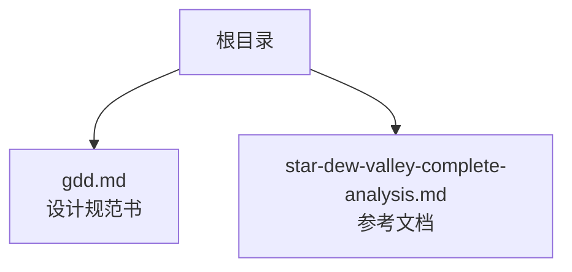
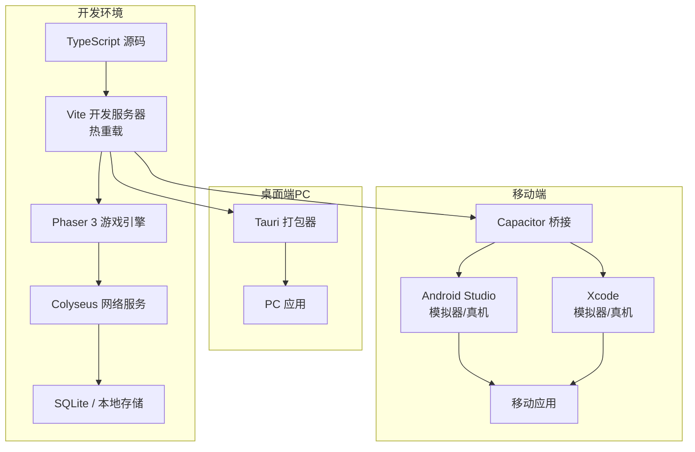
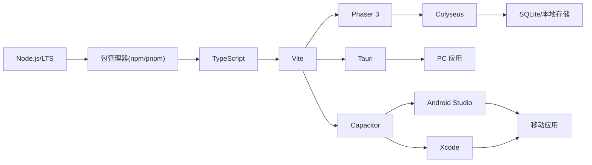

# 开发环境搭建

<cite>
**本文引用的文件**   
- [gdd.md](file://gdd.md)
- [star-dew-valley-complete-analysis.md](file://star-dew-valley-complete-analysis.md)
</cite>

## 目录
1. [简介](#简介)
2. [项目结构](#项目结构)
3. [核心组件](#核心组件)
4. [架构总览](#架构总览)
5. [详细组件分析](#详细组件分析)
6. [依赖分析](#依赖分析)
7. [性能考虑](#性能考虑)
8. [故障排查指南](#故障排查指南)
9. [结论](#结论)
10. [附录](#附录)

## 简介
本指南面向《山野小村》项目的开发者，目标是帮助团队在 Windows、macOS、Linux 上快速搭建一致的开发环境。文档覆盖 Node.js、TypeScript、Vite 等基础依赖安装与配置；Phaser 3 游戏引擎集成；Colyseus 网络框架配置；Tauri PC 打包工具设置；Capacitor 移动端（Android Studio、Xcode）开发与模拟器配置；数据库（SQLite/本地存储）、音频资源管理、图片资源优化等开发工具链配置；调试工具使用（浏览器开发者工具、Phaser Debugger、网络请求监控）；热重载、构建优化与开发服务器设置；以及跨平台差异说明。

本项目为像素风格乡村生活模拟游戏，支持 PC（Tauri）与手机（Capacitor）共用一套代码，并包含多人联机能力（Listen Server 模式）。这些目标将直接影响技术选型与环境搭建方式。

**章节来源**
- [gdd.md:1-100](file://gdd.md#L1-L100)

## 项目结构
当前仓库处于早期阶段，主要包含设计规范与参考文档：
- gdd.md：《山野小村》游戏设计规范书（GDD），定义核心系统、数值与安全护栏等
- star-dew-valley-complete-analysis.md：星露谷物语系统拆解参考文档，用于设计对齐与机制借鉴

**图表来源**
- [gdd.md:1-20](file://gdd.md#L1-L20)
- [star-dew-valley-complete-analysis.md:1-20](file://star-dew-valley-complete-analysis.md#L1-L20)

**章节来源**
- [gdd.md:1-20](file://gdd.md#L1-L20)
- [star-dew-valley-complete-analysis.md:1-20](file://star-dew-valley-complete-analysis.md#L1-L20)

## 核心组件
基于 GDD 与参考文档，以下为核心技术与运行环境的要点：
- 多端统一代码：PC（Tauri）+ 移动（Capacitor）共享同一套前端逻辑
- 多人联机：Listen Server 模式，主机保存进度，客户端预测+主机仲裁
- 安全护栏：渲染/网络/内存/循环等多维保护，防止异常导致过载或崩溃
- 时间/经济/天气等系统均有明确的数值边界与校验规则，需在环境中提供相应调试与验证手段

上述特性决定了开发环境需要同时满足：
- Web 运行时（Phaser 3 + Vite + TypeScript）
- 桌面打包（Tauri）
- 移动端桥接（Capacitor + Android Studio/Xcode）
- 网络服务（Colyseus）
- 数据持久化（SQLite/本地存储）
- 资源管线（音频/图片优化）
- 调试与监控（浏览器 DevTools、Phaser Debugger、网络监控）

**章节来源**
- [gdd.md:40-80](file://gdd.md#L40-L80)
- [gdd.md:180-240](file://gdd.md#L180-L240)
- [gdd.md:318-333](file://gdd.md#L318-L333)
- [gdd.md:468-476](file://gdd.md#L468-L476)
- [gdd.md:713-745](file://gdd.md#L713-L745)
- [star-dew-valley-complete-analysis.md:187-200](file://star-dew-valley-complete-analysis.md#L187-L200)

## 架构总览
下图展示了从开发到多端发布的关键环节与交互关系，便于理解各工具的协作方式。

[此图为概念性架构图，不直接映射具体源文件，故不提供图表来源]

## 详细组件分析

### Node.js 与包管理器
- 版本建议：选择长期支持（LTS）版本，确保与 Tauri/Capacitor 生态兼容
- 包管理器：优先使用 npm 或 pnpm（团队统一）
- 环境变量：通过 .env 或配置文件区分开发/测试/生产环境
- 脚本命令：封装 dev/build/serve 等常用命令，提升一致性

[本节为通用指导，不涉及具体文件分析]

### TypeScript 配置
- 启用严格类型检查，配合 GDD 中的数据结构作为类型定义来源
- 模块解析策略与路径别名，便于大型项目组织
- 输出目录与声明文件生成，便于 IDE 提示与第三方库集成

[本节为通用指导，不涉及具体文件分析]

### Vite 开发服务器与热重载
- 开发服务器：开启 HMR，缩短反馈周期
- 代理配置：转发网络请求至 Colyseus 服务，避免跨域问题
- 资源处理：图片/音频预加载与缓存策略，适配 Phaser 资源管线
- 环境变量注入：区分不同平台的构建参数

[本节为通用指导，不涉及具体文件分析]

### Phaser 3 游戏引擎集成
- 初始化流程：创建 Game 实例、场景管理、输入与渲染管线
- 资源加载：按区域/系统分块加载，减少首屏压力
- 调试：启用 Phaser Debugger，可视化物理、碰撞、帧率等信息
- 性能：对象池、纹理图集、批渲染等优化手段

[本节为通用指导，不涉及具体文件分析]

### Colyseus 网络框架配置
- 服务端：监听端口、房间生命周期、状态同步策略
- 客户端：连接管理、断线重连、客户端预测与回滚
- 安全：输入校验、速率限制、防作弊护栏（与 GDD 安全体系对齐）
- 调试：网络日志、消息追踪、延迟与丢包模拟

[本节为通用指导，不涉及具体文件分析]

### Tauri PC 打包工具设置
- 入口与窗口：HTML 入口、窗口尺寸、无边框/全屏选项
- 权限与文件系统：读写本地存档、数据库文件路径
- 构建产物：静态资源打包、签名与分发准备
- 调试：Rust 后端日志、前端 DevTools 集成

[本节为通用指导，不涉及具体文件分析]

### Capacitor 移动端开发环境配置
- Android Studio：JDK、SDK、Gradle、模拟器或真机调试
- Xcode：iOS SDK、模拟器或真机调试（需 Apple 开发者账号）
- Capacitor 桥接：原生插件、权限申请、推送与后台任务
- 构建与发布：签名、上架流程、渠道差异化配置

[本节为通用指导，不涉及具体文件分析]

### 数据库配置（SQLite/本地存储）
- 本地存储：键值对与轻量查询，适合玩家偏好与缓存
- SQLite：结构化数据（存档、NPC 关系、物品清单），事务与索引优化
- 迁移与备份：版本升级策略、自动备份与恢复
- 安全：敏感字段加密、防篡改校验

[本节为通用指导，不涉及具体文件分析]

### 音频资源管理与优化
- 格式与压缩：OGG/MP3 平衡音质与体积
- 动态加载：按需加载音效与背景音乐，控制内存占用
- 混音与优先级：UI 音效、环境音、角色语音分层管理
- 静音与音量：全局与局部音量控制，无障碍支持

[本节为通用指导，不涉及具体文件分析]

### 图片资源优化
- 纹理图集：合并小图，减少绘制调用
- 分辨率适配：多倍率资源与缩放策略
- 压缩与裁剪：去除透明冗余、按需导出
- 懒加载与缓存：按场景/区域加载，避免峰值卡顿

[本节为通用指导，不涉及具体文件分析]

### 调试工具使用指南
- 浏览器开发者工具：Network 面板监控请求、Performance 面板分析帧率与耗时
- Phaser Debugger：可视化物理体、碰撞检测、渲染批次
- 网络请求监控：拦截 WebSocket 消息，记录往返时延与错误码
- 日志与埋点：分级日志、关键事件上报，便于定位问题

[本节为通用指导，不涉及具体文件分析]

### 热重载、构建优化与开发服务器设置
- 热重载：HMR 仅更新变更模块，保持状态稳定
- 构建优化：Tree Shaking、代码分割、资源压缩
- 开发服务器：本地代理、Mock 数据、跨域与 CORS 配置
- 质量门禁：Lint、类型检查、单元测试与集成测试

[本节为通用指导，不涉及具体文件分析]

### 跨平台差异说明（Windows/macOS/Linux）
- Node.js 与包管理器：统一 LTS 版本，注意路径分隔符与大小写敏感性
- Tauri：Rust 工具链安装、平台特定依赖（如系统库）
- Capacitor：Android Studio 与 Xcode 的独立安装流程与模拟器配置
- 路径与编码：统一 UTF-8，避免中文路径导致的兼容性问题
- CI/CD：在多平台矩阵中并行构建与测试，保证一致性

[本节为通用指导，不涉及具体文件分析]

## 依赖分析
下图展示开发环境与多端发布之间的依赖关系，帮助识别潜在耦合点与风险。

[此图为概念性依赖图，不直接映射具体源文件，故不提供图表来源]

## 性能考虑
- 首屏加载：资源分包与懒加载，降低初始体积
- 渲染性能：对象池、纹理图集、批渲染，减少 Draw Call
- 网络性能：消息压缩、增量同步、客户端预测与回滚
- 内存管理：及时释放不再使用的资源，避免泄漏
- 稳定性：七维熔断保护（渲染/网络/内存/循环等），防止异常扩散

[本节为通用指导，不涉及具体文件分析]

## 故障排查指南
- 常见问题
  - 端口冲突：调整 Colyseus 监听端口或关闭占用进程
  - 证书问题：自签证书与本地 HTTPS 配置
  - 模拟器无法启动：检查 JDK/SDK 版本与镜像源
  - 资源加载失败：确认路径与 MIME 类型，检查缓存策略
- 定位方法
  - 查看浏览器控制台与 Network 面板
  - 启用 Phaser Debugger 与日志级别
  - 使用抓包工具分析 WebSocket 消息
  - 对比不同平台构建产物差异
- 恢复措施
  - 清理缓存与临时文件
  - 重置依赖与锁文件
  - 回滚到稳定分支或标签

[本节为通用指导，不涉及具体文件分析]

## 结论
通过统一的 Node.js/TypeScript/Vite 基础栈，结合 Phaser 3、Colyseus、Tauri 与 Capacitor，可实现“一次编写、多端运行”的目标。配合完善的调试工具链、资源优化策略与安全护栏，能够保障开发效率与产品质量。建议在团队内固化环境规范与脚本命令，确保成员间的一致性。

[本节为总结性内容，不涉及具体文件分析]

## 附录
- 术语表
  - HMR：热模块替换
  - LSP：语言服务协议（IDE 智能提示）
  - CORS：跨域资源共享
  - JWT：JSON Web Token（可选的身份令牌）
- 参考链接
  - GDD 与星露谷参考文档已在仓库中提供，可作为设计与实现依据

[本节为补充信息，不涉及具体文件分析]