# 测试策略与质量保证

<cite>
**本文引用的文件**   
- [gdd.md](file://gdd.md)
- [CLAUDE.md](file://.claude/CLAUDE.md)
</cite>

## 目录
1. [引言](#引言)
2. [项目结构](#项目结构)
3. [核心组件](#核心组件)
4. [架构总览](#架构总览)
5. [详细组件分析](#详细组件分析)
6. [依赖分析](#依赖分析)
7. [性能考虑](#性能考虑)
8. [故障排查指南](#故障排查指南)
9. [结论](#结论)
10. [附录](#附录)

## 引言
本文件为《山野小村》制定全面的测试策略与质量保证流程，覆盖单元测试、集成测试、性能测试、自动化流水线与游戏特定场景验证。文档以设计规范书（GDD）为依据，结合技术栈与安全护栏要求，形成可落地的质量门禁与持续交付方案，确保全平台稳定运行与联机一致性。

## 项目结构
当前仓库包含游戏设计规范书与项目工作流约束：
- gdd.md：定义系统规则、数值边界、安全护栏、存档格式、网络协议、UI/UX、进度门控等，是测试用例设计与验收的权威依据。
- .claude/CLAUDE.md：规定语言与代码规范、性能目标与“联机不歧视”原则，作为测试环境与工具链选择的约束。

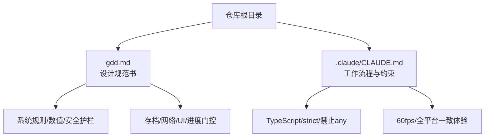

**图表来源**
- [gdd.md:1722-1733](file://gdd.md#L1722-L1733)
- [.claude/CLAUDE.md:8-17](file://.claude/CLAUDE.md#L8-L17)

**章节来源**
- [gdd.md:1722-1733](file://gdd.md#L1722-L1733)
- [.claude/CLAUDE.md:8-17](file://.claude/CLAUDE.md#L8-L17)

## 核心组件
围绕以下关键领域建立测试体系：
- 核心系统逻辑：时间、经济、耕种、NPC日程、背包、任务、节日、技能专精等。
- 数值平衡验证：售价计算、经济曲线、通胀保护、每日收入上限等。
- 安全机制测试：七维熔断保护（循环/渲染/网络/内存/数据/状态机/I/O）、异常恢复流程。
- 联机一致性：客户端预测+主机仲裁、消息速率限制、位置/物品/金钱同步校验。
- 存档读写：版本迁移、完整性校验、原子写入与备份恢复。
- 跨平台兼容：PC（Tauri）与手机（Capacitor）行为一致性与资源加载差异。

**章节来源**
- [gdd.md:1780-1888](file://gdd.md#L1780-L1888)
- [gdd.md:1890-1945](file://gdd.md#L1890-L1945)
- [gdd.md:1606-1675](file://gdd.md#L1606-L1675)
- [gdd.md:1451-1590](file://gdd.md#L1451-L1590)
- [gdd.md:1722-1733](file://gdd.md#L1722-L1733)

## 架构总览
测试架构分层：
- 单元层：基于 Vitest 对纯函数与模块进行断言（如售价计算、时间推进、状态机转换）。
- 集成层：模拟 Colyseus Schema 与文件系统，验证存档读写、网络消息路由、状态增量同步。
- 场景层：Phaser 场景级断言（渲染裁剪、粒子上限、TileMap 可见性），以及 Tauri/Capacitor 打包产物行为。
- 性能层：帧时监控、内存峰值、网络延迟与吞吐、I/O 耗时。
- 质量门禁：覆盖率阈值、失败阻断、报告归档。

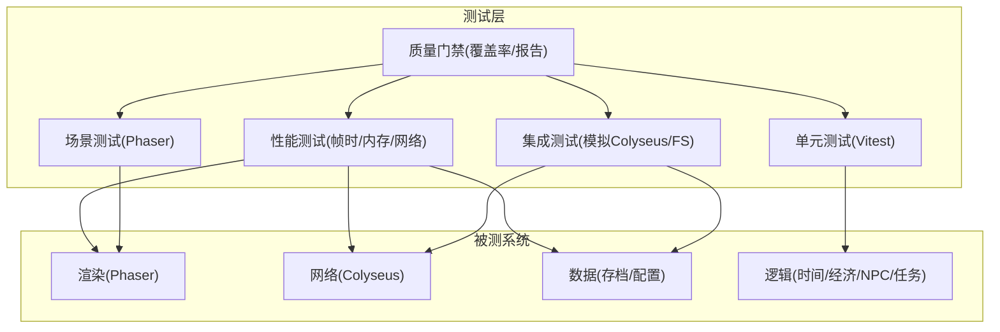

[此图为概念性架构图，无需图表来源]

## 详细组件分析

### 单元测试框架与规范
- 框架选择：Vitest（GDD 指定），配合 TypeScript strict 模式与类型守卫，避免 any。
- 命名与组织：按系统划分目录（time、economy、farming、npc、save、network、render、safety），每个模块对应一组测试套件。
- 用例编写规范：
  - 输入输出明确，边界值与异常路径覆盖；使用参数化测试覆盖多作物/多季节/多天气组合。
  - 断言聚焦于不变量（如 money ∈ [min,max]、energy ∈ [min,max]、day ∈ [1,28]）。
  - 对纯函数优先单测（如售价计算、时间推进、状态机转换）。
  - 对副作用模块采用隔离与桩对象（fs、网络、音频）。

示例断言要点（路径引用）：
- 经济售价计算与边界保护：[gdd.md:254-274](file://gdd.md#L254-L274)
- 时间推进与日界保护：[gdd.md:193-235](file://gdd.md#L193-L235)
- 安全护栏常量与阈值：[gdd.md:1780-1888](file://gdd.md#L1780-L1888)

**章节来源**
- [gdd.md:254-274](file://gdd.md#L254-L274)
- [gdd.md:193-235](file://gdd.md#L193-L235)
- [gdd.md:1780-1888](file://gdd.md#L1780-L1888)
- [.claude/CLAUDE.md:8-17](file://.claude/CLAUDE.md#L8-L17)

### 核心系统逻辑测试
- 时间系统
  - 推进步长、昼夜截止、睡眠加速、超时回退与强制睡眠。
  - 断言：maxTimeAdvancePerFrame、maxMinutesPerDay、onExceededDay 触发条件。
- 经济系统
  - 售价公式、品质倍率、工匠加成、NaN/Infinity 防护、金额上下限。
  - 断言：calculateSellPrice 输出受 valueBounds.money 保护。
- 耕种系统
  - 翻地→播种→浇水→生长→收获闭环；肥料/洒水器影响；最大地块与每批收获上限。
- NPC 社交与日程
  - 四套日程（工作日/周末/雨天/节日）；默认位置回退；好感度区间与心数解锁。
- 任务/剧情
  - 前置条件、目标计数、完成标志、自动修复不一致。
- 节日系统
  - 触发时段、参与奖励、联机并行独立评比。

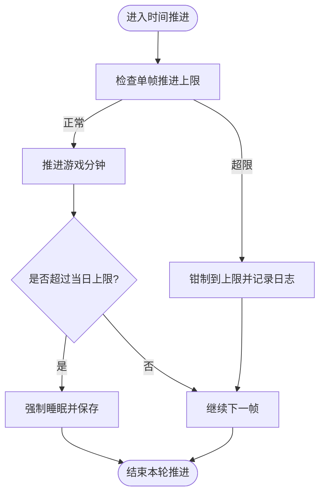

**图表来源**
- [gdd.md:193-235](file://gdd.md#L193-L235)

**章节来源**
- [gdd.md:193-235](file://gdd.md#L193-L235)
- [gdd.md:254-274](file://gdd.md#L254-L274)
- [gdd.md:468-476](file://gdd.md#L468-L476)
- [gdd.md:603-656](file://gdd.md#L603-L656)
- [gdd.md:1028-1067](file://gdd.md#L1028-L1067)
- [gdd.md:1106-1173](file://gdd.md#L1106-L1173)

### 数值平衡验证
- 经济曲线与通胀保护
  - 阶段日均收入目标、年度涨幅上限、单笔价格上限、每日收入上限。
- 典型经济链回归测试
  - 初级/中级/高级/动物/终局链条，复算利润与日均等效收益，确保与 GDD 一致。
- 工具能效与体力消耗映射
  - 范围增大带来的单位产出提升，不改变单次体力消耗。

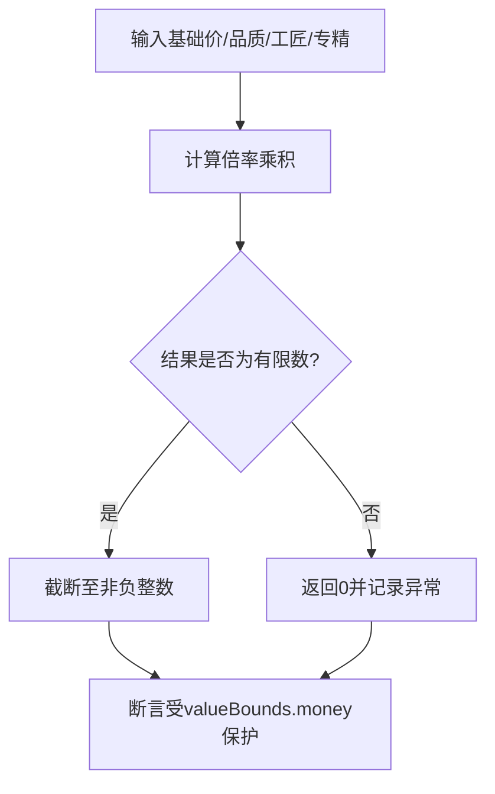

**图表来源**
- [gdd.md:254-274](file://gdd.md#L254-L274)
- [gdd.md:318-332](file://gdd.md#L318-L332)

**章节来源**
- [gdd.md:244-332](file://gdd.md#L244-L332)
- [gdd.md:541-549](file://gdd.md#L541-L549)

### 安全机制测试
- 七维熔断保护
  - 游戏循环：单帧时长上限、迭代次数上限、看门狗重启场景。
  - 渲染：精灵/粒子/纹理内存上限、Tile 裁剪。
  - 网络：消息速率限制、包大小限制、连接超时、状态校验。
  - 内存：场景切换清理、缓存上限、对象池上限。
  - 数据：原子写入、sha256 校验、数值边界、恢复策略。
  - 状态机：非法转移回滚、NPC 日程回退、任务一致性自检。
  - I/O：扩展白名单、文件大小限制、设置损坏回退。
- 错误恢复流程
  - 存档损坏、网络断开、资源加载失败、渲染崩溃、任务不一致、玩家位置异常、时间跳跃异常的检测与恢复策略。

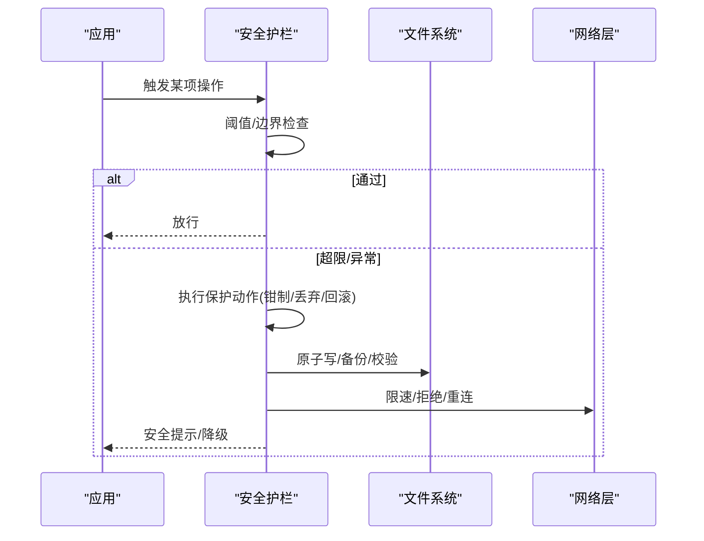

**图表来源**
- [gdd.md:1780-1888](file://gdd.md#L1780-L1888)
- [gdd.md:1890-1945](file://gdd.md#L1890-L1945)

**章节来源**
- [gdd.md:1780-1888](file://gdd.md#L1780-L1888)
- [gdd.md:1890-1945](file://gdd.md#L1890-L1945)

### 集成测试策略
- 网络同步测试
  - 监听服务器模式：主机控制时间、位置/物品/金钱可靠传输、NPC 增量同步、聊天速率限制。
  - 客户端预测：本地先执行，主机确认冲突时回滚；钓鱼/战斗本地判定，主机仲裁。
  - 平等性验收：同时操作、移动平滑、交易公平、拾取无主机优先。
- 存档读写测试
  - 版本迁移：低版本自动升级填充默认值，高版本拒绝并提示更新。
  - 完整性：sha256 校验、读取/写入一致性、原子写入与备份槽位。
- 跨平台兼容性测试
  - PC（Tauri）与手机（Capacitor）在 UI 交互、触摸/键鼠映射、资源加载超时、内存上限等方面的一致性。

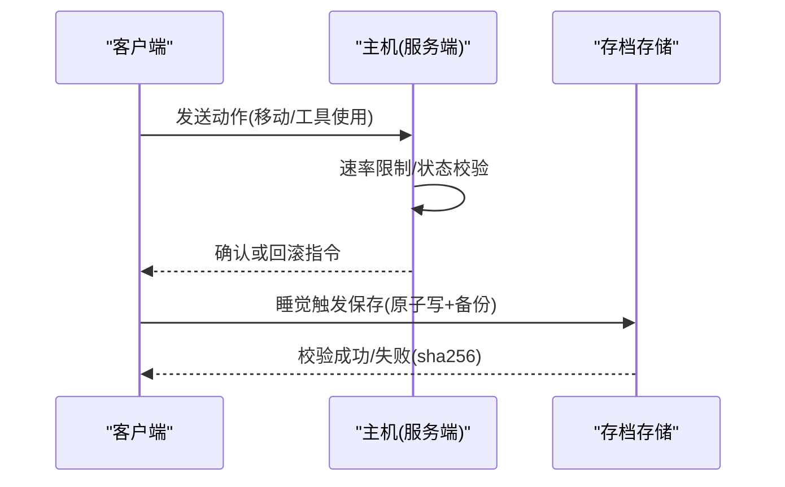

**图表来源**
- [gdd.md:1451-1590](file://gdd.md#L1451-L1590)
- [gdd.md:1606-1675](file://gdd.md#L1606-L1675)

**章节来源**
- [gdd.md:1451-1590](file://gdd.md#L1451-L1590)
- [gdd.md:1606-1675](file://gdd.md#L1606-L1675)

### 性能测试方法
- 渲染性能监控
  - 帧时分布、P95/P99 延迟、渲染对象数量、Tile 裁剪命中率。
- 内存使用分析
  - 纹理/音频缓存上限、对象池回收、场景切换后清理效果。
- 网络延迟测试
  - 端到端 RTT、消息丢失率、重连成功率、带宽占用。
- 指标目标（参考）
  - 60fps 稳定、加载时间、内存占用、包体大小。

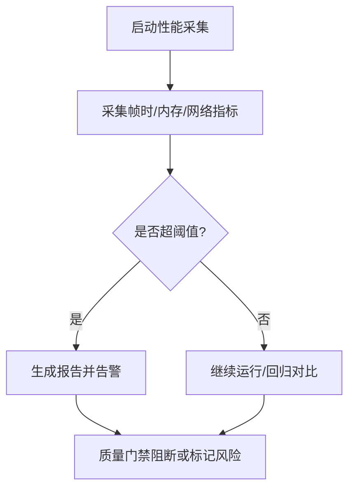

**章节来源**
- [gdd.md:1748-1779](file://gdd.md#L1748-L1779)

### 自动化测试流水线
- 持续集成环境
  - 安装 Node/TS/Vitest，构建 Phaser 工程，运行单元与集成测试，生成覆盖率与报告。
- 测试报告生成
  - 汇总单元/集成/性能结果，输出 HTML 报告与趋势图。
- 质量门禁
  - 覆盖率阈值、失败即阻断、性能回归告警、安全护栏触发统计。

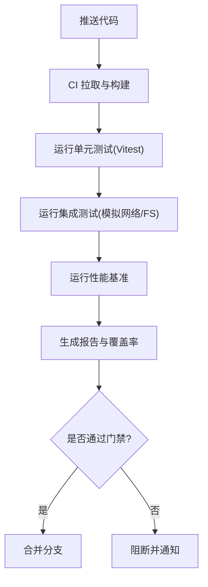

[此图为概念性流程图，无需图表来源]

### 游戏特定测试场景
- NPC 行为测试
  - 四套日程正确性、雨天/节日/季节变化下的位置与活动、高好感邀请事件。
- 经济系统平衡测试
  - 各经济链利润与日均等效收益回归；通胀保护触发；每日收入上限。
- 多人联机一致性验证
  - 同时操作冲突处理、钓鱼/战斗本地判定、NPC 交互互不影响、移动插值平滑。

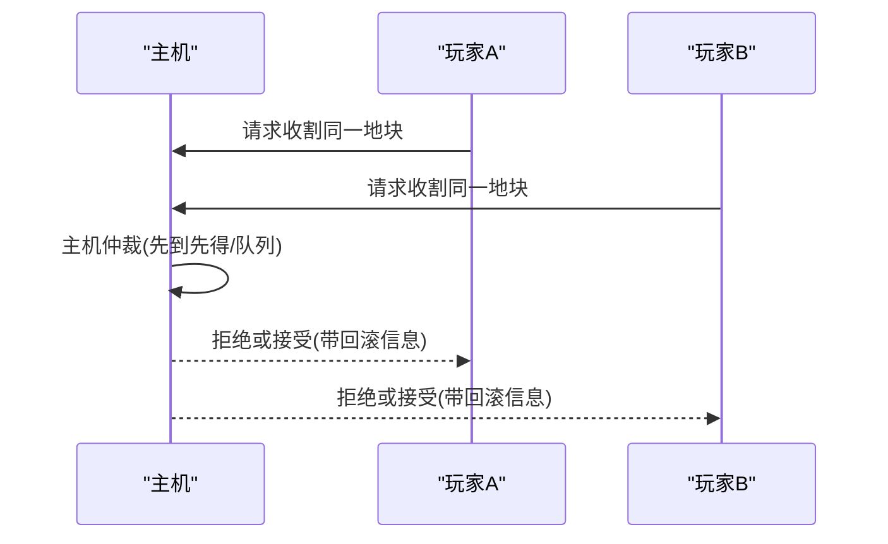

**图表来源**
- [gdd.md:1507-1590](file://gdd.md#L1507-L1590)

**章节来源**
- [gdd.md:603-656](file://gdd.md#L603-L656)
- [gdd.md:244-332](file://gdd.md#L244-L332)
- [gdd.md:1507-1590](file://gdd.md#L1507-L1590)

### 测试驱动开发（TDD）实践指南
- 红-绿-重构节奏
  - 先写失败的测试（红），实现最小可用逻辑（绿），再重构保证可读性与性能（保持 60fps）。
- 用例设计模板
  - 给定-当-那么（Given-When-Then）；参数化覆盖边界与异常；快照对比用于复杂数据结构。
- 与 GDD 对齐
  - 将 GDD 中的不变量与阈值直接转化为断言；对安全护栏与错误恢复路径编写专项用例。
- 协作约定
  - 提交前必须通过全部测试；新增功能需补充相应测试；覆盖率下降需说明原因。

**章节来源**
- [gdd.md:1722-1733](file://gdd.md#L1722-L1733)
- [gdd.md:1780-1888](file://gdd.md#L1780-L1888)

## 依赖分析
- 外部依赖
  - 渲染：Phaser 3（LTS）
  - 网络：Colyseus（含 @colyseus/schema）
  - 构建：Vite 6.x
  - 语言：TypeScript 5.x（strict）
  - 打包：Tauri 2.x（PC）、Capacitor 6.x（手机）
  - 音频：Howler.js 2.x
  - 测试：Vitest
- 耦合与内聚
  - 安全护栏与业务解耦，便于单测与集成测试隔离。
  - 存档结构与网络 Schema 强类型，利于生成测试数据与断言。

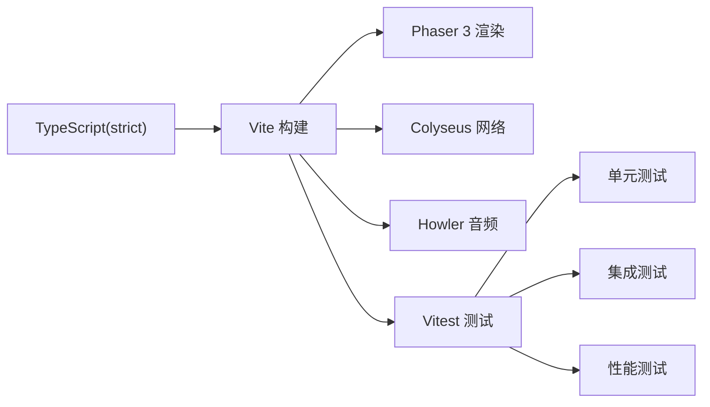

**图表来源**
- [gdd.md:1722-1733](file://gdd.md#L1722-L1733)

**章节来源**
- [gdd.md:1722-1733](file://gdd.md#L1722-L1733)

## 性能考虑
- 目标与红线
  - 全平台 60fps；加载时间 PC < 3s、手机 < 5s；内存占用 PC < 500MB、手机 < 200MB；包体 < 50MB。
- 优化建议
  - 减少不必要重绘、对象池复用、限制激活粒子/动画数量、延迟加载非关键资源。
- 过度优化警示
  - 不要牺牲可读性与正确性换取微小收益；瓶颈集中在循环与绘制。

**章节来源**
- [gdd.md:1748-1779](file://gdd.md#L1748-L1779)

## 故障排查指南
- 常见异常与恢复
  - 存档损坏：checksum 不匹配/JSON 解析错误/字段缺失 → 恢复备份/新建存档/提示用户。
  - 网络断开：超时/心跳丢失/连接被拒 → 自动重连/重试/离线模式。
  - 资源加载失败：超时/404/解码错误 → 跳过占位/重试一次/使用回退纹理。
  - 渲染崩溃：WebGL 上下文丢失/内存不足 → 重启渲染器/降低画质/重载场景。
  - 任务不一致：目标计数不符/前置缺失/完成标志缺失 → 自动修复/重置到检查点/标记失败。
  - 玩家位置异常：越界/碰撞内/低于地面 → 传送出生点/最后安全点/推出墙体。
  - 时间跳跃异常：时间倒流/向前跳≥1小时/跳过一天 → 回退有效值/钳制到合法范围/强制睡眠保存。
- 日志与诊断
  - 分级日志（debug/info/warn/error/fatal），通道开关（gameplay/network/safety/performance/save），日志轮转与安全日志条目。

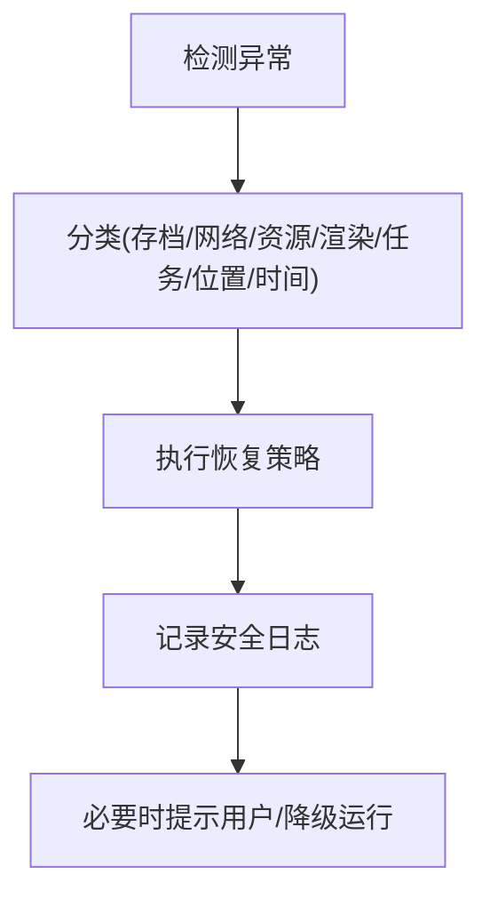

**图表来源**
- [gdd.md:1890-1945](file://gdd.md#L1890-L1945)
- [gdd.md:1947-1969](file://gdd.md#L1947-L1969)

**章节来源**
- [gdd.md:1890-1945](file://gdd.md#L1890-L1945)
- [gdd.md:1947-1969](file://gdd.md#L1947-L1969)

## 结论
通过将 GDD 中的不变量、阈值与恢复策略全面纳入测试体系，并以 Vitest 为核心、Phaser/Colyseus 为被测对象，辅以性能与质量门禁，可实现从单元到集成的全链路质量保障。遵循 TDD 节奏与“联机不歧视”“安全防护并重”的原则，有助于在快速迭代中维持稳定与一致性。

## 附录
- 术语与参考
  - Listen Server、Schema、Client Prediction、LERP、Circuit Breaker、HUD 等参见 GDD 术语表。
- 变更管理
  - 任何设计变更需评估影响范围、检查原则与闭环、更新交叉引用与决策表，并通知相关方。

**章节来源**
- [gdd.md:2099-2161](file://gdd.md#L2099-L2161)