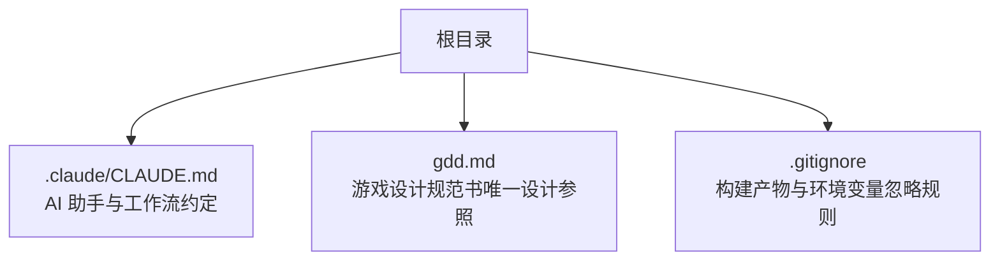
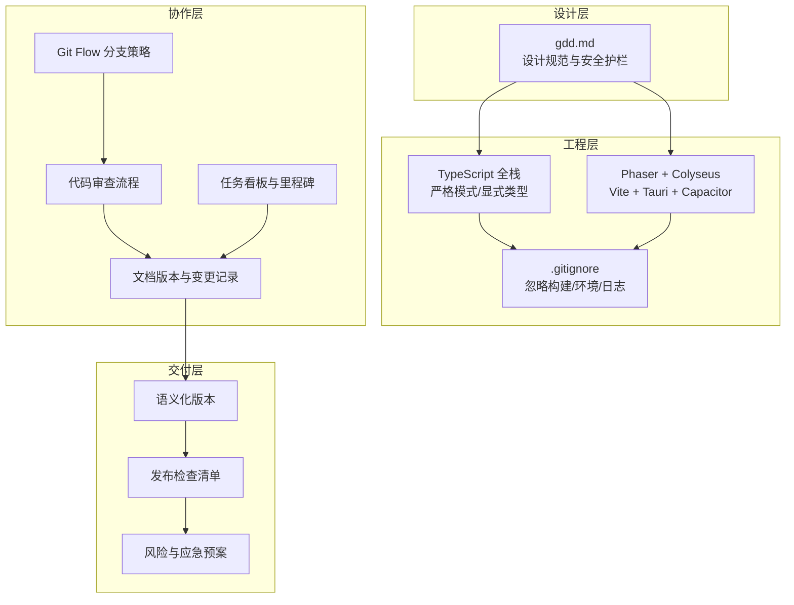
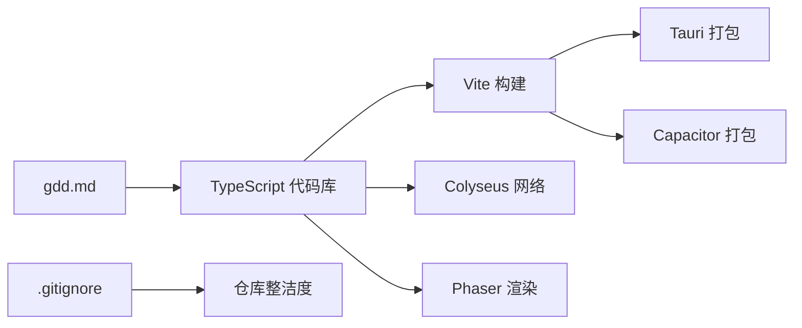
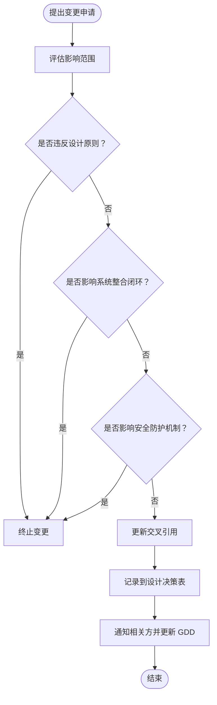

# 项目管理与协作

<cite>
**本文引用的文件**   
- [gdd.md](file://gdd.md)
- [.gitignore](file://.gitignore)
- [CLAUDE.md](file://.claude/CLAUDE.md)
</cite>

## 目录
1. [引言](#引言)
2. [项目结构](#项目结构)
3. [核心组件](#核心组件)
4. [架构总览](#架构总览)
5. [详细组件分析](#详细组件分析)
6. [依赖分析](#依赖分析)
7. [性能考虑](#性能考虑)
8. [故障排查指南](#故障排查指南)
9. [结论](#结论)
10. [附录](#附录)

## 引言
本文件为《山野小村》项目建立标准化的项目管理与团队协作流程，覆盖 Git 工作流、任务管理、文档规范、会议沟通、依赖与发布策略、风险管理以及新人培训要点。内容基于仓库现有资料进行提炼与扩展，确保团队在统一规范下高效协作并保障项目质量与可维护性。

## 项目结构
当前仓库包含游戏设计规范书（GDD）、忽略规则与 AI 助手配置等关键文件。整体结构简洁，便于快速定位设计依据与开发约束。

图表来源
- [CLAUDE.md:1-30](file://.claude/CLAUDE.md#L1-L30)
- [gdd.md:1-10](file://gdd.md#L1-L10)
- [.gitignore:1-43](file://.gitignore#L1-L43)

章节来源
- [CLAUDE.md:1-30](file://.claude/CLAUDE.md#L1-L30)
- [gdd.md:1-10](file://gdd.md#L1-L10)
- [.gitignore:1-43](file://.gitignore#L1-L43)

## 核心组件
围绕“设计与实现”的两大核心：
- 设计规范与变更控制：以 GDD 为唯一设计参照，所有系统规则、数值、安全护栏与里程碑均来源于此。
- 工程约束与工具链：通过 CLAUDE.md 明确语言、类型、质量与性能约束；通过 .gitignore 统一忽略规则，避免污染仓库。

章节来源
- [gdd.md:1-10](file://gdd.md#L1-L10)
- [CLAUDE.md:1-30](file://.claude/CLAUDE.md#L1-L30)
- [.gitignore:1-43](file://.gitignore#L1-L43)

## 架构总览
从“设计—实现—交付”的角度，将项目治理分为四层：
- 设计层：GDD 定义系统边界、数值、安全护栏与里程碑。
- 工程层：TypeScript 全栈、Phaser/Colyseus/Vite/Tauri/Capacitor 等技术栈与代码规范。
- 协作层：Git 分支策略、提交信息、审查流程、任务看板与文档版本化。
- 交付层：版本号、发布检查清单、风险与应急预案。

[无图表来源：该图为概念性架构示意]

## 详细组件分析

### Git 工作流规范（Git Flow）
- 分支模型
  - main：稳定发布基线，仅接受合并请求并通过检查后合入。
  - develop：集成开发分支，日常功能在此聚合。
  - feature/*：功能分支，从 develop 切出，完成后合并回 develop。
  - release/*：发布候选分支，用于冻结与回归测试，完成后合并到 main 与 develop。
  - hotfix/*：紧急修复分支，从 main 切出，修复后同时合并回 main 与 develop。
- 分支命名
  - 使用 kebab-case，如 feature/farming-crop-table、hotfix/save-integrity-fix。
- 提交信息格式
  - 采用 Conventional Commits：type(scope): subject
  - type 建议：feat, fix, docs, chore, refactor, perf, test, build, ci, revert
  - scope 建议：对应模块或子系统（如 farming, npc, save, network）
  - 示例：feat(farming): 新增蓝莓经济链计算校验
- 分支保护
  - main 与 develop 开启保护，禁止直接推送，必须通过 Pull Request 合并。
  - 强制要求至少一名 Reviewer 批准，CI 全部通过后方可合并。
- 冲突解决
  - 优先在本地 rebase 最新 develop，再提交 PR；若存在冲突，先解决冲突再更新 PR。

章节来源
- [CLAUDE.md:1-30](file://.claude/CLAUDE.md#L1-L30)
- [gdd.md:1-10](file://gdd.md#L1-L10)

### 提交信息规范与代码审查流程
- 提交信息
  - 主题行不超过 72 字符，描述变更动机与影响范围。
  - 涉及数值/规则变更需引用 GDD 对应章节，便于追溯。
- 代码审查
  - 审查重点：类型安全、逻辑正确性、安全防护（熔断/边界/一致性）、性能与可读性。
  - 审查清单：是否引入 any、是否违反单函数/单文件行数限制、是否遗漏安全检查、是否影响系统整合闭环。
  - 合并前要求：PR 标题与描述清晰、关联任务编号、通过自动化检查（lint/test/build）。

章节来源
- [CLAUDE.md:1-30](file://.claude/CLAUDE.md#L1-L30)
- [gdd.md:1735-1746](file://gdd.md#L1735-L1746)

### 任务管理与里程碑规划
- 工具建议
  - GitHub Projects 或 Jira：按 Sprint/里程碑划分，标签区分优先级（P0/P1/P2）。
- 里程碑
  - 参考 GDD 第十三部分阶段目标与验收标准，拆分为可交付增量。
- 任务分配
  - 每个任务明确负责人、起止时间、验收标准与依赖关系。
- 进度跟踪
  - 每日站会同步阻塞问题；看板状态流转（待办→进行中→评审→已合并→已验证）。

章节来源
- [gdd.md:2011-2060](file://gdd.md#L2011-L2060)

### 文档管理规范
- 设计文档版本控制
  - gdd.md 作为唯一设计参照，任何变更需遵循“变更流程”，并在文末记录决策与日期。
- API 文档更新
  - 网络协议消息类型、Schema 字段变更需在 PR 中附带接口说明与兼容性评估。
- 变更日志维护
  - 每次发布生成 CHANGELOG，记录新增、修复、破坏性变更与迁移步骤。
- 文档结构与索引
  - 文档间交叉引用保持一致，避免孤立文档导致理解偏差。

章节来源
- [gdd.md:2146-2161](file://gdd.md#L2146-L2161)
- [gdd.md:2165-2175](file://gdd.md#L2165-L2175)

### 会议与沟通规范
- 站会制度
  - 每日 15 分钟，聚焦昨日进展、今日计划与阻塞项。
- 技术分享
  - 每两周一次，主题围绕系统整合、安全防护、性能优化与跨端适配。
- 问题上报流程
  - 发现异常立即记录到任务看板，标注严重等级与复现步骤；必要时触发应急预案。

[本节为通用流程说明，不直接分析具体文件]

### 依赖管理与版本发布策略
- 依赖管理
  - 使用 npm/yarn/pnpm 锁定依赖版本，定期扫描漏洞与过期包。
  - 构建产物与 node_modules 纳入 .gitignore，避免污染仓库。
- 版本号规范
  - 采用语义化版本（主.次.修订），重大变更升主版本，新功能升次版本，修复升修订版本。
- 发布检查清单
  - 功能验收：满足里程碑验收标准。
  - 安全护栏：循环/渲染/网络/数据/状态机/I/O/联机专项防护生效。
  - 平台打包：PC（Tauri）与手机（Capacitor）均可构建成功。
  - 性能指标：PC/手机帧率达标，内存与包体符合上限。
  - 文档更新：GDD 决策表与变更日志同步。

章节来源
- [.gitignore:1-43](file://.gitignore#L1-L43)
- [gdd.md:2033-2060](file://gdd.md#L2033-L2060)

### 风险管理机制
- 技术债务记录
  - 在任务看板设立“技术债”标签，定期评估与排期偿还。
- 风险评估
  - 识别高影响风险（存档损坏、网络洪水、渲染过载、手机端内存不足），制定缓解措施。
- 应急预案
  - 针对关键异常（存档、网络、资源加载、渲染、任务状态、玩家位置、时间系统）定义恢复策略与回退路径。

章节来源
- [gdd.md:1971-1984](file://gdd.md#L1971-L1984)
- [gdd.md:1890-1945](file://gdd.md#L1890-L1945)

### 新人协作规范培训材料
- 必读文档
  - gdd.md：了解设计原则、系统边界、安全护栏与里程碑。
  - CLAUDE.md：掌握语言与质量约束、工作流程与记忆系统。
- 环境与工具
  - 安装 Node.js、TypeScript、Vite、Phaser、Colyseus、Tauri、Capacitor。
  - 配置 IDE 插件（TS 严格模式、Lint、格式化）。
- 上手任务
  - 创建 feature 分支，完成一个小型功能（如新增一种作物数据），提交 PR 并通过审查。
- 协作礼仪
  - 尊重设计边界，变更需走流程；遇到阻塞及时上报；保持文档与代码一致。

章节来源
- [gdd.md:1-10](file://gdd.md#L1-L10)
- [CLAUDE.md:1-30](file://.claude/CLAUDE.md#L1-L30)

## 依赖分析
- 内部依赖
  - 设计层（gdd.md）驱动工程层（TypeScript/Phaser/Colyseus/Vite/Tauri/Capacitor）。
  - 工程层受 .gitignore 约束，避免无关文件进入仓库。
- 外部依赖
  - 构建与运行时依赖通过包管理器锁定版本，定期更新与审计。
- 潜在耦合点
  - 网络协议与 Schema 变更需同步更新客户端与服务端。
  - 数值与经济系统变更需联动验证多系统闭环。

图表来源
- [gdd.md:1722-1734](file://gdd.md#L1722-L1734)
- [.gitignore:1-43](file://.gitignore#L1-L43)

章节来源
- [gdd.md:1722-1734](file://gdd.md#L1722-L1734)
- [.gitignore:1-43](file://.gitignore#L1-L43)

## 性能考虑
- 目标帧率与资源上限
  - PC/手机目标 60fps，内存与包体有明确上限。
- 优化策略
  - 合理对象池、延迟加载非关键资源、减少重绘与粒子数量。
- 安全护栏
  - 帧时间限制、渲染裁剪、纹理缓存上限、场景切换清理。

章节来源
- [gdd.md:1748-1779](file://gdd.md#L1748-L1779)
- [gdd.md:1808-1839](file://gdd.md#L1808-L1839)

## 故障排查指南
- 常见问题定位
  - 存档异常：检查完整性校验与备份恢复流程。
  - 网络异常：查看速率限制、连接超时与心跳检测。
  - 渲染异常：关注 WebGL 上下文丢失与内存溢出。
  - 任务状态不一致：启用自动修复与一致性检查。
- 日志与诊断
  - 启用安全日志通道，记录阈值触发与系统状态快照。
- 应急回退
  - 根据错误恢复流程选择最佳回退路径（自动保存、跳过资源、降级质量）。

章节来源
- [gdd.md:1890-1945](file://gdd.md#L1890-L1945)
- [gdd.md:1947-1969](file://gdd.md#L1947-L1969)

## 结论
通过统一的 Git 工作流、严格的代码与文档规范、完善的发布与风险管理机制，《山野小村》可在保证设计一致性的前提下高效推进开发与迭代。建议团队严格执行变更流程与审查清单，持续完善自动化检查与监控，确保项目质量与稳定性。

[本节为总结性内容，不直接分析具体文件]

## 附录

### 变更流程图（基于 GDD 变更流程）

图表来源
- [gdd.md:2146-2161](file://gdd.md#L2146-L2161)

章节来源
- [gdd.md:2146-2161](file://gdd.md#L2146-L2161)