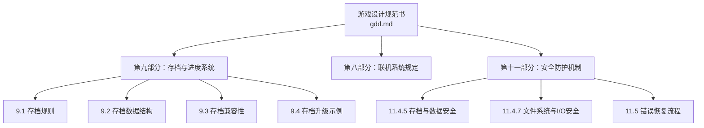
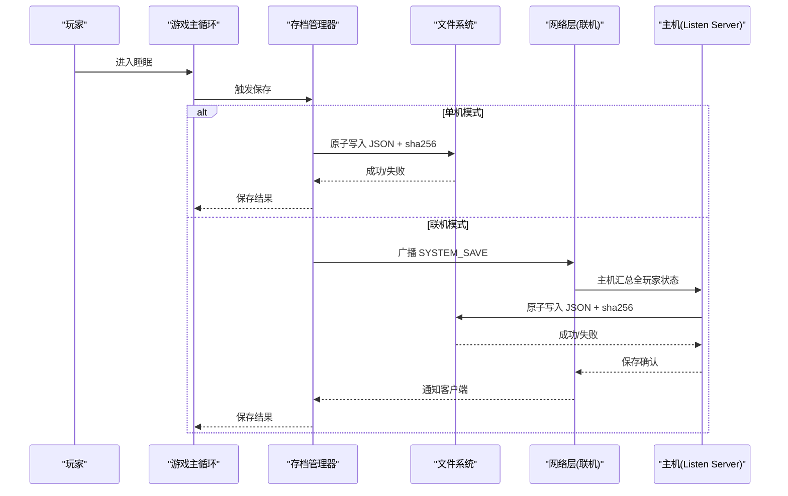
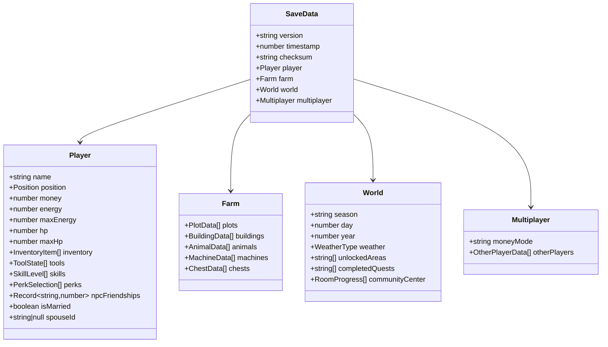
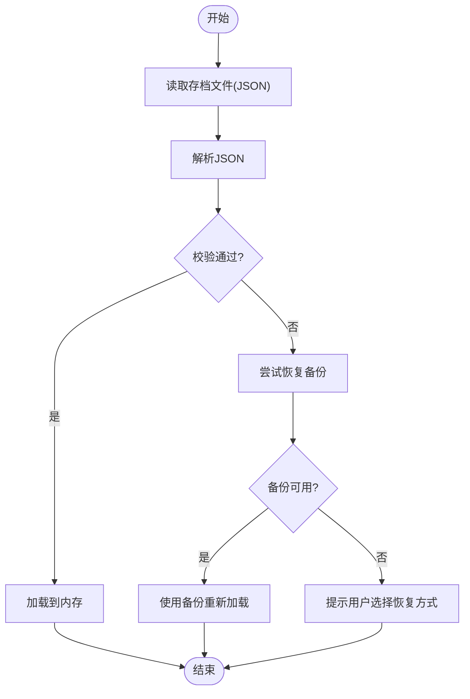
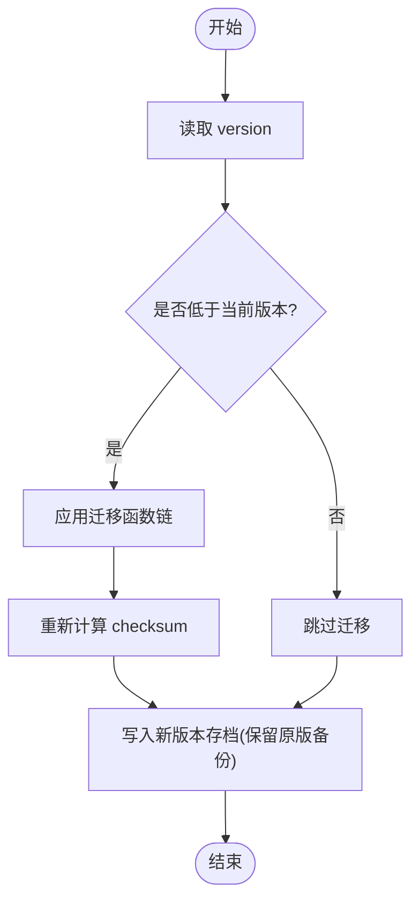
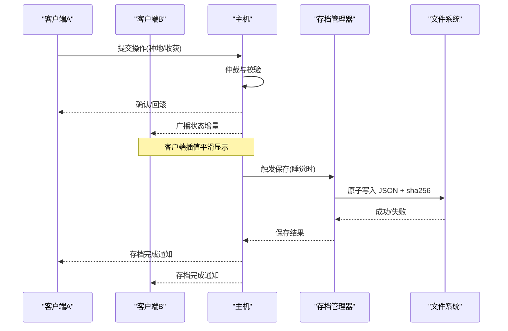
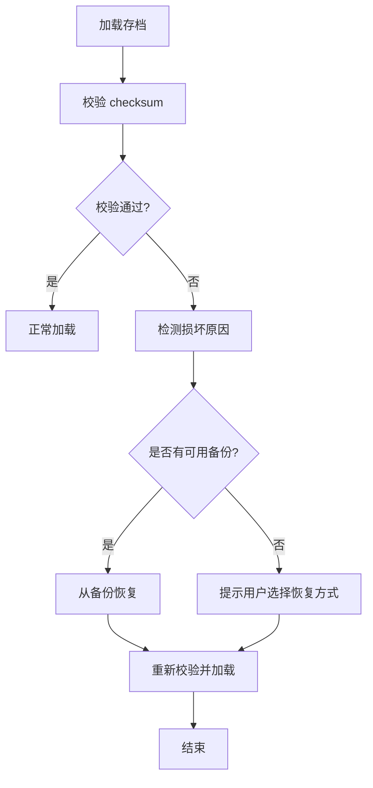
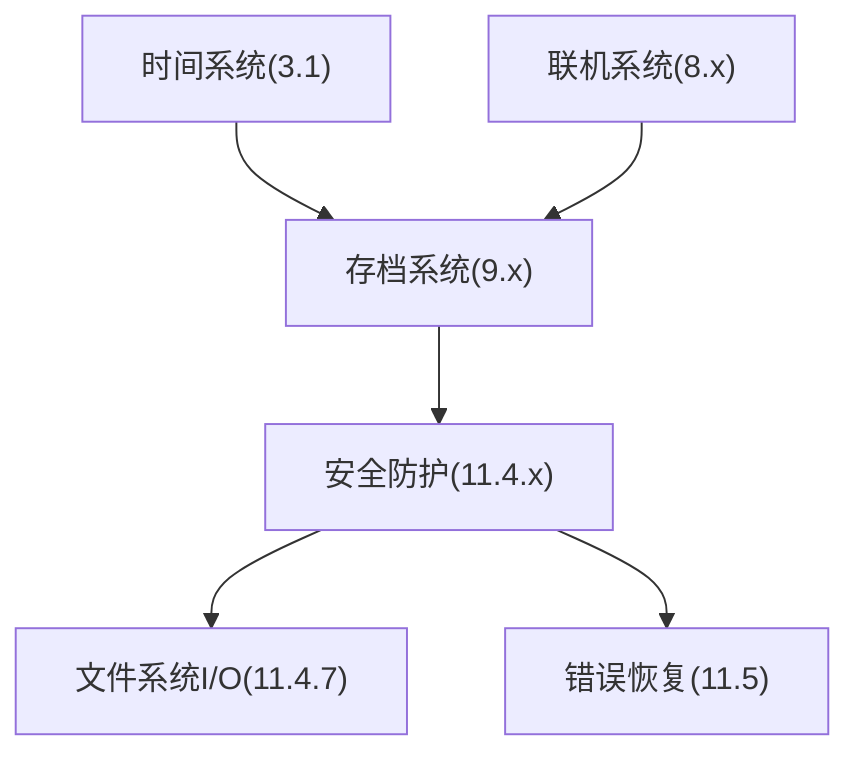

# 存档与进度管理

<cite>
**本文引用的文件**   
- [gdd.md](file://gdd.md)
</cite>

## 目录
1. [引言](#引言)
2. [项目结构](#项目结构)
3. [核心组件](#核心组件)
4. [架构总览](#架构总览)
5. [详细组件分析](#详细组件分析)
6. [依赖关系分析](#依赖关系分析)
7. [性能考量](#性能考量)
8. [故障排查指南](#故障排查指南)
9. [结论](#结论)
10. [附录](#附录)

## 引言
本技术文档聚焦《山野小村》的存档与进度管理系统，围绕以下目标展开：
- 深入解释 SaveData 数据结构设计、字段定义与数据类型约束
- 详细说明本地存档的文件格式、完整性校验与版本迁移机制
- 描述联机模式下的存档同步策略、冲突解决与数据一致性保证
- 包含存档损坏恢复与备份管理
- 提供存档导入导出工具、数据验证脚本与调试方法（概念性说明）

本说明严格基于仓库中的设计规范文档进行提炼与组织，确保所有实现细节均有据可查。

## 项目结构
当前仓库为设计与规范文档型项目，核心内容集中于单一设计文档中，存档系统相关规则、数据结构与安全机制均在该文档内统一规定。

图表来源
- [gdd.md:1592-1676](file://gdd.md#L1592-L1676)
- [gdd.md:1840-1877](file://gdd.md#L1840-L1877)
- [gdd.md:1890-1945](file://gdd.md#L1890-L1945)

章节来源
- [gdd.md:1592-1676](file://gdd.md#L1592-L1676)
- [gdd.md:1840-1877](file://gdd.md#L1840-L1877)
- [gdd.md:1890-1945](file://gdd.md#L1890-L1945)

## 核心组件
- 存档触发与槽位管理
  - 自动保存时机：每天睡觉时自动保存
  - 槽位配置：3个手动槽 + 1个自动槽
  - 联机场景：主机负责保存全部玩家状态
- 文件格式与完整性
  - 存储格式：JSON
  - 完整性校验：sha256 校验和
  - 写入保护：原子写入、覆盖前备份
- 数据结构与类型约束
  - 顶层字段：version、timestamp、checksum
  - 玩家域：位置、金钱、体力、生命值、背包、工具、技能、专精、NPC好感度、婚姻状态等
  - 农场域：地块、建筑、动物、机器、箱子
  - 世界域：季节/日/年、天气、解锁区域、任务完成列表、社区中心房间进度
  - 联机域：金钱模式、其他玩家数据
  - 数值边界：金钱、体力、HP、好感度、物品堆叠上限、技能等级等受保护
- 兼容性与迁移
  - 低版本自动升级并填充默认值
  - 高版本拒绝加载并提示更新
  - 迁移流程：读取 version → 逐版本迁移函数 → 重算 checksum → 写入新版本并保留原版备份

章节来源
- [gdd.md:1592-1676](file://gdd.md#L1592-L1676)
- [gdd.md:1840-1877](file://gdd.md#L1840-L1877)

## 架构总览
存档系统在单机与联机两种模式下运行，遵循“主机睡眠时保存”的统一策略，并通过完整性校验与备份机制保障数据安全。

图表来源
- [gdd.md:1452-1505](file://gdd.md#L1452-L1505)
- [gdd.md:1592-1605](file://gdd.md#L1592-L1605)
- [gdd.md:1840-1877](file://gdd.md#L1840-L1877)

## 详细组件分析

### SaveData 数据结构与约束
- 顶层字段
  - version：字符串版本号，用于兼容性检查
  - timestamp：保存时间戳
  - checksum：sha256 校验和，用于完整性校验
- 玩家域
  - name、position（x/y/map）、money、energy、maxEnergy、hp、maxHp
  - inventory、tools、skills、perks
  - npcFriendships（键值映射）、isMarried、spouseId
  - 约束：money、energy、hp、npcFriendship 等受数值边界保护
- 农场域
  - plots、buildings、animals、machines、chests
- 世界域
  - season、day、year、weather、unlockedAreas、completedQuests、communityCenter
- 联机域
  - moneyMode（shared/individual）、otherPlayers

图表来源
- [gdd.md:1608-1650](file://gdd.md#L1608-L1650)

章节来源
- [gdd.md:1608-1650](file://gdd.md#L1608-L1650)
- [gdd.md:1840-1877](file://gdd.md#L1840-L1877)

### 本地存档文件格式与完整性
- 文件格式：JSON
- 完整性校验：sha256 校验和
- 写入策略：原子写入，覆盖前先备份
- 加载策略：读取后校验 checksum；失败则尝试恢复备份或提示用户

图表来源
- [gdd.md:1592-1605](file://gdd.md#L1592-L1605)
- [gdd.md:1840-1877](file://gdd.md#L1840-L1877)
- [gdd.md:1890-1945](file://gdd.md#L1890-L1945)

章节来源
- [gdd.md:1592-1605](file://gdd.md#L1592-L1605)
- [gdd.md:1840-1877](file://gdd.md#L1840-L1877)
- [gdd.md:1890-1945](file://gdd.md#L1890-L1945)

### 版本迁移机制
- 迁移入口：读取 version 字段
- 迁移过程：按版本顺序执行独立且可测试的迁移函数
- 迁移后处理：重新计算 checksum，写入新版本存档，保留原版备份
- 兼容性策略：
  - 低版本：自动升级+填充默认值
  - 高版本：拒绝加载并提示更新

图表来源
- [gdd.md:1652-1676](file://gdd.md#L1652-L1676)

章节来源
- [gdd.md:1652-1676](file://gdd.md#L1652-L1676)

### 联机模式下的存档同步与一致性
- 架构模式：Listen Server（主机兼玩家）
- 同步策略：
  - 主机在玩家睡觉时保存全部玩家状态
  - 通过网络消息通知存档事件
- 一致性保证：
  - 主机仲裁：关键状态由主机最终判定
  - 客户端预测：操作先本地执行，主机确认后回滚不一致
  - 速率限制与消息队列保护，防止过载
- 冲突解决：
  - 同一资源（如地块）同时操作时，以主机为准，客户端回滚至一致状态

图表来源
- [gdd.md:1452-1505](file://gdd.md#L1452-L1505)
- [gdd.md:1592-1605](file://gdd.md#L1592-L1605)
- [gdd.md:1840-1877](file://gdd.md#L1840-L1877)

章节来源
- [gdd.md:1452-1505](file://gdd.md#L1452-L1505)
- [gdd.md:1592-1605](file://gdd.md#L1592-L1605)
- [gdd.md:1840-1877](file://gdd.md#L1840-L1877)

### 存档完整性校验、损坏恢复与备份管理
- 完整性校验：sha256 校验和，加载与保存时均校验
- 损坏检测：校验失败、JSON 解析错误、字段缺失
- 恢复策略：
  - 优先从备份恢复
  - 若备份不可用，提示用户选择恢复方式（新建存档/使用自动存档）
- 备份管理：
  - 覆盖前自动备份
  - 支持多槽位备份（至少3个），结合自动存档恢复

图表来源
- [gdd.md:1840-1877](file://gdd.md#L1840-L1877)
- [gdd.md:1890-1945](file://gdd.md#L1890-L1945)

章节来源
- [gdd.md:1840-1877](file://gdd.md#L1840-L1877)
- [gdd.md:1890-1945](file://gdd.md#L1890-L1945)

### 存档导入导出工具与数据验证脚本（概念性说明）
- 导入导出工具
  - 功能：将本地存档 JSON 转换为外部可读格式（如 CSV/Excel），或将外部数据批量导入为存档片段
  - 安全：导入前进行 schema 校验与数值边界检查，失败则拒绝并记录日志
- 数据验证脚本
  - 功能：对存档 JSON 进行结构校验、必填字段检查、枚举值校验、数值范围校验、关联一致性检查（如任务前置条件）
  - 输出：验证报告（通过/失败项、修复建议）
- 调试方法
  - 启用存档日志通道，记录保存/加载/迁移/校验的关键事件
  - 在开发环境开启更详细的校验日志，便于定位问题

[本节为通用实践说明，不直接分析具体文件]

## 依赖关系分析
- 存档系统与时间系统的耦合
  - 存档时机与时间系统紧密绑定（每日睡觉时自动保存）
- 存档系统与联机系统的耦合
  - 主机负责保存全部玩家状态，客户端通过消息接收存档完成通知
- 存档系统与安全防护机制的耦合
  - 数值边界、完整性校验、原子写入、备份槽位、错误恢复流程均由安全防护框架提供保障

图表来源
- [gdd.md:1592-1605](file://gdd.md#L1592-L1605)
- [gdd.md:1452-1505](file://gdd.md#L1452-L1505)
- [gdd.md:1840-1877](file://gdd.md#L1840-L1877)
- [gdd.md:1890-1945](file://gdd.md#L1890-L1945)

章节来源
- [gdd.md:1592-1605](file://gdd.md#L1592-L1605)
- [gdd.md:1452-1505](file://gdd.md#L1452-L1505)
- [gdd.md:1840-1877](file://gdd.md#L1840-L1877)
- [gdd.md:1890-1945](file://gdd.md#L1890-L1945)

## 性能考量
- 存档写入采用原子操作，避免部分写入导致的数据不一致
- 校验与迁移仅在必要阶段执行（加载/保存/迁移），避免频繁开销
- 备份数量与大小需受控，防止磁盘占用过高
- 联机模式下，主机保存频率受“睡觉时”触发控制，避免高频IO

[本节为一般性指导，不直接分析具体文件]

## 故障排查指南
- 常见问题定位
  - 校验失败：检查 checksum 生成与比较逻辑，确认文件未被篡改或截断
  - 解析错误：检查 JSON 结构与字段类型是否符合 SaveData 定义
  - 字段缺失：根据迁移规则补齐默认值，或提示用户更新游戏版本
  - 数值越界：依据 valueBounds 修正并记录日志
- 恢复步骤
  - 优先从备份恢复
  - 若无备份，提示用户选择新建存档或使用自动存档
- 日志与诊断
  - 开启存档日志通道，记录 save/load/migration/checksum 事件
  - 关注安全日志条目，包括触发的防护项、阈值与动作

章节来源
- [gdd.md:1840-1877](file://gdd.md#L1840-L1877)
- [gdd.md:1890-1945](file://gdd.md#L1890-L1945)

## 结论
《山野小村》的存档与进度管理系统在设计上强调安全性与一致性：
- 明确的数据结构与严格的类型约束
- 基于 JSON 与 sha256 的完整性校验
- 原子写入与多槽位备份的稳健持久化策略
- 联机模式下主机仲裁与客户端预测的一致性保障
- 完善的迁移与恢复流程，确保跨版本兼容与异常容错

这些机制共同构成了一个可靠、可扩展的存档与进度管理体系。

## 附录
- 术语
  - Listen Server：主机兼玩家的联机架构
  - Schema：状态定义与同步机制
  - Client Prediction：客户端预测，先执行再同步
  - LERP：线性插值，平滑移动过渡
  - Circuit Breaker：熔断保护机制
- 参考章节
  - 第九部分：存档与进度系统
  - 第八部分：联机系统规定
  - 第十一部分：安全防护机制

[本节为术语与参考信息，不直接分析具体文件]