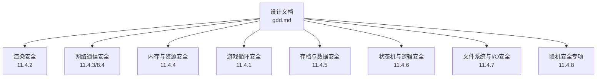
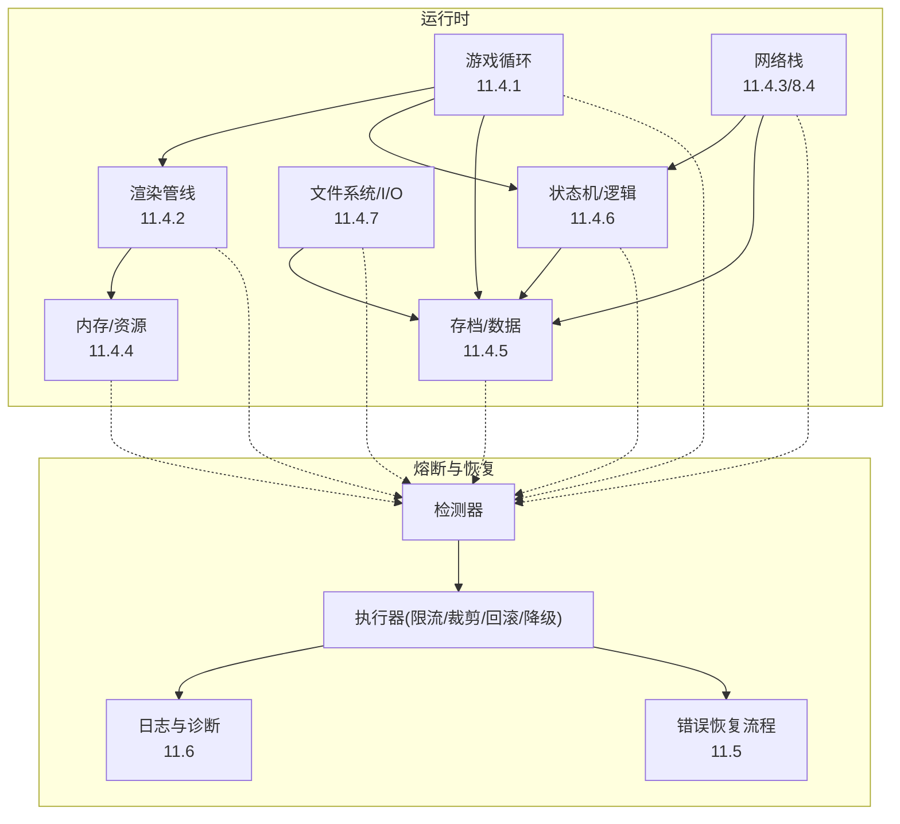
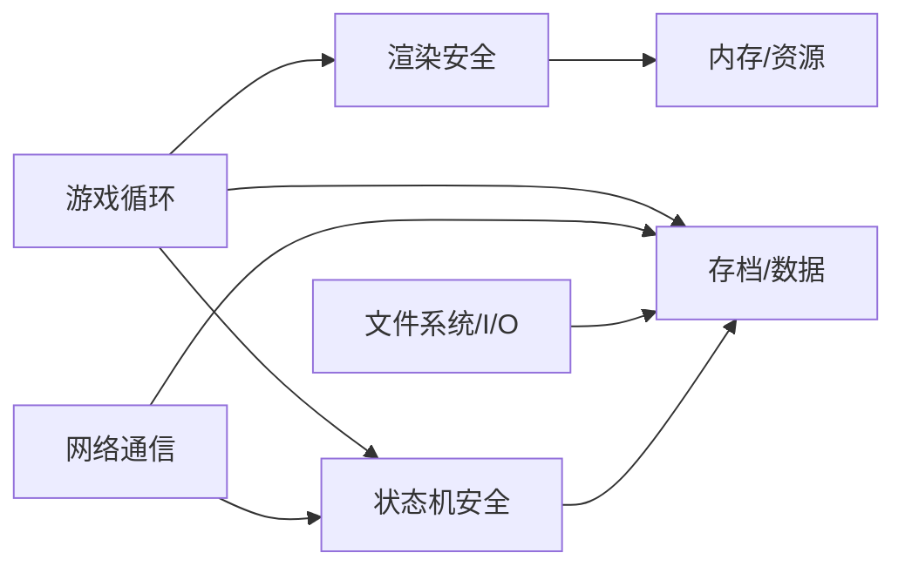
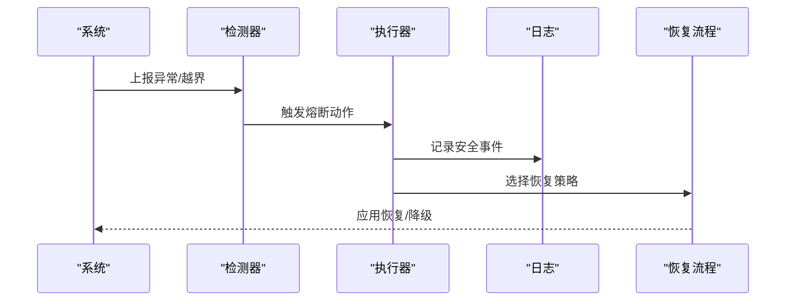

# 安全防护机制

<cite>
**本文引用的文件**   
- [gdd.md](file://gdd.md)
</cite>

## 目录
1. [引言](#引言)
2. [项目结构](#项目结构)
3. [核心组件](#核心组件)
4. [架构总览](#架构总览)
5. [详细组件分析](#详细组件分析)
6. [依赖关系分析](#依赖关系分析)
7. [性能考量](#性能考量)
8. [故障排查指南](#故障排查指南)
9. [结论](#结论)
10. [附录](#附录)

## 引言
本文件围绕《山野小村》的“七维度熔断保护体系”进行安全架构说明，覆盖渲染安全、网络通信安全、内存管理安全、游戏循环安全、数值计算安全、状态机安全与输入验证安全。文档基于设计文档中的安全规范与阈值定义，提炼出每个维度的保护措施、触发条件、恢复策略与监控指标，并提供安全编码指南、常见漏洞防护模式与安全测试方法，帮助开发者在实现过程中构建稳健的安全护栏。

## 项目结构
本项目为游戏设计文档驱动型仓库，当前以单一设计文档为核心，所有安全相关规则、阈值与流程均在该文档中集中定义。开发阶段将依据该文档落地到具体代码模块（如渲染层、网络层、数据持久化、逻辑状态机等），并以文档中的接口与约束作为验收标准。

图表来源
- [gdd.md:1780-1888](file://gdd.md#L1780-L1888)

章节来源
- [gdd.md:1720-1788](file://gdd.md#L1720-L1788)

## 核心组件
本节聚焦七维度熔断保护的核心配置项与行为约定，给出关键阈值与异常处理策略，便于直接转化为工程实现。

- 游戏循环安全
  - 单帧耗时上限：≤100ms；超限则跳过剩余工作并记录警告
  - 更新迭代上限：每帧最多10000次迭代；超限则中断并记录
  - 看门狗定时器：每5秒检测一次，若卡顿超过3秒则重启场景
- 渲染安全
  - 精灵数量限制：全局5000，每层1000；超限裁剪多余
  - 粒子保护：发射器内最大200粒子，活跃发射器上限20；超限回收最旧
  - 纹理内存上限：256MB；超限卸载未使用纹理
  - Tile裁剪：视口缓冲2格，最大渲染Tile数10000
- 网络通信安全
  - 速率限制：消息≤60条/秒，带宽≤51200B/s；违规丢弃并告警；封禁阈值10次/分钟
  - 消息大小限制：单条≤16KB；超限拒绝
  - 连接超时：初始连接10s，空闲断开5min，重连窗口5min
  - 状态校验：位置速度上限8；物品计数校验；每分钟金钱变动上限50000
- 内存与资源安全
  - 场景切换清理：清理纹理缓存、音频实例、补间池，强制GC
  - 资源加载超时：单项15s；超时跳过并记录
  - 缓存上限：纹理128MB，音频64MB，数据项500
  - 对象池上限：总池50，每池500
- 存档与数据安全
  - 原子写入：保存前备份，最多重试3次
  - 完整性校验：sha256，读写时校验，支持自动修复开关
  - 数值边界：金钱[0, 999999999]、体力[0, 999]、HP[0, 999]、好感度[0, 2500]、堆叠[0, 999]、技能等级[0, 10]
  - 恢复策略：自动回退至最近自动存档，提供3个备份槽位，检测到损坏提示用户
- 状态机与逻辑安全
  - 状态转换守卫：非法转换回滚并记录
  - NPC日程回退：找不到日程时使用默认位置
  - 任务一致性检查：读取时检查并自动修复
  - ID校验：未知ID拒绝并记录
- 文件系统与I/O安全
  - 文件操作限制：最大10MB，允许扩展名白名单；访问拒绝优雅失败
  - 设置文件：读取时校验，损坏回退默认值，自动恢复
- 联机安全专项
  - 人数上限：硬上限8，设计上限4；超限拒绝连接
  - 主机负载保护：每主机≤4客户端，带宽上限51200B/s；过载降频，最后手段断开最新玩家
  - 消息队列保护：队列上限1000；满则丢弃最旧；处理预算10ms
  - 作弊防护：动作校验、拒绝无效动作、动作频率上限20次/秒、可疑阈值50

章节来源
- [gdd.md:1784-1888](file://gdd.md#L1784-L1888)

## 架构总览
七维度熔断保护贯穿渲染、网络、内存、循环、数值、状态与I/O等子系统，形成“检测—拦截—降级—恢复—日志”的闭环。

图表来源
- [gdd.md:1784-1888](file://gdd.md#L1784-L1888)
- [gdd.md:1947-1969](file://gdd.md#L1947-L1969)
- [gdd.md:1890-1945](file://gdd.md#L1890-L1945)

## 详细组件分析

### 渲染安全（Canvas/WebGL 层）
- 目标：防止大量精灵/粒子导致帧率骤降或崩溃
- 关键阈值
  - 全局精灵上限5000，每层1000；超限裁剪
  - 粒子发射器内最大200粒子，活跃发射器20；超限回收最旧
  - 纹理内存256MB；超限卸载未使用纹理
  - Tile裁剪：视口缓冲2格，最大渲染Tile数10000
- 触发条件
  - 当一帧内新增/激活对象超过阈值，立即裁剪或回收
  - 纹理内存超限时按LRU策略卸载
- 异常处理
  - 记录安全事件（包含触发值、阈值、动作）
  - 必要时降低画质或关闭非关键特效
- 监控指标
  - 每帧绘制对象数、粒子总数、纹理内存占用、Tile渲染数
- 安全编码要点
  - 所有批量创建对象需带上限检查
  - 渲染前做可见性裁剪与层级上限控制
  - 资源释放路径必须可重复调用且幂等

章节来源
- [gdd.md:1808-1817](file://gdd.md#L1808-L1817)

### 网络通信安全（Colyseus 层）
- 目标：防止恶意流量、洪水攻击与状态不一致
- 关键阈值
  - 速率限制：60条/秒、51200B/s；违规丢弃并告警；封禁阈值10次/分钟
  - 单条消息≤16KB；超限拒绝
  - 连接超时：初始10s、空闲5min、重连窗口5min
  - 状态校验：移动速度上限8；物品计数校验；每分钟金钱变动上限50000
- 触发条件
  - 超出速率或大小限制即丢弃/拒绝
  - 心跳丢失或超时触发断线重连
- 异常处理
  - 自动重连与降级同步频率
  - 对异常状态进行回滚与仲裁
- 监控指标
  - 入站/出站消息速率、带宽占用、丢包率、重连次数、状态校验失败次数
- 安全编码要点
  - 所有入站消息先验后处理
  - 客户端预测+主机仲裁，冲突时回滚
  - 聊天/交易等敏感操作增加确认与防抖

章节来源
- [gdd.md:1819-1828](file://gdd.md#L1819-L1828)
- [gdd.md:1507-1546](file://gdd.md#L1507-L1546)

### 内存与资源安全（引擎/系统层）
- 目标：避免内存泄漏与峰值过高导致崩溃
- 关键阈值
  - 场景切换清理：纹理缓存、音频实例、补间池全部清理，强制GC
  - 资源加载超时：单项15s；超时跳过并记录
  - 缓存上限：纹理128MB、音频64MB、数据项500
  - 对象池上限：总池50，每池500
- 触发条件
  - 进入新场景或长时间未使用后触发清理
  - 缓存达到上限时淘汰最久未用项
- 异常处理
  - 资源加载失败使用占位资源并继续运行
  - 对象池耗尽时返回空或降级功能
- 监控指标
  - 内存峰值、缓存命中率、对象池复用率、资源加载失败率
- 安全编码要点
  - 所有长生命周期对象纳入池化管理
  - 资源引用采用弱引用或显式释放
  - 避免闭包持有大对象引用

章节来源
- [gdd.md:1830-1839](file://gdd.md#L1830-L1839)

### 游戏循环安全（主循环/调度层）
- 目标：防止单帧过长、死循环与卡顿
- 关键阈值
  - 单帧≤100ms；超限跳过剩余工作并记录
  - 每帧迭代≤10000；超限中断并记录
  - 看门狗：每5秒检测，卡顿>3秒重启场景
- 触发条件
  - 帧时间统计与迭代计数越界
  - 看门狗心跳超时
- 异常处理
  - 跳过非关键更新，保留核心逻辑
  - 重启场景恢复稳定状态
- 监控指标
  - 帧时长分布、迭代次数、卡顿次数、场景重启次数
- 安全编码要点
  - 将长任务拆分为多帧执行
  - 避免阻塞式IO与同步网络请求
  - 使用协程/微任务调度

章节来源
- [gdd.md:1784-1806](file://gdd.md#L1784-L1806)

### 数值计算安全（经济/属性/概率层）
- 目标：防止NaN/Infinity、溢出与通胀失控
- 关键阈值与规则
  - 售价计算输出受数值边界保护，非有限值归零并取整
  - 经济保护：单件最高价、日收入上限、种子最低成本、通胀检查、金钱封顶
  - 昏迷惩罚与每日时间推进受边界保护
- 触发条件
  - 计算结果非有限或越界
  - 通胀检查在换季时触发
- 异常处理
  - 截断到合法范围并记录
  - 通胀超标时调整价格或产出
- 监控指标
  - 越界次数、通胀指数、极端值出现频率
- 安全编码要点
  - 所有数值函数返回前统一校验
  - 概率与随机生成需有最小/最大兜底
  - 经济曲线定期回归测试

章节来源
- [gdd.md:256-274](file://gdd.md#L256-L274)
- [gdd.md:318-332](file://gdd.md#L318-L332)
- [gdd.md:193-235](file://gdd.md#L193-L235)
- [gdd.md:1841-1857](file://gdd.md#L1841-L1857)

### 状态机与逻辑安全（NPC/任务/结婚/专精）
- 目标：保证状态迁移合法、数据一致
- 关键规则
  - 状态转换守卫：非法转换回滚并记录
  - NPC日程回退：无日程时使用默认位置
  - 任务一致性检查：读取时检查并自动修复
  - ID校验：未知ID拒绝并记录
- 触发条件
  - 状态迁移不满足允许表
  - 读取存档发现不一致
- 异常处理
  - 自动修复或回滚到最近有效状态
  - 记录详细上下文以便定位
- 监控指标
  - 非法迁移次数、修复成功率、未知ID拒绝次数
- 安全编码要点
  - 所有状态变更走统一入口
  - 关键业务状态变更需事务化（提交/回滚）
  - 对外暴露的状态快照需校验

章节来源
- [gdd.md:1859-1868](file://gdd.md#L1859-L1868)

### 输入验证安全（UI/交互/协议层）
- 目标：防止非法输入导致崩溃或作弊
- 关键规则
  - 网络消息大小与速率限制
  - 玩家动作频率上限20次/秒
  - 聊天/交易等敏感操作需确认
- 触发条件
  - 输入长度/类型/范围越界
  - 动作频率超过阈值
- 异常处理
  - 拒绝并提示，记录安全事件
  - 对可疑行为进行限速或临时封禁
- 监控指标
  - 输入拒绝次数、高频动作次数、可疑行为告警
- 安全编码要点
  - 前端与后端双重校验
  - 所有外部输入视为不可信
  - 提供友好的错误反馈

章节来源
- [gdd.md:1819-1828](file://gdd.md#L1819-L1828)
- [gdd.md:1879-1888](file://gdd.md#L1879-L1888)

## 依赖关系分析
七维度保护之间存在相互依赖与协作关系：
- 游戏循环是中枢，协调渲染、逻辑与数据更新
- 网络层与状态机共同保障联机一致性
- 渲染与内存管理协同控制资源占用
- 存档与I/O负责持久化与恢复
- 数值安全贯穿各系统的数据计算环节

图表来源
- [gdd.md:1784-1888](file://gdd.md#L1784-L1888)

章节来源
- [gdd.md:1784-1888](file://gdd.md#L1784-L1888)

## 性能考量
- 目标帧率：PC与手机均为60fps
- 加载时间：PC<3s，手机<5s
- 内存占用：PC<500MB，手机<200MB
- 包体大小：<50MB
- 优化原则：合理优化，优先确保安全护栏；避免过度优化牺牲可读性

章节来源
- [gdd.md:1748-1779](file://gdd.md#L1748-L1779)

## 故障排查指南
- 错误恢复流程
  - 存档异常：校验失败→恢复备份→提示用户
  - 网络异常：超时/心跳丢失→自动重连→离线模式
  - 资源加载失败：超时/404/解码错误→占位资源→重试一次
  - 渲染异常：WebGL丢失/内存不足→重启渲染器→降低质量→重载场景
  - 任务状态不一致：目标计数不符/前置缺失/完成标记缺失→自动修复→重置检查点→标记失败
  - 玩家位置异常：越界/碰撞内/低于地面→传送出生点/最近安全点/挤出墙体
  - 时间系统异常：时间倒流/跳变>1小时/跳过一天→回退到最近有效值→钳制到合法范围→强制睡觉并保存
- 日志与诊断
  - 日志级别：debug/info/warn/error/fatal
  - 通道：gameplay/network/safety/performance/save
  - 安全日志条目：时间戳、熔断ID、触发值、阈值、动作、系统状态
  - 日志轮转：最多7个文件，单个最大10MB

图表来源
- [gdd.md:1890-1945](file://gdd.md#L1890-L1945)
- [gdd.md:1947-1969](file://gdd.md#L1947-L1969)

章节来源
- [gdd.md:1890-1969](file://gdd.md#L1890-L1969)

## 结论
通过七维度熔断保护体系，《山野小村》在游戏循环、渲染、网络、内存、数值、状态与I/O层面建立了完善的检测—拦截—降级—恢复—日志闭环。结合明确的阈值与恢复策略，可在异常发生时快速自愈，保障玩家体验与数据一致性。建议在开发中严格遵循安全编码指南，并在测试阶段引入压力与异常注入用例，持续验证熔断有效性。

## 附录

### 安全配置示例（可直接映射到实现）
- 循环安全
  - frameTimeLimit.maxMsPerFrame=100; onExceed=skipRemaining
  - updateIterationCap.maxIterationsPerUpdate=10000; onExceed=breakAndLog
  - watchdogTimer.intervalMs=5000; thresholdMs=3000; onHung=restartScene
- 渲染安全
  - maxActiveSprites.global=5000; perLayer=1000; onExceed=cullExcess
  - particleProtection.maxParticlesPerEmitter=200; maxEmittersActive=20; onExceed=recycleOldest
  - textureMemoryLimit.maxTextureMemoryMB=256; onExceed=unloadUnused
  - tileCulling.viewportBuffer=2; maxRenderedTiles=10000
- 网络通信安全
  - rateLimit.maxMessagesPerSecond=60; maxBytesPerSecond=51200; banThreshold=10; banDurationMs=60000
  - messageSizeLimit.maxSingleMessageBytes=16384; onExceed=reject
  - connectionTimeout.initialConnect=10000; idleDisconnect=300000; reconnectWindow=300000
  - stateValidation.maxMoveSpeed=8; maxMoneyChangePerMinute=50000
- 内存与资源安全
  - sceneTransitionCleanup.clearTextureCache=true; clearSoundInstances=true; clearTweenPool=true; forceGarbageCollection=true
  - assetLoadTimeout.perAsset=15000; onTimeout=skipAndLog
  - cacheLimit.maxCachedTexturesMB=128; maxCachedAudioMB=64; maxCachedDataItems=500
  - objectPoolLimit.maxPoolsTotal=50; maxObjectsPerPool=500
- 存档与数据安全
  - saveTransaction.atomicWrite=true; backupBeforeOverwrite=true; maxRetries=3
  - integrityCheck.checksumAlgorithm=sha256; validateOnLoad=true; validateOnSave=true; autoRepair=false
  - valueBounds.money=[0,999999999]; energy=[0,999]; hp=[0,999]; friendship=[0,2500]; itemStackSize=[0,999]; skillLevel=[0,10]
  - recovery.autoSaveRestore=true; backupSlots=3; corruptionDetected=promptUser
- 状态机与逻辑安全
  - stateTransitionGuard.enabled=true; onIllegalTransition=revertAndLog
  - npcScheduleFallback.enabled=true; onScheduleNotFound=useDefault
  - questConsistencyCheck.enabled=true; checkOnLoad=true; autoRepair=true
  - itemIdValidation.enabled=true; allowUnknownIds=false; onUnknownId=rejectAndLog
- 文件系统与I/O安全
  - fileOperations.maxFileSizeBytes=10485760; allowedExtensions=[.json,.png,.wav,.ogg,.mp3,.tsx,.tmx]; onAccessDenied=gracefulFail
  - settingsFile.validateOnLoad=true; fallbackOnCorrupt=useDefaults; autoRecover=true
- 联机安全专项
  - maxPlayers.hardLimit=8; designLimit=4; onExceed=rejectConnection
  - hostLoadProtection.maxClientsPerHost=4; maxBandwidthPerClient=51200; onOverload=reduceSyncRate; lastResort=disconnectNewest
  - messageQueueGuard.maxQueuedMessages=1000; onFull=dropOldest; processingBudgetMs=10
  - cheatPrevention.validateActions=true; rejectInvalidActions=true; maxActionRate=20; suspiciousThreshold=50

章节来源
- [gdd.md:1784-1888](file://gdd.md#L1784-L1888)

### 安全编码指南
- 所有外部输入（网络、文件、用户）必须先验后处理
- 数值计算函数统一加边界校验与非有限值兜底
- 批量对象创建/销毁必须带上限与回收策略
- 状态变更走统一入口，非法迁移回滚并记录
- 资源加载失败使用占位资源，避免阻断主流程
- 关键路径（存档、交易、战斗判定）增加二次校验与日志

### 常见漏洞防护模式
- 速率限制与令牌桶：防止消息洪水与高频操作
- 白名单与尺寸限制：过滤非法消息与超大载荷
- 状态机守卫：只允许预定义迁移路径
- 原子写入与校验：防止存档损坏与部分写入
- 降级与回滚：在异常时回到最近有效状态
- 看门狗与超时：检测卡死与资源加载失败

### 性能监控指标
- 渲染：绘制对象数、粒子数、纹理内存、Tile渲染数
- 网络：消息速率、带宽、丢包率、重连次数、状态校验失败次数
- 内存：峰值内存、缓存命中率、对象池复用率、资源加载失败率
- 循环：帧时长分布、迭代次数、卡顿次数、场景重启次数
- 数据：越界次数、通胀指数、极端值出现频率

### 安全测试方法与工具
- 单元测试：针对数值函数、边界校验、状态迁移进行断言
- 集成测试：模拟网络风暴、消息洪泛、资源加载失败
- 压力测试：大量作物/粒子/对象，观察渲染与内存熔断是否生效
- 异常注入：人为制造存档损坏、时间跳变、位置越界，验证恢复流程
- 可用性测试：手机端低内存设备下验证资源清理与降级

章节来源
- [gdd.md:1748-1779](file://gdd.md#L1748-L1779)
- [gdd.md:1890-1969](file://gdd.md#L1890-L1969)