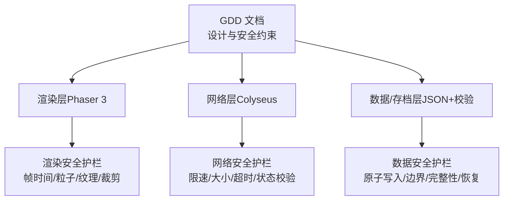
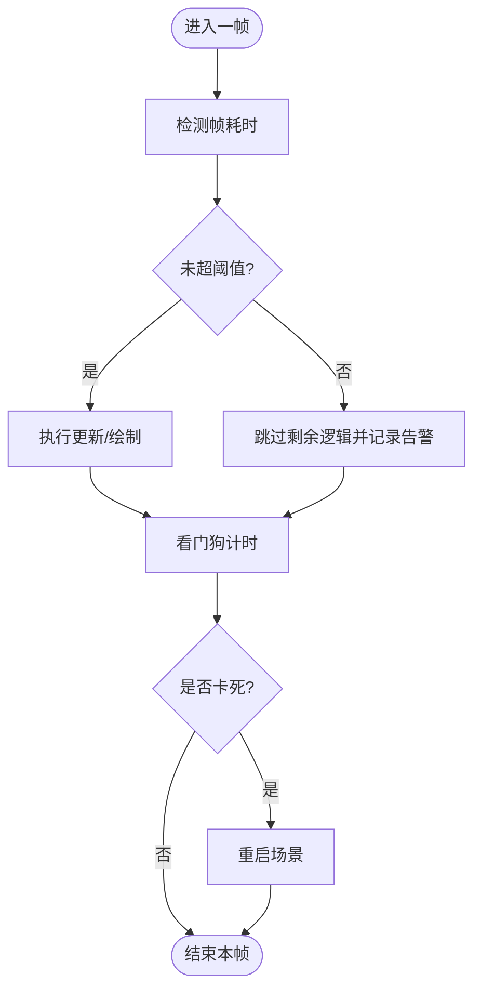
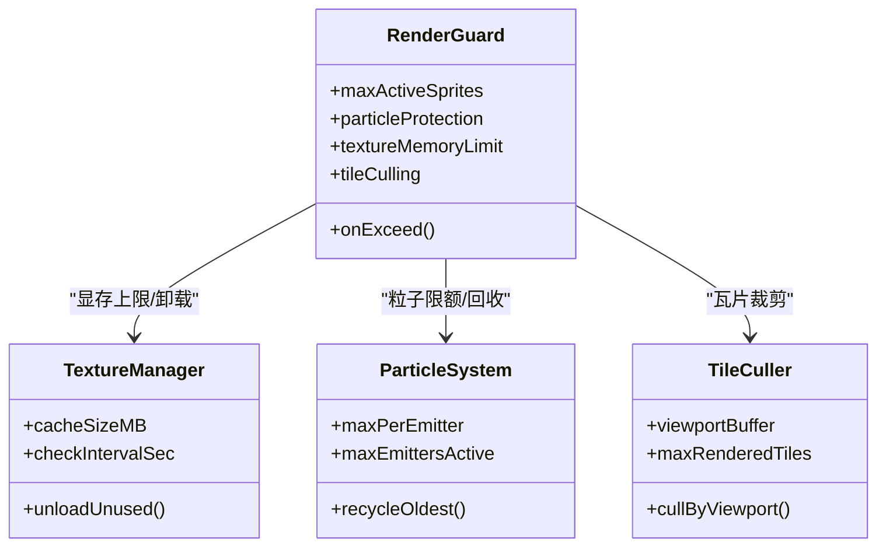
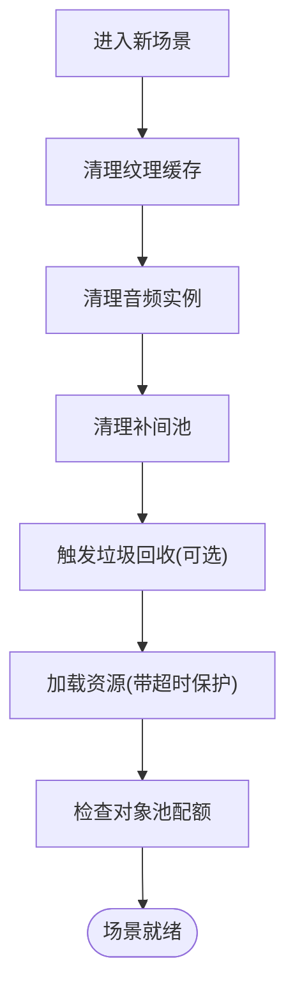
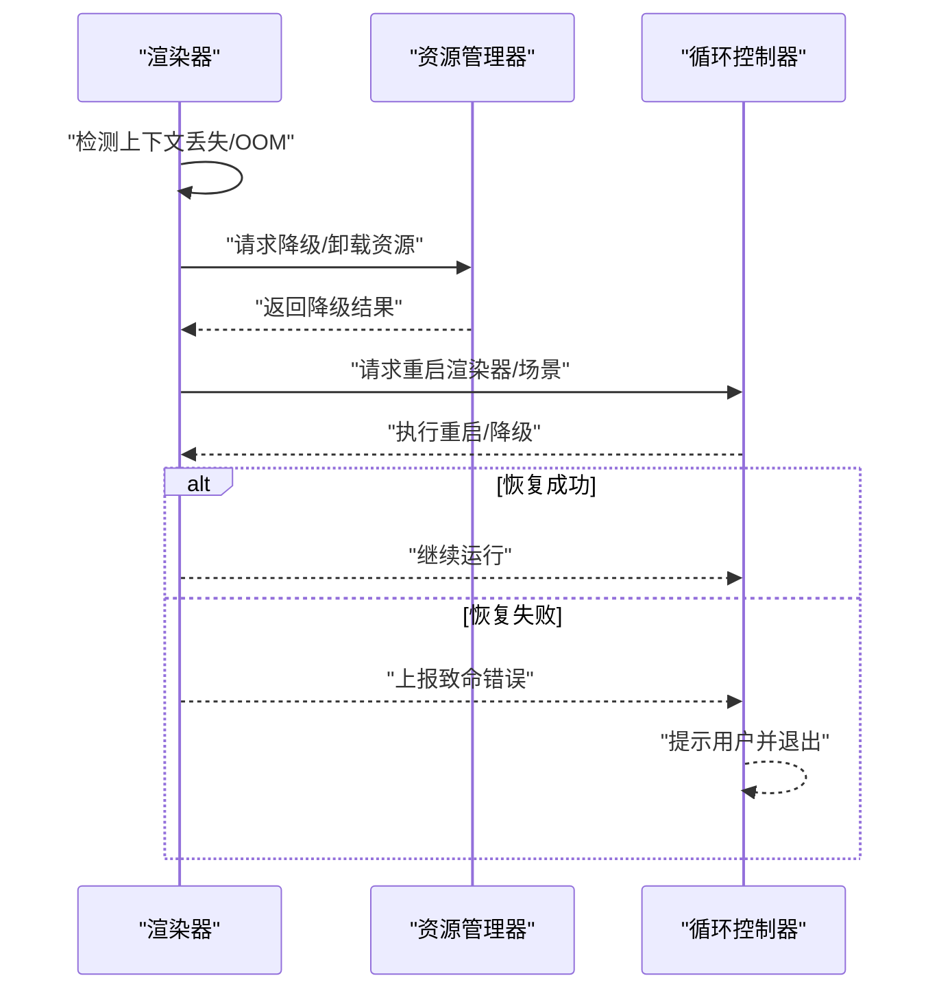
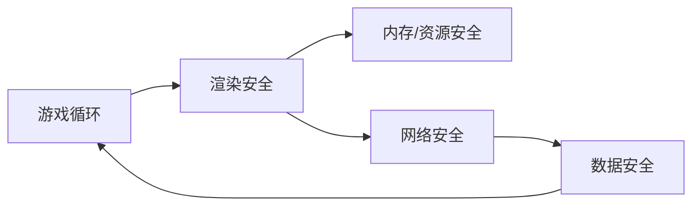

# 渲染安全保护

<cite>
**本文引用的文件**   
- [gdd.md](file://gdd.md)
</cite>

## 目录
1. [引言](#引言)
2. [项目结构](#项目结构)
3. [核心组件](#核心组件)
4. [架构总览](#架构总览)
5. [详细组件分析](#详细组件分析)
6. [依赖关系分析](#依赖关系分析)
7. [性能考量](#性能考量)
8. [故障排查指南](#故障排查指南)
9. [结论](#结论)
10. [附录](#附录)

## 引言
本技术文档聚焦《山野小村》的“渲染安全保护机制”，围绕渲染帧率保护、内存泄漏防护、GPU资源管理、渲染循环异常处理等关键主题，系统化梳理设计目标、配置参数、阈值策略与恢复流程。文档同时给出性能监控指标建议、对象池管理机制、显存上限控制方法，以及面向开发者的优化指南、常见问题排查与调试技巧，帮助团队在保障稳定性的前提下实现稳定的 60fps 体验。

## 项目结构
本项目为游戏设计规范文档驱动型仓库，当前阶段以 GDD 为核心依据，尚未包含可执行代码。因此，本文档将基于规范中的“安全防护机制”章节进行解读与扩展，形成可直接指导工程落地的渲染安全方案。



图表来源
- [gdd.md:1720-1780](file://gdd.md#L1720-L1780)
- [gdd.md:1780-1890](file://gdd.md#L1780-L1890)

章节来源
- [gdd.md:1720-1780](file://gdd.md#L1720-L1780)
- [gdd.md:1780-1890](file://gdd.md#L1780-L1890)

## 核心组件
本节从“渲染安全”视角提炼关键组件与职责：

- 渲染安全护栏
  - 精灵数量限制与剔除
  - 粒子发射器与粒子总量限制
  - 纹理显存上限与自动卸载
  - TileMap 视口裁剪与最大渲染瓦片数
- 游戏循环安全
  - 单帧耗时上限与剩余逻辑跳过
  - 更新迭代次数上限
  - 看门狗定时器与卡顿场景重启
- 内存与资源安全
  - 场景切换清理（纹理缓存、音频实例、补间池）
  - 资源加载超时与回退
  - 对象池规模上限
- 错误恢复流程
  - WebGL 上下文丢失、显存不足时的降级与重入
  - 渲染崩溃后的质量降级与场景重载

章节来源
- [gdd.md:1784-1890](file://gdd.md#L1784-L1890)
- [gdd.md:1916-1945](file://gdd.md#L1916-L1945)

## 架构总览
下图展示渲染安全在整体系统中的位置与交互关系，包括与循环、网络、数据层的联动。

```mermaid
sequenceDiagram
participant Loop as "游戏循环"
participant Render as "渲染子系统"
participant Mem as "内存/资源管理器"
participant Net as "网络子系统"
participant Data as "存档/数据层"
Loop->>Render : "每帧开始带帧时间保护"
Render->>Mem : "查询可用纹理/对象池配额"
Mem-->>Render : "返回配额/触发回收策略"
Render->>Loop : "绘制完成或触发裁剪/降级"
Loop->>Net : "同步必要状态受速率限制"
Net-->>Loop : "确认/丢弃超限消息"
Loop->>Data : "定时检查/保存原子写入+校验"
Data-->>Loop : "成功/失败失败则回退/提示"
```

图表来源
- [gdd.md:1784-1890](file://gdd.md#L1784-L1890)
- [gdd.md:1916-1945](file://gdd.md#L1916-L1945)

## 详细组件分析

### 渲染帧率保护与循环安全
- 单帧耗时上限
  - 当单帧超过阈值时，跳过剩余逻辑并记录告警，避免整局卡顿。
- 更新迭代上限
  - 对批量更新（如大量作物生长、AI 调度）设置迭代上限，超限后中断并记录日志。
- 看门狗定时器
  - 周期性检测主循环是否长时间无响应，必要时重启场景以恢复。



图表来源
- [gdd.md:1784-1806](file://gdd.md#L1784-L1806)

章节来源
- [gdd.md:1784-1806](file://gdd.md#L1784-L1806)

### GPU 资源管理与显存上限控制
- 纹理显存上限
  - 设定全局纹理显存上限，超过时按策略卸载未使用纹理，定期扫描释放。
- 精灵与粒子限制
  - 全局与分层级限制活跃精灵数量；每个发射器粒子数与激活发射器总数受限，超限回收最旧实例。
- TileMap 裁剪
  - 基于视口缓冲裁剪瓦片，限制每帧最大渲染瓦片数，降低 GPU 压力。



图表来源
- [gdd.md:1808-1817](file://gdd.md#L1808-L1817)

章节来源
- [gdd.md:1808-1817](file://gdd.md#L1808-L1817)

### 内存泄漏防护与对象池管理
- 场景切换清理
  - 强制清理纹理缓存、音频实例、补间池，必要时触发垃圾回收。
- 资源加载超时
  - 单个资源加载超时则跳过并记录，防止阻塞启动。
- 对象池上限
  - 限制对象池总数与每池对象数，避免无限增长导致内存泄漏。



图表来源
- [gdd.md:1830-1839](file://gdd.md#L1830-L1839)

章节来源
- [gdd.md:1830-1839](file://gdd.md#L1830-L1839)

### 渲染循环异常处理与恢复
- 异常类型
  - WebGL 上下文丢失、显存不足、渲染崩溃等。
- 恢复策略
  - 尝试重启渲染器、降低画质、重新加载场景；若仍失败，显示错误信息并退出。



图表来源
- [gdd.md:1916-1945](file://gdd.md#L1916-L1945)

章节来源
- [gdd.md:1916-1945](file://gdd.md#L1916-L1945)

### 性能监控指标与阈值建议
- 帧时间
  - 单帧≤100ms（对应≥10fps），但目标为稳定 60fps（~16.7ms）。
- 渲染对象
  - 全局活跃精灵上限、每层上限、每发射器粒子上限、激活发射器上限。
- 显存
  - 纹理显存上限与缓存上限，定期扫描卸载。
- 瓦片渲染
  - 每帧最大渲染瓦片数与视口缓冲。
- 网络与安全
  - 消息速率、包体大小、连接超时、状态校验、作弊预防。

章节来源
- [gdd.md:1773-1780](file://gdd.md#L1773-L1780)
- [gdd.md:1784-1890](file://gdd.md#L1784-L1890)

### 安全配置参数与阈值清单
以下为可直接用于工程配置的参数项（来源于规范定义）：

- 游戏循环
  - 单帧耗时上限、更新迭代上限、看门狗间隔与阈值、卡死动作
- 渲染
  - 全局/分层级精灵上限、粒子上限、纹理显存上限、瓦片裁剪参数
- 内存与资源
  - 场景清理开关、资源加载超时、缓存上限、对象池上限
- 网络
  - 消息速率、包体大小、连接超时、状态校验范围
- 数据
  - 原子写入、备份槽位、数值边界、完整性校验算法、恢复策略

章节来源
- [gdd.md:1784-1890](file://gdd.md#L1784-L1890)

### 常见渲染问题排查与调试技巧
- 帧率骤降
  - 检查单帧耗时是否频繁超限；查看粒子与精灵数量是否突破上限；确认瓦片裁剪是否生效。
- 显存飙升
  - 观察纹理缓存是否达到上限；确认是否有未释放的纹理或重复加载；检查对象池是否失控。
- 卡顿/假死
  - 查看看门狗是否触发；核对更新迭代上限是否被突破；排查网络消息洪泛导致的处理预算耗尽。
- 联机异常
  - 检查速率限制与消息大小限制；验证状态校验是否拒绝非法位移/物品计数；关注主机负载保护。

章节来源
- [gdd.md:1784-1890](file://gdd.md#L1784-L1890)
- [gdd.md:1971-1984](file://gdd.md#L1971-L1984)

## 依赖关系分析
渲染安全与其他子系统存在强耦合关系：

- 与游戏循环：帧时间保护与看门狗直接作用于主循环
- 与资源管理：纹理显存上限、对象池、场景清理共同决定内存占用
- 与网络系统：消息限速与状态校验影响主机负载与客户端流畅度
- 与数据层：原子写入与完整性校验保证存档安全，间接影响渲染稳定性（避免异常数据导致渲染崩溃）



图表来源
- [gdd.md:1784-1890](file://gdd.md#L1784-L1890)

章节来源
- [gdd.md:1784-1890](file://gdd.md#L1784-L1890)

## 性能考量
- 目标帧率
  - PC 与手机均追求 60fps，确保用户体验一致。
- 合理优化原则
  - 优先减少不必要的重绘与对象创建，复用对象池，延迟加载非关键资源。
- 避免过度优化
  - 不要牺牲可读性与可维护性换取微小收益；瓶颈通常在循环与绘制路径。

章节来源
- [gdd.md:1748-1780](file://gdd.md#L1748-L1780)

## 故障排查指南
- 快速定位
  - 开启安全日志通道，关注“安全触发项”的阈值与动作记录。
- 典型场景
  - 存档损坏：通过完整性校验与备份恢复；必要时提示用户选择恢复策略。
  - 网络断开：自动重连与重试窗口；离线模式兜底。
  - 资源加载失败：占位纹理/回退资源；重试一次后放弃。
  - 渲染崩溃：降级画质、重启渲染器、重载场景。
  - 任务状态不一致：自动修复或重置到检查点。
  - 玩家位置异常：传送至出生点或最近安全位置。
  - 时间跳跃异常：回滚到最近有效值或强制睡眠并保存。

章节来源
- [gdd.md:1916-1945](file://gdd.md#L1916-L1945)

## 结论
通过将“渲染安全”纳入七维熔断保护体系，并在循环、渲染、内存、网络、数据等层面设置明确阈值与恢复策略，《山野小村》能够在复杂场景下维持稳定流畅的体验。建议在 P0 原型阶段即落地上述安全框架，结合持续的性能监控与回归测试，确保上线前各项指标达标。

## 附录
- 术语
  - 渲染安全：针对渲染管线与资源使用的保护机制
  - 熔断保护：在检测到异常或越界时主动降级/中止，避免系统崩溃
  - 对象池：预分配对象集合，减少创建/销毁开销
  - 瓦片裁剪：仅渲染视口附近瓦片以降低 GPU 压力

[本节为概念性说明，不直接分析具体文件]