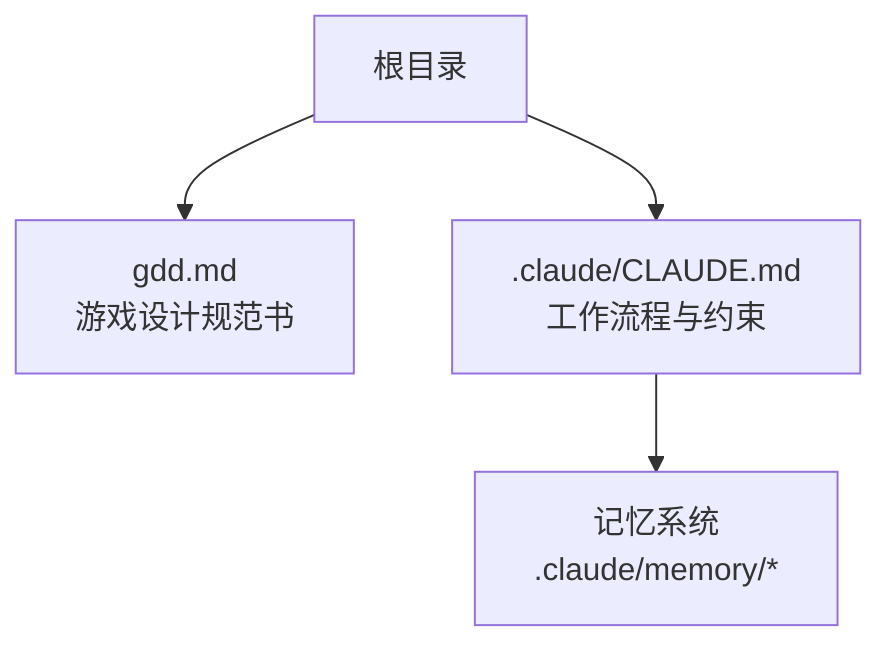
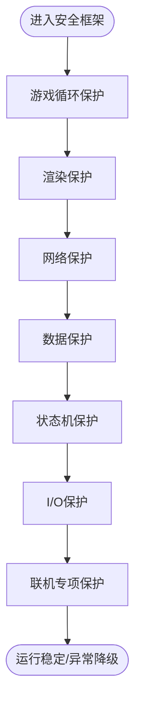
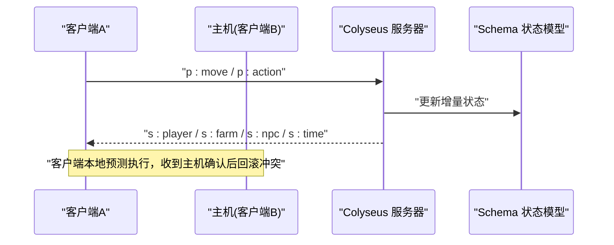
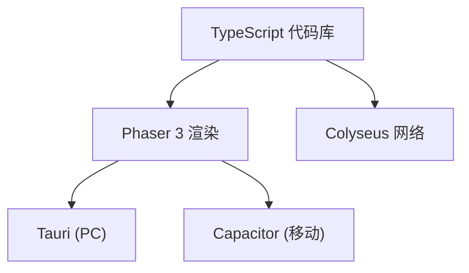
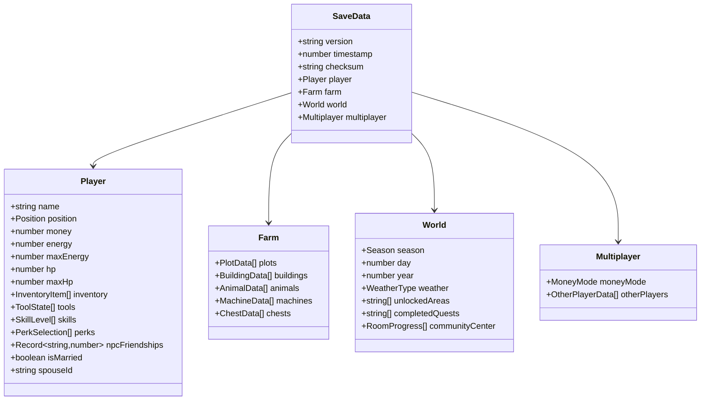
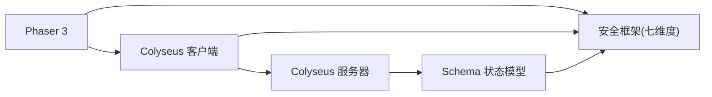
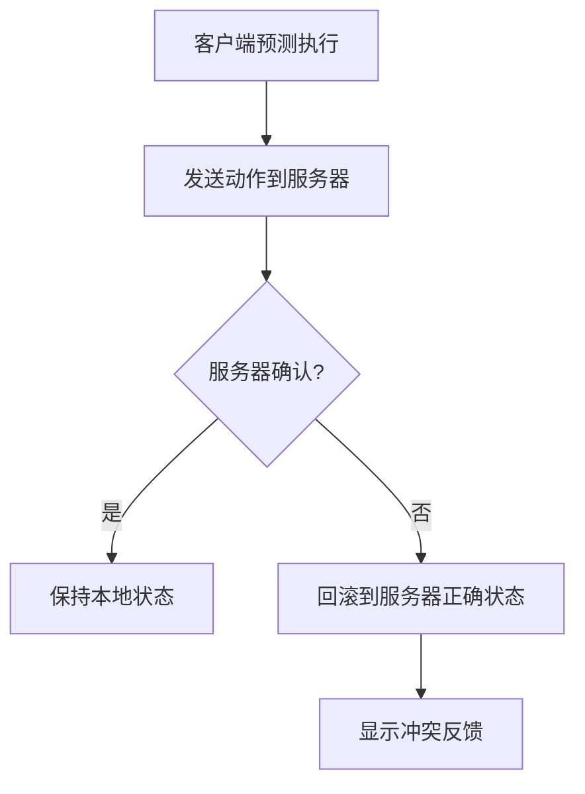

# 技术架构与安全

<cite>
**本文引用的文件**   
- [gdd.md](file://gdd.md)
</cite>

## 目录
1. [引言](#引言)
2. [项目结构](#项目结构)
3. [核心组件](#核心组件)
4. [架构总览](#架构总览)
5. [详细组件分析](#详细组件分析)
6. [依赖关系分析](#依赖关系分析)
7. [性能与内存优化](#性能与内存优化)
8. [安全防护：七维度熔断保护体系](#安全防护七维度熔断保护体系)
9. [联机系统：Listen Server、状态同步与客户端预测](#联机系统listen-server状态同步与客户端预测)
10. [跨平台适配：PC端Tauri与移动端Capacitor](#跨平台适配pc端tauri与移动端capacitor)
11. [存档系统：数据结构、版本兼容与完整性校验](#存档系统数据结构版本兼容与完整性校验)
12. [错误处理与恢复流程](#错误处理与恢复流程)
13. [监控指标与日志诊断](#监控指标与日志诊断)
14. [安全编码指南与故障排查](#安全编码指南与故障排查)
15. [结论](#结论)

## 引言
本技术文档围绕《山野小村》的技术架构与安全防护展开，聚焦以下目标：
- 解释“七维度熔断保护体系”的设计理念、实现机制与安全策略
- 说明 Listen Server 模式的联机架构、状态同步机制与客户端预测
- 描述跨平台适配方案（PC端 Tauri 打包、移动端 Capacitor 适配）
- 解析存档系统的数据结构设计、版本兼容性处理与完整性校验
- 提供性能优化策略、内存管理方案与渲染优化技术
- 给出安全配置示例、错误处理模式与监控指标
- 为开发者提供安全编码指南与故障排查方法

## 项目结构
本项目当前仓库以设计文档为核心，包含游戏设计规范书与开发约束。代码尚未落地，但技术规范、架构决策与防护策略已在规范中明确定义，可直接指导后续工程化实现。



图表来源
- [gdd.md:1-10](file://gdd.md#L1-L10)
- [.claude/CLAUDE.md:1-30](file://.claude/CLAUDE.md#L1-L30)

章节来源
- [gdd.md:1-10](file://gdd.md#L1-L10)
- [.claude/CLAUDE.md:1-30](file://.claude/CLAUDE.md#L1-L30)

## 核心组件
- 渲染引擎：Phaser 3（LTS），负责 TileMap、碰撞、动画等
- 网络框架：Colyseus（含 Schema），用于增量同步与消息类型定义
- 构建工具：Vite 6.x
- 语言：TypeScript 5.x（strict 模式）
- PC 打包：Tauri 2.x（Rust 后端）
- 手机打包：Capacitor 6.x（WebView 包装）
- 音频：Howler.js 2.x
- 测试：Vitest

章节来源
- [gdd.md:1722-1734](file://gdd.md#L1722-L1734)

## 架构总览
整体采用“前端 Phaser + Colyseus 服务端 + Tauri/Capacitor 打包”的混合架构。核心要点：
- 渲染层：Phaser 3 驱动像素风格渲染与交互
- 网络层：Colyseus 提供房间、Schema 自动增量同步、消息类型定义
- 平台层：Tauri 封装 PC 应用；Capacitor 封装移动端 WebView
- 安全层：七维度熔断保护贯穿循环、渲染、网络、数据、状态机、I/O、联机专项

```mermaid
graph TB
subgraph "客户端"
P["Phaser 3 渲染层"]
N["Colyseus 客户端"]
UI["UI/输入/菜单"]
end
subgraph "服务端"
S["Colyseus 服务器"]
SC["Schema 状态模型"]
end
subgraph "平台"
T["Tauri (PC)"]
C["Capacitor (移动)"]
end
P --> UI
P --> N
N < --> S
S --> SC
T --> P
C --> P
```

图表来源
- [gdd.md:1722-1734](file://gdd.md#L1722-L1734)
- [gdd.md:1451-1505](file://gdd.md#L1451-L1505)

## 详细组件分析

### 七维度熔断保护体系
设计理念：将安全防护从业务逻辑中解耦，形成独立、可观测、可回退的安全护栏，覆盖游戏循环、渲染、网络、数据、状态机、I/O、联机七大维度，确保异常不会导致崩溃或数据损坏。

- 游戏循环安全
  - 单帧时间上限、迭代次数上限、看门狗定时器
- 渲染安全
  - 精灵上限、粒子上限、纹理内存上限、瓦片裁剪
- 网络通信安全
  - 速率限制、消息大小限制、连接超时、状态校验
- 内存与资源安全
  - 场景切换清理、资源加载超时、缓存上限、对象池上限
- 存档与数据安全
  - 原子写入、备份、完整性校验、数值边界、恢复策略
- 状态机与逻辑安全
  - 状态转移守卫、NPC日程回退、任务一致性检查、ID 白名单
- 文件系统与 I/O 安全
  - 文件大小限制、扩展名白名单、设置文件校验与回退
- 联机安全专项
  - 最大人数、主机负载保护、消息队列保护、作弊预防



图表来源
- [gdd.md:1780-1888](file://gdd.md#L1780-L1888)

章节来源
- [gdd.md:1780-1888](file://gdd.md#L1780-L1888)

### 联机系统：Listen Server、状态同步与客户端预测
- 架构模式：Listen Server（主机兼玩家），最多 4 人（代码层硬上限 8）
- 同步方式：Colyseus Schema 自动增量同步
- 时间控制：主机掌控，所有玩家同步同一时间
- 平等原则：客户端预测+主机仲裁，消除主机优势
- 消息类型：统一枚举，涵盖玩家操作、状态同步、交互、系统事件



图表来源
- [gdd.md:1451-1505](file://gdd.md#L1451-L1505)
- [gdd.md:1507-1546](file://gdd.md#L1507-L1546)

章节来源
- [gdd.md:1451-1505](file://gdd.md#L1451-L1505)
- [gdd.md:1507-1546](file://gdd.md#L1507-L1546)

### 跨平台适配：PC端 Tauri 与移动端 Capacitor
- PC 端：使用 Tauri 2.x 进行原生打包，结合 Rust 后端能力（如文件访问、系统级权限）
- 移动端：使用 Capacitor 6.x 通过 WebView 包装 Web 应用，适配触屏与设备特性
- 共同点：共享一套 TypeScript 代码，渲染由 Phaser 3 完成，网络由 Colyseus 提供



图表来源
- [gdd.md:1722-1734](file://gdd.md#L1722-L1734)

章节来源
- [gdd.md:1722-1734](file://gdd.md#L1722-L1734)

### 存档系统：数据结构、版本兼容与完整性校验
- 数据结构：SaveData 包含玩家、农场、世界、多人信息
- 版本兼容：version 字段驱动迁移脚本，低版本自动升级填充默认值，高版本拒绝并提示更新
- 完整性校验：JSON + sha256 校验，读取时验证，保存后重算校验和
- 原子写入与备份：先备份再写，支持多槽位恢复



图表来源
- [gdd.md:1606-1650](file://gdd.md#L1606-L1650)

章节来源
- [gdd.md:1595-1676](file://gdd.md#L1595-L1676)

## 依赖关系分析
- 渲染与网络耦合度低：Phaser 仅负责渲染与输入，网络通过 Colyseus 抽象
- 安全框架作为横切关注点：各维度保护独立于业务逻辑，降低耦合
- 平台适配通过打包器隔离：Tauri/Capacitor 不侵入业务代码



图表来源
- [gdd.md:1722-1734](file://gdd.md#L1722-L1734)
- [gdd.md:1780-1888](file://gdd.md#L1780-L1888)

章节来源
- [gdd.md:1722-1734](file://gdd.md#L1722-L1734)
- [gdd.md:1780-1888](file://gdd.md#L1780-L1888)

## 性能与内存优化
- 目标帧率：PC 与移动端均为 60fps
- 加载时间：PC < 3s，移动 < 5s
- 内存占用：PC < 500MB，移动 < 200MB
- 包体大小：< 50MB
- 优化策略：减少重绘、对象池复用、限制粒子/动画数量、延迟加载非关键资源
- 过度优化警示：避免牺牲可读性与正确性

章节来源
- [gdd.md:1748-1779](file://gdd.md#L1748-L1779)

## 安全防护：七维度熔断保护体系
本节对七维度进行细化说明，并提供配置示例与阈值建议。

- 游戏循环安全
  - 单帧时间上限：防止长时间阻塞
  - 迭代次数上限：防止无限循环
  - 看门狗定时器：检测卡顿并重启场景
- 渲染安全
  - 全局/分层精灵上限：防止过多绘制
  - 粒子发射器上限与回收：防止内存暴涨
  - 纹理内存上限与卸载：防止 OOM
  - 瓦片裁剪：只渲染视口附近
- 网络通信安全
  - 速率限制：每秒消息数与字节数限制
  - 消息大小限制：防洪水攻击
  - 连接超时与心跳：断线重连窗口
  - 状态校验：位置、速度、物品计数、金钱变化频率
- 内存与资源安全
  - 场景切换清理：纹理、声音、补间池
  - 资源加载超时：跳过并记录
  - 缓存上限：纹理/音频/数据项
  - 对象池上限：控制总池与每池对象数
- 存档与数据安全
  - 原子写入与备份：避免半写损坏
  - 完整性校验：sha256 校验
  - 数值边界：金钱、体力、HP、好感度、堆叠上限、技能等级
  - 恢复策略：自动恢复、备份槽位、用户提示
- 状态机与逻辑安全
  - 状态转移守卫：非法转移回滚并记录
  - NPC 日程回退：找不到日程时使用默认位置
  - 任务一致性检查：加载时修复不一致
  - ID 白名单：未知 ID 拒绝并记录
- 文件系统与 I/O 安全
  - 文件大小限制与扩展名白名单
  - 设置文件校验与回退
- 联机安全专项
  - 最大人数与带宽限制
  - 主机负载保护：降频同步、断开最晚加入者
  - 消息队列保护：丢弃最旧消息
  - 作弊预防：动作验证与可疑阈值

章节来源
- [gdd.md:1780-1888](file://gdd.md#L1780-L1888)

## 联机系统：Listen Server、状态同步与客户端预测
- 监听服务器模式：主机同时扮演玩家，简化部署与状态权威
- 同步规则：
  - 玩家位置：增量同步，10Hz
  - 地块状态：事件触发
  - 物品/金钱：可靠传输
  - NPC 位置：增量同步，2Hz
  - 时间：广播，1Hz
  - 聊天：可靠传输
- 客户端预测：
  - 本地立即应用动作
  - 收到主机结果后回滚冲突
  - 其他玩家移动插值平滑



图表来源
- [gdd.md:1507-1546](file://gdd.md#L1507-L1546)

章节来源
- [gdd.md:1451-1505](file://gdd.md#L1451-L1505)
- [gdd.md:1507-1546](file://gdd.md#L1507-L1546)

## 跨平台适配：PC端 Tauri 与移动端 Capacitor
- Tauri（PC）
  - 利用 Rust 后端增强系统能力（文件访问、原生对话框等）
  - 包体显著减小，启动更快
- Capacitor（移动）
  - WebView 包装，适配触屏手势与设备 API
  - 与 Web 代码高度复用，降低维护成本

章节来源
- [gdd.md:1722-1734](file://gdd.md#L1722-L1734)

## 存档系统：数据结构、版本兼容与完整性校验
- 数据结构：SaveData 组织玩家、农场、世界、多人信息
- 版本兼容：
  - 读取 version 字段
  - 逐版本应用迁移函数（每个函数独立、可测试）
  - 迁移完成后重新计算 checksum
  - 写入新版本存档并保留原版备份
- 完整性校验：
  - JSON + sha256 校验
  - 读取时验证，失败则提示恢复备份
  - 自动覆盖前先备份

章节来源
- [gdd.md:1595-1676](file://gdd.md#L1595-L1676)

## 错误处理与恢复流程
- 存档异常：检测到损坏→恢复备份→创建新档→提示用户
- 网络异常：超时/心跳丢失/连接被拒→自动重连→重试→离线模式
- 资源加载异常：超时/HTTP 404/解码错误→跳过占位→重试一次→使用回退纹理
- 渲染异常：WebGL 上下文丢失/内存不足→重启渲染器→降低质量→重载场景
- 任务状态异常：目标计数不匹配/前置缺失/完成标记缺失→自动修复→重置到检查点→标记失败
- 玩家位置异常：越界/碰撞内/低于地面→传送出生点/最后安全点/推出墙体
- 时间系统异常：时间倒退/跳跃超过1小时/跳过一天→回退到最近有效值/钳制到有效范围→强制睡觉并保存

章节来源
- [gdd.md:1890-1945](file://gdd.md#L1890-L1945)

## 监控指标与日志诊断
- 日志级别：debug、info、warn、error、fatal
- 日志通道：玩法、网络、安全（默认开启）、性能、存档
- 日志轮转：最大文件数与大小限制
- 安全日志条目：时间戳、保护器ID、触发值、阈值、动作、系统状态

章节来源
- [gdd.md:1947-1969](file://gdd.md#L1947-L1969)

## 安全编码指南与故障排查
- 安全编码指南
  - 全栈 TypeScript，禁止 any，显式类型声明
  - 命名规范：camelCase（变量/函数），PascalCase（类/接口/类型）
  - 文件命名：kebab-case.ts
  - 单文件行数 ≤ 300，单函数行数 ≤ 50
  - 中文注释，JSDoc 规范
- 故障排查方法
  - 定位安全触发点：查看安全日志中的 safeguardId 与 triggeredValue
  - 核对阈值：对比 thresholdValue 与 action
  - 复现场景：根据 systemState 还原环境
  - 回退策略：优先使用备份与自动恢复
  - 网络问题：检查 rateLimit、messageSizeLimit、stateValidation 配置
  - 渲染问题：检查 maxActiveSprites、particleProtection、textureMemoryLimit
  - 存档问题：检查 integrityCheck、valueBounds、recovery

章节来源
- [gdd.md:1735-1746](file://gdd.md#L1735-L1746)
- [gdd.md:1947-1969](file://gdd.md#L1947-L1969)

## 结论
《山野小村》在架构设计上强调“质量与防护并重”，通过七维度熔断保护体系保障稳定性与安全性；联机采用 Listen Server 模式配合客户端预测与主机仲裁，确保公平一致的体验；跨平台通过 Tauri 与 Capacitor 实现高效打包与适配；存档系统具备完善的版本兼容与完整性校验。建议在后续工程中严格遵循上述规范，持续完善安全护栏与监控诊断能力，确保产品高质量交付。