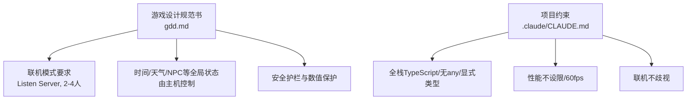
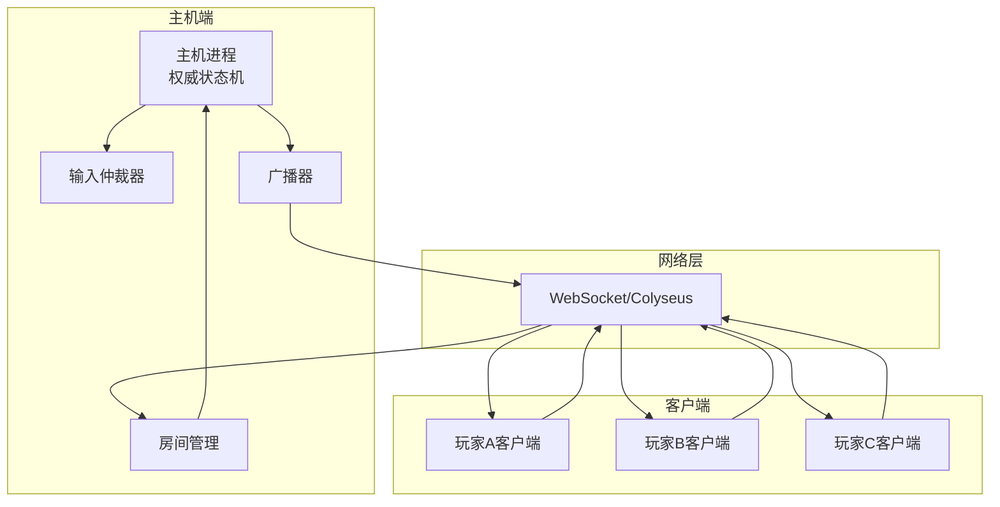
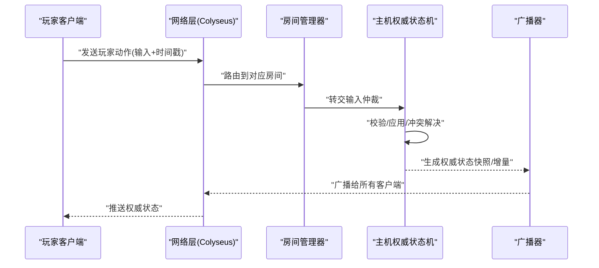
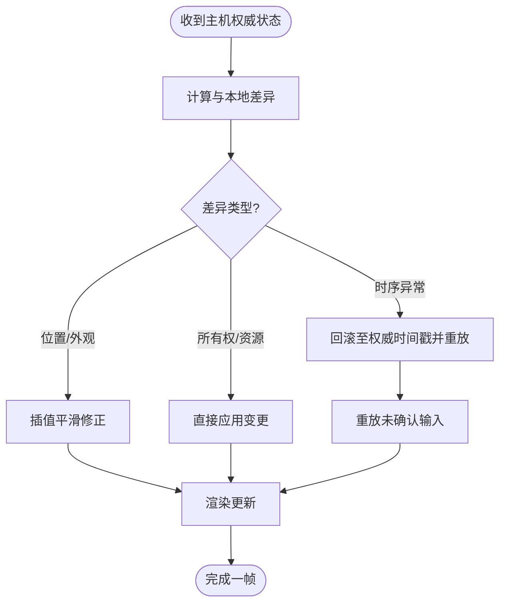
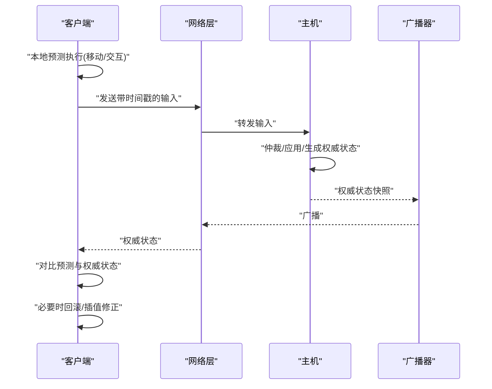
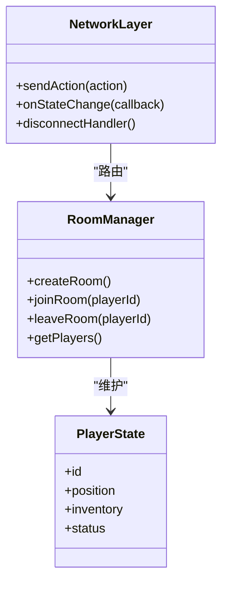
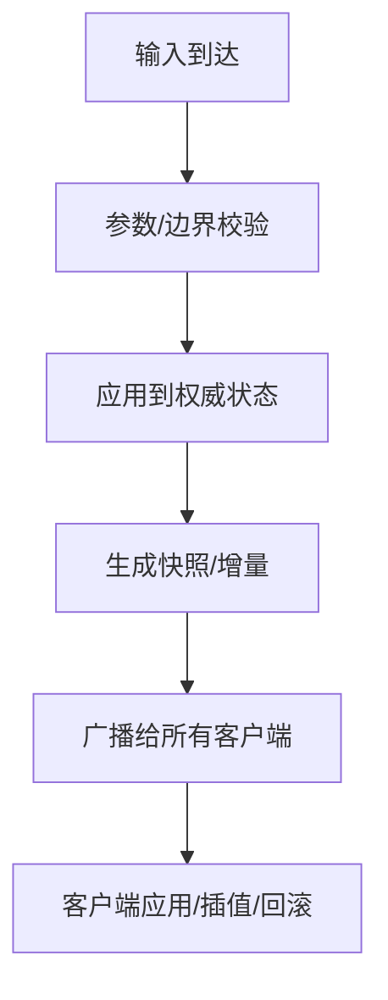
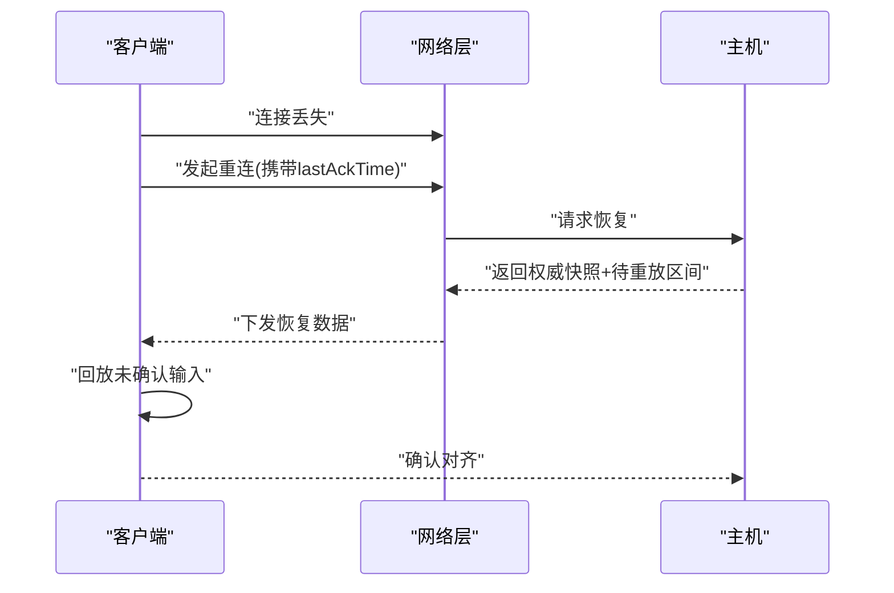
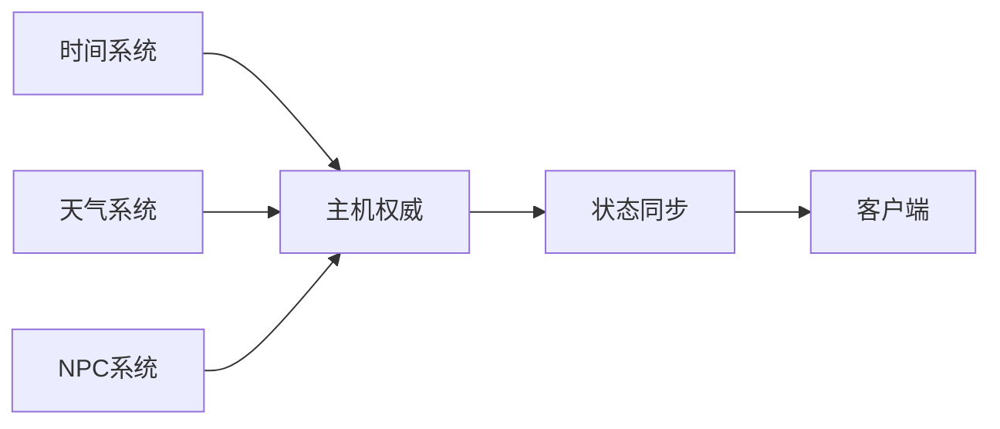

# 联机系统架构

<cite>
**本文引用的文件**   
- [gdd.md](file://gdd.md)
- [CLAUDE.md](file://.claude/CLAUDE.md)
</cite>

## 目录
1. [引言](#引言)
2. [项目结构](#项目结构)
3. [核心组件](#核心组件)
4. [架构总览](#架构总览)
5. [详细组件分析](#详细组件分析)
6. [依赖分析](#依赖分析)
7. [性能考虑](#性能考虑)
8. [故障排查指南](#故障排查指南)
9. [结论](#结论)
10. [附录](#附录)

## 引言
本文件为《山野小村》Listen Server（主机兼玩家）模式的联机系统技术架构文档。目标包括：
- 解释主机兼玩家的网络拓扑、状态同步与客户端预测实现思路
- 说明Colyseus框架集成方式、房间管理与玩家连接处理
- 描述游戏状态网络传输协议、数据压缩策略与延迟补偿算法
- 定义网络消息类型、事件同步机制与断线重连流程
- 提供带宽控制、性能优化技巧与调试方法

本项目采用全栈TypeScript，强调“联机不歧视”，确保主机与客户端体验一致。

**章节来源**
- [CLAUDE.md:8-17](file://.claude/CLAUDE.md#L8-L17)

## 项目结构
当前仓库包含设计规范书与项目约束说明，尚未包含具体代码实现。因此本节聚焦于设计文档中已明确的联机相关要点，并据此构建后续架构蓝图。

**图表来源**
- [gdd.md:73](file://gdd.md#L73)
- [gdd.md:191](file://gdd.md#L191)
- [gdd.md:371](file://gdd.md#L371)
- [gdd.md:610](file://gdd.md#L610)
- [CLAUDE.md:12-17](file://.claude/CLAUDE.md#L12-L17)

**章节来源**
- [gdd.md:73](file://gdd.md#L73)
- [gdd.md:191](file://gdd.md#L191)
- [gdd.md:371](file://gdd.md#L371)
- [gdd.md:610](file://gdd.md#L610)
- [CLAUDE.md:12-17](file://.claude/CLAUDE.md#L12-L17)

## 核心组件
基于规范书，可抽象出以下关键组件与职责：
- 主机（Listen Server）
  - 权威状态机：时间、天气、NPC日程、地图对象、经济与安全校验
  - 输入仲裁：接收所有玩家动作，进行合法性校验与冲突解决
  - 广播器：将确定性快照或增量更新下发给所有客户端
- 客户端（含主机上的本地玩家）
  - 输入采集与本地预测：对移动、交互等高频操作做本地即时反馈
  - 状态插值与回滚：根据主机权威状态修正本地表现，平滑过渡
  - 重连与恢复：拉取最近权威快照，回放未确认的本地动作

上述职责在规范书中得到原则性支撑：主机控制时间与全局事件；NPC位置由主机同步；联机不歧视原则保障公平性。

**章节来源**
- [gdd.md:191](file://gdd.md#L191)
- [gdd.md:371](file://gdd.md#L371)
- [gdd.md:610](file://gdd.md#L610)
- [CLAUDE.md:17](file://.claude/CLAUDE.md#L17)

## 架构总览
下图展示Listen Server模式下各模块的职责与交互关系。该图为概念图，用于帮助理解整体流程。

[此图为概念示意，无需图表来源]

## 详细组件分析

### 网络拓扑与角色分工
- 主机负责权威逻辑与最终裁决，客户端仅负责输入上报与渲染呈现
- 主机同时作为一名玩家参与游戏，遵循相同的输入与判定规则，避免“主机优势”
- 房间容量限制为2-4人，符合农场社交规模

[此图为概念示意，无需图表来源]

**章节来源**
- [gdd.md:73](file://gdd.md#L73)
- [CLAUDE.md:17](file://.claude/CLAUDE.md#L17)

### 状态同步机制
- 权威源：主机维护完整世界状态（时间、天气、NPC、地图对象、经济等）
- 同步粒度：
  - 低频全局：时间、天气、区域切换（按帧或秒级）
  - 中频实体：NPC位置/行为、环境对象变化（如作物生长进度）
  - 高频局部：玩家移动、交互结果（通过客户端预测+主机校正）
- 一致性保证：主机对所有输入进行仲裁，客户端以权威状态为准进行修正

[此图为概念示意，无需图表来源]

**章节来源**
- [gdd.md:191](file://gdd.md#L191)
- [gdd.md:371](file://gdd.md#L371)
- [gdd.md:610](file://gdd.md#L610)

### 客户端预测与延迟补偿
- 预测范围：移动、工具使用、交互等高频低影响操作
- 补偿策略：
  - 输入时间戳：客户端附带输入时间，主机按序执行
  - 乐观执行：客户端立即应用本地效果，若与主机不一致则平滑回滚
  - 抖动缓冲：对网络抖动进行滤波，避免频繁抖动导致的视觉跳变
- 公平性：主机仲裁确保所有玩家体验一致，避免“主机优先”

[此图为概念示意，无需图表来源]

**章节来源**
- [CLAUDE.md:17](file://.claude/CLAUDE.md#L17)

### Colyseus集成与房间管理
- 集成点：
  - WebSocket通道：使用Colyseus提供的房间生命周期钩子
  - 房间实例：每个房间代表一次联机会话，承载玩家集合与共享状态
- 房间管理：
  - 创建/加入/离开：监听连接事件，分配玩家ID，维护玩家列表
  - 权限与能力：区分主机与玩家，限制某些写权限仅主机拥有
  - 容量控制：限制2-4人，超出拒绝加入
- 状态订阅：客户端订阅房间状态变化，增量更新UI与场景

[此图为概念示意，无需图表来源]

**章节来源**
- [gdd.md:73](file://gdd.md#L73)

### 网络消息类型与事件同步
- 消息分类：
  - 输入类：玩家动作（移动、交互、使用物品），携带时间戳与序列号
  - 状态类：权威状态快照或增量（位置、属性、库存、环境）
  - 事件类：全局事件（天气变化、时间推进、NPC日程变更）
  - 控制类：房间管理（加入/离开/踢出）、重连握手
- 事件同步：
  - 主机驱动：所有全局事件由主机触发并广播
  - 客户端消费：按时间戳排序，合并重复事件，去抖合并相近状态

[此图为概念示意，无需图表来源]

**章节来源**
- [gdd.md:191](file://gdd.md#L191)
- [gdd.md:371](file://gdd.md#L371)
- [gdd.md:610](file://gdd.md#L610)

### 断线重连与恢复
- 断开检测：心跳超时或连接关闭事件
- 重连流程：
  - 客户端尝试重连，携带最后已知权威时间戳
  - 主机返回最近权威快照及待重放输入区间
  - 客户端回放未确认输入，逐步对齐权威状态
- 失败处理：超过阈值则强制重新加入房间

[此图为概念示意，无需图表来源]

**章节来源**
- [gdd.md:191](file://gdd.md#L191)

### 数据压缩与带宽控制
- 压缩策略：
  - 差分编码：仅传输变化字段（位置差值、属性增量）
  - 量化与舍入：对浮点坐标进行合理量化，减少字节数
  - 批量打包：将多实体状态合并为批次，降低包数量
- 带宽控制：
  - 自适应频率：根据RTT动态调整广播间隔
  - 优先级队列：高优先级（玩家输入/关键事件）优先发送
  - 丢包容忍：允许少量非关键状态丢失，依靠插值平滑

[本节为通用指导，无需章节来源]

### 延迟补偿算法
- 输入排序：按时间戳排序，避免乱序导致的状态漂移
- 回滚窗口：保留最近若干权威快照，支持快速回滚
- 平滑修正：对位置/动画使用插值，避免突兀跳变
- 防抖与节流：对高频输入进行聚合，降低网络压力

[本节为通用指导，无需章节来源]

## 依赖分析
从设计文档可见的关键依赖关系如下：
- 主机权威依赖时间系统与天气系统，二者共同决定NPC行为与环境变化
- NPC日程与位置由主机同步，客户端仅消费
- 联机不歧视原则贯穿所有子系统，确保公平性

**图表来源**
- [gdd.md:191](file://gdd.md#L191)
- [gdd.md:371](file://gdd.md#L371)
- [gdd.md:610](file://gdd.md#L610)

**章节来源**
- [gdd.md:191](file://gdd.md#L191)
- [gdd.md:371](file://gdd.md#L371)
- [gdd.md:610](file://gdd.md#L610)

## 性能考虑
- 渲染与网络解耦：保持60fps渲染，网络层异步处理
- 批处理与合并：将多个实体状态合并发送，减少包数量
- 预测与插值：减少感知延迟，提升流畅度
- 安全护栏：数值边界检查、熔断保护，防止异常导致过载

[本节为通用指导，无需章节来源]

## 故障排查指南
- 常见问题定位：
  - 状态不同步：检查主机权威状态与客户端插值逻辑
  - 输入乱序：核对时间戳与排序策略
  - 重连失败：确认恢复快照与待重放区间是否完整
- 调试建议：
  - 记录权威时间戳与客户端本地时间，绘制延迟曲线
  - 输出关键事件日志（天气、时间推进、NPC行为）
  - 模拟高延迟/丢包，验证鲁棒性

[本节为通用指导，无需章节来源]

## 结论
本架构以主机权威为核心，结合客户端预测与延迟补偿，确保2-4人Listen Server模式下的稳定与公平。通过差分压缩、自适应频率与优先级队列，兼顾性能与带宽。未来可在Colyseus集成层细化房间生命周期与状态订阅，完善断线重连与调试工具链。

[本节为总结，无需章节来源]

## 附录
- 参考规范：
  - 联机模式与人数限制
  - 主机控制时间与全局事件
  - NPC同步与天气同步
  - 项目约束（全栈TS、无any、显式类型、60fps、联机不歧视）

**章节来源**
- [gdd.md:73](file://gdd.md#L73)
- [gdd.md:191](file://gdd.md#L191)
- [gdd.md:371](file://gdd.md#L371)
- [gdd.md:610](file://gdd.md#L610)
- [CLAUDE.md:12-17](file://.claude/CLAUDE.md#L12-L17)