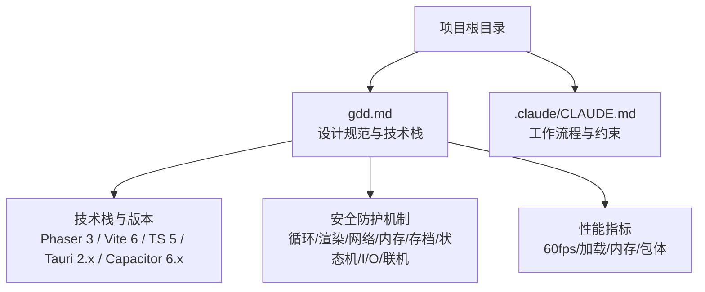
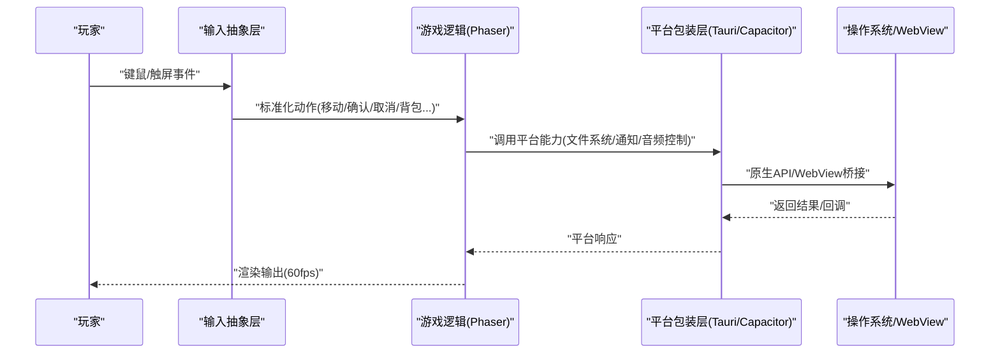
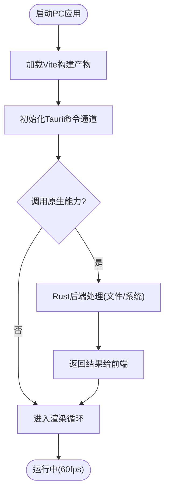
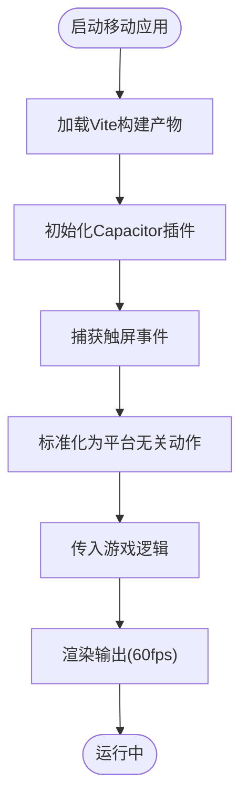
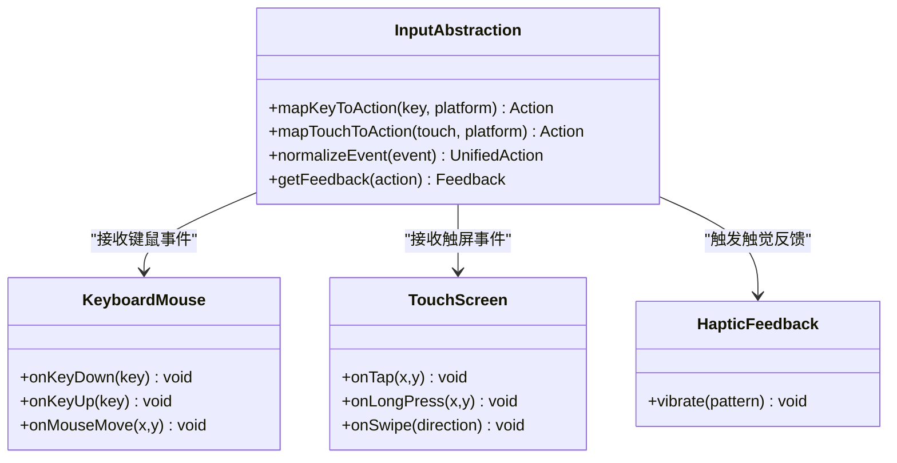
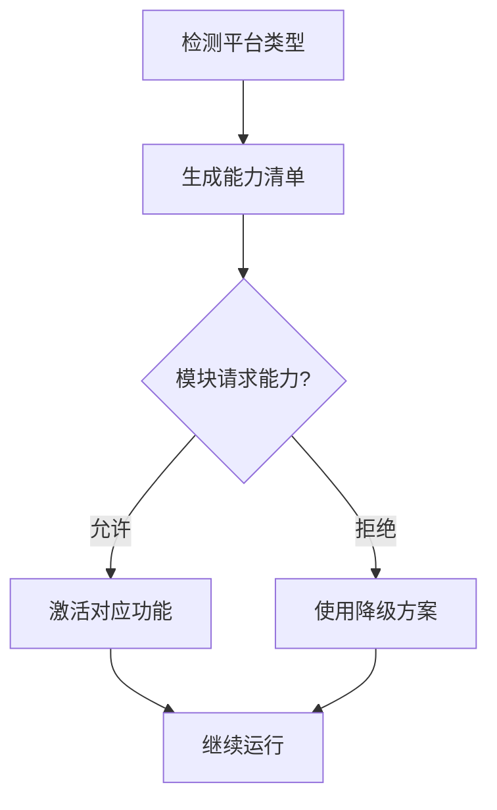
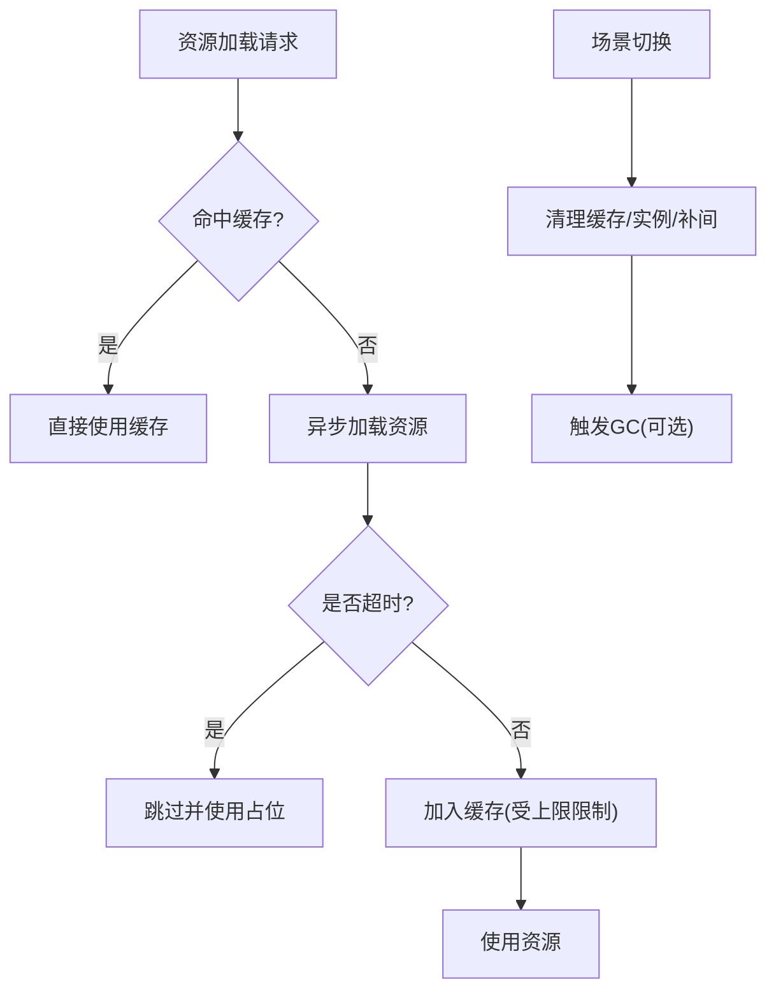
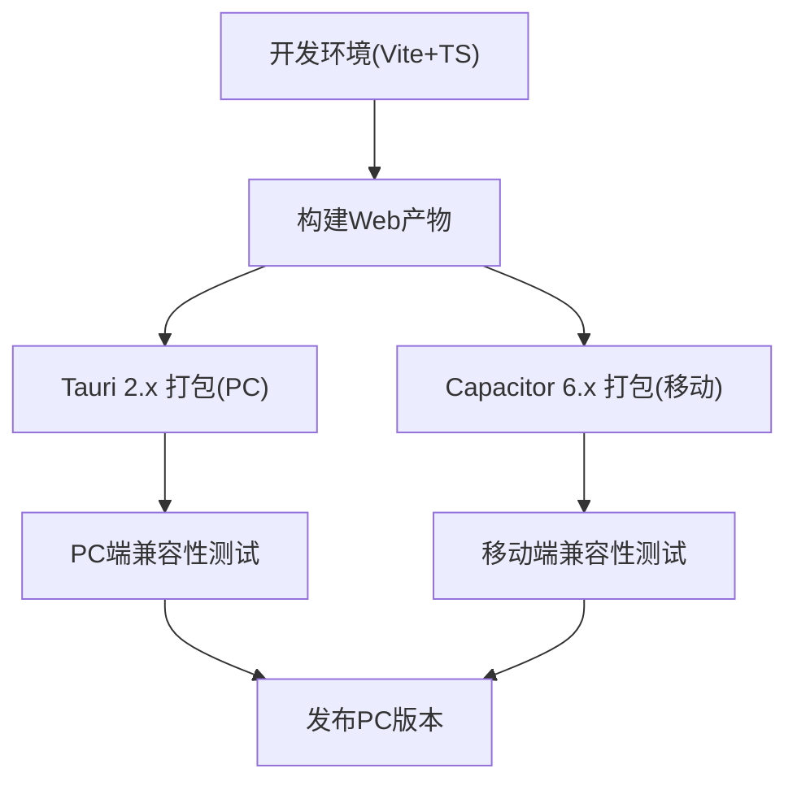
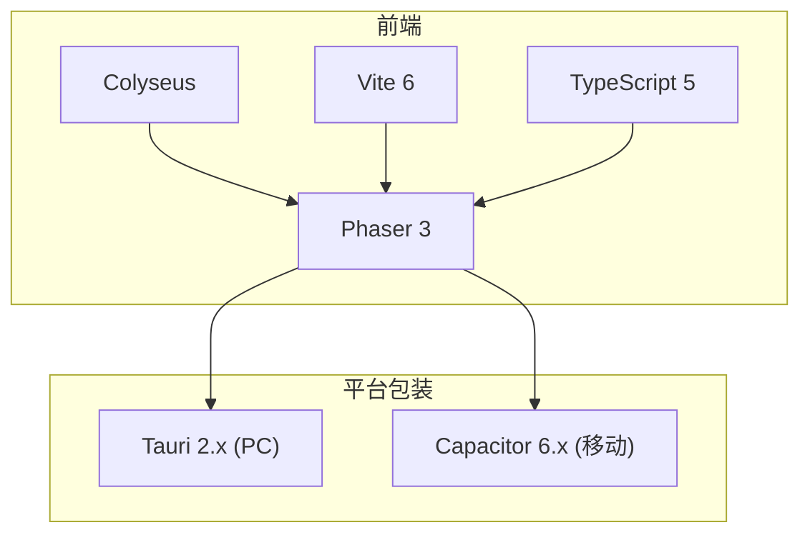

# 跨平台适配方案

<cite>
**本文引用的文件**   
- [gdd.md](file://gdd.md)
- [CLAUDE.md](file://.claude/CLAUDE.md)
</cite>

## 目录
1. [引言](#引言)
2. [项目结构](#项目结构)
3. [核心组件](#核心组件)
4. [架构总览](#架构总览)
5. [详细组件分析](#详细组件分析)
6. [依赖分析](#依赖分析)
7. [性能考虑](#性能考虑)
8. [故障排查指南](#故障排查指南)
9. [结论](#结论)
10. [附录](#附录)

## 引言
本技术文档围绕《山野小村》的跨平台适配方案，聚焦以下目标：
- PC端（Tauri 2.x）打包配置、原生API集成与性能优化策略
- 移动端（Capacitor 6.x）适配策略、触摸输入处理与屏幕适配方案
- 输入系统抽象层设计，统一键鼠与触屏交互逻辑
- 平台特定功能开关、资源加载优化与内存管理策略
- 跨平台构建流程、部署配置与兼容性测试方法

本项目采用全栈 TypeScript，渲染引擎为 Phaser 3，网络框架为 Colyseus，PC 打包使用 Tauri 2.x，手机打包使用 Capacitor 6.x。以上技术选型与约束在项目规范中明确定义，并作为后续实现与验证的依据。

**章节来源**
- [gdd.md:1722-1734](file://gdd.md#L1722-L1734)
- [CLAUDE.md:1-30](file://.claude/CLAUDE.md#L1-L30)

## 项目结构
仓库当前以设计规范为主，包含游戏设计文档与开发工作流说明。关键要点：
- 技术规范与版本要求集中在“技术栈”章节，明确了 Tauri 2.x 与 Capacitor 6.x 的使用范围
- 安全与防护机制贯穿各子系统，包括循环、渲染、网络、内存、存档等维度
- 性能指标在全平台统一为 60fps，并对加载时间、内存占用与包体大小给出上限

**图表来源**
- [gdd.md:1722-1734](file://gdd.md#L1722-L1734)
- [gdd.md:1748-1779](file://gdd.md#L1748-L1779)
- [gdd.md:1780-1888](file://gdd.md#L1780-L1888)

**章节来源**
- [gdd.md:1722-1734](file://gdd.md#L1722-L1734)
- [gdd.md:1748-1779](file://gdd.md#L1748-L1779)
- [gdd.md:1780-1888](file://gdd.md#L1780-L1888)
- [CLAUDE.md:1-30](file://.claude/CLAUDE.md#L1-L30)

## 核心组件
面向跨平台适配的核心组件包括：
- 平台包装层：Tauri 2.x（PC）、Capacitor 6.x（移动）
- 输入抽象层：统一键鼠与触屏事件到平台无关动作
- 资源与内存管理器：按平台特性进行加载、缓存与回收
- 安全护栏：覆盖循环、渲染、网络、数据、I/O、状态机等

这些组件在 GDD 的技术栈与安全机制中有明确定义，并在后续章节展开具体实现建议与流程图示。

**章节来源**
- [gdd.md:1722-1734](file://gdd.md#L1722-L1734)
- [gdd.md:1780-1888](file://gdd.md#L1780-L1888)

## 架构总览
下图展示从用户输入到渲染输出的跨平台路径，以及平台包装层与输入抽象层的职责边界。

[此图为概念性流程示意，不直接映射具体源码文件]

## 详细组件分析

### 平台包装层：Tauri 2.x（PC端）
- 打包与分发
  - 使用 Tauri 2.x 将 Web 应用封装为桌面可执行文件，显著降低包体体积
  - 通过 Rust 后端暴露原生能力（如文件系统访问、窗口管理、系统托盘等）
- 原生API集成
  - 前端通过 Tauri 命令通道调用 Rust 侧能力，用于存档读写、设置持久化、系统通知等
  - 结合 GDD 的安全防护，对 I/O 操作进行白名单扩展名校验、文件大小限制与异常回退
- 性能优化
  - 利用 Tauri 轻量运行时优势，减少内存占用与启动开销
  - 结合渲染裁剪与对象池复用，确保 PC 端稳定 60fps

**图表来源**
- [gdd.md:1722-1734](file://gdd.md#L1722-L1734)
- [gdd.md:1870-1877](file://gdd.md#L1870-L1877)

**章节来源**
- [gdd.md:1722-1734](file://gdd.md#L1722-L1734)
- [gdd.md:1870-1877](file://gdd.md#L1870-L1877)

### 平台包装层：Capacitor 6.x（移动端）
- WebView包装与插件生态
  - 使用 Capacitor 6.x 将 Web 应用打包为 Android/iOS 应用，通过插件访问设备能力（震动、通知、存储等）
- 触摸输入与手势
  - 将多点触控、长按、滑动等事件转换为标准动作，交由输入抽象层处理
- 屏幕适配
  - 根据设备像素比与视口尺寸动态调整 UI 布局与 HUD 缩放，保证在不同分辨率下的一致体验

**图表来源**
- [gdd.md:1722-1734](file://gdd.md#L1722-L1734)

**章节来源**
- [gdd.md:1722-1734](file://gdd.md#L1722-L1734)

### 输入系统抽象层：键鼠与触屏的统一交互
- 抽象原则
  - 将不同平台的输入事件映射为统一的“动作”语义（移动、确认、取消、背包、地图、工具使用、切换工具、奔跑、菜单）
  - 支持手柄扩展，保持未来兼容
- 交互反馈
  - 视觉反馈（高亮、粒子、动画）与触觉反馈（手机端震动）保持一致
- 可及性与本地化
  - 支持键位重映射与文字大小缩放，提升可访问性

**图表来源**
- [gdd.md:1347-1375](file://gdd.md#L1347-L1375)
- [gdd.md:1989-2001](file://gdd.md#L1989-L2001)

**章节来源**
- [gdd.md:1347-1375](file://gdd.md#L1347-L1375)
- [gdd.md:1989-2001](file://gdd.md#L1989-L2001)

### 平台特定功能开关
- 基于平台检测启用或禁用特定能力
  - PC端：文件系统直写、系统托盘、全屏模式
  - 移动端：震动反馈、通知、后台播放控制
- 开关策略
  - 在应用启动时读取平台信息，生成能力清单
  - 业务模块按需订阅能力清单，避免硬编码平台判断

[此图为概念性流程示意，不直接映射具体源码文件]

### 资源加载优化与内存管理策略
- 资源加载
  - 延迟加载非关键资源，设置单资源加载超时，失败时使用占位纹理
  - 纹理与音频缓存上限受控，避免移动端内存溢出
- 内存管理
  - 场景切换时清理纹理缓存、声音实例与补间池，必要时触发垃圾回收
  - 对象池上限与数量限制，防止过度创建导致 GC 抖动
- 渲染安全
  - 全局与分层精灵上限、粒子发射器上限、瓦片裁剪与视口缓冲

**图表来源**
- [gdd.md:1830-1839](file://gdd.md#L1830-L1839)
- [gdd.md:1808-1817](file://gdd.md#L1808-L1817)

**章节来源**
- [gdd.md:1830-1839](file://gdd.md#L1830-L1839)
- [gdd.md:1808-1817](file://gdd.md#L1808-L1817)

### 跨平台构建流程与部署配置
- 构建流程
  - 使用 Vite 6 构建 Web 产物，分别通过 Tauri 2.x 与 Capacitor 6.x 打包为 PC 与移动应用
- 部署配置
  - PC端：生成安装包或便携版，附带 Rust 运行时
  - 移动端：生成 APK/IPA，上架前完成签名与权限配置
- 兼容性测试
  - 多分辨率与 DPI 测试、触摸手势覆盖、键鼠重映射验证
  - 性能基准：60fps 稳定性、加载时间与内存占用达标

[此图为概念性流程示意，不直接映射具体源码文件]

### 兼容性测试方法与验收标准
- 验收指标
  - 内容数量：作物≥28、NPC≥14、鱼类≥20、食谱≥30
  - 平台能力：PC构建与移动端构建均通过
  - 系统整合：闭环检查通过
  - 安全护栏：循环保护、渲染裁剪、网络限速、存档完整性、状态验证、内存守护全部启用
  - 帧率：PC与移动端均≥60fps
- 测试用例
  - 输入：键鼠与触屏一致行为；长按连续动作；虚拟摇杆与点击
  - 资源：大地图加载、大量作物渲染、音频并发上限
  - 网络：消息速率限制、连接超时与重连、主机仲裁一致性
  - 存档：损坏恢复、备份还原、版本迁移

**章节来源**
- [gdd.md:2033-2060](file://gdd.md#L2033-L2060)
- [gdd.md:1780-1888](file://gdd.md#L1780-L1888)

## 依赖分析
- 外部依赖
  - Phaser 3：渲染与 TileMap 生态
  - Colyseus：网络同步与 Schema
  - Vite 6：构建工具
  - Tauri 2.x：PC 打包与原生桥接
  - Capacitor 6.x：移动端包装与插件
- 内部耦合
  - 输入抽象层与游戏逻辑解耦，便于平台扩展
  - 平台包装层仅暴露必要能力，业务模块通过能力清单订阅
  - 安全护栏独立于业务逻辑，避免引入新的崩溃点

**图表来源**
- [gdd.md:1722-1734](file://gdd.md#L1722-L1734)

**章节来源**
- [gdd.md:1722-1734](file://gdd.md#L1722-L1734)

## 性能考虑
- 目标帧率：全平台 60fps
- 加载时间：PC < 3s，移动 < 5s
- 内存占用：PC < 500MB，移动 < 200MB
- 包体大小：< 50MB
- 优化策略
  - 合理对象池与纹理缓存上限
  - 延迟加载非关键资源
  - 渲染裁剪与瓦片视口缓冲
  - 音频实例上限与自动回收

**章节来源**
- [gdd.md:1748-1779](file://gdd.md#L1748-L1779)
- [gdd.md:1830-1839](file://gdd.md#L1830-L1839)

## 故障排查指南
- 常见异常与恢复
  - 存档损坏：sha256 校验失败→提示恢复备份或使用自动存档
  - 网络断开：心跳丢失→自动重连或提示重试，支持离线模式
  - 资源加载失败：超时或解码错误→跳过并使用占位纹理
  - 渲染异常：WebGL 上下文丢失或内存不足→重启渲染器或降低质量
  - 任务状态不一致：目标计数不符或缺前置→自动修复或重置到检查点
  - 玩家位置异常：越界或碰撞内→传送至出生点或最近安全位置
  - 时间系统异常：时间倒流或跳跃→回滚到有效值或强制睡觉保存
- 日志与诊断
  - 分级日志（debug/info/warn/error/fatal），分频道记录（玩法/网络/安全/性能/存档）
  - 安全日志条目包含触发阈值、动作与系统状态快照

**章节来源**
- [gdd.md:1890-1945](file://gdd.md#L1890-L1945)
- [gdd.md:1947-1969](file://gdd.md#L1947-L1969)

## 结论
本方案以 GDD 中的技术栈与安全机制为基础，构建了跨平台适配的整体蓝图：
- PC端通过 Tauri 2.x 提供轻量原生能力与高效打包
- 移动端通过 Capacitor 6.x 实现 WebView 包装与设备能力接入
- 输入抽象层统一键鼠与触屏交互，保障一致的操控体验
- 资源与内存管理遵循安全护栏，确保全平台稳定 60fps
- 构建与部署流程清晰，验收标准明确，便于持续集成与回归测试

[本节为总结性内容，不直接分析具体文件]

## 附录
- 术语表与变更流程参考 GDD 附录部分，便于团队对齐理解与协作

[本节为补充信息，不直接分析具体文件]