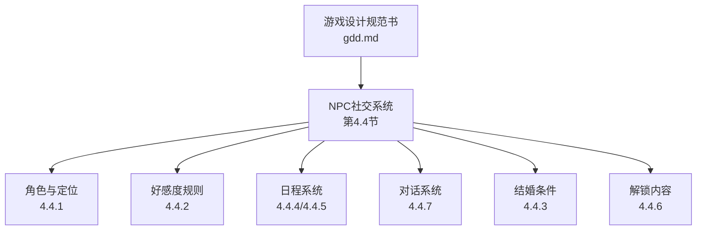
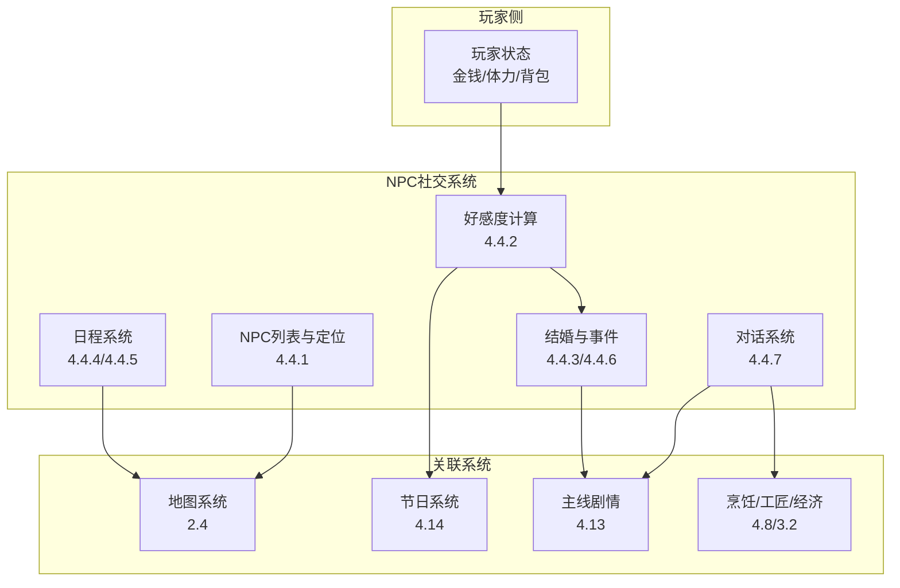
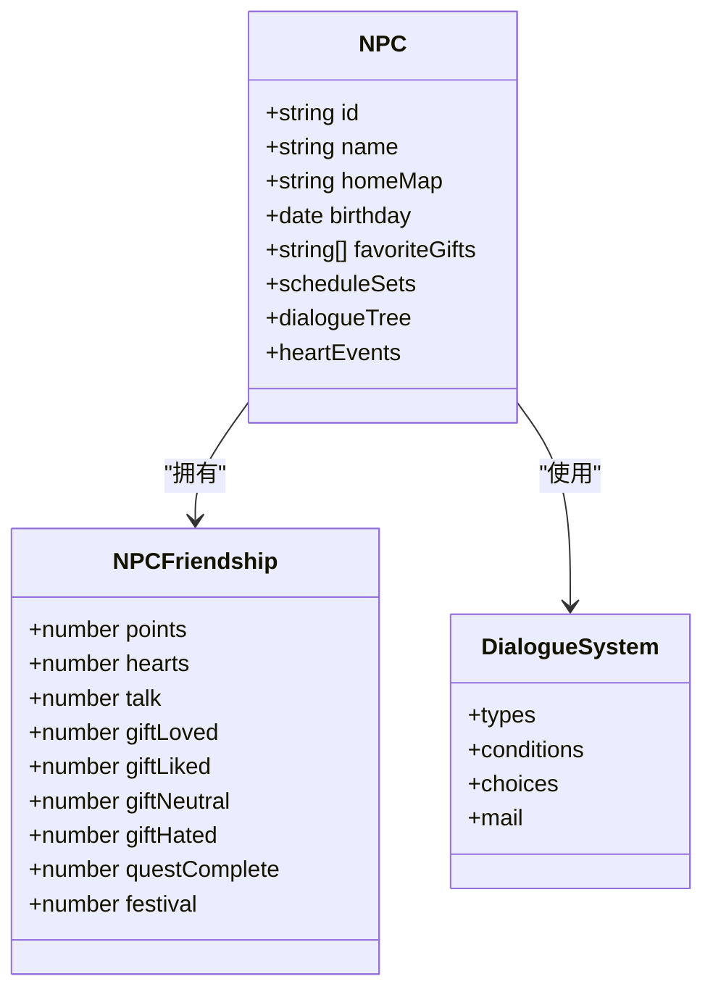
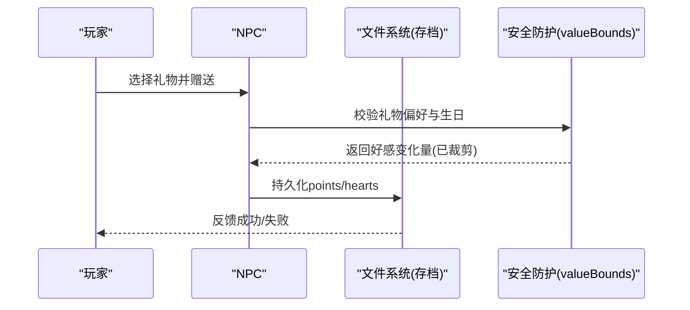
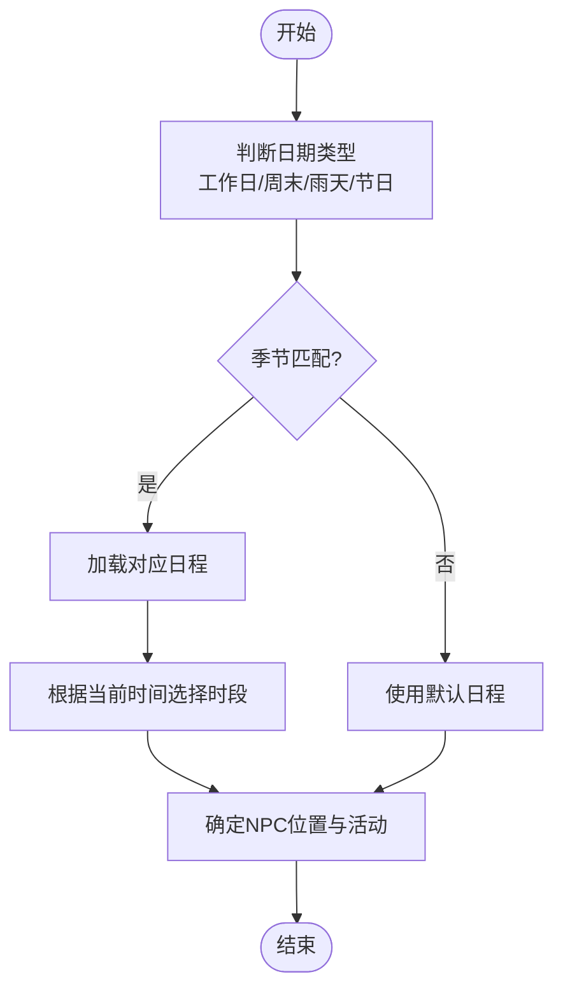
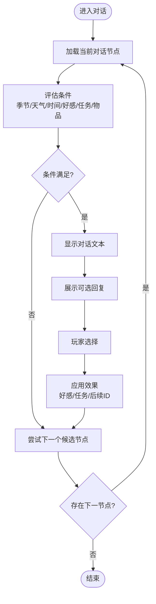
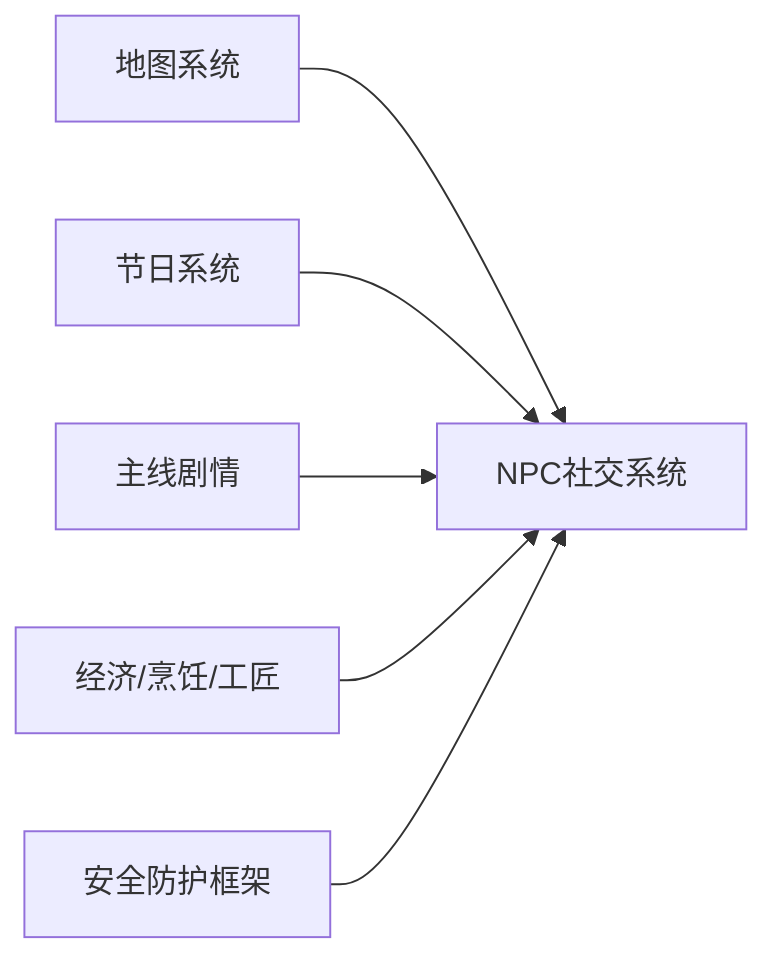

# NPC社交系统

<cite>
**本文引用的文件**   
- [gdd.md](file://gdd.md)
</cite>

## 目录
1. [引言](#引言)
2. [项目结构](#项目结构)
3. [核心组件](#核心组件)
4. [架构总览](#架构总览)
5. [详细组件分析](#详细组件分析)
6. [依赖分析](#依赖分析)
7. [性能考虑](#性能考虑)
8. [故障排查指南](#故障排查指南)
9. [结论](#结论)
10. [附录](#附录)

## 引言
本技术文档围绕《山野小村》的NPC社交系统，系统化梳理17个NPC的角色设定、好感度计算体系、日程管理系统、对话系统设计、礼物偏好算法、结婚条件判定与特殊事件触发机制。同时给出NPC状态机实现思路、日程切换逻辑与对话树遍历算法的实现要点，并说明与地图系统区域关联、节日系统互动以及与主线剧情的推进关系。文末包含完整的NPC时刻表示例、对话条件判断与安全防护措施，确保状态异常防护与内存泄漏防护。

## 项目结构
本项目为设计文档驱动型仓库，当前仅包含一份游戏设计规范书（GDD），其中第四部分“系统设计规范”对NPC社交系统进行了完整定义，包括角色名单、好感度规则、日程表、对话数据结构等。

图表来源
- [gdd.md:551-711](file://gdd.md#L551-L711)

章节来源
- [gdd.md:551-711](file://gdd.md#L551-L711)

## 核心组件
本节聚焦NPC社交系统的核心数据模型与规则：

- NPC名单与定位（首发17人）
- 好感度接口与增减规则
- 结婚条件与婚后流程
- 日程系统与每日时刻表
- 对话系统数据结构与条件判断
- 礼物偏好算法与生日加成

章节来源
- [gdd.md:551-711](file://gdd.md#L551-L711)

## 架构总览
NPC社交系统与其他系统的整合关系如下：

图表来源
- [gdd.md:551-711](file://gdd.md#L551-L711)
- [gdd.md:1106-1173](file://gdd.md#L1106-L1173)
- [gdd.md:1017-1091](file://gdd.md#L1017-L1091)
- [gdd.md:135-175](file://gdd.md#L135-L175)

## 详细组件分析

### 1) NPC角色设定与定位（17人）
- 可结婚对象（6人）：小鹿、阿杰、灵溪、石头、小暖、渔夫
- 村民（8人）：林婶、陈姨、老铁、顾医生、阿木、威利、阿婆、小胖
- 特殊（3人）：法师、神秘商人、隐士

各角色的居住地、生日、最爱礼物及关联系统已在规范中明确，用于送礼偏好算法与日程位置映射。

章节来源
- [gdd.md:551-574](file://gdd.md#L551-L574)

### 2) 好感度计算体系与加减规则
- 基础字段与上限
  - points: 0-2500（10心）
  - hearts: 0-10
- 日常交互增益
  - talk: 每日对话 +20
  - giftLiked: 喜欢礼物 +45
  - giftNeutral: 一般 +20
  - giftHated: 讨厌 -20
  - questComplete: 完成任务 +150
  - festival: 节日互动 +100
- 生日加成
  - giftLoved: 最爱礼物 +80；生日当天 ×8（即+640）
- 边界保护
  - 数值受全局valueBounds保护，防止溢出或非法值

章节来源
- [gdd.md:575-590](file://gdd.md#L575-L590)
- [gdd.md:1841-1857](file://gdd.md#L1841-L1857)

### 3) 礼物偏好算法
- 输入：NPCID、物品ID、是否生日
- 输出：好感度变化量
- 规则：
  - 若物品为NPC最爱且当日为其生日 → +640（+80×8）
  - 若为最爱但非生日 → +80
  - 若为喜欢 → +45
  - 若为一般 → +20
  - 若为讨厌 → -20
- 安全：结果经valueBounds裁剪至[0,2500]

章节来源
- [gdd.md:575-590](file://gdd.md#L575-L590)
- [gdd.md:1841-1857](file://gdd.md#L1841-L1857)

### 4) 日程管理系统与每日时刻表
- 四套日程：工作日/周末/雨天/节日
- 季节影响：不同季节活动区域可能变化
- 高好感邀请：高好感时NPC会邀请玩家前往特殊地点
- 联机同步：NPC位置由主机同步
- 回退策略：无日程时使用默认位置

示例时刻表（工作日·晴）：
- 小鹿：花店2楼→门口浇花→柜台营业→收摊→休息→睡觉
- 阿杰：森林小屋起床→森林巡逻→午餐→巡逻→整理→休息→睡觉
- 石头：铁匠铺2楼起床→打铁→柜台营业→整理→餐厅晚餐→休息→睡觉
- 灵溪：图书馆2楼起床→整理书架→柜台营业→小镇散步→阅读→睡觉
- 小暖：公寓起床→餐厅工作→广场休息→餐厅工作→睡觉
- 渔夫：沙滩小屋起床→码头/海面捕鱼→鱼店午餐+整理→柜台营业→沙滩散步/钓鱼→休息→睡觉

章节来源
- [gdd.md:603-656](file://gdd.md#L603-L656)

### 5) 对话系统设计
- 对话类型：问候、日常、生日、节日、好感事件、婚后、任务相关
- 对话条件：季节、天气、时间段、好感度门槛、任务完成状态、持有物品
- 回复选项：文本、好感度影响、任务影响、后续对话ID
- 邮件系统：触发条件、标题、正文、附件物品

章节来源
- [gdd.md:669-711](file://gdd.md#L669-L711)

### 6) 结婚条件与特殊事件触发
- 恋爱关系：好感≥8心（2000点）→赠送花束
- 求婚：好感≥10心（2500点）→赠送项链
- 婚礼：等待3天后举行
- 婚后：配偶搬入农场，房屋自动升级
- 解锁内容：随好感逐步解锁背景故事、房间进入权限、邮件礼物、专属配方、特殊事件

章节来源
- [gdd.md:592-601](file://gdd.md#L592-L601)
- [gdd.md:657-668](file://gdd.md#L657-L668)

### 7) 与地图系统、节日系统、主线剧情的联动
- 地图系统：NPC位置与区域关联，按日程在指定地点出现
- 节日系统：节日当天NPC集中在节日地点，参与可获得额外好感与限定道具
- 主线剧情：对话与任务推动社区中心修复等主线进程，解锁新区域与系统

章节来源
- [gdd.md:135-175](file://gdd.md#L135-L175)
- [gdd.md:1106-1173](file://gdd.md#L1106-L1173)
- [gdd.md:1017-1091](file://gdd.md#L1017-L1091)

### 8) 代码级实现要点（概念性图示）

#### 类图：NPC社交核心结构

图表来源
- [gdd.md:551-711](file://gdd.md#L551-L711)

#### 序列图：送礼与好感更新流程

图表来源
- [gdd.md:575-590](file://gdd.md#L575-L590)
- [gdd.md:1841-1857](file://gdd.md#L1841-L1857)

#### 流程图：日程切换逻辑

图表来源
- [gdd.md:603-656](file://gdd.md#L603-L656)

#### 流程图：对话树遍历算法

图表来源
- [gdd.md:669-711](file://gdd.md#L669-L711)

## 依赖分析
- 内部依赖
  - 地图系统：提供NPC位置与区域信息
  - 节日系统：提供节日日程与互动奖励
  - 主线剧情：通过对话与任务推进解锁
  - 经济/烹饪/工匠：影响礼物价值与解锁内容
- 外部约束
  - 安全框架：valueBounds、状态机保护、存档完整性校验

图表来源
- [gdd.md:135-175](file://gdd.md#L135-L175)
- [gdd.md:1106-1173](file://gdd.md#L1106-L1173)
- [gdd.md:1017-1091](file://gdd.md#L1017-L1091)
- [gdd.md:1841-1857](file://gdd.md#L1841-L1857)

章节来源
- [gdd.md:135-175](file://gdd.md#L135-L175)
- [gdd.md:1106-1173](file://gdd.md#L1106-L1173)
- [gdd.md:1017-1091](file://gdd.md#L1017-L1091)
- [gdd.md:1841-1857](file://gdd.md#L1841-L1857)

## 性能考虑
- 日程与对话查询应缓存常用路径，避免每帧重复计算
- 对话树遍历采用惰性加载，按需解析节点
- 好感度变更批量写入，减少频繁I/O
- 网络模式下NPC位置增量同步，降低带宽占用

## 故障排查指南
- 常见异常
  - 好感度越界：检查valueBounds裁剪逻辑
  - 日程缺失：启用默认位置回退
  - 对话条件不生效：核对条件字段与当前世界状态
  - 结婚状态不一致：检查状态机允许转换表
- 恢复策略
  - 读取备份存档并校验checksum
  - 自动修复任务与NPC状态一致性
  - 日志记录触发阈值与动作，便于复现

章节来源
- [gdd.md:1841-1857](file://gdd.md#L1841-L1857)
- [gdd.md:1859-1868](file://gdd.md#L1859-L1868)
- [gdd.md:1890-1945](file://gdd.md#L1890-L1945)

## 结论
NPC社交系统以清晰的数据结构与严格的规则为核心，结合日程管理、对话系统与节日联动，形成稳定的社交体验闭环。通过安全防护机制保障数值与状态的一致性，确保在多平台与联机环境下稳定运行。

## 附录

### 完整NPC时刻表示例（工作日·晴）
- 小鹿：花店2楼→门口浇花→柜台营业→收摊→休息→睡觉
- 阿杰：森林小屋起床→森林巡逻→午餐→巡逻→整理→休息→睡觉
- 石头：铁匠铺2楼起床→打铁→柜台营业→整理→餐厅晚餐→休息→睡觉
- 灵溪：图书馆2楼起床→整理书架→柜台营业→小镇散步→阅读→睡觉
- 小暖：公寓起床→餐厅工作→广场休息→餐厅工作→睡觉
- 渔夫：沙滩小屋起床→码头/海面捕鱼→鱼店午餐+整理→柜台营业→沙滩散步/钓鱼→休息→睡觉

章节来源
- [gdd.md:612-656](file://gdd.md#L612-L656)

### 对话条件判断清单
- 季节：春/夏/秋/冬
- 天气：晴/雨/雷暴/雪/风
- 时间段：早/上午/午后/下午/傍晚/夜晚/深夜
- 好感度门槛：按心数或具体点数
- 任务完成状态：特定任务ID已完成
- 持有物品：背包中存在指定物品

章节来源
- [gdd.md:669-711](file://gdd.md#L669-L711)

### 安全防护措施（防状态异常与内存泄漏）
- 数值边界保护：money/energy/hp/friendship/itemStackSize/skillLevel
- 状态机保护：非法转换回滚并记录日志
- 日程回退：找不到日程时使用默认位置
- 存档完整性：sha256校验、原子写入、备份槽位
- 资源清理：场景切换时清理纹理、音频实例、Tween池，强制GC

章节来源
- [gdd.md:1841-1857](file://gdd.md#L1841-L1857)
- [gdd.md:1859-1868](file://gdd.md#L1859-L1868)
- [gdd.md:1830-1839](file://gdd.md#L1830-L1839)