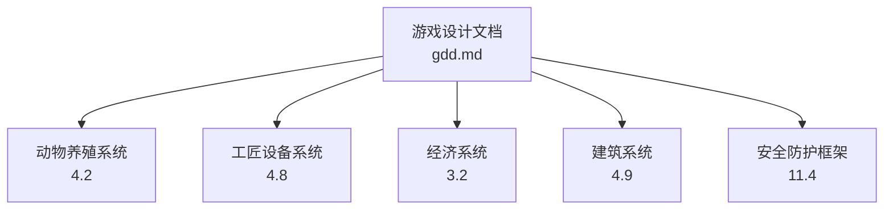
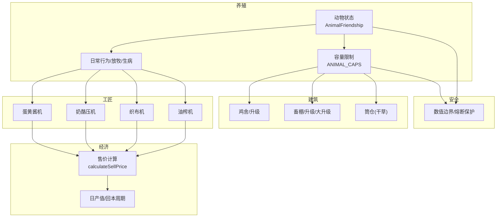
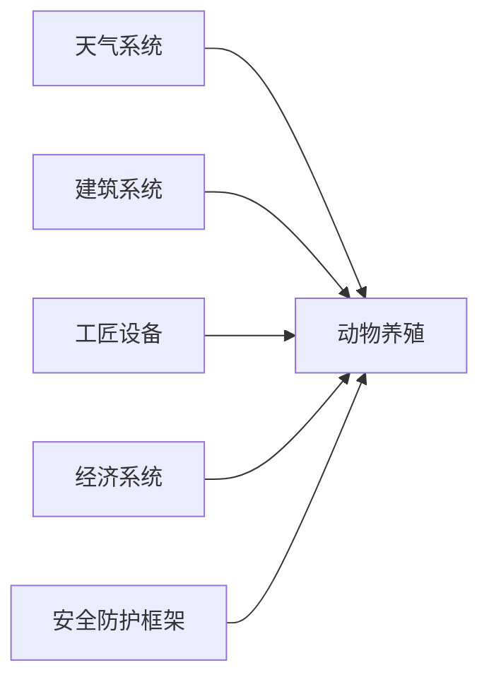
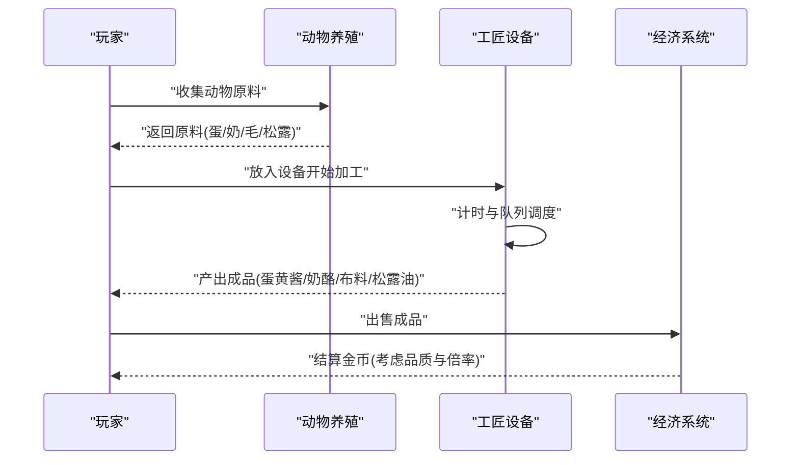
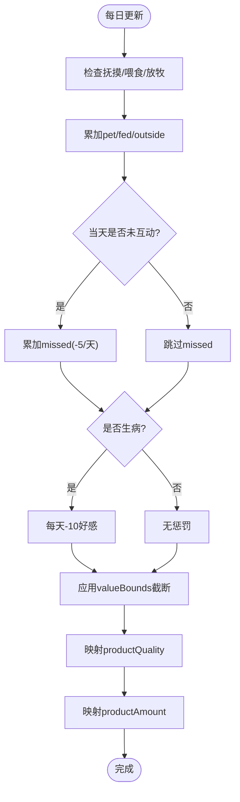

# 动物养殖系统

<cite>
**本文引用的文件**   
- [gdd.md](file://gdd.md)
</cite>

## 目录
1. [引言](#引言)
2. [项目结构](#项目结构)
3. [核心组件](#核心组件)
4. [架构总览](#架构总览)
5. [详细组件分析](#详细组件分析)
6. [依赖关系分析](#依赖关系分析)
7. [性能与安全考量](#性能与安全考量)
8. [故障排查指南](#故障排查指南)
9. [结论](#结论)
10. [附录](#附录)

## 引言
本技术文档聚焦《山野小村》的动物养殖系统，围绕以下目标展开：
- 明确首发5种动物的特性差异与产出路径
- 定义好感度计算机制、产品品质与数量决定算法
- 给出AnimalFriendship接口定义与数值边界保护
- 说明动物数量上限规则与建筑容量管理
- 解释日常行为模式、放牧机制、生病系统与产品产出时间计算
- 展示与工匠设备系统的集成（蛋黄酱机、奶酪压机等）及经济价值关联
- 提供安全防护措施，防止动物数量溢出与好感度数值异常

## 项目结构
本项目为游戏设计文档驱动型仓库，当前仅包含一份全局设计规范文档。所有系统规范（含动物养殖、工匠设备、经济系统等）均在该文档中统一约定，便于跨模块对齐与实现参考。

图表来源
- [gdd.md:478-515](file://gdd.md#L478-L515)
- [gdd.md:851-862](file://gdd.md#L851-L862)
- [gdd.md:237-332](file://gdd.md#L237-L332)
- [gdd.md:863-888](file://gdd.md#L863-L888)
- [gdd.md:1780-1888](file://gdd.md#L1780-L1888)

章节来源
- [gdd.md:478-515](file://gdd.md#L478-L515)
- [gdd.md:851-862](file://gdd.md#L851-L862)
- [gdd.md:237-332](file://gdd.md#L237-L332)
- [gdd.md:863-888](file://gdd.md#L863-L888)
- [gdd.md:1780-1888](file://gdd.md#L1780-L1888)

## 核心组件
本节提炼动物养殖系统的关键数据模型与规则，作为后续分析与集成的基础。

- 动物种类与基础信息
  - 鸡、鸭、牛、羊、猪五种动物，分别对应不同建筑与产品，日产值与解锁条件各异。
  - 产品包括蛋类、奶类、毛类与松露，部分产品需通过工匠设备进行加工增值。

- 动物好感度模型
  - 使用AnimalFriendship接口描述当前好感、上限、每日互动增量、放牧加成、未互动惩罚、生病惩罚以及基于好感的产品质量与数量影响字段。
  - 数值范围受全局安全边界约束，避免越界或异常值。

- 建筑容量与总数上限
  - 每种建筑有最大容纳数量；同时存在全农场动物总数上限，防止资源与体验失衡。

- 工匠设备集成
  - 蛋黄酱机、奶酪压机、织布机、油榨机等将动物原料转化为高附加值产品，提升日产值与经济回报。

- 经济价值关联
  - 产品售价遵循统一的经济计算公式，结合品质系数与工匠专精倍率，确保数值一致性与可预测性。

章节来源
- [gdd.md:478-515](file://gdd.md#L478-L515)
- [gdd.md:851-862](file://gdd.md#L851-L862)
- [gdd.md:237-332](file://gdd.md#L237-L332)

## 架构总览
动物养殖系统与其他系统的交互如下：

图表来源
- [gdd.md:478-515](file://gdd.md#L478-L515)
- [gdd.md:851-862](file://gdd.md#L851-L862)
- [gdd.md:237-332](file://gdd.md#L237-L332)
- [gdd.md:863-888](file://gdd.md#L863-L888)
- [gdd.md:1780-1888](file://gdd.md#L1780-L1888)

## 详细组件分析

### 动物种类与特性差异
- 鸡
  - 价格较低，所需建筑为鸡舍，产出鸡蛋，日产值中等，产品质量随好感变化，适合早期经济循环。
- 鸭
  - 需要鸡舍升级，产出鸭蛋，高好感额外产鸭毛，用于织布机加工。
- 牛
  - 需要畜棚，产出牛奶，产品质量随好感变化，适配奶酪压机。
- 羊
  - 需要畜棚升级，产出羊毛，毛生长速度受好感影响，适配织布机。
- 猪
  - 需要畜棚大升级，产出松露，高价值且适配油榨机，但初始投入较高。

章节来源
- [gdd.md:478-515](file://gdd.md#L478-L515)

### 动物好感度计算机制
- 数据结构
  - AnimalFriendship包含当前好感、上限、每日互动增量（抚摸/喂食/放牧）、未互动累积惩罚、生病惩罚、以及基于好感的质量与数量影响字段。
- 计算要点
  - 每日根据互动情况累计pet/fed/outside加分；若当天未互动则累积missed扣分；生病状态下每天扣减固定值。
  - productQuality与productAmount由当前好感映射到品质等级与是否多产的概率或阈值。
- 安全保护
  - 数值范围受全局valueBounds保护，确保不会越界或出现NaN/Infinity。

章节来源
- [gdd.md:478-515](file://gdd.md#L478-L515)
- [gdd.md:1841-1857](file://gdd.md#L1841-L1857)

### 产品品质与数量决定算法
- 品质等级
  - 采用normal/silver/gold/iridium四级，对应不同的售价乘数。
- 数量决定
  - 高好感可能触发“多产”判定，增加单次产出数量或概率。
- 售价计算
  - 使用统一的calculateSellPrice函数，结合品质乘数与工匠专精倍率，输出整数金币并做边界保护。

章节来源
- [gdd.md:237-332](file://gdd.md#L237-L332)
- [gdd.md:478-515](file://gdd.md#L478-L515)

### 动物数量上限与建筑容量管理
- 单建筑容量
  - 鸡舍、升级鸡舍、畜棚、升级畜棚、大升级畜棚各自有最大容纳数量。
- 全农场总量上限
  - 设置maxTotalAnimals，防止过度扩张导致性能与体验问题。
- 容量校验
  - 在放置动物时进行容量检查，超限拒绝操作并提示。

章节来源
- [gdd.md:478-515](file://gdd.md#L478-L515)
- [gdd.md:863-888](file://gdd.md#L863-L888)

### 日常行为模式与放牧机制
- 天气影响
  - 晴天动物可在室外活动；雨天、雷暴、雪天动物进入室内。
- 放牧加成
  - 放牧在外可获得额外好感加成，鼓励玩家合理布局与利用天气。
- 室内/室外切换
  - 根据天气自动调整动物位置，减少玩家手动干预成本。

章节来源
- [gdd.md:345-373](file://gdd.md#L345-L373)
- [gdd.md:478-515](file://gdd.md#L478-L515)

### 生病系统与恢复
- 生病惩罚
  - 生病状态下每天扣减固定好感值，降低产品质量与数量。
- 恢复方式
  - 可通过治疗或改善环境恢复健康，恢复正常产出。

章节来源
- [gdd.md:478-515](file://gdd.md#L478-L515)

### 产品产出时间计算
- 直接产出
  - 如鸡蛋、牛奶按日产出，时间单位以游戏分钟换算。
- 加工产出
  - 蛋黄酱机、奶酪压机、织布机、油榨机各有固定加工时长，完成后产出成品。
- 产出调度
  - 系统按设备队列与动物原料可用性安排生产，避免空转与阻塞。

章节来源
- [gdd.md:851-862](file://gdd.md#L851-L862)

### 与工匠设备系统的集成
- 设备清单
  - 蛋黄酱机（鸡蛋→蛋黄酱）、奶酪压机（牛奶→奶酪）、织布机（羊毛→布料）、油榨机（松露→松露油）。
- 加工时间与倍率
  - 各设备有明确的加工时长与价值倍率，显著提升日产值。
- 原料来源
  - 原料来自动物养殖，形成“养殖→加工→经济”的正向循环。

章节来源
- [gdd.md:851-862](file://gdd.md#L851-L862)
- [gdd.md:478-515](file://gdd.md#L478-L515)

### 与经济系统的价值关联
- 售价公式
  - calculateSellPrice结合品质与工匠专精倍率，输出最终售价。
- 日产值评估
  - 通过动物产品与加工设备组合，计算日均收入与回本周期，指导玩家投资与扩产。
- 通胀保护
  - 经济系统设有价格上限与年度涨幅检查，防止数值膨胀。

章节来源
- [gdd.md:237-332](file://gdd.md#L237-L332)

### 代码示例路径（不展示具体代码内容）
- 动物状态管理与好感度增减逻辑
  - 参考：[gdd.md:478-515](file://gdd.md#L478-L515)
- 产品生成流程（设备加工）
  - 参考：[gdd.md:851-862](file://gdd.md#L851-L862)
- 售价计算与经济联动
  - 参考：[gdd.md:237-332](file://gdd.md#L237-L332)

## 依赖关系分析
- 内部依赖
  - 动物养殖依赖天气系统（室外/室内）、建筑系统（容量与升级）、工匠设备（加工增值）、经济系统（售价与回本）。
- 外部依赖
  - 安全防护框架对数值边界、状态一致性、存档完整性进行保护。

图表来源
- [gdd.md:345-373](file://gdd.md#L345-L373)
- [gdd.md:863-888](file://gdd.md#L863-L888)
- [gdd.md:851-862](file://gdd.md#L851-L862)
- [gdd.md:237-332](file://gdd.md#L237-L332)
- [gdd.md:1780-1888](file://gdd.md#L1780-L1888)

章节来源
- [gdd.md:345-373](file://gdd.md#L345-L373)
- [gdd.md:863-888](file://gdd.md#L863-L888)
- [gdd.md:851-862](file://gdd.md#L851-L862)
- [gdd.md:237-332](file://gdd.md#L237-L332)
- [gdd.md:1780-1888](file://gdd.md#L1780-L1888)

## 性能与安全考量
- 渲染与对象池
  - 控制活跃精灵与粒子数量，避免大量动物与设备同时渲染造成帧率下降。
- 网络同步
  - 动物状态与设备进度采用增量同步，频率与大小受限，防止消息洪水。
- 数值边界保护
  - 好感度、金钱、物品堆叠等关键数值受valueBounds保护，越界自动截断并记录日志。
- 状态一致性
  - 状态机保护与加载校验确保动物状态、设备队列与库存一致，异常自动修复。

章节来源
- [gdd.md:1780-1888](file://gdd.md#L1780-L1888)
- [gdd.md:1841-1857](file://gdd.md#L1841-L1857)

## 故障排查指南
- 常见问题
  - 动物无法产出：检查设备队列、原料库存与天气导致的室内外状态。
  - 好感度异常：确认每日互动是否执行、生病状态是否持续、数值边界是否被触发。
  - 容量溢出：验证建筑容量与总数上限，超限应拒绝放置并提示。
- 定位方法
  - 查看安全日志中的safetyLogEntry，关注触发的safeguardId与thresholdValue。
  - 使用存档校验与备份恢复功能，确保数据一致性。

章节来源
- [gdd.md:1947-1969](file://gdd.md#L1947-L1969)
- [gdd.md:1841-1857](file://gdd.md#L1841-L1857)

## 结论
动物养殖系统通过清晰的动物类型差异、严谨的好感度计算、稳定的产品产出与加工链路，以及与经济系统的深度整合，形成了可持续的农场经济循环。配合安全防护框架，系统在数值、状态与性能层面具备较强的鲁棒性，能够有效防止溢出与异常，保障玩家体验的稳定与舒适。

## 附录

### 序列图：动物产品加工流程（从原料到成品）

图表来源
- [gdd.md:851-862](file://gdd.md#L851-L862)
- [gdd.md:237-332](file://gdd.md#L237-L332)

### 流程图：好感度增减与质量/数量判定

图表来源
- [gdd.md:478-515](file://gdd.md#L478-L515)
- [gdd.md:1841-1857](file://gdd.md#L1841-L1857)