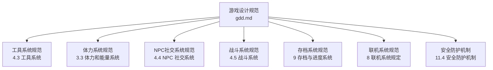
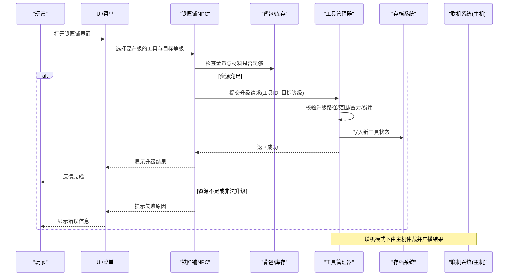
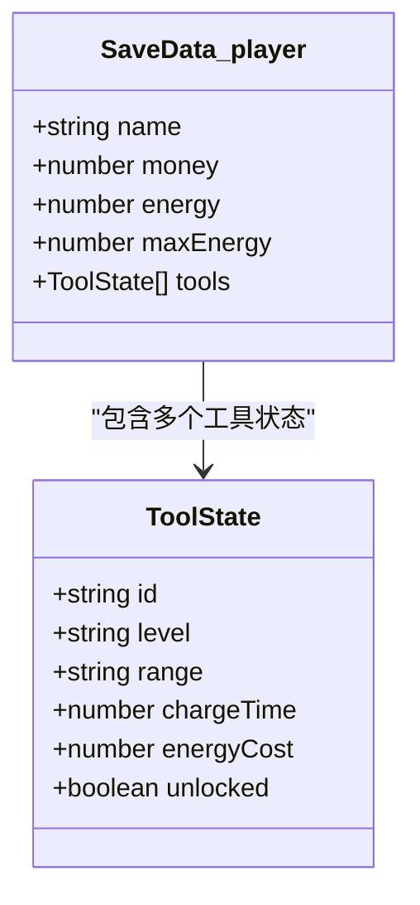
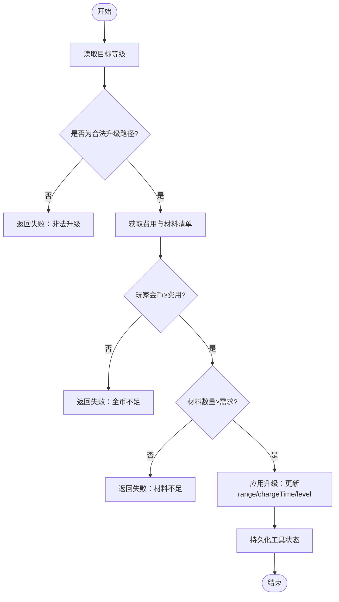
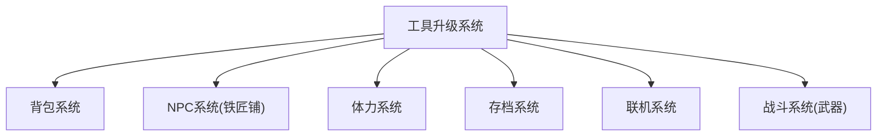

# 工具升级系统

<cite>
**本文引用的文件**   
- [gdd.md](file://gdd.md)
</cite>

## 目录
1. [引言](#引言)
2. [项目结构](#项目结构)
3. [核心组件](#核心组件)
4. [架构总览](#架构总览)
5. [详细组件分析](#详细组件分析)
6. [依赖关系分析](#依赖关系分析)
7. [性能与安全考量](#性能与安全考量)
8. [故障排查指南](#故障排查指南)
9. [结论](#结论)
10. [附录](#附录)

## 引言
本技术文档聚焦《山野小村》的“工具升级系统”，围绕以下目标展开：
- 明确6种基础工具的升级路径、材料需求与范围加成机制
- 定义工具等级数据结构、升级费用公式、体力消耗映射关系
- 解释锄头、水壶、斧头、镐、镰刀、鱼竿各自的升级效果与解锁条件
- 提供TypeScript代码示例，展示工具升级验证逻辑、材料检查流程与范围计算算法
- 说明与铁匠铺NPC的交互流程、联机模式下的同步机制，以及与战斗系统的武器关联
- 给出安全防护措施，防止非法升级与数值溢出

## 项目结构
本项目为设计文档驱动型仓库，当前仅包含一份游戏设计规范文档。工具升级系统的设计规范集中于该文档中，后续实现将基于此规范落地到具体模块（如工具管理、NPC交互、网络同步等）。

图表来源
- [gdd.md:517-549](file://gdd.md#L517-L549)
- [gdd.md:334-343](file://gdd.md#L334-L343)
- [gdd.md:551-673](file://gdd.md#L551-L673)
- [gdd.md:713-767](file://gdd.md#L713-L767)
- [gdd.md:1595-1675](file://gdd.md#L1595-L1675)
- [gdd.md:1451-1590](file://gdd.md#L1451-L1590)
- [gdd.md:1780-1888](file://gdd.md#L1780-L1888)

章节来源
- [gdd.md:517-549](file://gdd.md#L517-L549)
- [gdd.md:334-343](file://gdd.md#L334-L343)
- [gdd.md:551-673](file://gdd.md#L551-L673)
- [gdd.md:713-767](file://gdd.md#L713-L767)
- [gdd.md:1595-1675](file://gdd.md#L1595-L1675)
- [gdd.md:1451-1590](file://gdd.md#L1451-L1590)
- [gdd.md:1780-1888](file://gdd.md#L1780-L1888)

## 核心组件
本节梳理工具升级系统的核心要素，包括工具类型、等级、费用、材料、范围加成、蓄力时间、体力消耗映射以及数据持久化字段。

- 工具列表与用途
  - 锄头：翻地、挖采集物
  - 水壶：浇水
  - 斧头：砍树、砍硬木
  - 镐：敲石头、采矿
  - 镰刀：收草、割草
  - 鱼竿：钓鱼
  - 武器：战斗（独立于上述6种基础工具）

- 工具升级规则（等级→费用→材料→范围→蓄力）
  - 基础：无费用；范围1×1；蓄力0.3s
  - 铜：费用2,000g；材料铜锭×5；范围3×1；蓄力0.4s
  - 铁：费用5,000g；材料铁锭×5；范围3×3；蓄力0.5s
  - 金：费用10,000g；材料金锭×5；范围5×3；蓄力0.6s
  - 铱：费用25,000g；材料铱锭×5；范围5×5；蓄力0.7s

- 体力消耗映射
  - 工具等级不改变单次体力消耗，统一为固定值；但范围增大提升单位体力产出效率

- 数据持久化
  - 玩家存档中包含 tools 数组，用于记录每个工具的状态（含等级、经验等扩展字段）

章节来源
- [gdd.md:517-549](file://gdd.md#L517-L549)
- [gdd.md:1608-1650](file://gdd.md#L1608-L1650)

## 架构总览
工具升级系统涉及多系统协作：
- 玩家状态与背包：持有金币与材料，更新工具等级
- 铁匠铺NPC：提供升级服务，校验资格与材料
- 体力系统：限制操作执行（当体力不足时拒绝使用工具）
- 战斗系统：武器作为独立装备，与工具并列存在
- 存档系统：保存工具状态与玩家资源
- 联机系统：主机仲裁升级请求，客户端预测并回滚冲突

图表来源
- [gdd.md:517-549](file://gdd.md#L517-L549)
- [gdd.md:1608-1650](file://gdd.md#L1608-L1650)
- [gdd.md:1451-1590](file://gdd.md#L1451-L1590)

## 详细组件分析

### 工具等级数据结构
- 工具状态字段建议
  - id: 工具唯一标识（如 'hoe', 'watering_can' 等）
  - level: 当前等级（basic/copper/iron/gold/iridium）
  - range: 覆盖范围（如 '1x1', '3x1', '3x3', '5x3', '5x5'）
  - chargeTime: 蓄力时间（秒）
  - energyCost: 单次体力消耗（固定值）
  - unlocked: 是否已解锁（初始赠送工具默认true）
- 玩家存档中的工具集合
  - tools: ToolState[]（见存档接口）

图表来源
- [gdd.md:1608-1650](file://gdd.md#L1608-L1650)
- [gdd.md:517-549](file://gdd.md#L517-L549)

章节来源
- [gdd.md:517-549](file://gdd.md#L517-L549)
- [gdd.md:1608-1650](file://gdd.md#L1608-L1650)

### 升级费用公式与材料需求计算
- 费用公式
  - 按等级阶梯定价：基础→铜→铁→金→铱，对应费用分别为 0 / 2,000 / 5,000 / 10,000 / 25,000 g
- 材料需求
  - 铜：铜锭×5
  - 铁：铁锭×5
  - 金：金锭×5
  - 铱：铱锭×5
- 范围加成
  - 基础：1×1
  - 铜：3×1
  - 铁：3×3
  - 金：5×3
  - 铱：5×5
- 蓄力时间
  - 随等级递增：0.3s → 0.4s → 0.5s → 0.6s → 0.7s

图表来源
- [gdd.md:517-549](file://gdd.md#L517-L549)

章节来源
- [gdd.md:517-549](file://gdd.md#L517-L549)

### 体力消耗映射关系
- 规则要点
  - 工具等级不改变单次体力消耗，统一为固定值
  - 范围增大提升单位体力产出效率（即每次使用的有效面积更大）
- 安全保护
  - 体力不低于0；低于阈值时拒绝执行工具使用操作

章节来源
- [gdd.md:334-343](file://gdd.md#L334-L343)
- [gdd.md:517-549](file://gdd.md#L517-L549)

### 各工具升级效果与解锁条件
- 锄头、水壶、斧头、镐、镰刀、鱼竿均为初始赠送或特定NPC赠送（鱼竿由威利赠送），其升级路径一致，遵循统一的等级→费用→材料→范围→蓄力表
- 解锁条件
  - 锄头、水壶、斧头、镐、镰刀：初始赠送
  - 鱼竿：由沙滩鱼店老板威利赠送（钓鱼系统相关）
- 升级效果
  - 范围扩大：从1×1逐步提升至5×5
  - 蓄力时间增加：从0.3s逐步提升至0.7s
  - 体力消耗不变，但单位体力产出更高

章节来源
- [gdd.md:517-549](file://gdd.md#L517-L549)

### 与铁匠铺NPC的交互流程
- 铁匠铺位置与营业时间
  - 位于小镇，营业时间为10:00-17:00
- 交互步骤
  - 进入铁匠铺并与NPC对话
  - 选择要升级的工具与目标等级
  - 系统校验金币与材料
  - 成功后更新工具状态并反馈

章节来源
- [gdd.md:149-162](file://gdd.md#L149-L162)
- [gdd.md:517-549](file://gdd.md#L517-L549)

### 联机模式下的同步机制
- 架构模式
  - Listen Server（主机兼玩家）
- 同步规则
  - 物品/金钱采用可靠传输（事件触发）
  - 主机仲裁升级请求，客户端预测并回滚冲突
- 平等原则
  - 所有玩家体验一致，不存在主机优势

章节来源
- [gdd.md:1451-1590](file://gdd.md#L1451-L1590)

### 与战斗系统的武器关联
- 武器属于独立装备类别，与6种基础工具并列存在
- 武器通过战斗系统获得与升级，不影响工具升级路径
- 工具主要用于生产与采集，武器用于战斗

章节来源
- [gdd.md:517-549](file://gdd.md#L517-L549)
- [gdd.md:713-767](file://gdd.md#L713-L767)

### TypeScript 代码示例（概念性）
以下为概念性示例，展示工具升级验证逻辑、材料检查流程与范围计算算法的实现思路。注意：此处不直接粘贴源码，仅提供结构与关键步骤说明。

- 升级验证逻辑
  - 输入：工具ID、目标等级
  - 校验：升级路径合法性、费用与材料充足性、体力是否允许
  - 输出：成功/失败及原因
- 材料检查流程
  - 遍历材料清单，逐项比对背包中对应物品的数量
  - 若任一材料不足，立即返回失败
- 范围计算算法
  - 根据目标等级查表得到范围字符串（如 '3x1'）
  - 解析为二维矩阵尺寸，用于渲染与碰撞检测

章节来源
- [gdd.md:517-549](file://gdd.md#L517-L549)

## 依赖关系分析
工具升级系统与以下系统存在强耦合：
- 背包系统：检查与扣除金币与材料
- NPC系统：提供升级服务入口
- 体力系统：限制工具使用
- 存档系统：持久化工具状态
- 联机系统：主机仲裁与状态同步
- 战斗系统：武器独立于工具，避免混淆

图表来源
- [gdd.md:517-549](file://gdd.md#L517-L549)
- [gdd.md:1595-1675](file://gdd.md#L1595-L1675)
- [gdd.md:1451-1590](file://gdd.md#L1451-L1590)
- [gdd.md:713-767](file://gdd.md#L713-L767)

章节来源
- [gdd.md:517-549](file://gdd.md#L517-L549)
- [gdd.md:1595-1675](file://gdd.md#L1595-L1675)
- [gdd.md:1451-1590](file://gdd.md#L1451-L1590)
- [gdd.md:713-767](file://gdd.md#L713-L767)

## 性能与安全考量
- 性能
  - 工具升级为低频操作，对性能影响可忽略
  - 范围变化可能影响渲染与碰撞检测，需确保范围矩阵尺寸合理
- 安全
  - 数值边界保护：金币、体力、物品堆叠上限等受全局安全框架约束
  - 非法升级防护：严格校验升级路径与材料清单
  - 联机安全：主机仲裁，客户端预测与回滚，速率限制与消息大小限制

章节来源
- [gdd.md:1780-1888](file://gdd.md#L1780-L1888)
- [gdd.md:1451-1590](file://gdd.md#L1451-L1590)

## 故障排查指南
- 常见问题
  - 升级失败：检查金币与材料是否充足，确认目标等级是否合法
  - 体力不足：提示“太累了，无法继续”，等待恢复后再尝试
  - 联机不同步：确认主机仲裁结果，检查网络延迟与消息丢失
- 恢复策略
  - 存档异常：自动恢复备份或使用最近自动存档
  - 网络异常：自动重连或提示重试
  - 渲染异常：降低质量或重启场景

章节来源
- [gdd.md:1890-1945](file://gdd.md#L1890-L1945)

## 结论
工具升级系统是《山野小村》生产循环的重要支撑，通过清晰的等级路径、材料需求与范围加成机制，提升了玩家的成长感与效率。结合NPC交互、体力限制、存档与联机同步，系统在功能完整性的同时兼顾了安全性与稳定性。未来可在工具特效、范围可视化与联机体验上进一步优化。

## 附录
- 术语
  - 工具：用于生产与采集的可升级物品
  - 范围：工具作用区域的二维尺寸
  - 蓄力时间：使用工具前的准备时间
  - 体力：限制玩家操作的资源
  - 主机仲裁：联机模式下由主机决定最终状态

[本节为概念性总结，无需引用具体文件]