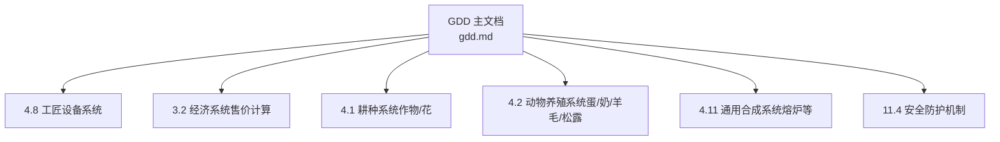
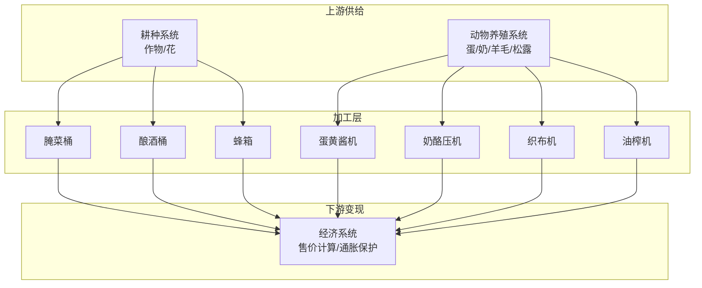
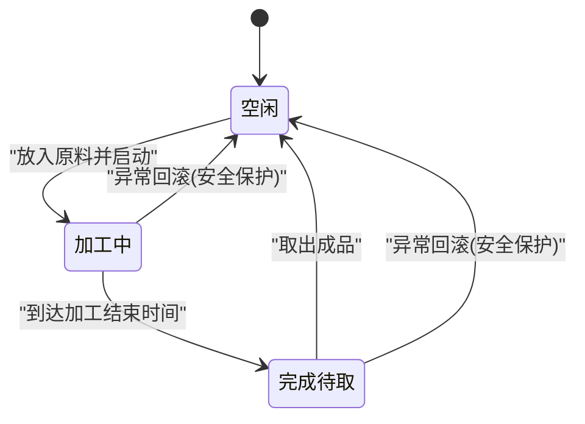
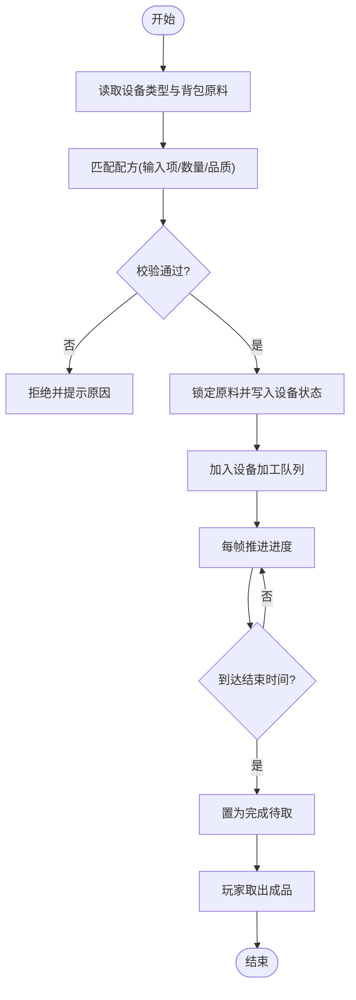
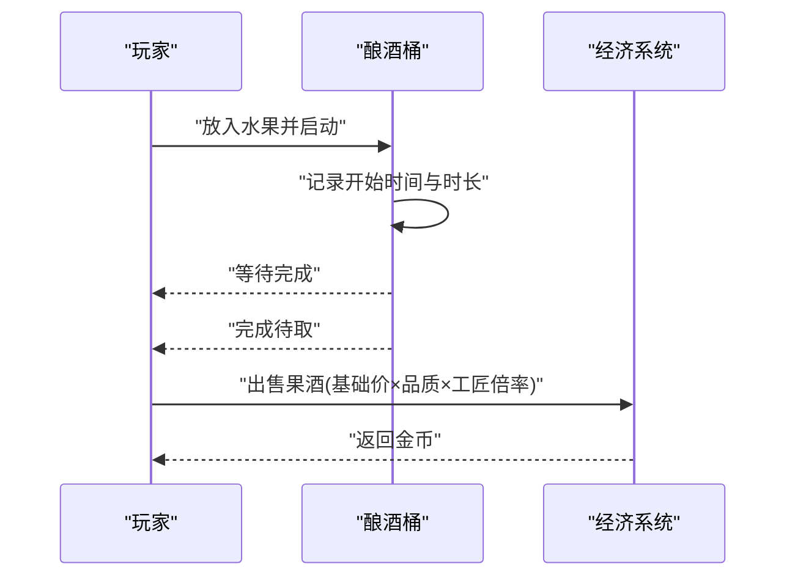
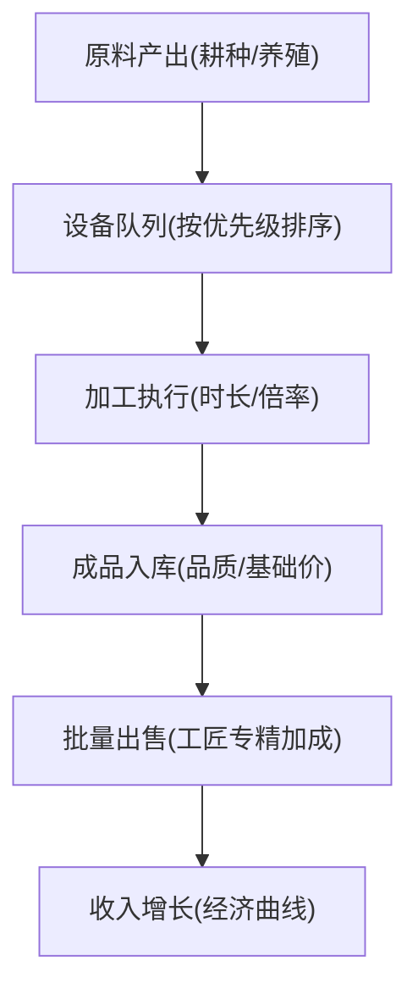
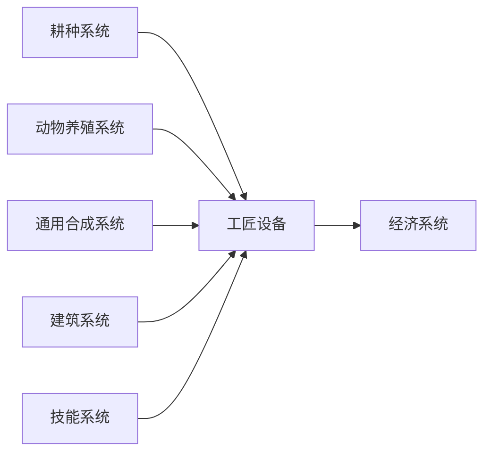

# 工匠设备系统

<cite>
**本文引用的文件**   
- [gdd.md](file://gdd.md)
</cite>

## 目录
1. [引言](#引言)
2. [项目结构](#项目结构)
3. [核心组件](#核心组件)
4. [架构总览](#架构总览)
5. [详细组件分析](#详细组件分析)
6. [依赖分析](#依赖分析)
7. [性能考虑](#性能考虑)
8. [故障排查指南](#故障排查指南)
9. [结论](#结论)
10. [附录](#附录)

## 引言
本技术文档聚焦《山野小村》的“工匠设备系统”，围绕7种加工设备的功能特性、配方制作流程、产品价值计算进行系统化说明。文档同时覆盖设备数据结构、加工时间管理、自动化生产链设计，并解释酿酒桶、腌菜桶、熔炉、织布机等设备的具体用途与产出物。此外，提供与耕种系统、动物养殖系统的原料供应关系，以及与经济系统的价值提升关联；给出完整的设备列表、配方数据库与安全保护措施（防止加工超时和资源丢失）的实现要点。

## 项目结构
本项目为游戏设计文档驱动型仓库，当前工作区包含单一设计文档 gdd.md，其中对工匠设备系统及相关系统进行了完整规范定义。工匠设备相关的设计位于第4部分“系统设计规范”中的“4.8 工匠设备系统”，并与经济系统（售价计算）、动物养殖、耕种系统形成闭环联动。

图表来源
- [gdd.md:851-861](file://gdd.md#L851-L861)
- [gdd.md:256-274](file://gdd.md#L256-L274)
- [gdd.md:379-476](file://gdd.md#L379-L476)
- [gdd.md:478-515](file://gdd.md#L478-L515)
- [gdd.md:964-994](file://gdd.md#L964-L994)
- [gdd.md:1780-1888](file://gdd.md#L1780-L1888)

章节来源
- [gdd.md:851-861](file://gdd.md#L851-L861)
- [gdd.md:256-274](file://gdd.md#L256-L274)
- [gdd.md:379-476](file://gdd.md#L379-L476)
- [gdd.md:478-515](file://gdd.md#L478-L515)
- [gdd.md:964-994](file://gdd.md#L964-L994)
- [gdd.md:1780-1888](file://gdd.md#L1780-L1888)

## 核心组件
本节梳理工匠设备的核心要素：设备清单、输入输出、加工时长、倍率、解锁条件、日产值估算，以及与经济系统的价值放大关系。

- 设备清单与基础参数
  - 蛋黄酱机：耕种等级1解锁；鸡蛋→蛋黄酱；加工时长3小时；倍率×1.8；日产值约180g
  - 奶酪压机：耕种等级5解锁；牛奶→奶酪；加工时长3小时；倍率×1.8；日产值约270g
  - 腌菜桶：耕种等级4解锁；蔬菜→腌菜；加工时长2.5天；倍率×2.0；日产值视作物
  - 酿酒桶：耕种等级7解锁；水果→果酒；加工时长6天；倍率×3.0；日产值视作物
  - 蜂箱：耕种等级3解锁；花→蜂蜜；加工时长隔夜；产出=基础+花价；日产值约100g+
  - 织布机：耕种等级6解锁；羊毛→布料；加工时长4小时；倍率×2.5；日产值约450g
  - 油榨机：耕种等级8解锁；松露→松露油；加工时长2小时；倍率×2.5；日产值约625g

- 价值计算规则
  - 统一售价公式：基础价格 × 品质倍率 × 工匠专精倍率（若具备工匠专精且满足条件），并对结果做边界保护（非正数归零、截断上限）。
  - 品质倍率：普通1.0、银星1.25、金星1.50、铱星2.0
  - 工匠专精倍率：具备工匠专精时×1.4，否则×1.0

- 原料来源与系统联动
  - 耕种系统：提供蔬菜、水果、花等原料
  - 动物养殖系统：提供蛋、奶、羊毛、松露等原料
  - 经济系统：通过倍率与品质提升最终售价，形成“原料→加工→增值→出售”的正向循环

章节来源
- [gdd.md:851-861](file://gdd.md#L851-L861)
- [gdd.md:256-274](file://gdd.md#L256-L274)
- [gdd.md:379-476](file://gdd.md#L379-L476)
- [gdd.md:478-515](file://gdd.md#L478-L515)

## 架构总览
工匠设备系统处于“资源供给—加工增值—经济变现”的核心位置，向上承接耕种与养殖的原料产出，向下对接经济系统的定价与玩家收入曲线。

图表来源
- [gdd.md:851-861](file://gdd.md#L851-L861)
- [gdd.md:256-274](file://gdd.md#L256-L274)
- [gdd.md:379-476](file://gdd.md#L379-L476)
- [gdd.md:478-515](file://gdd.md#L478-L515)

## 详细组件分析

### 设备数据模型与状态管理
- 设备实体字段建议（基于GDD中存档结构与设备表推导）
  - id：设备唯一标识
  - type：设备类型（如 egg_mayon, cheese_press, pickle_barrel, wine_barrel, beehive, loom, oil_press）
  - status：空闲/加工中/完成待取
  - recipeId：当前加工配方ID
  - inputItems：投入物品清单（含数量）
  - outputItem：产出物品（含基础价格、品质）
  - startTime：开始时间戳
  - durationMinutes：加工时长（分钟）
  - progress：进度百分比或剩余时间
  - lastSaveTime：上次保存时间（用于安全校验）
  - safeguard：防护标记（是否触发熔断/回滚）

- 状态机流转
  - 空闲 → 加工中：放入原料后进入加工，记录startTime与durationMinutes
  - 加工中 → 完成待取：到达结束时间，产出就绪
  - 完成待取 → 空闲：玩家取出成品后清空状态
  - 异常恢复：在加载存档时校验进度与时间，必要时回退到最近有效状态

图表来源
- [gdd.md:1606-1650](file://gdd.md#L1606-L1650)
- [gdd.md:1859-1868](file://gdd.md#L1859-1868)

章节来源
- [gdd.md:1606-1650](file://gdd.md#L1606-L1650)
- [gdd.md:1859-1868](file://gdd.md#L1859-1868)

### 配方匹配算法与生产队列处理
- 配方匹配流程
  - 输入：设备类型 + 背包内可用原料
  - 匹配策略：按设备支持的输入项集合查找可执行的配方；若存在多个候选，优先选择高价值或玩家指定
  - 校验：检查原料数量、品质、是否过期（如有）、是否符合设备限制
  - 锁定：将原料从背包移除并写入设备inputItems，生成outputItem占位
  - 入队：加入设备加工队列（单设备单任务，多设备并行）

- 生产队列处理
  - 每帧更新：根据elapsedTime推进progress，当达到durationMinutes时置为“完成待取”
  - 批量处理：每日结算时汇总所有设备状态，避免逐帧重算导致开销过大
  - 并发控制：单机模式由主机统一调度；联机模式下由主机仲裁，客户端预测本地操作，冲突时回滚

图表来源
- [gdd.md:851-861](file://gdd.md#L851-L861)
- [gdd.md:1859-1868](file://gdd.md#L1859-1868)

章节来源
- [gdd.md:851-861](file://gdd.md#L851-L861)
- [gdd.md:1859-1868](file://gdd.md#L1859-L1868)

### 关键设备详解

#### 酿酒桶（水果→果酒）
- 用途：将水果加工成果酒，显著增值
- 加工时长：6天
- 倍率：×3.0
- 原料来源：耕种系统的水果类作物
- 经济示例：蓝莓→果酒，结合品质与工匠专精可获得更高售价

图表来源
- [gdd.md:851-861](file://gdd.md#L851-L861)
- [gdd.md:256-274](file://gdd.md#L256-L274)

章节来源
- [gdd.md:851-861](file://gdd.md#L851-L861)
- [gdd.md:256-274](file://gdd.md#L256-L274)

#### 腌菜桶（蔬菜→腌菜）
- 用途：将蔬菜加工成腌菜，中等增值
- 加工时长：2.5天
- 倍率：×2.0
- 原料来源：耕种系统的蔬菜类作物

章节来源
- [gdd.md:851-861](file://gdd.md#L851-L861)

#### 织布机（羊毛→布料）
- 用途：将羊毛加工成布料，较高增值
- 加工时长：4小时
- 倍率：×2.5
- 原料来源：动物养殖系统的羊产羊毛

章节来源
- [gdd.md:851-861](file://gdd.md#L851-L861)
- [gdd.md:478-515](file://gdd.md#L478-L515)

#### 油榨机（松露→松露油）
- 用途：将松露加工成松露油，高增值
- 加工时长：2小时
- 倍率：×2.5
- 原料来源：动物养殖系统的猪产松露

章节来源
- [gdd.md:851-861](file://gdd.md#L851-L861)
- [gdd.md:478-515](file://gdd.md#L478-L515)

#### 蛋黄酱机（鸡蛋→蛋黄酱）
- 用途：将鸡蛋加工成蛋黄酱，稳定增值
- 加工时长：3小时
- 倍率：×1.8
- 原料来源：动物养殖系统的鸡产鸡蛋

章节来源
- [gdd.md:851-861](file://gdd.md#L851-L861)
- [gdd.md:478-515](file://gdd.md#L478-L515)

#### 奶酪压机（牛奶→奶酪）
- 用途：将牛奶加工成奶酪，稳定增值
- 加工时长：3小时
- 倍率：×1.8
- 原料来源：动物养殖系统的牛产牛奶

章节来源
- [gdd.md:851-861](file://gdd.md#L851-L861)
- [gdd.md:478-515](file://gdd.md#L478-L515)

#### 蜂箱（花→蜂蜜）
- 用途：将花加工成蜂蜜，产出=基础+花价
- 加工时长：隔夜
- 原料来源：耕种系统的花类作物

章节来源
- [gdd.md:851-861](file://gdd.md#L851-L861)
- [gdd.md:379-476](file://gdd.md#L379-L476)

#### 熔炉（矿石→锭）
- 用途：将矿石熔炼成锭，属于通用合成系统中的设施
- 解锁方式：采矿等级1
- 材料需求：铜矿×5、石×20
- 关联系统：战斗系统（矿洞掉落）、通用合成系统

章节来源
- [gdd.md:964-994](file://gdd.md#L964-L994)

### 配方数据库（设备级）
以下为设备级配方清单（以设备为中心组织）：

- 蛋黄酱机
  - 输入：鸡蛋×1
  - 输出：蛋黄酱（基础价×1.8）
- 奶酪压机
  - 输入：牛奶×1
  - 输出：奶酪（基础价×1.8）
- 腌菜桶
  - 输入：任意蔬菜×1
  - 输出：腌菜（基础价×2.0）
- 酿酒桶
  - 输入：任意水果×1
  - 输出：果酒（基础价×3.0）
- 蜂箱
  - 输入：任意花×1
  - 输出：蜂蜜（基础+花价）
- 织布机
  - 输入：羊毛×1
  - 输出：布料（基础价×2.5）
- 油榨机
  - 输入：松露×1
  - 输出：松露油（基础价×2.5）

章节来源
- [gdd.md:851-861](file://gdd.md#L851-L861)

### 自动化生产链设计
- 目标：构建“原料持续产出→设备自动加工→成品自动出售”的被动收入链
- 设计要点
  - 原料端：使用洒水器、种子机、自动喂食器等设施提高产出效率
  - 加工端：多设备并行，错峰安排长周期设备（酿酒桶）与短周期设备（油榨机）
  - 销售端：批量出售，利用工匠专精与高品质提升收益
  - 监控端：设置告警与提醒，确保成品及时取出，避免占用设备槽位

图表来源
- [gdd.md:851-861](file://gdd.md#L851-L861)
- [gdd.md:256-274](file://gdd.md#L256-L274)

章节来源
- [gdd.md:851-861](file://gdd.md#L851-L861)
- [gdd.md:256-274](file://gdd.md#L256-L274)

## 依赖分析
- 直接依赖
  - 耕种系统：提供蔬菜、水果、花等原料
  - 动物养殖系统：提供蛋、奶、羊毛、松露等原料
  - 经济系统：提供统一售价计算与通胀保护
- 间接依赖
  - 通用合成系统：提供熔炉等基础设施，支撑原料预处理（矿石→锭）
  - 建筑系统：房屋升级解锁地下室（酿酒陈化）等高级功能
  - 技能系统：耕种等级解锁设备，工匠专精提升售价

图表来源
- [gdd.md:851-861](file://gdd.md#L851-L861)
- [gdd.md:256-274](file://gdd.md#L256-L274)
- [gdd.md:964-994](file://gdd.md#L964-L994)
- [gdd.md:879-888](file://gdd.md#L879-L888)
- [gdd.md:819-850](file://gdd.md#L819-L850)

章节来源
- [gdd.md:851-861](file://gdd.md#L851-L861)
- [gdd.md:256-274](file://gdd.md#L256-L274)
- [gdd.md:964-994](file://gdd.md#L964-L994)
- [gdd.md:879-888](file://gdd.md#L879-L888)
- [gdd.md:819-850](file://gdd.md#L819-L850)

## 性能考虑
- 批量结算：设备状态与进度采用每日结算为主、帧级推进为辅的策略，降低CPU开销
- 渲染优化：设备UI与动画按需显示，避免大量粒子与重复绘制
- 内存与对象池：设备实例复用，减少频繁创建销毁
- 网络同步：联机模式下仅同步必要状态变更，减少带宽占用

[本节为通用指导，不直接分析具体文件]

## 故障排查指南
- 常见问题定位
  - 加工超时未出成品：检查设备startTime与durationMinutes是否正确写入；确认时间推进逻辑未被安全熔断跳过
  - 资源丢失：核对inputItems与背包一致性；检查存档完整性校验与原子写入是否生效
  - 数值异常：验证售价计算是否受valueBounds保护；确认工匠专精倍率应用正确
  - 状态不一致：加载存档时执行状态机一致性检查，必要时回滚到最近有效状态

- 安全保护要点
  - 值域保护：金钱、体力、好感度、堆叠数量等受边界保护
  - 状态机保护：非法状态转换被拒绝并记录日志
  - 存档保护：原子写入、备份、sha256校验、自动恢复
  - 网络保护：速率限制、消息大小限制、状态校验

章节来源
- [gdd.md:1841-1868](file://gdd.md#L1841-L1868)
- [gdd.md:1890-1945](file://gdd.md#L1890-L1945)

## 结论
工匠设备系统是《山野小村》实现“舒适循环”与“内容密度”的关键枢纽。通过明确的设备清单、稳定的配方与倍率体系、严谨的价值计算与安全保护，系统在耕种与养殖之间建立高效转化通道，并在经济系统中实现可观的增值回报。配合自动化生产链设计与安全防护措施，玩家可在无焦虑的前提下享受长期稳定的被动收入体验。

[本节为总结性内容，不直接分析具体文件]

## 附录

### 设备列表速查
- 蛋黄酱机：耕种1，鸡蛋→蛋黄酱，3h，×1.8
- 奶酪压机：耕种5，牛奶→奶酪，3h，×1.8
- 腌菜桶：耕种4，蔬菜→腌菜，2.5天，×2.0
- 酿酒桶：耕种7，水果→果酒，6天，×3.0
- 蜂箱：耕种3，花→蜂蜜，隔夜，基础+花价
- 织布机：耕种6，羊毛→布料，4h，×2.5
- 油榨机：耕种8，松露→松露油，2h，×2.5

章节来源
- [gdd.md:851-861](file://gdd.md#L851-L861)

### 配方数据库（设备级）
- 蛋黄酱机：鸡蛋×1→蛋黄酱
- 奶酪压机：牛奶×1→奶酪
- 腌菜桶：蔬菜×1→腌菜
- 酿酒桶：水果×1→果酒
- 蜂箱：花×1→蜂蜜
- 织布机：羊毛×1→布料
- 油榨机：松露×1→松露油

章节来源
- [gdd.md:851-861](file://gdd.md#L851-L861)

### 安全防护措施（防加工超时与资源丢失）
- 加工超时保护：帧时间限制、更新迭代上限、看门狗定时器
- 资源一致性保护：输入/输出项校验、状态机转换守卫、未知ID拒绝
- 存档安全：原子写入、备份、完整性校验、自动恢复
- 数值边界保护：金钱、体力、好感度、堆叠数量等范围约束

章节来源
- [gdd.md:1780-1888](file://gdd.md#L1780-L1888)
- [gdd.md:1890-1945](file://gdd.md#L1890-L1945)