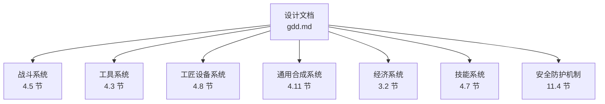
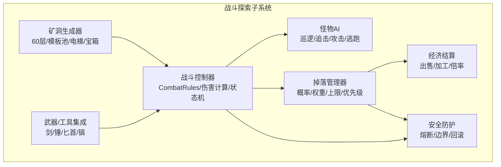
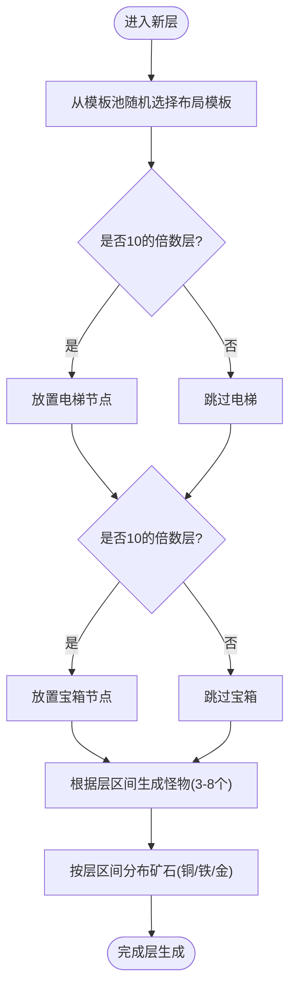
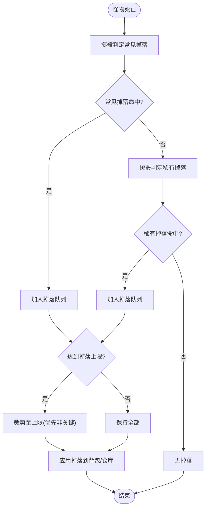
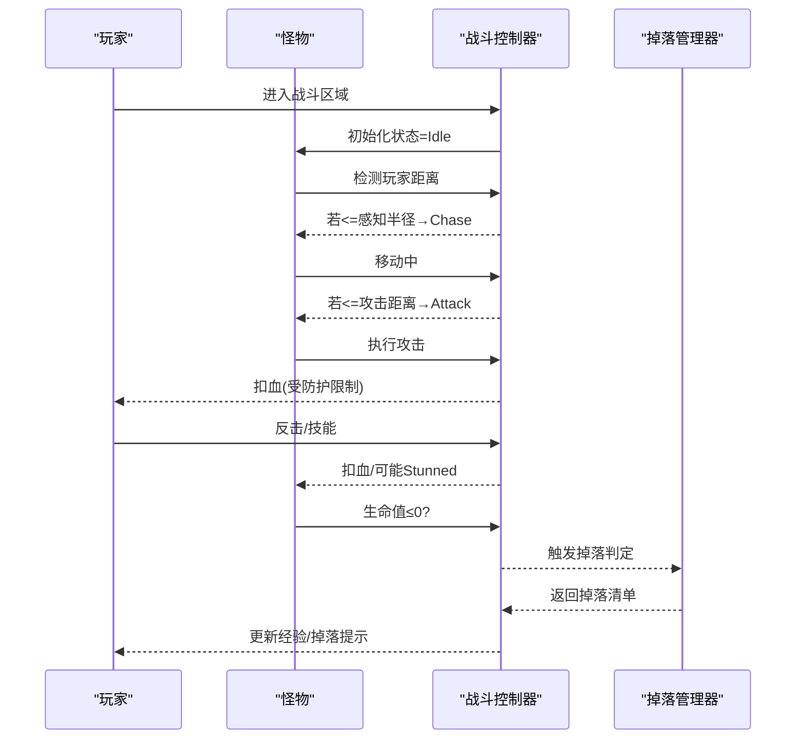
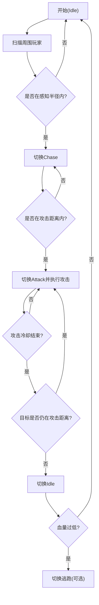
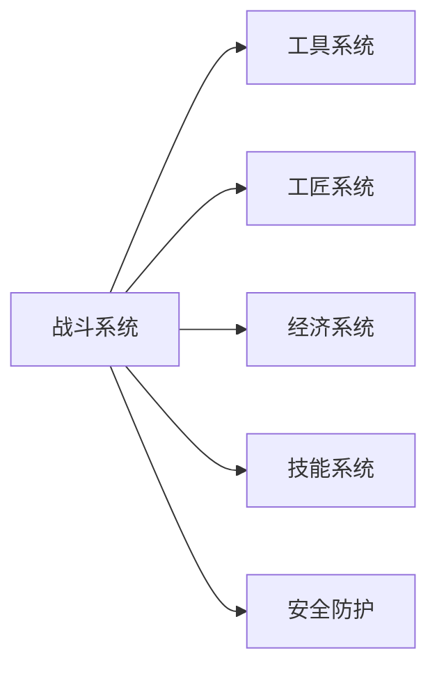

# 战斗探索系统

<cite>
**本文引用的文件**   
- [gdd.md](file://gdd.md)
</cite>

## 目录
1. [引言](#引言)
2. [项目结构](#项目结构)
3. [核心组件](#核心组件)
4. [架构总览](#架构总览)
5. [详细组件分析](#详细组件分析)
6. [依赖分析](#依赖分析)
7. [性能与安全](#性能与安全)
8. [故障排查指南](#故障排查指南)
9. [结论](#结论)
10. [附录](#附录)

## 引言
本技术文档聚焦《山野小村》的战斗探索系统，围绕“60层矿洞结构生成、怪物生态分布、战斗规则机制”展开，覆盖 CombatRules 接口定义、武器伤害计算、掉落物品算法；解释随机地图生成算法、电梯位置固定、宝箱分布规则；并提供战斗状态机、怪物AI行为与掉落概率计算的流程说明。同时梳理与工具系统（武器关联）、工匠系统（材料收集）、经济系统（资源流通）的联动关系，并给出完整的怪物类型表、武器属性表以及安全防护措施，防止伤害溢出与无限循环等异常。

## 项目结构
本项目为设计文档驱动型仓库，当前工作区仅包含一份游戏设计规范书（GDD），所有战斗探索系统的规则、数值与接口均以该文档为准进行设计与实现。

图表来源
- [gdd.md:713-767](file://gdd.md#L713-L767)
- [gdd.md:517-549](file://gdd.md#L517-L549)
- [gdd.md:851-862](file://gdd.md#L851-L862)
- [gdd.md:964-994](file://gdd.md#L964-L994)
- [gdd.md:237-332](file://gdd.md#L237-L332)
- [gdd.md:819-850](file://gdd.md#L819-L850)
- [gdd.md:1780-1888](file://gdd.md#L1780-L1888)

章节来源
- [gdd.md:713-767](file://gdd.md#L713-L767)
- [gdd.md:517-549](file://gdd.md#L517-L549)
- [gdd.md:851-862](file://gdd.md#L851-L862)
- [gdd.md:964-994](file://gdd.md#L964-L994)
- [gdd.md:237-332](file://gdd.md#L237-L332)
- [gdd.md:819-850](file://gdd.md#L819-L850)
- [gdd.md:1780-1888](file://gdd.md#L1780-L1888)

## 核心组件
本节提炼战斗探索系统的核心数据与规则，便于后续实现与联调。

- 战斗规则接口（CombatRules）
  - 玩家基础生命值、每级生命成长、空手基础伤害、武器伤害来源
  - 死亡惩罚：金钱损失比例与上限、掉落策略、背包保留策略
  - 安全保护：单次死亡最多掉落数量、优先掉落非关键物品
  - 参考路径：[CombatRules 接口定义:728-745](file://gdd.md#L728-L745)

- 武器类型与特性
  - 剑：平衡型，可格挡，攻速系数 1.0x
  - 锤：高伤害，范围大，攻速系数 0.7x
  - 匕首：快速，暴击高，攻速系数 1.5x
  - 参考路径：[武器类型表:747-754](file://gdd.md#L747-L754)

- 怪物类型与掉落
  - 怪物种类、区域分布、HP/伤害/经验、常见掉落与稀有掉落、用途关联
  - 参考路径：[怪物类型与掉落表:755-767](file://gdd.md#L755-L767)

- 矿洞结构与生成
  - 主矿洞层数：60 层
  - 每层结构：随机生成（3 种模板池）
  - 电梯：每 10 层一个
  - 怪物密度：每层 3-8 个
  - 矿石分布：1-20F 铜矿，21-40F 铁矿，41-60F 金矿
  - 宝箱层：每 10 层固定出现一个宝箱
  - 参考路径：[矿洞结构规定:715-725](file://gdd.md#L715-L725)

- 与工具系统关联
  - 镐用于采矿，武器用于战斗；工具升级影响效率与范围
  - 参考路径：[工具列表与升级规则:517-549](file://gdd.md#L517-L549)

- 与工匠系统关联
  - 怪物掉落物可作为工匠设备原料或合成材料
  - 参考路径：[工匠设备列表:851-862](file://gdd.md#L851-L862)

- 与经济系统关联
  - 掉落物出售、加工增值、价格倍率与品质影响
  - 参考路径：[售价计算公式与经济保护:254-332](file://gdd.md#L254-L332)

章节来源
- [gdd.md:713-767](file://gdd.md#L713-L767)
- [gdd.md:517-549](file://gdd.md#L517-L549)
- [gdd.md:851-862](file://gdd.md#L851-L862)
- [gdd.md:237-332](file://gdd.md#L237-L332)

## 架构总览
战斗探索系统由“矿洞生成器、战斗控制器、怪物AI、掉落管理器、装备与工具集成、经济结算、安全防护”组成，遵循“内容密度优先、有机整合、安全防护并重”的设计原则。

图表来源
- [gdd.md:713-767](file://gdd.md#L713-L767)
- [gdd.md:517-549](file://gdd.md#L517-L549)
- [gdd.md:237-332](file://gdd.md#L237-L332)
- [gdd.md:1780-1888](file://gdd.md#L1780-L1888)

## 详细组件分析

### 矿洞结构生成与布局
- 层数与模板
  - 60 层，每层从 3 种模板池中随机选择一种作为基础布局
  - 模板差异体现在房间连通性、通道宽度、障碍物密度
- 电梯与宝箱
  - 每 10 层固定设置电梯（10F、20F、…、60F）
  - 每 10 层固定出现一个宝箱（10F、20F、…、60F）
- 怪物密度与矿石分布
  - 每层 3-8 个怪物，按层区间调整分布
  - 1-20F 产出铜矿，21-40F 产出铁矿，41-60F 产出金矿
- 生成流程（概念流程图）

图表来源
- [gdd.md:715-725](file://gdd.md#L715-L725)

章节来源
- [gdd.md:715-725](file://gdd.md#L715-L725)

### 战斗规则与伤害计算
- 基础规则
  - 玩家初始生命值、每级增长、空手基础伤害
  - 武器伤害来源于武器配置（类型、等级、品质）
  - 死亡惩罚：金钱损失比例与上限、掉落策略、背包保留策略
- 伤害计算要点
  - 最终伤害 = 武器伤害 × 攻速系数 × 暴击修正 × 防御减免（如有）
  - 防溢出：结果受全局 valueBounds 保护，确保不越界
- 参考路径
  - [CombatRules 接口定义:728-745](file://gdd.md#L728-L745)
  - [武器类型与攻速系数:747-754](file://gdd.md#L747-L754)
  - [经济/数值边界保护:1847-1856](file://gdd.md#L1847-L1856)

章节来源
- [gdd.md:728-745](file://gdd.md#L728-L745)
- [gdd.md:747-754](file://gdd.md#L747-L754)
- [gdd.md:1847-1856](file://gdd.md#L1847-L1856)

### 掉落物品算法
- 掉落触发
  - 怪物死亡时触发掉落判定
- 掉落概率与权重
  - 常见掉落：较高权重，稳定产出
  - 稀有掉落：较低权重，随层深提升概率
- 掉落上限与优先级
  - 单次死亡最多掉落 N 件（CombatRules.safeguard.maxDropsPerDeath）
  - 优先掉落非关键物品（minimizeItemsFirst=true）
- 掉落流程（概念流程图）

图表来源
- [gdd.md:728-745](file://gdd.md#L728-L745)
- [gdd.md:755-767](file://gdd.md#L755-L767)

章节来源
- [gdd.md:728-745](file://gdd.md#L728-L745)
- [gdd.md:755-767](file://gdd.md#L755-L767)

### 战斗状态机
- 状态定义
  - Idle：待机/寻路
  - Chase：追击玩家
  - Attack：攻击动作
  - Stunned：被控制/眩晕
  - Dead：死亡
- 状态转换
  - Idle → Chase：当玩家在感知范围内
  - Chase → Attack：进入攻击距离
  - Attack → Idle：攻击冷却结束且目标离开
  - Any → Stunned：受到控制效果
  - Any → Dead：生命值归零
- 状态机序列（概念时序图）

图表来源
- [gdd.md:728-745](file://gdd.md#L728-L745)
- [gdd.md:755-767](file://gdd.md#L755-L767)

章节来源
- [gdd.md:728-745](file://gdd.md#L728-L745)
- [gdd.md:755-767](file://gdd.md#L755-L767)

### 怪物AI行为
- 行为模式
  - 巡逻：在区域内随机点间移动
  - 追击：发现玩家后加速接近
  - 攻击：进入范围后发起攻击
  - 逃跑：低血量或特定条件触发
- 行为参数
  - 感知半径、攻击距离、移动速度、仇恨衰减
- 行为流程（概念流程图）

图表来源
- [gdd.md:755-767](file://gdd.md#L755-L767)

章节来源
- [gdd.md:755-767](file://gdd.md#L755-L767)

### 与工具系统、工匠系统、经济系统的联动
- 工具系统
  - 镐用于采矿，武器用于战斗；工具升级影响效率与范围
  - 参考路径：[工具列表与升级规则:517-549](file://gdd.md#L517-L549)
- 工匠系统
  - 怪物掉落物可作为工匠设备原料或合成材料
  - 参考路径：[工匠设备列表:851-862](file://gdd.md#L851-L862)
- 经济系统
  - 掉落物出售、加工增值、价格倍率与品质影响
  - 参考路径：[售价计算公式与经济保护:254-332](file://gdd.md#L254-L332)

章节来源
- [gdd.md:517-549](file://gdd.md#L517-L549)
- [gdd.md:851-862](file://gdd.md#L851-L862)
- [gdd.md:254-332](file://gdd.md#L254-L332)

## 依赖分析
战斗探索系统与以下系统存在强耦合：
- 工具系统：武器/镐的属性与升级直接影响战斗与采矿效率
- 工匠系统：掉落物作为原料参与加工，形成资源闭环
- 经济系统：掉落物出售与加工增值影响玩家收入曲线
- 技能系统：战斗专精影响伤害、暴击、CD等战斗属性
- 安全防护：全局熔断与边界保护贯穿战斗、掉落、经济各环节

图表来源
- [gdd.md:517-549](file://gdd.md#L517-L549)
- [gdd.md:851-862](file://gdd.md#L851-L862)
- [gdd.md:237-332](file://gdd.md#L237-L332)
- [gdd.md:819-850](file://gdd.md#L819-L850)
- [gdd.md:1780-1888](file://gdd.md#L1780-L1888)

章节来源
- [gdd.md:517-549](file://gdd.md#L517-L549)
- [gdd.md:851-862](file://gdd.md#L851-L862)
- [gdd.md:237-332](file://gdd.md#L237-L332)
- [gdd.md:819-850](file://gdd.md#L819-L850)
- [gdd.md:1780-1888](file://gdd.md#L1780-L1888)

## 性能与安全
- 性能考虑
  - 怪物数量与粒子特效需受渲染上限保护，避免帧率下降
  - 矿洞生成采用模板池与分层加载，减少一次性计算压力
- 安全防护
  - 数值边界：生命值、金钱、掉落数量等受 valueBounds 保护
  - 熔断机制：单帧时间上限、迭代次数上限、网络消息速率限制
  - 状态机保护：非法状态转换回退与日志记录
  - 存档完整性：校验与自动恢复
- 参考路径
  - [安全防护机制（七维熔断）:1780-1888](file://gdd.md#L1780-L1888)
  - [数值边界保护:1847-1856](file://gdd.md#L1847-L1856)

章节来源
- [gdd.md:1780-1888](file://gdd.md#L1780-L1888)
- [gdd.md:1847-1856](file://gdd.md#L1847-L1856)

## 故障排查指南
- 常见问题定位
  - 伤害溢出：检查 valueBounds.hp 与伤害计算链路
  - 掉落过多：核查 maxDropsPerDeath 与 minimizeItemsFirst 逻辑
  - 怪物卡住：确认 AI 感知/攻击距离阈值与碰撞体
  - 矿洞死锁：验证模板池连通性与电梯/宝箱固定位置
- 恢复策略
  - 状态不一致：使用状态机保护回退到上一合法状态
  - 存档损坏：sha256 校验失败则恢复备份
  - 渲染异常：触发渲染熔断，降级粒子与精灵数量
- 参考路径
  - [错误恢复流程:1890-1945](file://gdd.md#L1890-L1945)
  - [安全防护机制:1780-1888](file://gdd.md#L1780-L1888)

章节来源
- [gdd.md:1890-1945](file://gdd.md#L1890-L1945)
- [gdd.md:1780-1888](file://gdd.md#L1780-L1888)

## 结论
战斗探索系统以“60层矿洞+模板化随机生成+固定电梯/宝箱”为核心骨架，结合“CombatRules 定义的规则与安全防护”，在“工具/工匠/经济/技能”的多系统联动下形成稳定的正向反馈循环。通过严格的状态机与熔断保护，确保战斗体验流畅、数值可控、异常可恢复。

## 附录

### 完整怪物类型表
- 绿史莱姆：区域 1-20F，HP 30，伤害 5，经验 3，常见掉落“史莱姆泥”，稀有掉落“史莱姆蛋”，用途关联“通用合成”
- 红史莱姆：区域 21-40F，HP 50，伤害 8，经验 5，常见掉落“史莱姆泥”，稀有掉落“红宝石”，用途关联“通用合成”
- 蝙蝠：区域 10-30F，HP 25，伤害 6，经验 4，常见掉落“蝙蝠翅膀”，稀有掉落“—”，用途关联“通用合成”
- 骷髅：区域 30-50F，HP 60，伤害 10，经验 7，常见掉落“骨头”，稀有掉落“古代种子”，用途关联“采集”
- 岩石蟹：区域 1-40F，HP 80，伤害 7，经验 5，常见掉落“蟹壳”，稀有掉落“钻石”，用途关联“通用合成”
- 飞虫：全层，HP 15，伤害 4，经验 2，常见掉落“虫肉”，稀有掉落“蜂蜜”，用途关联“烹饪”
- 暗影之子：区域 40-60F，HP 100，伤害 15，经验 10，常见掉落“虚空精华”，稀有掉落“铱矿”，用途关联“通用合成”
- 岩浆精灵：区域 50-60F，HP 70，伤害 12，经验 12，常见掉落“岩浆矿”，稀有掉落“火晶石”，用途关联“通用合成”

章节来源
- [gdd.md:755-767](file://gdd.md#L755-L767)

### 武器属性表
- 剑：平衡型，可格挡，攻速系数 1.0x，首发数量 4 把，关联“通用合成”
- 锤：高伤害，范围大，攻速系数 0.7x，首发数量 3 把，关联“通用合成”
- 匕首：快速，暴击高，攻速系数 1.5x，首发数量 2 把，关联“通用合成”

章节来源
- [gdd.md:747-754](file://gdd.md#L747-L754)

### 代码示例路径（战斗状态机、怪物AI、掉落概率）
- 战斗状态机（概念时序图）
  - [战斗状态机时序图:728-745](file://gdd.md#L728-L745)
- 怪物AI行为（概念流程图）
  - [怪物AI流程图:755-767](file://gdd.md#L755-L767)
- 掉落概率计算（概念流程图）
  - [掉落概率流程图:728-745](file://gdd.md#L728-L745)

章节来源
- [gdd.md:728-745](file://gdd.md#L728-L745)
- [gdd.md:755-767](file://gdd.md#L755-L767)