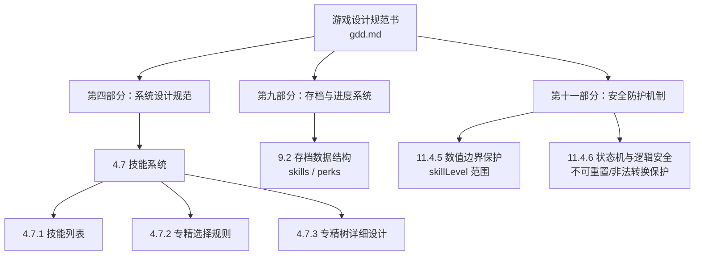
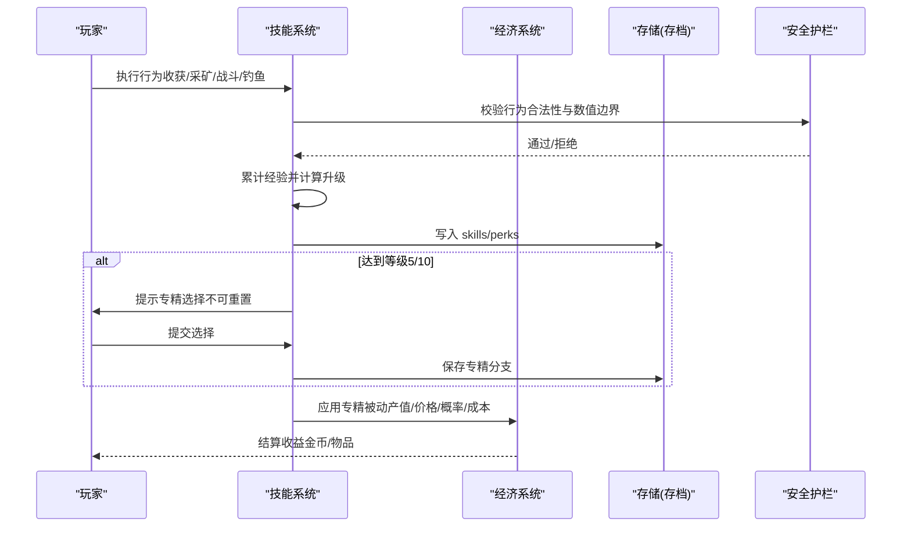
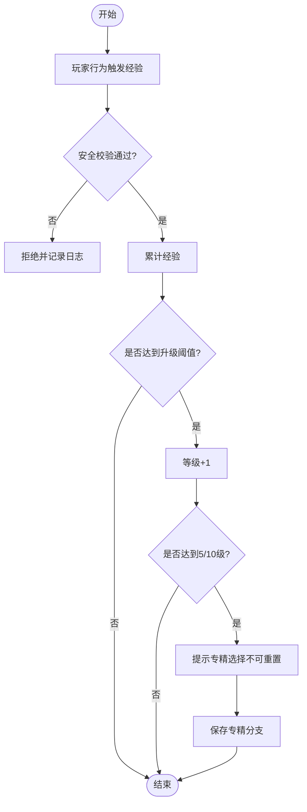
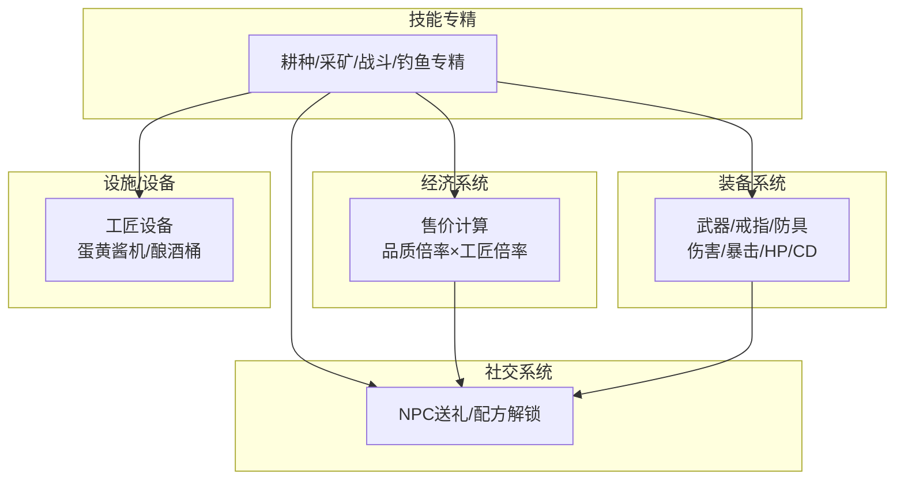
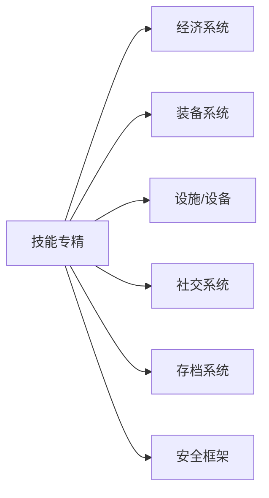

# 技能专精系统

<cite>
**本文引用的文件**   
- [gdd.md](file://gdd.md)
</cite>

## 目录
1. [引言](#引言)
2. [项目结构](#项目结构)
3. [核心组件](#核心组件)
4. [架构总览](#架构总览)
5. [详细组件分析](#详细组件分析)
6. [依赖分析](#依赖分析)
7. [性能与平衡性考虑](#性能与平衡性考虑)
8. [故障排查指南](#故障排查指南)
9. [结论](#结论)
10. [附录：数据模型与接口](#附录数据模型与接口)

## 引言
本技术文档围绕《山野小村》的“技能专精系统”展开，聚焦以下目标：
- 明确五大技能（耕种、采矿、战斗、钓鱼、社交）的数据结构与成长机制
- 说明经验获取规则、等级提升算法与数值边界保护
- 解释专精树选择策略、解锁条件与被动效果应用
- 展示与各玩法系统的深度整合（装备属性叠加、经济效率提升等）
- 提供安全护栏与防滥用措施，确保数值稳定与体验一致

为保证可追溯性，所有实现细节均直接来源于游戏设计规范书。

## 项目结构
本项目为单文档驱动的设计规范仓库，核心内容集中于单一设计文档中，按章节组织各系统定义、数据结构与安全约束。技能专精系统相关内容位于“技能系统”章节及其关联的安全防护与存档结构部分。



图表来源
- [gdd.md:819-849](file://gdd.md#L819-L849)
- [gdd.md:1606-1650](file://gdd.md#L1606-L1650)
- [gdd.md:1841-1868](file://gdd.md#L1841-L1868)

章节来源
- [gdd.md:819-849](file://gdd.md#L819-L849)
- [gdd.md:1606-1650](file://gdd.md#L1606-L1650)
- [gdd.md:1841-1868](file://gdd.md#L1841-L1868)

## 核心组件
- 技能维度与上限
  - 五大技能：耕种、采矿、采集、钓鱼、战斗；等级上限均为 10
  - 社交作为独立维度在交互与送礼体系中体现，但当前技能表未将其纳入等级化体系
- 专精选择规则
  - 等级 5 时二选一（A/B），等级 10 时基于已选分支再二选一（共四条路径）
  - 选择不可重置（状态机保护）
- 专精效果类型
  - 产值倍率、材料产出加成、价格加成、概率提升、CD/成本减免等
- 数据存储
  - 存档包含 skills 与 perks 字段，用于持久化等级与专精选择
- 安全边界
  - skillLevel 值域受全局 valueBounds 保护（最小 0，最大 10）
  - 状态转换受 LogicSafeguards 保护，防止非法重置或越界修改

章节来源
- [gdd.md:823-849](file://gdd.md#L823-L849)
- [gdd.md:1606-1650](file://gdd.md#L1606-L1650)
- [gdd.md:1841-1868](file://gdd.md#L1841-L1868)

## 架构总览
技能专精系统贯穿玩家成长、资源产出与经济循环，其关键交互如下：
- 玩家行为触发经验增长（如收获作物、敲矿石、杀怪、钓鱼）
- 等级达到阈值后开放专精选择（等级 5/10）
- 专精被动效果参与计算（产值、价格、概率、成本等）
- 结果反馈至经济系统与装备/设施系统（售价、产出、效率）



图表来源
- [gdd.md:819-849](file://gdd.md#L819-L849)
- [gdd.md:1606-1650](file://gdd.md#L1606-L1650)
- [gdd.md:1841-1868](file://gdd.md#L1841-L1868)

## 详细组件分析

### 技能数据结构与成长机制
- 数据结构要点
  - 技能等级：每个技能维护一个等级值（0-10），由 valueBounds.skillLevel 保护
  - 专精选择：记录 level5 与 level10 的选择分支，且不可重置
  - 存档字段：skills 与 perks 分别持久化等级与专精
- 经验获取规则
  - 耕种：收获作物 + 照顾动物
  - 采矿：敲矿石 + 下矿层
  - 采集：捡采集物 + 砍树
  - 钓鱼：钓鱼 + 蟹笼
  - 战斗：杀怪物
- 等级提升算法
  - 当累计经验达到阈值则提升一级（上限 10）
  - 到达等级 5 与 10 时触发专精选择流程
  - 选择完成后不可更改（状态机保护）



图表来源
- [gdd.md:819-849](file://gdd.md#L819-L849)
- [gdd.md:1606-1650](file://gdd.md#L1606-L1650)
- [gdd.md:1841-1868](file://gdd.md#L1841-L1868)

章节来源
- [gdd.md:819-849](file://gdd.md#L819-L849)
- [gdd.md:1606-1650](file://gdd.md#L1606-L1650)
- [gdd.md:1841-1868](file://gdd.md#L1841-L1868)

### 专精树设计与选择策略
- 耕种
  - 5A：农耕人（产值+10%）
  - 5B：畜牧人（产品+20%）
  - 10A→A：农场主（产值+15%）
  - 10A→B：工匠（加工倍率+40%）
  - 10B→A：牧场主（产品+40%）
  - 10B→B：牧羊人（毛速+50%）
- 采矿
  - 5A：矿工（每脉+1矿）
  - 5B：地质学家（宝石+50%）
  - 10A→A：铁匠（锭价+50%）
  - 10A→B：勘探者（煤+50%）
  - 10B→A：宝石专家（宝石相关+30%）
  - 10B→B：挖掘者（晶洞+50%）
- 采集
  - 5A：护林人（木材+25%）
  - 5B：采集者（采集次数+1）
  - 10A→A：伐木工（硬木+50%）
  - 10A→B：森林主（野生种子+50%）
  - 10B→A：植物学家（全金星品质）
  - 10B→B：追踪者（地图显示）
- 钓鱼
  - 5A：渔夫（鱼价+25%）
  - 5B：捕蟹人（成本-50%）
  - 10A→A：垂钓者（捕获+50%）
  - 10A→B：海盗（宝藏+50%）
  - 10B→A：渔夫无垃圾（减少无效掉落）
  - 10B→B：诱饵大师（无需鱼饵）
- 战斗
  - 5A：战士（伤害+10%）
  - 5B：斥候（暴击率+50%）
  - 10A→A：野蛮人（伤害+15%）
  - 10A→B：防御者（HP+25）
  - 10B→A：忍者（暴击+50%）
  - 10B→B：杂技（CD-50%）

```mermaid
classDiagram
class SkillTree {
+耕种 : {5A,5B,10A_A,10A_B,10B_A,10B_B}
+采矿 : {5A,5B,10A_A,10A_B,10B_A,10B_B}
+采集 : {5A,5B,10A_A,10A_B,10B_A,10B_B}
+钓鱼 : {5A,5B,10A_A,10A_B,10B_A,10B_B}
+战斗 : {5A,5B,10A_A,10A_B,10B_A,10B_B}
}
class PerkSelection {
+level5 : string
+level10 : string
+不可重置 : boolean
}
SkillTree --> PerkSelection : "选择分支"
```

图表来源
- [gdd.md:843-849](file://gdd.md#L843-L849)

章节来源
- [gdd.md:843-849](file://gdd.md#L843-L849)

### 能力加成计算与系统集成
- 经济系统整合
  - 售价计算统一公式，支持品质倍率与工匠专精加成
  - 示例：蓝莓酿酒链经工匠专精×1.4 后显著提升日均收入
- 装备系统整合
  - 战斗专精影响伤害、暴击、HP、CD 等属性，与武器/戒指等装备形成叠加
- 设施/设备整合
  - 耕种专精影响产值与加工倍率，配合工匠设备（蛋黄酱机、酿酒桶等）放大收益
- 社交系统整合
  - 钓鱼与烹饪结合，鱼类用于料理与送礼，间接提升 NPC 好感度与解锁内容



图表来源
- [gdd.md:254-274](file://gdd.md#L254-L274)
- [gdd.md:851-862](file://gdd.md#L851-L862)
- [gdd.md:819-849](file://gdd.md#L819-L849)

章节来源
- [gdd.md:254-274](file://gdd.md#L254-L274)
- [gdd.md:851-862](file://gdd.md#L851-L862)
- [gdd.md:819-849](file://gdd.md#L819-L849)

### 代码示例路径（不展示具体代码）
- 技能经验计算与等级提升
  - 参考路径：[gdd.md:819-849](file://gdd.md#L819-L849)
- 专精解锁条件与不可重置保护
  - 参考路径：[gdd.md:831-839](file://gdd.md#L831-L839)
- 被动效果应用（经济售价公式）
  - 参考路径：[gdd.md:254-274](file://gdd.md#L254-L274)
- 存档中的技能与专精字段
  - 参考路径：[gdd.md:1606-1650](file://gdd.md#L1606-L1650)
- 数值边界与状态机保护
  - 参考路径：[gdd.md:1841-1868](file://gdd.md#L1841-L1868)

## 依赖分析
- 内部依赖
  - 经济系统：售价计算与工匠倍率
  - 装备系统：战斗属性叠加
  - 设施/设备：加工倍率与产出效率
  - 社交系统：礼物与配方解锁
- 外部依赖
  - 存档系统：skills/perks 持久化
  - 安全框架：valueBounds 与 LogicSafeguards



图表来源
- [gdd.md:254-274](file://gdd.md#L254-L274)
- [gdd.md:851-862](file://gdd.md#L851-L862)
- [gdd.md:1606-1650](file://gdd.md#L1606-L1650)
- [gdd.md:1841-1868](file://gdd.md#L1841-L1868)

章节来源
- [gdd.md:254-274](file://gdd.md#L254-L274)
- [gdd.md:851-862](file://gdd.md#L851-L862)
- [gdd.md:1606-1650](file://gdd.md#L1606-L1650)
- [gdd.md:1841-1868](file://gdd.md#L1841-L1868)

## 性能与平衡性考虑
- 数值边界保护
  - skillLevel 限制在 0-10，避免溢出与异常
  - money、energy、hp、friendship 等均有上下限，防止数值膨胀
- 状态机保护
  - 专精选择不可重置，防止玩家反复刷最优分支
  - 非法状态转换自动回滚并记录日志
- 经济通胀控制
  - 经济系统具备通胀检查与年度涨幅限制，保障长期平衡
- 渲染与网络安全
  - 帧时间、粒子数量、消息速率等均有熔断保护，避免过载崩溃

章节来源
- [gdd.md:1841-1868](file://gdd.md#L1841-L1868)
- [gdd.md:318-332](file://gdd.md#L318-L332)

## 故障排查指南
- 常见问题定位
  - 专精无法选择：检查等级是否达到 5/10，确认 UI 提示与状态机允许转换
  - 等级不提升：核对经验累计逻辑与阈值判定，查看安全校验是否拒绝
  - 数值异常：检查 valueBounds 是否生效，确认存档完整性校验
- 恢复策略
  - 存档损坏：sha256 校验失败时自动恢复备份
  - 状态不一致：加载时一致性检查并自动修复
  - 网络异常：断线重连与心跳检测，必要时降级同步频率

章节来源
- [gdd.md:1606-1650](file://gdd.md#L1606-L1650)
- [gdd.md:1841-1868](file://gdd.md#L1841-L1868)

## 结论
技能专精系统以清晰的等级与分支选择为核心，通过严谨的安全护栏与跨系统整合，实现了稳定的成长曲线与丰富的玩法组合。建议在后续开发中：
- 完善社交技能的量化指标（若纳入等级体系）
- 细化经验阈值与难度曲线，确保不同阶段体验均衡
- 持续监控经济通胀与产出倍率，动态调整专精效果

## 附录：数据模型与接口
- 技能与专精字段
  - skills：技能等级数组（含耕种、采矿、采集、钓鱼、战斗）
  - perks：专精选择对象（level5、level10）
- 安全边界
  - skillLevel：min=0，max=10
  - 其他数值：money、energy、hp、friendship、itemStackSize 均有上下限
- 状态机保护
  - 禁止非法状态转换（如重置专精）
  - 未知 ID 与异常状态自动拒绝并记录日志

章节来源
- [gdd.md:1606-1650](file://gdd.md#L1606-L1650)
- [gdd.md:1841-1868](file://gdd.md#L1841-L1868)