# 核心系统设计

<cite>
**本文引用的文件**   
- [gdd.md](file://gdd.md)
</cite>

## 目录
1. [引言](#引言)
2. [项目结构](#项目结构)
3. [核心组件](#核心组件)
4. [架构总览](#架构总览)
5. [详细组件分析](#详细组件分析)
6. [依赖关系分析](#依赖关系分析)
7. [性能与安全考量](#性能与安全考量)
8. [故障排查指南](#故障排查指南)
9. [结论](#结论)
10. [附录：接口与数据模型速查](#附录接口与数据模型速查)

## 引言
本技术文档围绕《山野小村》的14个核心玩法系统，系统化梳理其数据模型、业务逻辑、安全保护与跨系统关联，提供可直接落地的TypeScript接口定义、数值计算规则与状态管理机制。文档同时解释系统间的整合闭环与正向反馈循环，给出计算公式、概率矩阵与平衡性考虑，并附带开发者集成要点与示例路径，帮助团队快速对齐设计与实现。

## 项目结构
本项目为游戏设计文档驱动型仓库，当前以单一GDD为核心蓝图，覆盖世界观、系统规范、UI/音频、联机、存档、引导、技术架构与安全护栏等全栈内容。开发过程中所有数值、流程、数据结构均以该文档为准，避免需求蔓延与设计偏离。

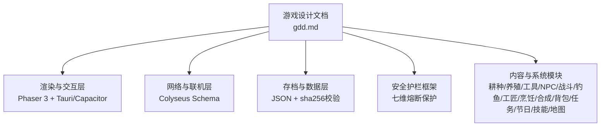

图表来源
- [gdd.md:1722-1734](file://gdd.md#L1722-L1734)
- [gdd.md:1780-1888](file://gdd.md#L1780-L1888)

章节来源
- [gdd.md:1-10](file://gdd.md#L1-L10)
- [gdd.md:1722-1734](file://gdd.md#L1722-L1734)

## 核心组件
本节聚焦14个核心系统的“数据模型—业务逻辑—安全保护—关联关系”四维说明，并给出关键接口与公式路径，便于直接落地到代码。

- 耕种系统：作物数据、生长/再生、肥料与洒水器、收获品质概率；与工匠设备、NPC送礼、经济系统联动。
- 动物养殖：动物种类、产品产出、好感度影响质量与数量；与工匠设备、经济系统联动。
- 工具升级：等级范围、材料费用、蓄力时间；与体力消耗、效率提升联动。
- NPC社交：好感度、日程、对话、结婚条件；与任务、节日、烹饪送礼联动。
- 战斗探索：矿洞结构、怪物掉落、死亡惩罚；与合成、经济、烹饪buff联动。
- 钓鱼：小游戏机制、鱼类分布、蟹笼/鱼塘；与烹饪、NPC送礼联动。
- 工匠设备：加工倍率、解锁条件、日产值；与耕种/养殖/经济联动。
- 烹饪：食谱、属性增益、送礼偏好；与NPC好感、战斗/采矿增益联动。
- 通用合成：配方、材料、用途；与战斗/耕种/钓鱼设施联动。
- 背包系统：容量、堆叠、分类、快速切换；与交易、丢弃、存储联动。
- 任务/剧情：主线/支线/求助/收集；与进度门控、区域解锁联动。
- 节日活动：季节节日、参与奖励、联机同步；与社交、经济联动。
- 技能专精：五系技能、5级/10级二选一；与工具/设施/价格加成联动。
- 地图与区域：7大区域、传送耗时、室内场景；与NPC日程、天气影响联动。

章节来源
- [gdd.md:379-476](file://gdd.md#L379-L476)
- [gdd.md:478-515](file://gdd.md#L478-L515)
- [gdd.md:517-549](file://gdd.md#L517-L549)
- [gdd.md:551-711](file://gdd.md#L551-L711)
- [gdd.md:713-766](file://gdd.md#L713-L766)
- [gdd.md:768-818](file://gdd.md#L768-L818)
- [gdd.md:851-862](file://gdd.md#L851-L862)
- [gdd.md:889-963](file://gdd.md#L889-L963)
- [gdd.md:964-994](file://gdd.md#L964-L994)
- [gdd.md:995-1016](file://gdd.md#L995-L1016)
- [gdd.md:1017-1105](file://gdd.md#L1017-L1105)
- [gdd.md:1106-1173](file://gdd.md#L1106-L1173)
- [gdd.md:819-850](file://gdd.md#L819-L850)
- [gdd.md:135-176](file://gdd.md#L135-L176)

## 架构总览
下图展示系统间正向反馈链与资源流转，体现“有机整合”的设计哲学：每个系统至少与两个其他系统形成闭环，避免孤岛。

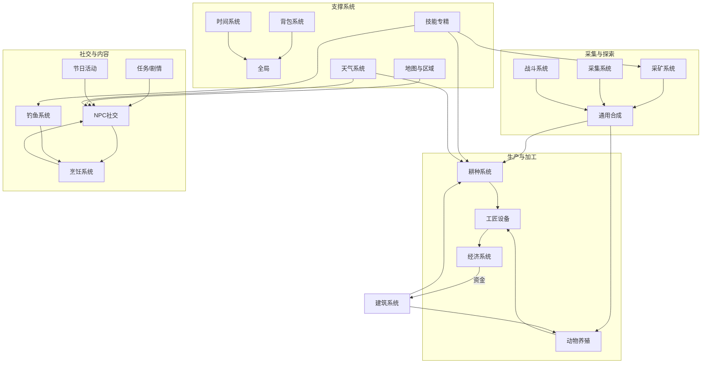

图表来源
- [gdd.md:1180-1220](file://gdd.md#L1180-L1220)
- [gdd.md:1222-1254](file://gdd.md#L1222-L1254)
- [gdd.md:1256-1271](file://gdd.md#L1256-L1271)

章节来源
- [gdd.md:1176-1295](file://gdd.md#L1176-L1295)

## 详细组件分析

### 耕种系统
- 数据模型
  - 作物数据接口：包含id、名称、季节、种子成本、生长天数、再生间隔、基础售价、类别、送礼偏好、品质概率等字段。
  - 安全边界：地块上限、单次收获上限、生长进度范围校验。
- 业务逻辑
  - 流程：翻地→播种→浇水→生长→收获。
  - 肥料：基础/高级/豪华肥料提升银星/金星/铱星概率；生长激素加速；保湿土降低浇水消耗。
  - 洒水器：基础/优质/铱洒水器覆盖范围递增，自动浇水减少人工。
- 安全保护
  - 数值边界：生长进度最小/最大限制，加载时校验。
  - 产量上限：防止单批收获过多导致卡顿或溢出。
- 关联关系
  - 与工匠设备（腌菜桶/酿酒桶）、NPC送礼、经济系统（售价计算）紧密联动。

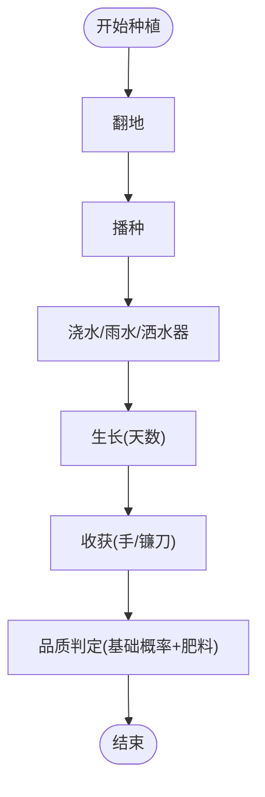

图表来源
- [gdd.md:379-476](file://gdd.md#L379-L476)

章节来源
- [gdd.md:379-476](file://gdd.md#L379-L476)

### 动物养殖系统
- 数据模型
  - 动物好感度：当前值、最大值、每日互动增量、未互动扣减、生病扣减、产品质量与数量映射。
  - 数量上限：按建筑类型设定上限与总上限。
- 业务逻辑
  - 产品产出：鸡/鸭/牛/羊/猪对应不同产品，受好感度影响质量与数量。
  - 放牧与室内：天气影响动物位置，雨天/雪天/大风需进入室内。
- 安全保护
  - 数值边界：好感度上下限保护，避免异常增长。
  - 数量上限：防止超出建筑容量。
- 关联关系
  - 与工匠设备（蛋黄酱机/奶酪压机/织布机/油榨机）、经济系统、建筑系统联动。

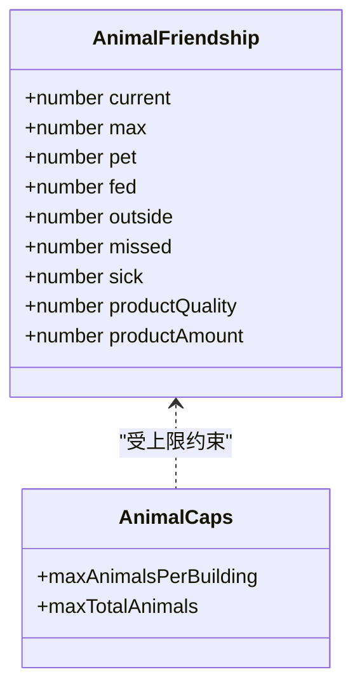

图表来源
- [gdd.md:490-515](file://gdd.md#L490-L515)

章节来源
- [gdd.md:478-515](file://gdd.md#L478-L515)

### 工具升级系统
- 数据模型
  - 工具列表与用途：锄头/水壶/斧头/镐/镰刀/鱼竿/武器。
  - 升级规则：等级、费用、材料、范围加成、蓄力时间。
  - 能效映射：工具等级不改变单次体力消耗，但范围增大提升单位体力产出。
- 业务逻辑
  - 通过铁匠铺升级，逐步解锁更大范围与更高效率。
- 安全保护
  - 升级材料检查与费用校验，防止非法升级。
- 关联关系
  - 与耕种、采矿、战斗、钓鱼、经济系统联动。

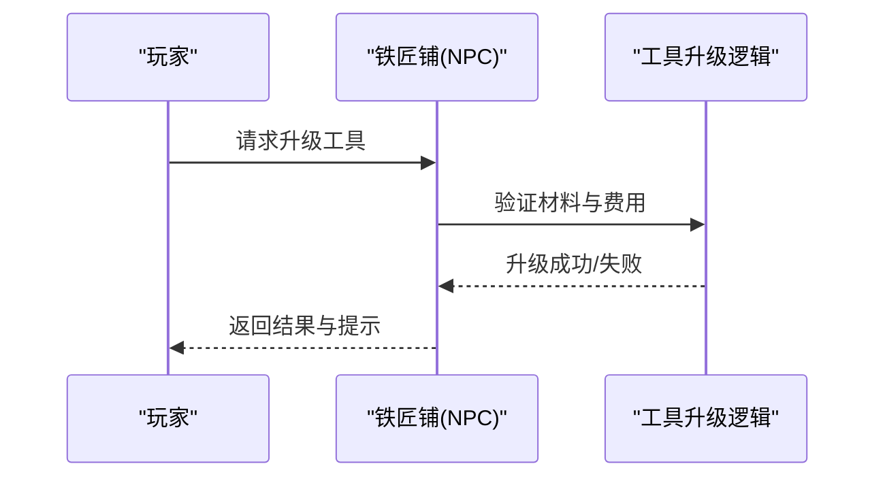

图表来源
- [gdd.md:517-549](file://gdd.md#L517-L549)

章节来源
- [gdd.md:517-549](file://gdd.md#L517-L549)

### NPC社交系统
- 数据模型
  - 好感度：点数、心数、对话/礼物/任务/节日影响。
  - 日程：工作日/周末/雨天/节日四套时刻表，含位置与活动。
  - 对话系统：类型、条件、选项、邮件附件。
- 业务逻辑
  - 结婚条件：好感度门槛、花束/项链、等待期、婚后搬入与房屋升级。
  - 日程回退：无日程时使用默认位置，确保稳定。
- 安全保护
  - 状态机保护：非法状态转换回滚并记录日志。
  - 日程回退：缺失日程使用默认位置。
- 关联关系
  - 与烹饪（送礼）、任务（触发）、节日（互动）、建筑（婚后房间）联动。

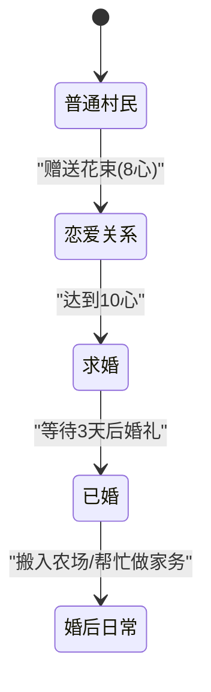

图表来源
- [gdd.md:575-601](file://gdd.md#L575-L601)
- [gdd.md:603-656](file://gdd.md#L603-L656)
- [gdd.md:669-711](file://gdd.md#L669-L711)

章节来源
- [gdd.md:551-711](file://gdd.md#L551-L711)

### 战斗探索系统
- 数据模型
  - 战斗规则：初始HP、每级HP、空手伤害、武器伤害、死亡惩罚（金钱损失、物品掉落）。
  - 怪物类型：区域、HP、伤害、经验、常见/稀有掉落、用途关联。
- 业务逻辑
  - 矿洞结构：60层、随机模板池、电梯、宝箱层、矿石分布。
  - 武器类型：剑/锤/匕首，攻速与特性差异。
- 安全保护
  - 掉落上限：每次死亡最多掉落3件非关键物品。
  - 数值边界：HP/伤害/掉落数量边界保护。
- 关联关系
  - 与合成（炸弹/戒指/熔炉）、经济（出售掉落）、烹饪（特殊buff料理）联动。

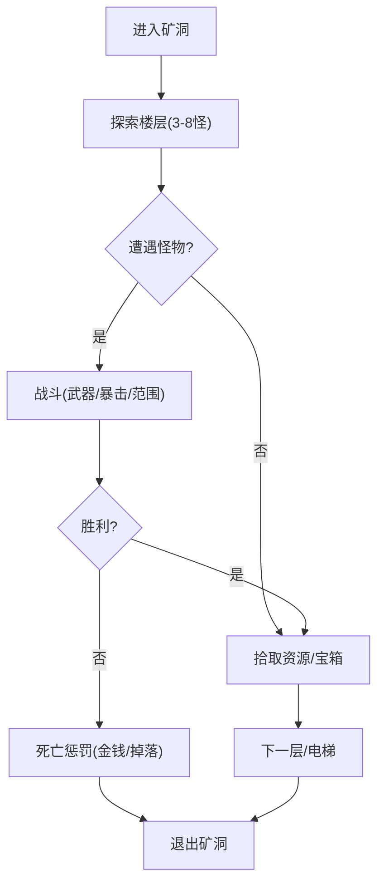

图表来源
- [gdd.md:713-766](file://gdd.md#L713-L766)

章节来源
- [gdd.md:713-766](file://gdd.md#L713-L766)

### 钓鱼系统
- 数据模型
  - 规则：鱼竿等级、鱼种类、传奇鱼、咬钩时间、迷你游戏、蟹笼/鱼塘。
  - 鱼类分布：区域、季节、难度、售价、用途、关联系统。
- 业务逻辑
  - 能量条控制小游戏：绿色条跟随移动，保持在目标范围内，不同鱼行为模式不同。
  - 天气影响：小雨/雷暴增加咬钩概率，大风无法钓鱼，冬季冰洞钓鱼。
- 安全保护
  - 小游戏超时保护：60秒无操作自动退出。
  - 鱼行为异常保护：不合理跳动回归默认模式。
- 关联关系
  - 与烹饪（食材）、NPC送礼、图鉴收藏联动。

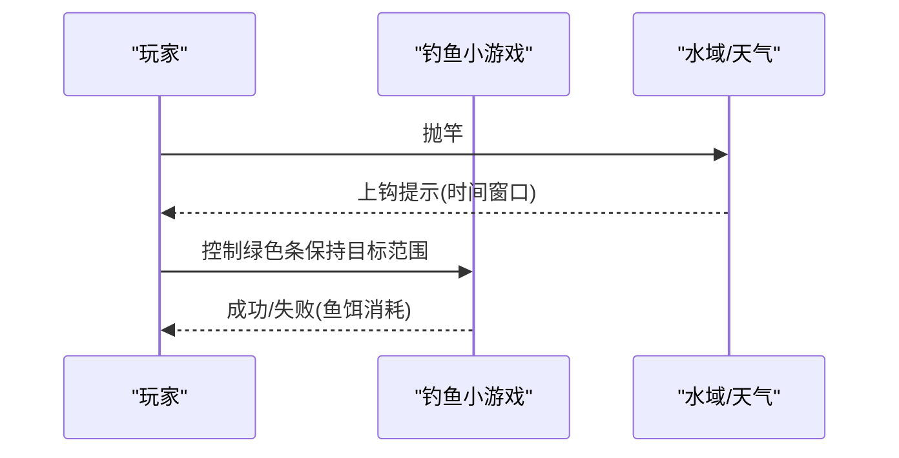

图表来源
- [gdd.md:768-818](file://gdd.md#L768-L818)

章节来源
- [gdd.md:768-818](file://gdd.md#L768-L818)

### 工匠设备系统
- 数据模型
  - 设备清单：解锁条件、原料→产品、时间、倍率、原料来源、日产值。
- 业务逻辑
  - 加工设备将初级农产品增值，提高日均收入与被动收益。
- 安全保护
  - 解锁条件校验：耕种等级不足禁止使用。
- 关联关系
  - 与耕种/养殖/经济系统深度联动。

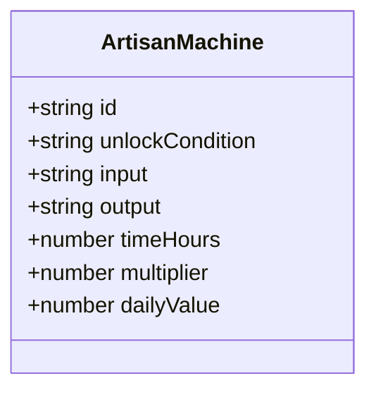

图表来源
- [gdd.md:851-862](file://gdd.md#L851-L862)

章节来源
- [gdd.md:851-862](file://gdd.md#L851-L862)

### 烹饪系统
- 数据模型
  - 食谱：id、名称、食材、恢复体力/生命值、增益效果（类型/数值/持续时间）、基础售价、送礼偏好。
- 业务逻辑
  - 解锁方式：看电视/购买/好感度获得；场所：厨房（房屋≥2级）。
  - 分类：体力恢复、属性增益、特殊效果、礼物。
- 安全保护
  - 数值边界：恢复值与增益时长受边界保护。
- 关联关系
  - 与NPC送礼、战斗/采矿增益、经济系统联动。

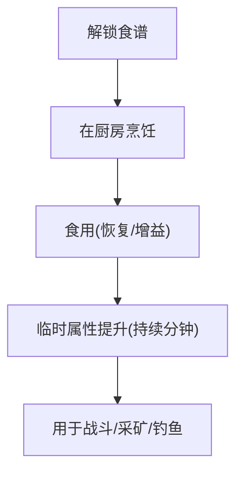

图表来源
- [gdd.md:889-963](file://gdd.md#L889-L963)

章节来源
- [gdd.md:889-963](file://gdd.md#L889-L963)

### 通用合成系统
- 数据模型
  - 配方：分类、解锁条件、材料、用途、关联系统。
- 业务逻辑
  - 随身合成（非工匠类），设施/工具/装饰/消耗品多样。
- 安全保护
  - 材料充足性校验，防止非法合成。
- 关联关系
  - 与战斗（炸弹/戒指）、耕种（种子机/稻草人）、钓鱼（蟹笼/浮标）联动。

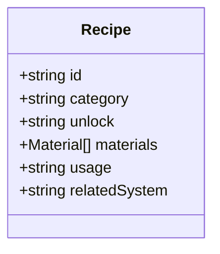

图表来源
- [gdd.md:964-994](file://gdd.md#L964-L994)

章节来源
- [gdd.md:964-994](file://gdd.md#L964-L994)

### 背包系统
- 数据模型
  - 容量与扩容：初始12格，两次扩容至24/36格。
  - 堆叠与分类：最多999/格，分类管理。
- 业务逻辑
  - 快速切换、垃圾清理、箱子扩展存储。
- 安全保护
  - 堆叠上限保护，销毁确认防误操作。
- 关联关系
  - 与交易、丢弃、存储、任务交付联动。

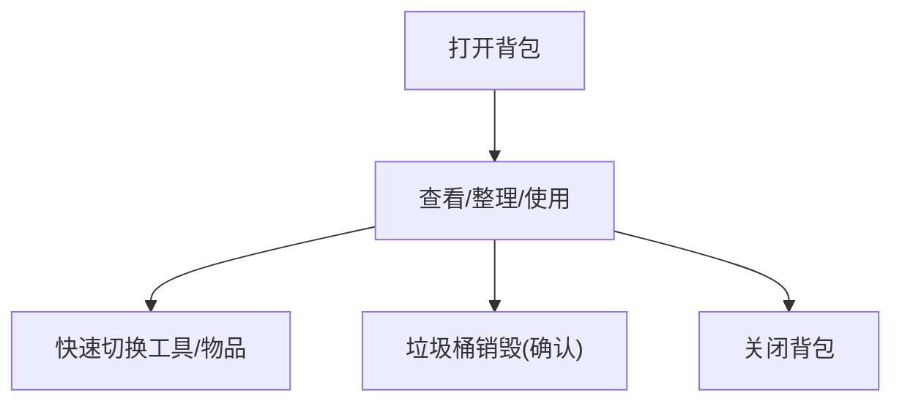

图表来源
- [gdd.md:995-1016](file://gdd.md#L995-L1016)

章节来源
- [gdd.md:995-1016](file://gdd.md#L995-L1016)

### 任务/剧情系统
- 数据模型
  - 任务数据：类型、标题、描述、目标、奖励、前置条件、对话、安全保护。
- 业务逻辑
  - 主线/支线/求助/收集四类任务，推动进程与解锁新区域/系统。
- 安全保护
  - 同时进行的目标上限、读取一致性检查、自动修复不一致状态。
- 关联关系
  - 与NPC社交、节日活动、社区中心献祭联动。

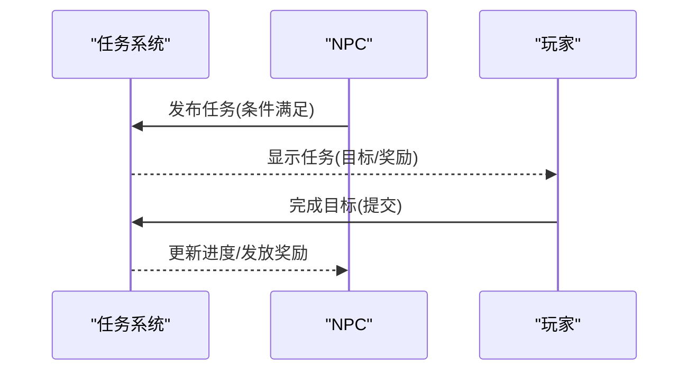

图表来源
- [gdd.md:1017-1105](file://gdd.md#L1017-L1105)

章节来源
- [gdd.md:1017-1105](file://gdd.md#L1017-L1105)

### 节日系统
- 数据模型
  - 节日日程：季节、日期、活动时间、活动内容、参与奖励、关联系统。
- 业务逻辑
  - 春之祭/夏夜花火/丰收节/冬雪庆典，各节日特定时段与奖励。
- 安全保护
  - 联机同步：所有在线玩家一起参加，评比各自独立。
- 关联关系
  - 与NPC社交、经济系统、烹饪/工匠产品联动。

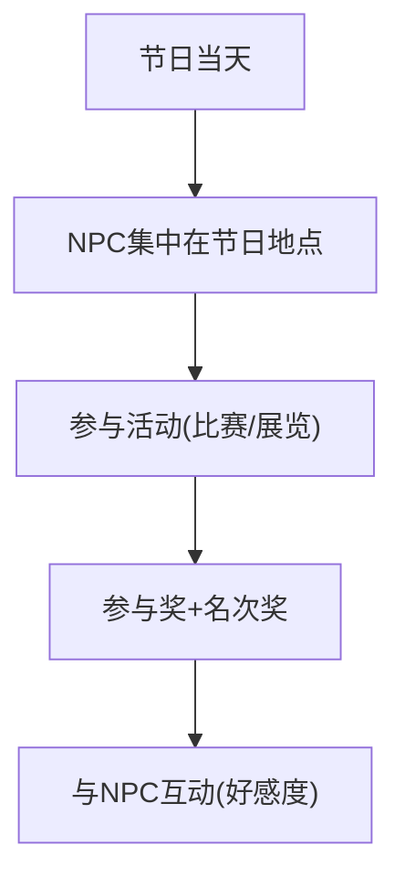

图表来源
- [gdd.md:1106-1173](file://gdd.md#L1106-L1173)

章节来源
- [gdd.md:1106-1173](file://gdd.md#L1106-L1173)

### 技能专精系统
- 数据模型
  - 技能列表：耕种/采矿/采集/钓鱼/战斗，升级方式与主要解锁。
  - 专精选择：5级二选一、10级基于5级的二选一，不可重置。
- 业务逻辑
  - 专精树提供差异化加成（产值、价格、速度、暴击等）。
- 安全保护
  - 状态机保护：不可重置，选择后锁定。
- 关联关系
  - 与工具/设施/价格加成联动，影响经济曲线。

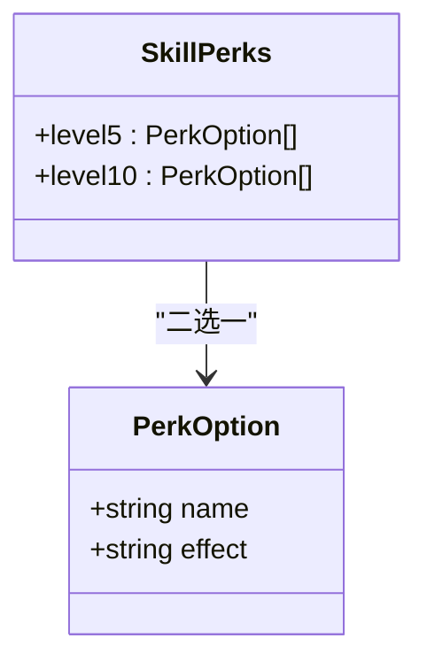

图表来源
- [gdd.md:819-850](file://gdd.md#L819-L850)

章节来源
- [gdd.md:819-850](file://gdd.md#L819-L850)

### 地图与区域系统
- 数据模型
  - 区域：中文名、核心功能、大小、解锁条件、连接区域、传送点。
  - 关键地点：NPC关联、营业时间、功能、室内场景。
  - 传送耗时：步行/巴士/船，现实时间与动画加载。
- 业务逻辑
  - 区域解锁与主线推进相关，传送点便捷移动。
- 安全保护
  - 传送耗时与加载动画保障体验流畅。
- 关联关系
  - 与NPC日程、天气影响、节日活动联动。

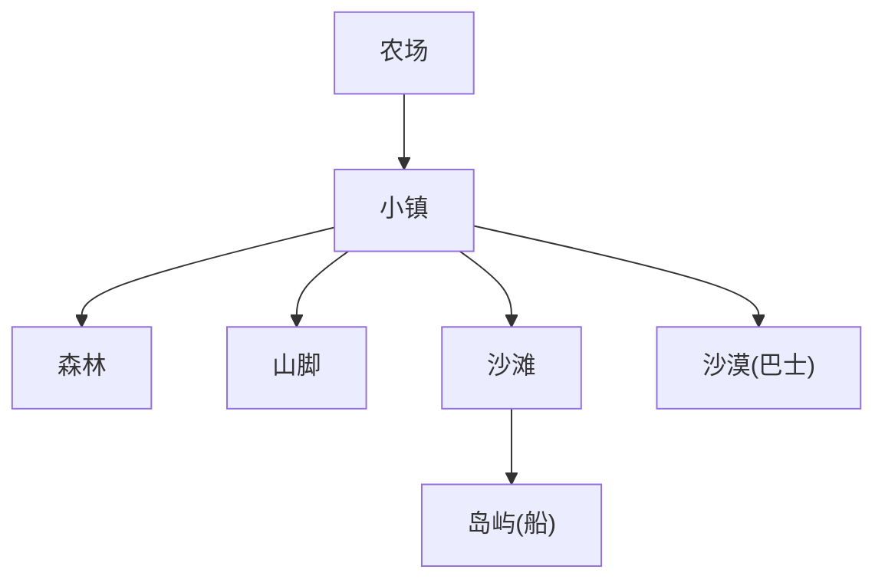

图表来源
- [gdd.md:135-176](file://gdd.md#L135-L176)

章节来源
- [gdd.md:135-176](file://gdd.md#L135-L176)

## 依赖关系分析
本节从耦合与内聚角度审视系统依赖，识别直接/间接依赖与潜在环路，并评估外部依赖与集成点。

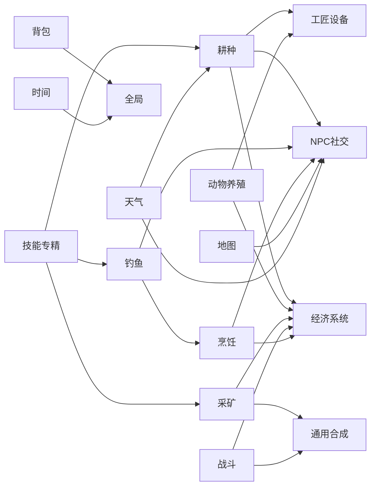

图表来源
- [gdd.md:1180-1220](file://gdd.md#L1180-L1220)
- [gdd.md:1256-1271](file://gdd.md#L1256-L1271)

章节来源
- [gdd.md:1176-1295](file://gdd.md#L1176-L1295)

## 性能与安全考量
- 性能目标
  - PC/手机均目标60fps，加载时间<3s/<5s，内存占用<500MB/<200MB，包体<50MB。
  - 优化策略：对象池复用、延迟加载非关键资源、粒子/动画数量限制、脏矩形检查。
- 安全防护（七维熔断）
  - 游戏循环：帧时间上限、迭代次数上限、看门狗定时器。
  - 渲染：精灵上限、粒子上限、纹理内存限制、瓦片裁剪。
  - 网络：速率限制、消息大小限制、连接超时、状态校验。
  - 内存与资源：场景切换清理、缓存上限、对象池上限。
  - 存档与数据：原子写入、sha256校验、数值边界、备份恢复。
  - 状态机与逻辑：状态转换守卫、NPC日程回退、任务一致性检查、ID校验。
  - 文件系统与I/O：文件大小限制、白名单扩展、设置文件校验与回退。
  - 联机专项：人数上限、主机负载保护、消息队列保护、作弊预防。

章节来源
- [gdd.md:1748-1779](file://gdd.md#L1748-L1779)
- [gdd.md:1780-1888](file://gdd.md#L1780-L1888)

## 故障排查指南
- 存档异常
  - 检测：校验失败/解析错误/字段缺失
  - 恢复：恢复备份/创建新档/提示用户
  - 回退：使用自动存档
- 网络异常
  - 检测：超时/心跳丢失/连接拒绝
  - 恢复：自动重连/5秒重试/提示重试
  - 回退：离线模式继续
- 资源加载异常
  - 检测：超时/HTTP404/解码错误
  - 恢复：跳过并使用占位/重试一次/使用回退纹理
- 渲染异常
  - 检测：WebGL上下文丢失/内存不足
  - 恢复：重启渲染器/降低画质/重载场景
- 任务状态异常
  - 检测：目标计数不匹配/前置缺失/完成标记缺失
  - 恢复：自动修复/重置到检查点/标记失败
- 玩家位置异常
  - 检测：越界/碰撞内/低于地面
  - 恢复：传送到出生点/最后安全点/推出墙体
- 时间系统异常
  - 检测：时间倒退/跳跃超过1小时/跳过一天
  - 恢复：回退到最近有效值/钳制到有效范围
  - 回退：强制睡觉并保存

章节来源
- [gdd.md:1890-1945](file://gdd.md#L1890-L1945)

## 结论
《山野小村》的核心系统设计以“舒适循环、内容密度、有机整合”为基石，通过严谨的数据模型、清晰的业务逻辑与完善的安全防护，构建了14个相互滋养的系统闭环。开发者可依据本文档提供的接口定义、数值规则与流程图，快速实现并集成各系统，确保体验一致性与稳定性。

## 附录：接口与数据模型速查
- 时间系统
  - 时间流速规则、每日分段、安全保护
- 经济系统
  - 售价计算公式、经济曲线目标、安全保护
- 耕种系统
  - CropData接口、肥料规则、洒水器规则、安全保护
- 动物养殖
  - AnimalFriendship接口、数量上限
- 工具升级
  - 工具列表、升级规则、能效映射
- NPC社交
  - NPCFriendship接口、日程系统、对话系统数据结构
- 战斗系统
  - CombatRules接口、武器类型、怪物掉落
- 钓鱼系统
  - FishingRules接口、小游戏规则、鱼类分布
- 工匠设备
  - 设备清单与日产值
- 烹饪系统
  - Recipe接口、首发食谱全表
- 通用合成
  - 配方清单与用途
- 背包系统
  - 容量与堆叠规则
- 任务/剧情
  - QuestData接口、主线结构、社区中心献祭
- 节日系统
  - 节日日程与通用规则
- 技能专精
  - SkillPerks接口、专精树
- 地图与区域
  - 区域设定、关键地点、传送耗时

章节来源
- [gdd.md:193-235](file://gdd.md#L193-L235)
- [gdd.md:237-332](file://gdd.md#L237-L332)
- [gdd.md:379-476](file://gdd.md#L379-L476)
- [gdd.md:478-515](file://gdd.md#L478-L515)
- [gdd.md:517-549](file://gdd.md#L517-L549)
- [gdd.md:551-711](file://gdd.md#L551-L711)
- [gdd.md:713-766](file://gdd.md#L713-L766)
- [gdd.md:768-818](file://gdd.md#L768-L818)
- [gdd.md:851-862](file://gdd.md#L851-L862)
- [gdd.md:889-963](file://gdd.md#L889-L963)
- [gdd.md:964-994](file://gdd.md#L964-L994)
- [gdd.md:995-1016](file://gdd.md#L995-L1016)
- [gdd.md:1017-1105](file://gdd.md#L1017-L1105)
- [gdd.md:1106-1173](file://gdd.md#L1106-L1173)
- [gdd.md:819-850](file://gdd.md#L819-L850)
- [gdd.md:135-176](file://gdd.md#L135-L176)