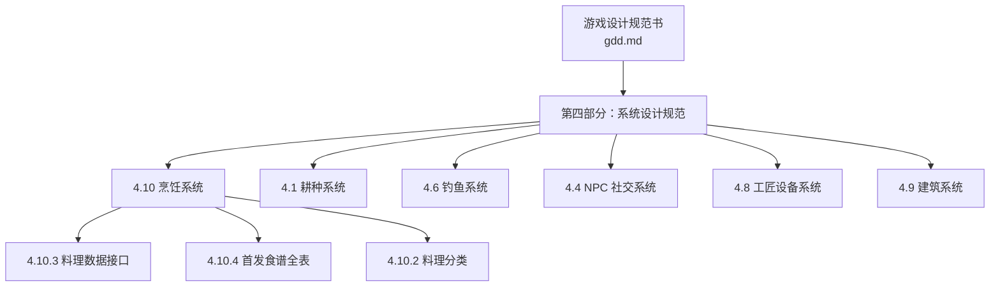
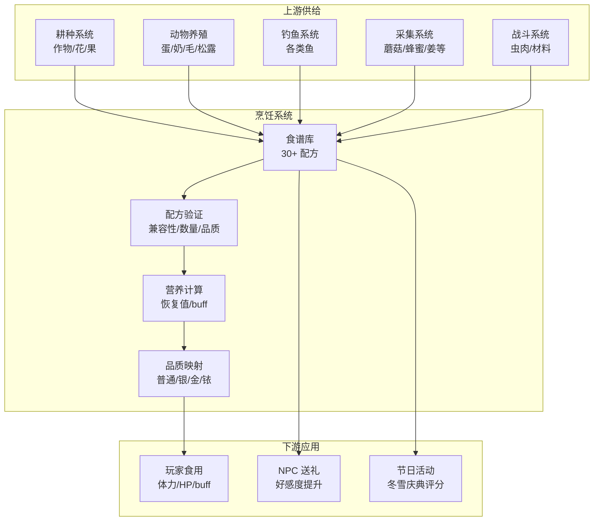
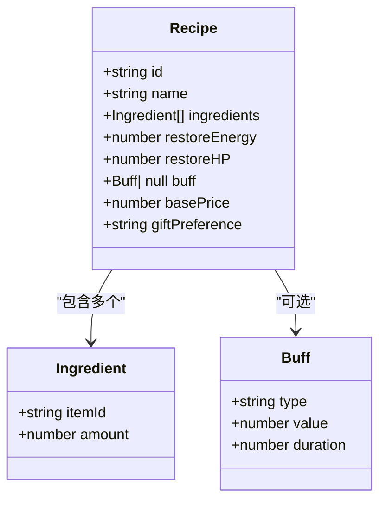
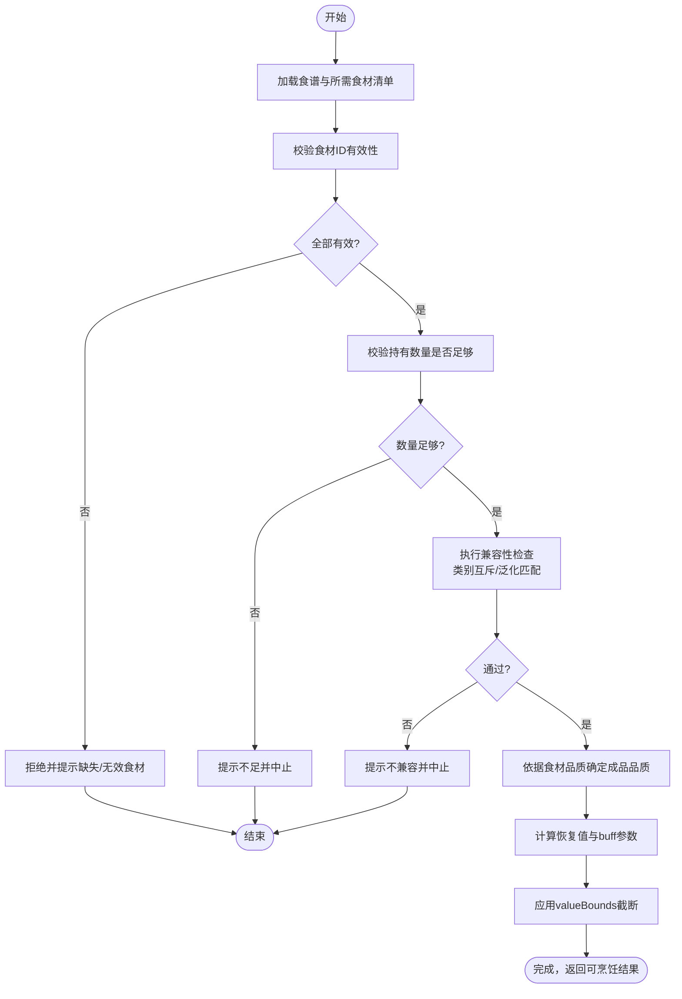
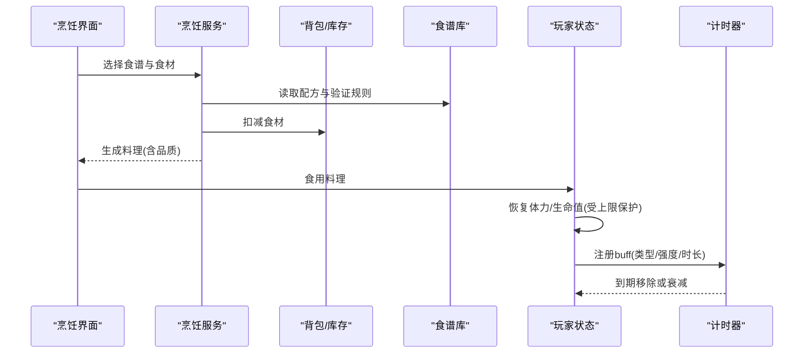
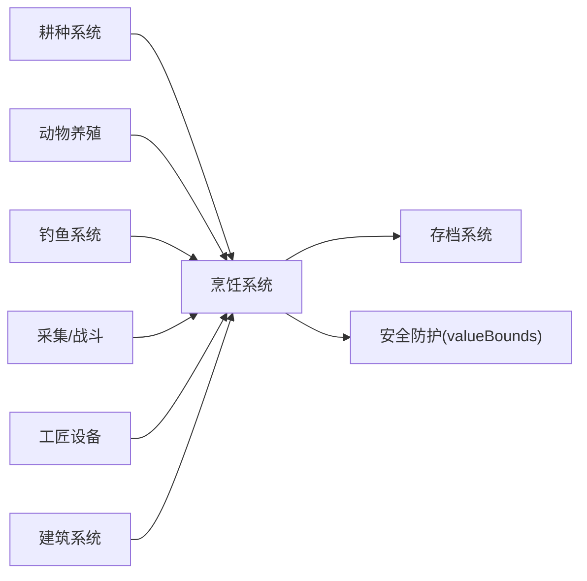

# 烹饪系统

<cite>
**本文引用的文件**   
- [gdd.md](file://gdd.md)
</cite>

## 目录
1. [引言](#引言)
2. [项目结构](#项目结构)
3. [核心组件](#核心组件)
4. [架构总览](#架构总览)
5. [详细组件分析](#详细组件分析)
6. [依赖分析](#依赖分析)
7. [性能考虑](#性能考虑)
8. [故障排查指南](#故障排查指南)
9. [结论](#结论)
10. [附录](#附录)

## 引言
本技术文档围绕《山野小村》的“烹饪系统”展开，目标是提供一份面向开发与策划的权威参考：覆盖30+菜谱的食材搭配、属性增益与持续时间管理、料理品质体系、配方验证与数值安全、以及与耕种/钓鱼/NPC社交等系统的联动。文档同时给出数据结构定义、关键流程时序图与流程图，帮助读者快速理解并落地实现。

## 项目结构
本项目为设计文档驱动型仓库，当前仅包含游戏设计规范书（GDD），其中第4章对“烹饪系统”进行了完整规范定义，包括数据接口、首发食谱全表、分类与效果说明，以及与其他系统的整合关系。

图表来源
- [gdd.md:889-963](file://gdd.md#L889-L963)
- [gdd.md:379-476](file://gdd.md#L379-L476)
- [gdd.md:768-818](file://gdd.md#L768-L818)
- [gdd.md:551-668](file://gdd.md#L551-L668)
- [gdd.md:851-862](file://gdd.md#L851-L862)
- [gdd.md:863-888](file://gdd.md#L863-L888)

章节来源
- [gdd.md:889-963](file://gdd.md#L889-L963)

## 核心组件
- 食谱数据结构：统一使用 Recipe 接口描述，包含基础信息、所需食材、恢复值、可选 buff、售价与送礼偏好。
- 料理分类：体力恢复、属性增益、特殊效果、礼物四类，分别对应不同玩法目标与数值表现。
- 首发食谱全表：30+ 条，覆盖蔬菜、水果、谷物、鱼、采集物与怪物掉落等多类原料，兼顾日常恢复与战斗/采矿/钓鱼等场景加成。
- 品质影响：食材品质将影响成品效果（与通用经济/品质体系一致）。
- 解锁与场所：房屋等级≥2 解锁厨房；食谱通过看电视/购买/NPC好感度获得。

章节来源
- [gdd.md:889-963](file://gdd.md#L889-L963)

## 架构总览
烹饪系统处于资源加工与体验反馈的关键节点：上游承接耕种、动物养殖、钓鱼、采集与战斗掉落；下游输出体力恢复、临时 buff、NPC 送礼价值与节日活动评分。

图表来源
- [gdd.md:889-963](file://gdd.md#L889-L963)
- [gdd.md:379-476](file://gdd.md#L379-L476)
- [gdd.md:768-818](file://gdd.md#L768-L818)
- [gdd.md:551-668](file://gdd.md#L551-L668)

## 详细组件分析

### 数据结构与类型契约
- 食谱对象字段：id、name、ingredients、restoreEnergy、restoreHP、buff（type/value/duration）、basePrice、giftPreference。
- 约束与安全：所有数值受全局 valueBounds 保护，防止溢出或非法状态。

图表来源
- [gdd.md:910-927](file://gdd.md#L910-L927)

章节来源
- [gdd.md:910-927](file://gdd.md#L910-L927)

### 配方验证与食材兼容性检查
- 输入校验：食材 ID 必须存在于物品字典；数量必须为正整数且不超过背包持有量。
- 兼容规则：同一配方中不允许重复冲突的食材（如互斥类别）；若存在“任意鱼×N”的泛化条目，需确保所选鱼满足该配方的口味/稀有度要求。
- 品质判定：根据各食材品质取最高者作为成品品质基准，再按品质系数调整 buff 强度与恢复值。
- 边界保护：任何中间结果均受 valueBounds 截断，避免 NaN/Infinity/越界。

图表来源
- [gdd.md:910-927](file://gdd.md#L910-L927)
- [gdd.md:1841-1857](file://gdd.md#L1841-L1857)

章节来源
- [gdd.md:910-927](file://gdd.md#L910-L927)
- [gdd.md:1841-1857](file://gdd.md#L1841-L1857)

### 营养值计算与 buff 持续时间管理
- 恢复值：restoreEnergy 与 restoreHP 直接叠加至玩家当前值，上限受各自最大值限制。
- buff 类型：speed/farming/mining/fishing/combat/luck，value 表示加成幅度，duration 以游戏分钟计。
- 持续时间管理：采用时间戳或剩余分钟计数两种方式之一；在跨天/睡眠时按策略清零或衰减（建议默认清零，避免长期累积）。
- 品质影响：高品质食材可线性提升 buff 强度或延长时长（具体系数由策划配置，但不得突破 valueBounds）。

图表来源
- [gdd.md:910-927](file://gdd.md#L910-L927)
- [gdd.md:1841-1857](file://gdd.md#L1841-L1857)

章节来源
- [gdd.md:910-927](file://gdd.md#L910-L927)
- [gdd.md:1841-1857](file://gdd.md#L1841-L1857)

### 料理分类与效果矩阵
- 体力恢复：沙拉、煎蛋、汤类等，侧重即时回能回血。
- 属性增益：速度/耕种/采矿/钓鱼/战斗/运气等，持续一定时间，用于特定活动窗口。
- 特殊效果：针对钓鱼/采矿/战斗的专项加成。
- 礼物：高价值料理用于 NPC 送礼，提升好感度。

章节来源
- [gdd.md:901-909](file://gdd.md#L901-L909)

### 首发食谱全表（节选要点）
- 覆盖范围：蔬菜、水果、谷物、鱼类、采集物、怪物材料等。
- 典型示例：田园沙拉（生菜+番茄）、烤鱼（任意鱼+柠檬）、草莓蛋糕（草莓+面粉+蛋）、战士烩（虫肉+辣椒）、南瓜饼（南瓜+面粉+糖）、咖喱（辣椒+土豆+胡萝卜+面粉）等。
- 数值特征：恢复值从低到高分布，部分附带 buff（如耕种+1、钓鱼+1、速度+1/2、战斗+1/2、采矿+1、运气+1），持续时间多为 200-400 游戏分钟区间。

章节来源
- [gdd.md:929-963](file://gdd.md#L929-L963)

### 与耕种系统的关联
- 食材来源：大量蔬菜、水果、谷物、花卉来自耕种系统。
- 品质联动：肥料与洒水器影响作物品质，从而间接提升料理效果。
- 经济闭环：种植→收获→烹饪→出售/送礼→资金→升级工具/设施→更高效种植。

章节来源
- [gdd.md:379-476](file://gdd.md#L379-L476)
- [gdd.md:889-963](file://gdd.md#L889-L963)

### 与钓鱼系统的关联
- 食材来源：河流/海水/矿洞湖等区域产出多种鱼，构成烤鱼、鱼汤等核心料理。
- 天气影响：雨天/雷暴提升咬钩率，利于获取高级鱼用于高价值料理。
- 经济闭环：钓鱼→烹饪→出售/送礼→资金→升级鱼竿/浮标→更高效率。

章节来源
- [gdd.md:768-818](file://gdd.md#L768-L818)
- [gdd.md:889-963](file://gdd.md#L889-L963)

### 与 NPC 社交的关联
- 送礼偏好：多数食谱标注了送礼偏好（最爱/喜欢/一般），用于定向提升好感度。
- 解锁路径：部分食谱通过 NPC 好感度事件解锁，形成“社交→配方→更强料理→更好送礼”的正向循环。
- 节日联动：冬雪庆典以料理评分为核心，推动玩家收集高阶食材与优化配方。

章节来源
- [gdd.md:551-668](file://gdd.md#L551-L668)
- [gdd.md:889-963](file://gdd.md#L889-L963)
- [gdd.md:1106-1173](file://gdd.md#L1106-L1173)

### 与工匠设备的关联
- 原料互补：蜂蜜、油、糖、盐、面粉等常由蜂箱/油榨机/商店/合成获得，作为多道料理的必要辅料。
- 经济放大：通过工匠设备提高原料价值，再投入烹饪形成更高附加值产品。

章节来源
- [gdd.md:851-862](file://gdd.md#L851-L862)
- [gdd.md:889-963](file://gdd.md#L889-L963)

### 与建筑的关联
- 解锁条件：房屋等级≥2 解锁厨房，方可进行烹饪。
- 空间扩展：更高等级房屋带来更大厨房与更多操作位，便于批量制作与节日备战。

章节来源
- [gdd.md:863-888](file://gdd.md#L863-L888)
- [gdd.md:889-963](file://gdd.md#L889-L963)

## 依赖分析
- 内部依赖：
  - 耕种系统：提供绝大多数植物类食材与品质基础。
  - 动物养殖：提供蛋、奶、毛、松露等高价值辅料。
  - 钓鱼系统：提供鱼类食材，支撑特色料理与送礼。
  - 采集/战斗：提供蘑菇、蜂蜜、虫肉等补充性食材。
  - 工匠设备：提供糖、油、蜂蜜等加工产物。
  - 建筑系统：决定能否进入厨房与批量处理能力。
- 外部约束：
  - 数值安全：valueBounds 对所有恢复值、buff 强度与持续时间进行截断保护。
  - 存档一致性：烹饪结果与消耗计入存档，需保证原子写入与完整性校验。

图表来源
- [gdd.md:889-963](file://gdd.md#L889-L963)
- [gdd.md:1841-1857](file://gdd.md#L1841-L1857)

章节来源
- [gdd.md:889-963](file://gdd.md#L889-L963)
- [gdd.md:1841-1857](file://gdd.md#L1841-L1857)

## 性能考虑
- 渲染与交互：烹饪界面仅在厨房内触发，避免全局重绘；批量制作时采用队列处理，避免单帧过多逻辑。
- 数据访问：食谱查找采用哈希索引（按 id 或名称），O(1) 平均复杂度；食材匹配采用预编译的兼容表，减少运行时判断。
- 内存与缓存：常驻食谱库与物品字典，避免频繁 IO；buff 列表采用对象池复用。
- 安全熔断：任何异常分支均走 valueBounds 与状态机保护，确保不会因极端输入导致崩溃或数值溢出。

[本节为通用指导，无需源码引用]

## 故障排查指南
- 常见错误
  - 食材缺失或数量不足：检查背包持有量与配方需求，确认未误删/误售。
  - 食材不兼容：检查类别互斥与泛化匹配（如“任意鱼”是否满足风味要求）。
  - 数值异常：查看 valueBounds 日志，确认是否被截断。
  - 无法烹饪：确认房屋等级≥2 且已解锁厨房。
- 定位方法
  - 打开调试日志，筛选 cooking 相关通道，核对配方验证步骤。
  - 回放最近一次烹饪操作的输入参数与中间结果。
  - 检查 buff 计时器是否存在重复注册或提前清理。

章节来源
- [gdd.md:1841-1857](file://gdd.md#L1841-L1857)
- [gdd.md:889-963](file://gdd.md#L889-L963)

## 结论
烹饪系统以简洁的数据结构与严格的验证/安全机制为核心，向上游聚合多系统产出，向下游提供即时恢复、短时增益与社交价值。通过 30+ 食谱的丰富组合与品质体系，玩家在耕种、钓鱼、采集与战斗中获得的资源得以高效转化为体验正反馈。配合 valueBounds 与状态机保护，系统在复杂交互下仍保持稳定与可预期。

[本节为总结，无需源码引用]

## 附录

### 代码示例路径（无代码内容，仅路径）
- 食谱数据结构定义：[gdd.md:910-927](file://gdd.md#L910-L927)
- 首发食谱全表：[gdd.md:929-963](file://gdd.md#L929-L963)
- 料理分类与规则：[gdd.md:889-909](file://gdd.md#L889-L909)
- 数值安全与边界保护：[gdd.md:1841-1857](file://gdd.md#L1841-L1857)

章节来源
- [gdd.md:889-963](file://gdd.md#L889-L963)
- [gdd.md:1841-1857](file://gdd.md#L1841-L1857)