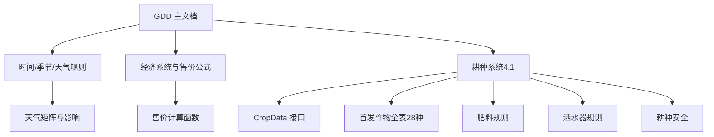
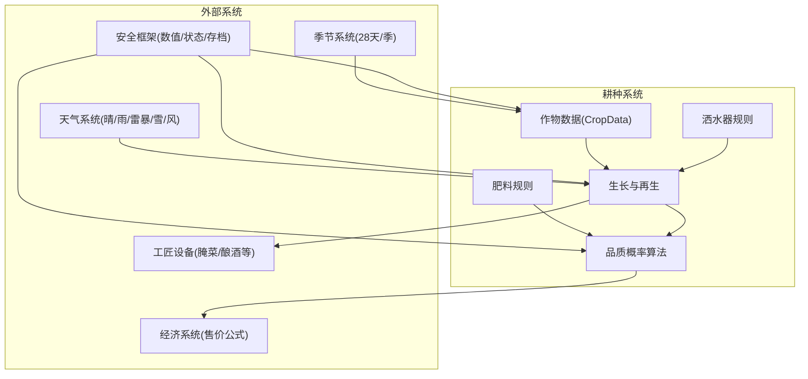
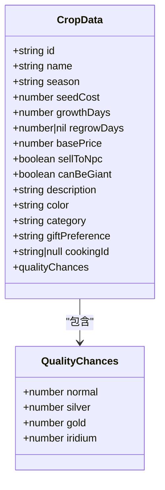
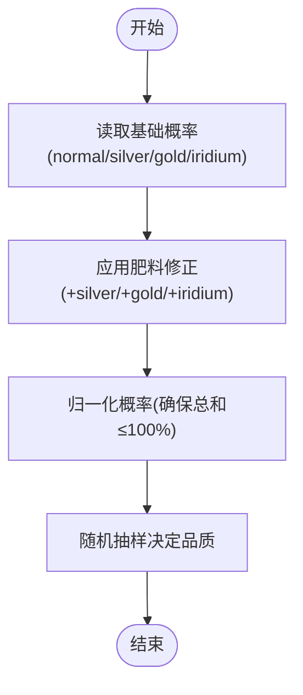
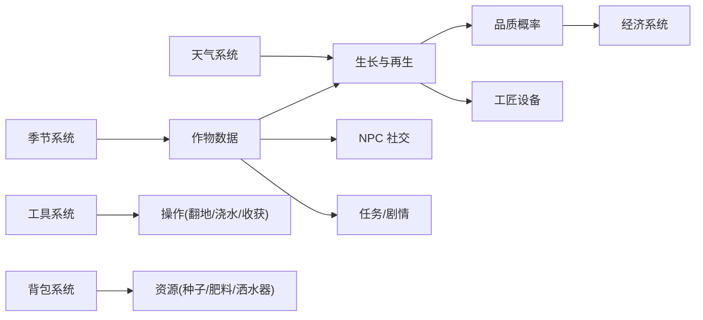

# 耕种系统

<cite>
**本文引用的文件**   
- [gdd.md](file://gdd.md)
</cite>

## 目录
1. [引言](#引言)
2. [项目结构](#项目结构)
3. [核心组件](#核心组件)
4. [架构总览](#架构总览)
5. [详细组件分析](#详细组件分析)
6. [依赖分析](#依赖分析)
7. [性能考虑](#性能考虑)
8. [故障排查指南](#故障排查指南)
9. [结论](#结论)
10. [附录](#附录)

## 引言
本技术文档聚焦《山野小村》的耕种系统，围绕以下目标展开：
- 作物生命周期管理（翻地→播种→浇水→生长→收获）
- 肥料与洒水器系统（概率提升、覆盖范围、保水机制）
- 品质与产量计算机制（基础概率、肥料修正、天气影响）
- 完整 CropData 接口定义与 28 种作物数据表
- 生长天数计算、再生周期处理、天气对生长的影响
- 与季节系统、经济系统、工匠设备的关联关系
- 安全防护措施（数值边界、状态机保护、异常恢复）

## 项目结构
本项目为单一设计文档仓库，所有规则、数据结构与流程均集中于 GDD。耕种系统相关内容主要分布在“第三部分：核心系统规定”和“第四部分：系统设计规范”。

图表来源
- [gdd.md:379-476](file://gdd.md#L379-L476)
- [gdd.md:254-274](file://gdd.md#L254-L274)
- [gdd.md:345-372](file://gdd.md#L345-L372)

章节来源
- [gdd.md:379-476](file://gdd.md#L379-L476)
- [gdd.md:254-274](file://gdd.md#L254-L274)
- [gdd.md:345-372](file://gdd.md#L345-L372)

## 核心组件
- 作物数据模型：CropData 接口定义了作物的唯一标识、名称、季节、种子成本、生长天数、再生间隔、基础售价、是否可巨型化、描述、颜色、类别、送礼偏好、烹饪关联以及品质概率等字段。
- 首发作物全表：按四季列出 28 种作物，包含种子价、生长天数、再生间隔、售价、类别、烹饪用途与送礼偏好。
- 肥料规则：基础/高级/豪华肥料分别提升银星/金星/铱星概率；生长激素加速生长；保湿土降低每日用水消耗概率。
- 洒水器规则：基础/优质/铱洒水器解锁等级不同，覆盖范围分别为十字 4 格、3×3、5×5。
- 耕种安全：地块上限、单次收获上限、生长进度校验等防护。

章节来源
- [gdd.md:389-413](file://gdd.md#L389-L413)
- [gdd.md:415-446](file://gdd.md#L415-L446)
- [gdd.md:448-458](file://gdd.md#L448-L458)
- [gdd.md:460-466](file://gdd.md#L460-L466)
- [gdd.md:468-476](file://gdd.md#L468-L476)

## 架构总览
耕种系统与其他系统的交互如下：
- 与季节系统：作物按季节限定种植窗口，冬季仅有少量作物。
- 与经济系统：基础售价经品质系数与工匠专精加成后形成最终售价，受全局价格保护。
- 与工匠设备：腌菜桶、酿酒桶等设备将作物加工增值，改变产出价值曲线。
- 与天气系统：雨天自动浇水，雪天不生长，大风可能倒伏。
- 与安全框架：数值边界、状态机保护、存档完整性校验贯穿耕种全流程。

图表来源
- [gdd.md:379-476](file://gdd.md#L379-L476)
- [gdd.md:254-274](file://gdd.md#L254-L274)
- [gdd.md:345-372](file://gdd.md#L345-L372)

## 详细组件分析

### 作物数据接口与生命周期
- 接口要点
  - id/name/season：用于识别与季节门控
  - seedCost/growthDays/regrowDays/basePrice：决定种植成本、生长时长、再生周期与基础售价
  - qualityChances：初始品质概率分布（normal/silver/gold/iridium）
  - category/giftPreference/cookingId：与图鉴、社交、烹饪系统的关联键
- 生命周期阶段
  - 播种：检查季节匹配、种子库存、土地状态
  - 浇水：水壶/雨水/洒水器三源，保湿土可降低每日用水消耗概率
  - 生长：按 growthDays 推进，生长激素可缩短实际天数
  - 再生：若 regrowDays 非空，则在收获后进入再生冷却
  - 收获：触发品质判定、数量结算、背包更新、经济入账

章节来源
- [gdd.md:389-413](file://gdd.md#L389-L413)
- [gdd.md:448-458](file://gdd.md#L448-L458)
- [gdd.md:460-466](file://gdd.md#L460-L466)

#### 类图（概念映射到接口）

图表来源
- [gdd.md:389-413](file://gdd.md#L389-L413)

### 28 种作物数据表
以下为按季节分类的首发作物清单（含种子价、生长天数、再生间隔、售价、类别、烹饪用途、送礼偏好）。该表可直接作为开发数据源使用。

- 春季
  - 防风草：种子 20g，生长 4 天，一次性，售价 35g，蔬菜，防风草汤，一般
  - 土豆：种子 30g，生长 6 天，一次性，售价 80g，蔬菜，薯饼，小鹿
  - 草莓：种子 60g，生长 8 天，再生 4 天，售价 120g，水果，草莓蛋糕，小鹿❤️
  - 蓝调草：种子 25g，生长 7 天，一次性，售价 50g，花，沙拉，灵溪
  - 番茄：种子 30g，生长 11 天，再生 4 天，售价 60g，蔬菜，番茄酱，小暖
  - 胡萝卜：种子 20g，生长 5 天，一次性，售价 45g，蔬菜，胡萝卜汤，阿杰
  - 生菜：种子 15g，生长 6 天，一次性，售价 40g，蔬菜，田园沙拉，一般
  - 豌豆：种子 25g，生长 10 天，再生 3 天，售价 45g，蔬菜，豌豆粥，一般

- 夏季
  - 蓝莓：种子 50g，生长 13 天，再生 4 天，售价 80g，水果，蓝莓酱，灵溪❤️
  - 辣椒：种子 25g，生长 5 天，再生 3 天，售价 90g，蔬菜，辣味炖菜，石头
  - 玉米：种子 30g，生长 14 天，再生 4 天，售价 50g，谷物，玉米浓汤，一般
  - 西瓜：种子 80g，生长 12 天，一次性，售价 200g，水果，果汁，阿杰
  - 秋葵：种子 30g，生长 10 天，再生 3 天，售价 60g，蔬菜，秋葵汤，一般
  - 向日葵：种子 40g，生长 8 天，一次性，售价 30g，花，—，小鹿❤️
  - 南瓜：种子 60g，生长 13 天，一次性，售价 150g，蔬菜，南瓜饼，小暖
  - 红豆：种子 25g，生长 9 天，再生 3 天，售价 55g，谷物，红豆汤，一般

- 秋季
  - 茄子：种子 30g，生长 7 天，再生 5 天，售价 60g，蔬菜，烤茄子，一般
  - 葡萄：种子 40g，生长 10 天，再生 3 天，售价 80g，水果，葡萄酒，灵溪
  - 白菜：种子 25g，生长 6 天，一次性，售价 70g，蔬菜，泡菜，一般
  - 红薯：种子 40g，生长 8 天，一次性，售价 100g，蔬菜，烤红薯，阿杰❤️
  - 小麦：种子 15g，生长 4 天，一次性，售价 25g，谷物，面包，一般
  - 玫瑰：种子 50g，生长 10 天，一次性，售价 100g，花，—，小鹿❤️
  - 山药：种子 30g，生长 7 天，一次性，售价 60g，蔬菜，山药汤，阿杰
  - 辣椒(秋)：种子 35g，生长 8 天，一次性，售价 75g，蔬菜，咖喱，石头

- 冬季
  - 雪莲：种子 50g，生长 7 天，一次性，售价 120g，花，药茶，隐士
  - 冬根：种子 20g，生长 6 天，一次性，售价 40g，蔬菜，—，一般
  - 水晶花：种子 80g，生长 12 天，一次性，售价 150g，花，—，法师
  - 冰莓：种子 40g，生长 10 天，再生 3 天，售价 90g，水果，冰莓汁，小暖

章节来源
- [gdd.md:415-446](file://gdd.md#L415-L446)

### 肥料效果矩阵
- 基础肥料：银星概率 +10%（从 20%→30%）
- 高级肥料：金星概率 +15%（从 8%→23%）
- 豪华肥料：铱星概率 +10%（从 2%→12%）
- 生长激素：生长速度 +10%（天数×0.9）
- 高级生长激素：生长速度 +20%（天数×0.8）
- 保湿土：保水概率 30%（每天 30% 概率不消耗水）
- 高级保湿土：保水概率 60%（每天 60% 概率不消耗水）

章节来源
- [gdd.md:448-458](file://gdd.md#L448-L458)

### 洒水器覆盖范围规则
- 基础洒水器：耕种 2 级解锁，十字 4 格
- 优质洒水器：耕种 6 级解锁，3×3 覆盖
- 铱洒水器：耕种 9 级解锁，5×5 覆盖

章节来源
- [gdd.md:460-466](file://gdd.md#L460-L466)

### 生长天数计算与再生周期
- 基础生长：以 crop.growthDays 为准，逐日推进
- 生长激素修正：根据肥料等级乘以 0.9 或 0.8 的系数
- 再生周期：当 regrowDays 非空时，收获后进入再生冷却，冷却结束后再次成熟可重复收获
- 天气影响：雪天不生长；雨天自动浇水；大风可能导致倒伏（增加额外风险）

章节来源
- [gdd.md:448-458](file://gdd.md#L448-L458)
- [gdd.md:345-372](file://gdd.md#L345-L372)

### 天气对生长的影响
- 晴天：正常生长
- 小雨：自动浇水（减少玩家操作）
- 雷暴：自动浇水，但存在潜在风险（如闪电伤害设施）
- 雪：不生长
- 大风：倒伏概率上升（+15%），影响产量或品质

章节来源
- [gdd.md:345-372](file://gdd.md#L345-L372)

### 品质概率算法
- 基础概率：normal 70%，silver 20%，gold 8%，iridium 2%
- 肥料修正：
  - 基础肥料：silver +10%
  - 高级肥料：gold +15%
  - 豪华肥料：iridium +10%
- 算法步骤（概念流程）
  - 读取基础概率
  - 应用肥料修正
  - 归一化确保总和不超过 100%
  - 随机抽样确定最终品质

图表来源
- [gdd.md:389-413](file://gdd.md#L389-L413)
- [gdd.md:448-458](file://gdd.md#L448-L458)

### 与季节系统、经济系统、工匠设备的关联
- 季节系统：作物仅在对应季节可种植；冬季仅少数作物可用
- 经济系统：最终售价 = 基础售价 × 品质系数 × 工匠专精倍率；受全局价格保护（防 NaN/Infinity）
- 工匠设备：腌菜桶、酿酒桶等将作物加工为高附加值产品，改变收益曲线

章节来源
- [gdd.md:254-274](file://gdd.md#L254-L274)
- [gdd.md:415-446](file://gdd.md#L415-L446)

### 安全防护措施
- 数值边界：金钱、体力、HP、好感度、物品堆叠、技能等级均有上下界保护
- 状态机保护：非法状态转移回滚并记录日志
- 存档完整性：sha256 校验、原子写入、备份槽位、损坏恢复
- 渲染与循环保护：帧时间限制、粒子上限、纹理内存上限、对象池上限
- 网络通信保护：速率限制、消息大小限制、连接超时、状态校验

章节来源
- [gdd.md:1780-1888](file://gdd.md#L1780-L1888)
- [gdd.md:1841-1857](file://gdd.md#L1841-L1857)
- [gdd.md:1859-1868](file://gdd.md#L1859-L1868)
- [gdd.md:1870-1877](file://gdd.md#L1870-L1877)
- [gdd.md:1879-1888](file://gdd.md#L1879-L1888)

## 依赖分析
耕种系统的关键依赖关系如下：
- 输入依赖
  - 季节系统：决定可种植作物集合
  - 天气系统：影响浇水与生长
  - 工具系统：锄头翻地、水壶浇水、镰刀收割
  - 背包系统：种子/肥料/洒水器/成品存储
- 输出依赖
  - 经济系统：出售收入
  - 工匠设备：加工增值
  - NPC 社交：礼物偏好与送礼
  - 任务/剧情：社区中心献祭、节日比赛

图表来源
- [gdd.md:379-476](file://gdd.md#L379-L476)
- [gdd.md:254-274](file://gdd.md#L254-L274)

章节来源
- [gdd.md:379-476](file://gdd.md#L379-L476)
- [gdd.md:254-274](file://gdd.md#L254-L274)

## 性能考虑
- 大量作物渲染：启用精灵上限与裁剪策略，避免单帧过多绘制
- 生长与再生计算：批量更新，避免每帧遍历全部地块
- 品质判定：在收获时进行，不在日常循环中频繁计算
- 洒水器覆盖：预计算覆盖区域，缓存结果以减少重复计算

[本节为通用指导，无需具体文件引用]

## 故障排查指南
- 常见问题
  - 作物未生长：检查天气是否为雪天；确认是否被浇水；查看是否有生长激素
  - 品质异常：核对肥料是否生效；检查概率归一化逻辑
  - 洒水器无效：确认覆盖范围与放置位置；检查解锁等级
  - 数值溢出：核查 valueBounds 保护是否生效
- 定位方法
  - 查看安全日志（safetyLogEntry）
  - 检查状态机转换是否合法
  - 验证存档完整性（checksum）

章节来源
- [gdd.md:1947-1969](file://gdd.md#L1947-L1969)
- [gdd.md:1859-1868](file://gdd.md#L1859-L1868)
- [gdd.md:1841-1857](file://gdd.md#L1841-L1857)

## 结论
耕种系统通过清晰的 CropData 接口、完整的 28 种作物数据、明确的肥料与洒水器规则，以及与季节、天气、经济、工匠系统的深度整合，构建了稳定且可扩展的农场玩法。配合全面的安全防护机制，系统在数值与状态层面具备较强的鲁棒性，适合长期开发与内容扩展。

[本节为总结，无需具体文件引用]

## 附录

### TypeScript 代码示例（路径引用）
- 作物状态机实现（概念流程）
  - 参考路径：[gdd.md:379-476](file://gdd.md#L379-L476)
- 浇水检测逻辑（雨水/洒水器/保湿土）
  - 参考路径：[gdd.md:448-458](file://gdd.md#L448-L458)
- 收获判定流程（品质概率与售价计算）
  - 参考路径：[gdd.md:389-413](file://gdd.md#L389-L413)
  - 参考路径：[gdd.md:254-274](file://gdd.md#L254-L274)

章节来源
- [gdd.md:379-476](file://gdd.md#L379-L476)
- [gdd.md:389-413](file://gdd.md#L389-L413)
- [gdd.md:254-274](file://gdd.md#L254-L274)