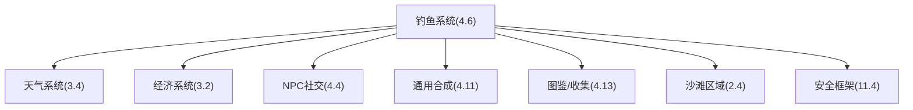
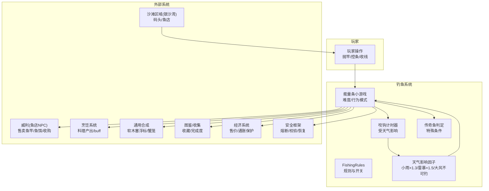
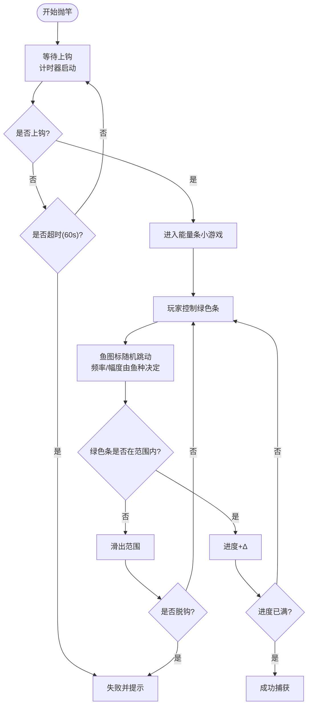
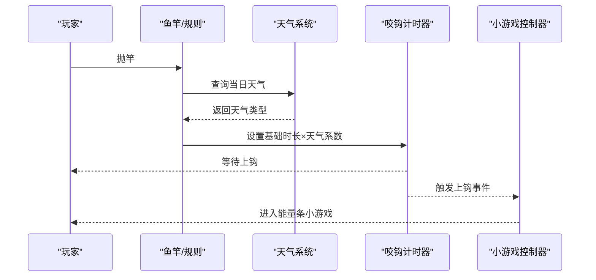
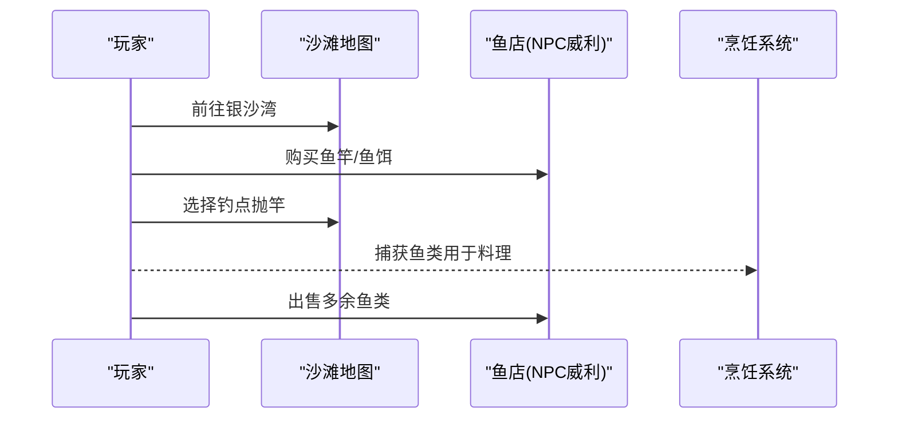
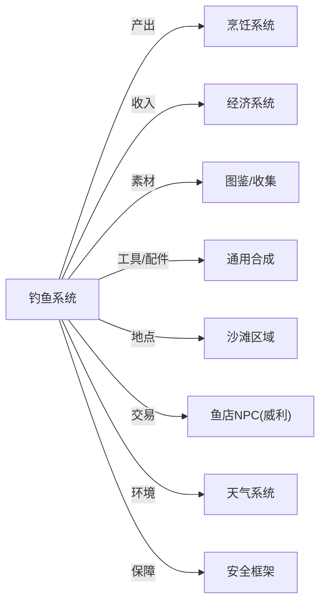

# 钓鱼系统

<cite>
**本文引用的文件**   
- [gdd.md](file://gdd.md)
</cite>

## 目录
1. [引言](#引言)
2. [项目结构](#项目结构)
3. [核心组件](#核心组件)
4. [架构总览](#架构总览)
5. [详细组件分析](#详细组件分析)
6. [依赖关系分析](#依赖关系分析)
7. [性能与安全考虑](#性能与安全考虑)
8. [故障排查指南](#故障排查指南)
9. [结论](#结论)
10. [附录](#附录)

## 引言
本技术文档围绕《山野小村》的钓鱼系统，系统化梳理其机制、数据与实现要点。内容覆盖：
- 钓鱼小游戏机制（能量条控制）
- 鱼类分布规律与行为模式
- 渔具配件系统与难度调节
- FishingRules 接口定义
- 咬钩时间计算与天气影响因子
- 与沙滩地图、鱼店 NPC、烹饪系统的关联
- 完整鱼类数据表与传奇鱼捕获条件
- 安全防护措施，防止小游戏卡死与数值异常

## 项目结构
本项目为设计文档驱动型仓库，当前包含一份全局游戏设计文档（GDD），其中第 4.6 节集中定义了钓鱼系统规则、数据与交互约束；同时多处章节对钓鱼系统有交叉引用（如天气、经济、NPC、合成、图鉴等）。

图表来源
- [gdd.md:768-818](file://gdd.md#L768-L818)
- [gdd.md:345-373](file://gdd.md#L345-L373)
- [gdd.md:237-332](file://gdd.md#L237-L332)
- [gdd.md:551-668](file://gdd.md#L551-L668)
- [gdd.md:964-994](file://gdd.md#L964-L994)
- [gdd.md:1017-1105](file://gdd.md#L1017-L1105)
- [gdd.md:135-176](file://gdd.md#L135-L176)
- [gdd.md:1780-1888](file://gdd.md#L1780-L1888)

章节来源
- [gdd.md:768-818](file://gdd.md#L768-L818)
- [gdd.md:135-176](file://gdd.md#L135-L176)
- [gdd.md:345-373](file://gdd.md#L345-L373)
- [gdd.md:237-332](file://gdd.md#L237-L332)
- [gdd.md:551-668](file://gdd.md#L551-L668)
- [gdd.md:964-994](file://gdd.md#L964-L994)
- [gdd.md:1017-1105](file://gdd.md#L1017-L1105)
- [gdd.md:1780-1888](file://gdd.md#L1780-L1888)

## 核心组件
本节聚焦钓鱼系统的关键抽象与数据契约，便于后续实现与联调。

- FishingRules 接口
  - 作用：统一钓鱼系统能力边界与默认参数，作为各子系统对接的契约。
  - 关键字段：鱼竿等级、首发鱼种数量、传奇鱼数量、默认上钩时间、是否启用能量条小游戏、蟹笼与鱼塘等扩展开关。
  - 参考路径：[FishingRules 接口定义:772-782](file://gdd.md#L772-L782)

- 钓鱼小游戏规则
  - 类型：能量条控制
  - 目标：将绿色条保持在“鱼图标”范围内
  - 难度：不同鱼类的跳动频率与幅度不同
  - 成功/失败：进度条填满即成功；脱钩则消耗鱼饵
  - 安全保护：超时退出、行为模式异常回退
  - 参考路径：[钓鱼小游戏规则:784-801](file://gdd.md#L784-L801)

- 鱼类分布与用途
  - 按区域/季节/难度/售价/用途组织，形成与烹饪、送礼、收藏的闭环
  - 参考路径：[鱼类分布表:803-818](file://gdd.md#L803-L818)

章节来源
- [gdd.md:772-782](file://gdd.md#L772-L782)
- [gdd.md:784-801](file://gdd.md#L784-L801)
- [gdd.md:803-818](file://gdd.md#L803-L818)

## 架构总览
钓鱼系统处于“资源获取—加工增值—社交反馈”的正向循环中，并与天气、经济、NPC、合成、图鉴等系统紧密耦合。

图表来源
- [gdd.md:768-818](file://gdd.md#L768-L818)
- [gdd.md:345-373](file://gdd.md#L345-L373)
- [gdd.md:237-332](file://gdd.md#L237-L332)
- [gdd.md:964-994](file://gdd.md#L964-L994)
- [gdd.md:1017-1105](file://gdd.md#L1017-L1105)
- [gdd.md:135-176](file://gdd.md#L135-L176)
- [gdd.md:1780-1888](file://gdd.md#L1780-L1888)

## 详细组件分析

### 钓鱼小游戏：能量条控制算法
- 输入：鼠标/触屏上下移动控制绿色条位置
- 状态机：等待上钩→上钩后进入控条阶段→成功/失败
- 控条逻辑：
  - 鱼图标范围由目标鱼的“行为模式”决定（频率、振幅）
  - 玩家需将绿色条维持在范围内，累积进度至满
  - 超出范围或脱钩则失败并消耗鱼饵
- 难度曲线：随鱼种类提升而提高（简单/中等/困难/传奇）
- 安全保护：
  - 超时保护：60 秒无操作自动退出
  - 行为模式异常保护：发现不合理跳动回归默认模式
- 参考路径：
  - [钓鱼小游戏规则:784-801](file://gdd.md#L784-L801)
  - [安全框架-游戏循环/渲染/数值保护:1780-1888](file://gdd.md#L1780-L1888)

图表来源
- [gdd.md:784-801](file://gdd.md#L784-L801)
- [gdd.md:1780-1888](file://gdd.md#L1780-L1888)

章节来源
- [gdd.md:784-801](file://gdd.md#L784-L801)
- [gdd.md:1780-1888](file://gdd.md#L1780-L1888)

### 咬钩时间与天气影响因子
- 默认上钩时间：在 FishingRules 中定义基准时长
- 天气影响矩阵：
  - 晴天：正常
  - 小雨：咬钩速度 ×1.3
  - 雷暴：咬钩速度 ×1.5
  - 雪：冰洞钓鱼（特殊场景）
  - 大风：无法钓鱼
- 参考路径：
  - [FishingRules 默认上钩时间:772-782](file://gdd.md#L772-L782)
  - [天气影响矩阵（钓鱼行）:356-366](file://gdd.md#L356-L366)

图表来源
- [gdd.md:772-782](file://gdd.md#L772-L782)
- [gdd.md:356-366](file://gdd.md#L356-L366)

章节来源
- [gdd.md:772-782](file://gdd.md#L772-L782)
- [gdd.md:356-366](file://gdd.md#L356-L366)

### 鱼类行为模式与难度分级
- 行为模式维度：
  - 频率：慢/中/快/极快
  - 振幅：小/中/大/极大
  - 随机性：低/中/高/极高
- 难度映射：
  - 简单鱼（如鲫鱼）：慢频小幅
  - 中等鱼（如鲈鱼）：中频中幅
  - 困难鱼（如金枪鱼）：快速大幅
  - 传奇鱼（如冰川鱼）：随机模式、极快
- 参考路径：
  - [钓鱼小游戏规则中的行为描述:784-801](file://gdd.md#L784-L801)
  - [鱼类分布表（含难度/用途）:803-818](file://gdd.md#L803-L818)

章节来源
- [gdd.md:784-801](file://gdd.md#L784-L801)
- [gdd.md:803-818](file://gdd.md#L803-L818)

### 渔具配件系统与难度调节
- 配件与设施：
  - 软木塞浮标：减少控条滑动，降低难度
  - 蟹笼：被动捕蟹/虾，与钓鱼技能联动
- 解锁方式：通过“通用合成”配方获得
- 难度调节：
  - 浮标降低控条灵敏度
  - 技能专精“诱饵大师”可取消鱼饵消耗（间接提升效率）
- 参考路径：
  - [通用合成-软木塞浮标/蟹笼:987-989](file://gdd.md#L987-L989)
  - [技能专精-钓鱼相关选项:843-849](file://gdd.md#L843-L849)

章节来源
- [gdd.md:987-989](file://gdd.md#L987-L989)
- [gdd.md:843-849](file://gdd.md#L843-L849)

### 与沙滩地图、鱼店 NPC、烹饪系统的关联
- 沙滩地图（银沙湾）：
  - 功能：钓鱼、码头、鱼店
  - 传送：小镇南→沙滩
- 鱼店 NPC（威利）：
  - 营业：08:00-17:00
  - 功能：出售鱼竿/鱼饵、收购鱼类
- 烹饪系统：
  - 鱼类作为食材参与料理制作，提供体力恢复与属性增益
  - 部分料理可作为礼物提升 NPC 好感度
- 参考路径：
  - [沙滩区域说明:140-146](file://gdd.md#L140-L146)
  - [鱼店营业时间与功能:161-162](file://gdd.md#L161-L162)
  - [NPC 日程（威利）:649-655](file://gdd.md#L649-L655)
  - [食谱示例（烤鱼/鱼汤等）:931-963](file://gdd.md#L931-L963)

图表来源
- [gdd.md:140-146](file://gdd.md#L140-L146)
- [gdd.md:161-162](file://gdd.md#L161-L162)
- [gdd.md:649-655](file://gdd.md#L649-L655)
- [gdd.md:931-963](file://gdd.md#L931-L963)

章节来源
- [gdd.md:140-146](file://gdd.md#L140-L146)
- [gdd.md:161-162](file://gdd.md#L161-L162)
- [gdd.md:649-655](file://gdd.md#L649-L655)
- [gdd.md:931-963](file://gdd.md#L931-L963)

### 完整鱼类数据表（首发 20 种）
以下为基于设计文档整理的鱼类清单，涵盖区域、季节、难度、售价与用途，便于直接落地到数据表与配置。

- 小镇河流
  - 鲫鱼：春/夏/秋，★☆☆，约 50g，烹饪食材
  - 鲤鱼：春/夏/秋，★☆☆，约 50g，烹饪食材
  - 鲶鱼：春/夏/秋，★☆☆，约 50g，烹饪食材
- 森林溪流
  - 虹鳟鱼：春/夏，★★☆，约 80g，烹饪/NPC 送礼
  - 鲈鱼：春/夏，★★☆，约 80g，烹饪/NPC 送礼
  - 香鱼：春/夏，★★☆，约 80g，烹饪/NPC 送礼
  - 锦鲤：全季，★★☆，约 180g，收藏/NPC 送礼
- 沙滩海水
  - 沙丁鱼：全季，★★☆，约 120g，高级料理
  - 金枪鱼：全季，★★☆，约 120g，高级料理
  - 比目鱼：全季，★★☆，约 120g，高级料理
  - 海鲈：全季，★★☆，约 120g，高级料理
  - 河豚：夏季，★★★，约 250g，高级料理（需处理）
- 矿洞地下湖
  - 岩浆鳅：全季，★★★，约 200g，特殊 buff 料理
  - 石斑鱼：全季，★★★，约 200g，特殊 buff 料理
  - 灯笼鱼：深层，★★★，约 280g，特殊 buff 料理
- 冬季限定
  - 冰川鱼：冬季，★★★，约 300g，传奇鱼·收藏
  - 冰梭：冬季，★★★，约 300g，收藏
- 夜间限定
  - 夜行鱼：夏/秋夜，★★☆，约 150g，NPC 送礼
  - 月光鱼：夏/秋夜，★★☆，约 150g，NPC 送礼
- 秋季河流
  - 鳗鱼：秋夜，★★☆，约 120g，烹饪/NPC 送礼
- 鱼塘养殖
  - 同种鱼繁殖：全季，★☆☆，约 100g，鱼卵→加工

章节来源
- [gdd.md:803-818](file://gdd.md#L803-L818)

### 传奇鱼捕获条件
- 候选：冰川鱼（冬季限定）、其他未明确标注的传奇鱼（以 FishingRules 中“传奇鱼=3”为准）
- 捕获条件建议（结合设计原则与防护要求）：
  - 季节/时段限制：仅冬季或特定夜晚出现
  - 天气限制：避开大风天；雨天/雷暴可能提升出现概率
  - 地点限制：特定水域（如深海/矿洞深层）
  - 难度上限：极快跳动与高随机性，配合浮标降低难度
  - 防卡死保护：强制超时退出与异常回退
- 参考路径：
  - [FishingRules 传奇鱼数量:772-782](file://gdd.md#L772-L782)
  - [鱼类分布（冬季/夜间/深层）:803-818](file://gdd.md#L803-L818)
  - [小游戏安全保护:784-801](file://gdd.md#L784-L801)

章节来源
- [gdd.md:772-782](file://gdd.md#L772-L782)
- [gdd.md:803-818](file://gdd.md#L803-L818)
- [gdd.md:784-801](file://gdd.md#L784-L801)

### 成功判定逻辑与数值安全
- 成功判定：
  - 控条阶段内，绿色条持续位于鱼图标范围内达到阈值即成功
  - 脱钩判定：超出范围且累计滑出次数超过容错阈值
- 数值安全：
  - 进度值、滑出计数、超时计时均受安全框架保护
  - 价格/收益受经济系统保护（最大值、通胀检查）
- 参考路径：
  - [钓鱼小游戏规则:784-801](file://gdd.md#L784-L801)
  - [经济系统保护](file://gdd.md:237-L332)
  - [安全框架-数值边界/存档校验](file://gdd.md:1780-L1888)

章节来源
- [gdd.md:784-801](file://gdd.md#L784-L801)
- [gdd.md:237-332](file://gdd.md#L237-L332)
- [gdd.md:1780-1888](file://gdd.md#L1780-L1888)

## 依赖关系分析
钓鱼系统对外部系统的依赖与供给关系如下：

图表来源
- [gdd.md:768-818](file://gdd.md#L768-L818)
- [gdd.md:345-373](file://gdd.md#L345-L373)
- [gdd.md:237-332](file://gdd.md#L237-L332)
- [gdd.md:964-994](file://gdd.md#L964-L994)
- [gdd.md:1017-1105](file://gdd.md#L1017-L1105)
- [gdd.md:135-176](file://gdd.md#L135-L176)
- [gdd.md:1780-1888](file://gdd.md#L1780-L1888)

章节来源
- [gdd.md:768-818](file://gdd.md#L768-L818)
- [gdd.md:345-373](file://gdd.md#L345-L373)
- [gdd.md:237-332](file://gdd.md#L237-L332)
- [gdd.md:964-994](file://gdd.md#L964-L994)
- [gdd.md:1017-1105](file://gdd.md#L1017-L1105)
- [gdd.md:135-176](file://gdd.md#L135-L176)
- [gdd.md:1780-1888](file://gdd.md#L1780-L1888)

## 性能与安全考虑
- 性能
  - 小鱼群/粒子控制在合理范围内，避免帧率抖动
  - 小游戏控条逻辑轻量，优先保证响应性
- 安全
  - 小游戏超时保护（60 秒）
  - 行为模式异常回退（防止无限跳动）
  - 数值边界保护（金钱、物品堆叠、技能等级等）
  - 存档完整性校验与原子写入
- 参考路径：
  - [安全框架-游戏循环/渲染/网络/内存/数据/状态机/I/O/联机](file://gdd.md:1780-L1888)
  - [钓鱼小游戏安全保护](file://gdd.md:784-L801)

章节来源
- [gdd.md:784-801](file://gdd.md#L784-L801)
- [gdd.md:1780-1888](file://gdd.md#L1780-L1888)

## 故障排查指南
- 常见问题
  - 小游戏卡死：检查超时保护与行为模式异常回退是否生效
  - 咬钩时间异常：核对天气影响因子与默认时长乘积
  - 售价异常：确认经济系统价格上限与通胀检查
  - 存档不一致：检查完整性校验与自动修复策略
- 定位步骤
  - 查看日志通道：gameplay/network/safety/performance/save
  - 回放关键事件：抛竿→上钩→控条→结果
  - 验证边界值：进度、滑出次数、超时计时、金钱变化
- 参考路径：
  - [错误恢复流程](file://gdd.md:1890-L1945)
  - [日志与诊断系统](file://gdd.md:1947-L1969)
  - [钓鱼小游戏安全保护](file://gdd.md:784-L801)

章节来源
- [gdd.md:1890-1945](file://gdd.md#L1890-L1945)
- [gdd.md:1947-1969](file://gdd.md#L1947-L1969)
- [gdd.md:784-801](file://gdd.md#L784-L801)

## 结论
钓鱼系统以 FishingRules 为契约，围绕能量条小游戏构建核心体验，并通过天气、配件、NPC、烹饪与图鉴等系统形成正向反馈。设计文档提供了明确的规则、数据与防护要求，可直接指导实现与测试。建议在开发中严格遵循安全框架，确保小游戏流畅稳定、数值健康可控。

## 附录
- 术语
  - 能量条小游戏：通过控制绿色条位置维持与目标区间一致的小游戏
  - 咬钩时间：从抛竿到鱼上钩的时间间隔，受天气影响
  - 软木塞浮标：降低控条滑动速度的配件
  - 蟹笼：被动捕蟹/虾的设施
- 参考路径
  - [FishingRules 接口](file://gdd.md:772-L782)
  - [钓鱼小游戏规则](file://gdd.md:784-L801)
  - [鱼类分布表](file://gdd.md:803-L818)
  - [通用合成-配件](file://gdd.md:987-L989)
  - [天气影响矩阵](file://gdd.md:356-L366)
  - [经济系统保护](file://gdd.md:237-L332)
  - [安全框架](file://gdd.md:1780-L1888)