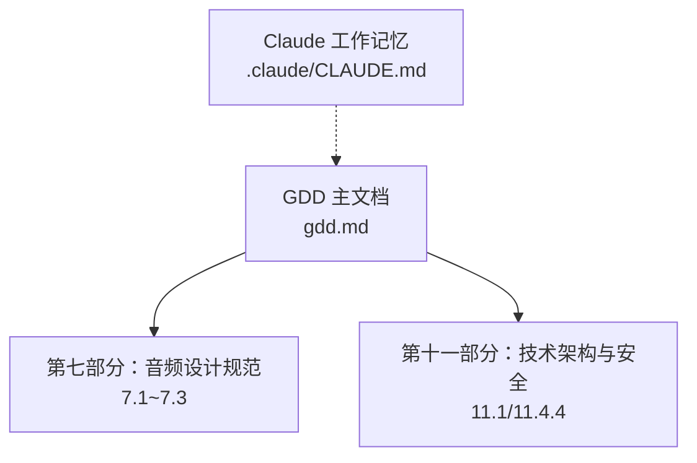
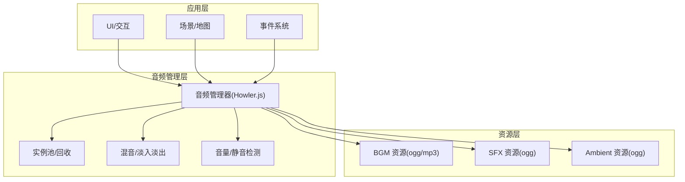
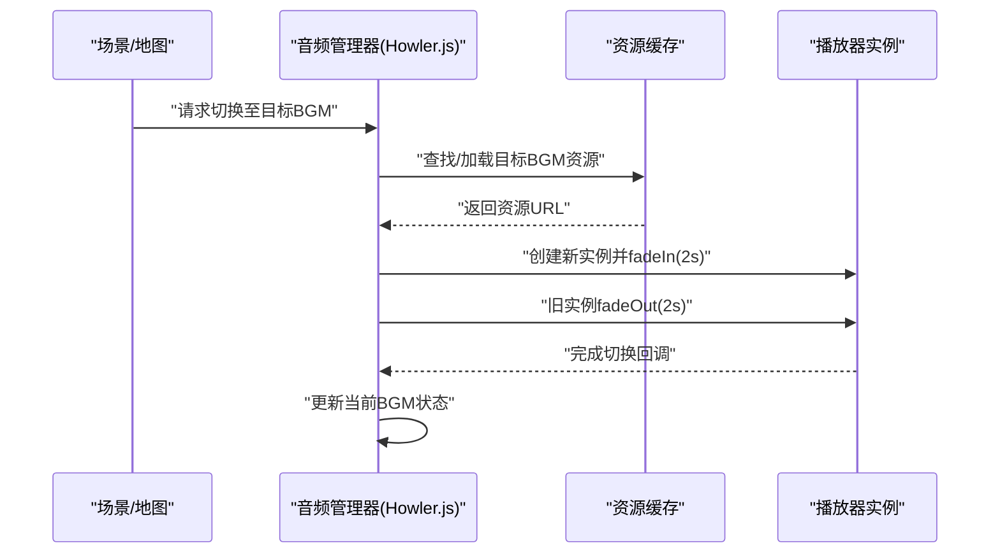
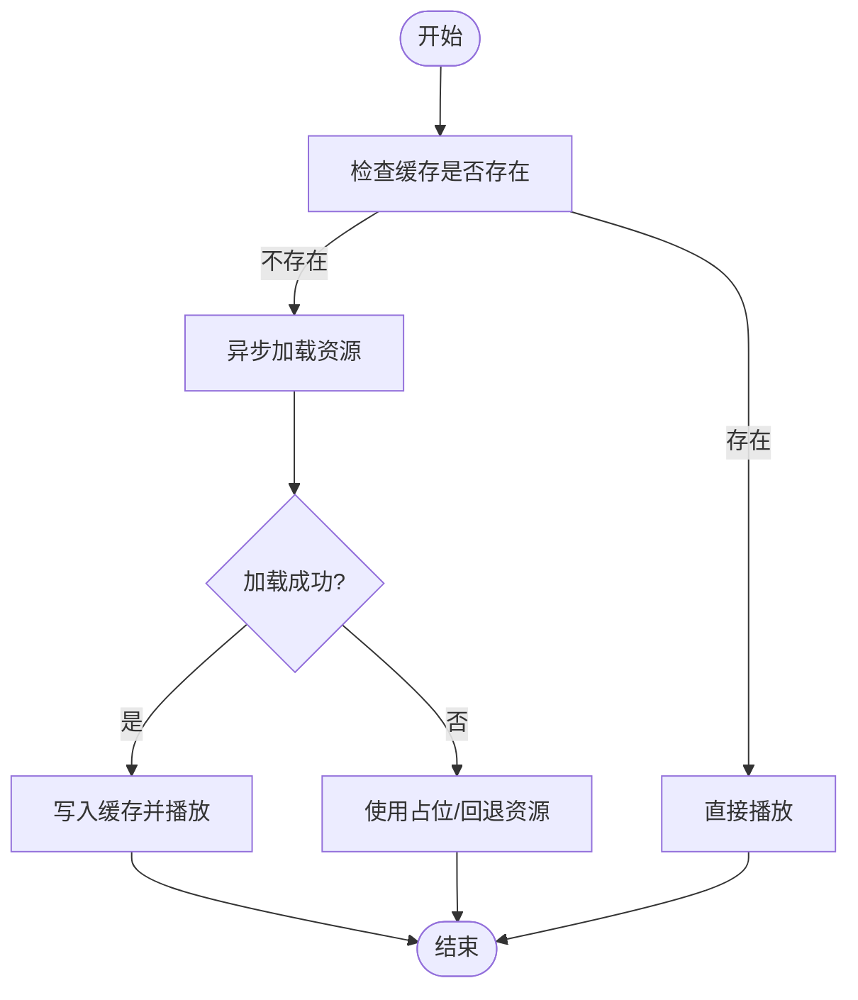
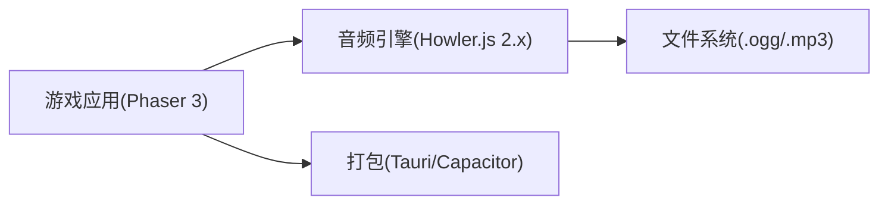

# 音频设计规范

<cite>
**本文引用的文件**   
- [gdd.md](file://gdd.md)
</cite>

## 目录
1. [引言](#引言)
2. [项目结构](#项目结构)
3. [核心组件](#核心组件)
4. [架构总览](#架构总览)
5. [详细组件分析](#详细组件分析)
6. [依赖分析](#依赖分析)
7. [性能考虑](#性能考虑)
8. [故障排查指南](#故障排查指南)
9. [结论](#结论)
10. [附录](#附录)

## 引言
本规范面向《山野小村》的音频设计与集成，统一音乐场景情绪分类、BGM切换逻辑与环境音效设计；明确音效命名规范、文件格式与音量平衡标准；说明 Howler.js 集成的技术实现、资源管理与性能优化策略；并提供不同场景的音乐风格指导（田园宁静、紧张战斗、温馨社交等）。同时给出音频文件组织结构、动态加载机制与内存控制方案，为音频设计师与程序开发人员提供一致的制作与集成标准。

## 项目结构
本项目为游戏设计文档仓库，当前包含 GDD 主文档与 Claude 工作记忆。音频相关规范集中于 GDD 第七部分“音频设计规范”以及第十一部分“技术架构与安全防护规定”。

图表来源
- [gdd.md:1408-1449](file://gdd.md#L1408-L1449)
- [gdd.md:1720-1734](file://gdd.md#L1720-L1734)
- [gdd.md:1830-1839](file://gdd.md#L1830-L1839)

章节来源
- [gdd.md:1408-1449](file://gdd.md#L1408-L1449)
- [gdd.md:1720-1734](file://gdd.md#1720-L1734)
- [gdd.md:1830-1839](file://gdd.md#L1830-L1839)

## 核心组件
- 音乐场景与情绪分类：按区域/时间/事件划分，定义风格、乐器与情绪标签，并给出资源命名约定。
- 音效命名规范：按类别前缀组织，统一后缀与格式。
- 音频技术规范：交叉淡入淡出、环境音分层、动态混音、优先级、联机衰减、静音检测、实例上限回收。
- 技术栈与集成：Howler.js 2.x 作为音频引擎，配合 Phaser 3 渲染与 Tauri/Capacitor 打包。
- 安全与内存：场景切换清理、缓存上限、超时跳过、实例上限保护。

章节来源
- [gdd.md:1408-1449](file://gdd.md#L1408-L1449)
- [gdd.md:1720-1734](file://gdd.md#L1720-L1734)
- [gdd.md:1830-1839](file://gdd.md#L1830-L1839)

## 架构总览
音频子系统围绕 Howler.js 构建，遵循“场景化 BGM + 分层环境音 + 事件音效”的三层模型，并通过全局管理器进行播放、切换、优先级与音量控制。

图表来源
- [gdd.md:1408-1449](file://gdd.md#L1408-L1449)
- [gdd.md:1720-1734](file://gdd.md#L1720-L1734)
- [gdd.md:1830-1839](file://gdd.md#L1830-L1839)

## 详细组件分析

### 音乐场景与情绪分类
- 场景维度：农场四季、矿洞、小镇、森林、沙滩、节日、雷暴等。
- 情绪表达：希望/新生、热情/活力、满足/丰收、宁静/休养、探索/紧张、温馨/归属、空灵/自然、度假/放松、庆祝/欢乐、暴风雨来临等。
- 乐器建议：木吉他、口琴、笛子、尤克里里、铃鼓、大提琴、钢琴、铃铛、低音提琴、合成器、手风琴、小提琴、竖琴、鸟鸣、钢鼓、打击乐等。
- 资源命名：采用语义化前缀+场景标识，如 bgm_spring_farm、bgm_summer_farm、bgm_mine、bgm_town、bgm_forest、bgm_beach、bgm_festival、bgm_storm。

章节来源
- [gdd.md:1408-1449](file://gdd.md#L1408-L1449)

### BGM 切换逻辑
- 切换时机：进入/离开区域、季节变化、天气变化、触发节日或特殊事件。
- 过渡方式：2 秒交叉淡入淡出，避免突兀跳变。
- 优先级：关键反馈 > 环境音 > 音效 > 音乐；同一时刻仅允许一个 BGM 通道活跃。
- 状态机建议：维护当前场景/天气/事件三元组，组合映射到目标 BGM 资源 ID。

章节来源
- [gdd.md:1408-1449](file://gdd.md#L1408-L1449)

### 环境音效与动态混音
- 每区域独立 ambient 层，支持叠加鸟鸣、风声、流水等元素。
- 动态混音：例如进入矿洞时降低高频并增加混响，模拟空间差异。
- 联机音频：其他玩家工具音效需按距离衰减。

章节来源
- [gdd.md:1408-1449](file://gdd.md#L1408-L1449)

### 音效命名规范与格式
- 命名模式：sfx_tool_{name}、sfx_nature_{name}、sfx_animal_{name}、sfx_npc_{action}、sfx_ui_{action}、sfx_combat_{action}、sfx_fish_{action}。
- 示例：sfx_tool_hoe_dig、sfx_nature_bird_01、sfx_animal_chicken、sfx_npc_talk、sfx_ui_click、sfx_combat_sword_swing、sfx_fish_cast。
- 格式：统一使用 .ogg 格式，便于跨平台兼容与体积控制。

章节来源
- [gdd.md:1408-1449](file://gdd.md#L1408-L1449)

### 音量平衡标准
- 优先级顺序：关键反馈 > 环境音 > 音效 > 音乐。
- 手机静音检测：自动降低整体音量或切换到震动提示。
- 建议参考值（以 dBFS 相对基准）：BGM -12dB，Ambient -18dB，SFX -6dB，UI -3dB；根据实际听感微调。

章节来源
- [gdd.md:1408-1449](file://gdd.md#L1408-L1449)

### Howler.js 集成与技术实现
- 技术栈：Phaser 3 渲染 + Howler.js 2.x 音频引擎 + Tauri/Capacitor 打包。
- 集成要点：
  - 初始化单例管理器，封装 load/play/pause/fade/volume/mute。
  - 管理 BGM/Ambient/SFX 三类通道，分别设置循环与淡入淡出参数。
  - 监听页面可见性与设备静音状态，调整播放行为。
  - 结合场景生命周期在切换时释放资源。

章节来源
- [gdd.md:1720-1734](file://gdd.md#L1720-L1734)

### 音频资源管理
- 资源组织建议：
  - assets/audio/bgm/{season_area}.ogg
  - assets/audio/sfx/tool/{tool_action}.ogg
  - assets/audio/sfx/nature/{id}.ogg
  - assets/audio/sfx/animal/{id}.ogg
  - assets/audio/sfx/npc/{action}.ogg
  - assets/audio/sfx/ui/{action}.ogg
  - assets/audio/sfx/combat/{action}.ogg
  - assets/audio/sfx/fish/{action}.ogg
  - assets/audio/ambient/{area}/{layer}.ogg
- 动态加载：
  - 首屏仅加载必要 BGM 与基础 SFX，其余按需懒加载。
  - 预加载相邻区域 BGM/Ambient，减少切换延迟。
- 缓存策略：
  - 限制音频缓存大小（MB），超出则淘汰最久未用项。
  - 场景切换时清理已卸载资源的引用，避免悬挂指针。

章节来源
- [gdd.md:1830-1839](file://gdd.md#L1830-L1839)

### 性能优化策略
- 实例上限与回收：
  - 音频实例上限 64 个，超限回收最久未使用的实例。
  - 对象池复用短促 SFX，减少 GC 压力。
- 淡入淡出与节流：
  - 所有 BGM 切换强制 2s 交叉淡入淡出。
  - 高频 SFX 合并与限流，避免瞬时爆发。
- 移动端适配：
  - 检测静音模式，自动降音量或关闭非关键音频。
  - 优先保证 UI 与关键反馈可感知。

章节来源
- [gdd.md:1408-1449](file://gdd.md#L1408-L1449)
- [gdd.md:1830-1839](file://gdd.md#L1830-L1839)

### 不同场景音乐风格指导
- 田园宁静（春·农场）：轻快、希望与新生，木吉他/口琴/笛子为主。
- 热情活力（夏·农场）：明亮活泼，尤克里里/铃鼓节奏明快。
- 满足丰收（秋·农场）：温暖抒情，木吉他/大提琴铺底。
- 宁静休养（冬·农场）：安详宁静，钢琴/铃铛营造氛围。
- 探索紧张（矿洞）：低沉神秘，低音提琴/合成器增强压迫感。
- 温馨归属（小镇）：悠闲社区，手风琴/小提琴传递人情味。
- 空灵好奇（森林）：自然空灵，竖琴/鸟鸣点缀。
- 度假放松（沙滩）：轻松惬意，吉他/钢鼓营造海风感。
- 庆祝欢乐（节日）：全乐队编排，欢快热烈。
- 暴风雨来临（雷暴）：紧张压抑，打击乐/低音推进。

章节来源
- [gdd.md:1408-1449](file://gdd.md#L1408-L1449)

### 序列流程：BGM 切换与淡入淡出

图表来源
- [gdd.md:1408-1449](file://gdd.md#L1408-L1449)
- [gdd.md:1720-1734](file://gdd.md#L1720-L1734)

### 流程图：音频资源加载与缓存策略

图表来源
- [gdd.md:1830-1839](file://gdd.md#L1830-L1839)

## 依赖分析
- 外部依赖：Howler.js 2.x 作为音频引擎，Phaser 3 负责渲染与场景生命周期。
- 平台打包：Tauri（PC）、Capacitor（手机），确保音频在不同 WebView/Native 容器中的兼容性。
- 资源格式：.ogg/.mp3 等，受文件系统白名单约束。

图表来源
- [gdd.md:1720-1734](file://gdd.md#L1720-L1734)
- [gdd.md:1870-1877](file://gdd.md#L1870-L1877)

章节来源
- [gdd.md:1720-1734](file://gdd.md#L1720-L1734)
- [gdd.md:1870-1877](file://gdd.md#L1870-L1877)

## 性能考虑
- 帧率与加载：目标 PC/手机均 60fps，加载时间 < 3s（PC）/< 5s（手机）。
- 内存占用：PC < 500MB，手机 < 200MB；音频缓存上限 64MB。
- 渲染与对象池：限制粒子/动画数量，复用对象，避免频繁创建销毁。
- 过度优化警示：不牺牲可读性换取微小体积节省，瓶颈集中在循环与绘制。

章节来源
- [gdd.md:1748-1779](file://gdd.md#L1748-L1779)
- [gdd.md:1830-1839](file://gdd.md#L1830-L1839)

## 故障排查指南
- 常见问题定位：
  - 音频无法播放：检查资源路径、格式是否在白名单内、是否被静音模式拦截。
  - 切换卡顿：确认淡入淡出时长与资源预加载策略是否合理。
  - 内存泄漏：场景切换后是否清理了音频实例与缓存引用。
  - 实例超限：是否触发了回收策略，是否有异常堆积。
- 恢复策略：
  - 资源加载失败：跳过并记录日志，使用占位资源或回退资源。
  - 场景切换异常：强制清理纹理/声音实例，必要时重启场景。
  - 存档/数据异常：校验失败时提示恢复备份。

章节来源
- [gdd.md:1830-1839](file://gdd.md#L1830-L1839)
- [gdd.md:1890-1945](file://gdd.md#L1890-L1945)

## 结论
本规范将《山野小村》的音频体系标准化为“场景化 BGM + 分层环境音 + 事件音效”，并以 Howler.js 为核心实现统一的播放、切换与混音策略。通过严格的命名规范、格式要求与音量平衡标准，结合资源动态加载与内存控制，确保跨平台稳定表现与良好用户体验。开发与设计团队应据此执行，并在迭代中持续验证与优化。

## 附录
- 术语表：BGM、SFX、Ambient、淡入淡出、实例、缓存、混音、优先级、静音检测等。
- 变更流程：任何音频相关变更需评估影响范围、安全性与性能，并记录决策。

[本节为通用补充内容，无需具体文件引用]