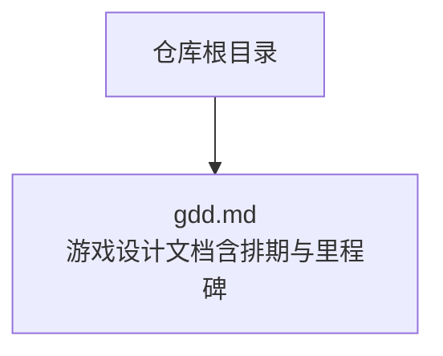
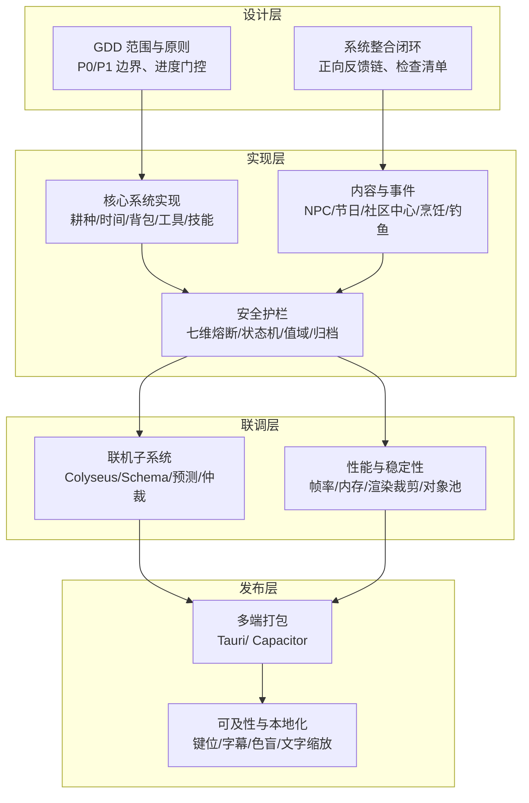
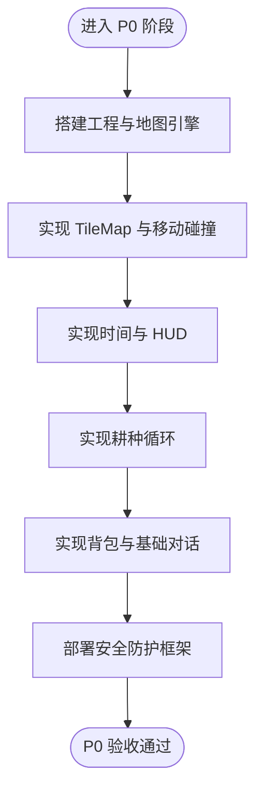
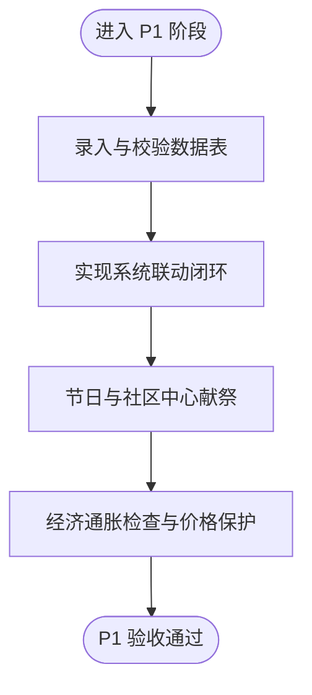
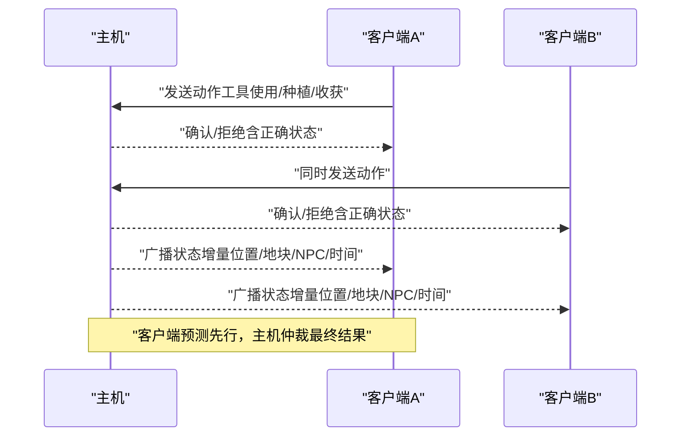
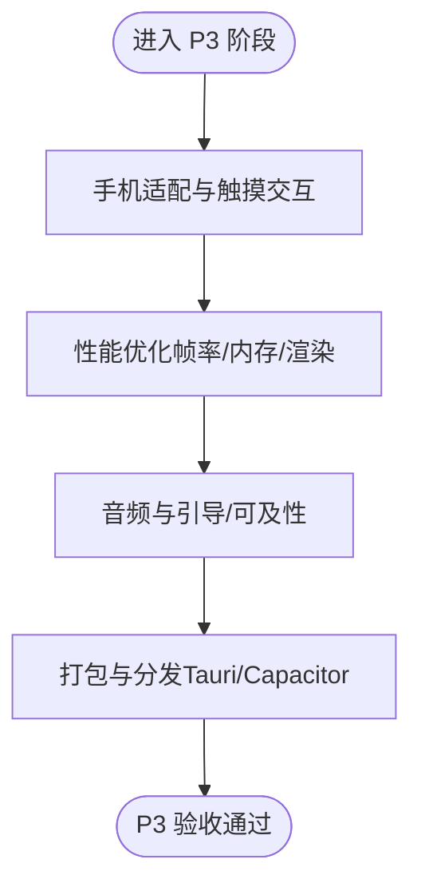
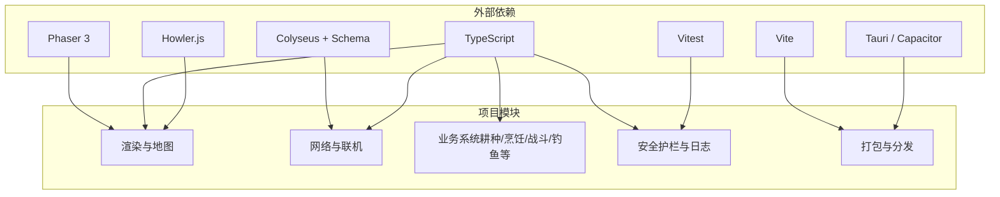
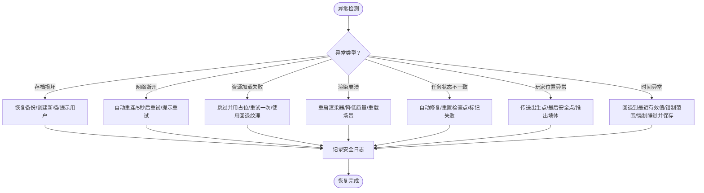

# 项目排期与里程碑

<cite>
**本文引用的文件**   
- [gdd.md](file://gdd.md)
</cite>

## 目录
1. [引言](#引言)
2. [项目结构](#项目结构)
3. [核心组件](#核心组件)
4. [架构总览](#架构总览)
5. [详细组件分析](#详细组件分析)
6. [依赖分析](#依赖分析)
7. [性能考虑](#性能考虑)
8. [故障排查指南](#故障排查指南)
9. [结论](#结论)
10. [附录](#附录)

## 引言
本文件为《山野小村》项目的排期规划与里程碑管理文档，基于游戏设计文档（GDD）中的范围、系统设计与技术约束，形成可执行的阶段划分、交付物清单、质量验收标准、优先级策略、里程碑定义、进度跟踪与风险预警机制，并给出人员配置、任务分解、时间估算、敏捷迭代与冲刺管理方案，以及外部依赖与第三方服务集成策略。目标是确保项目在既定范围内按时高质量交付。

## 项目结构
本项目仓库当前包含：
- 根目录下的 GDD 文档，作为开发唯一设计参照，涵盖 P0/P1 功能边界、系统规范、安全护栏、存档/联机/性能等要求，以及“第十三部分：项目排期与里程碑”的阶段性目标与验收指标。

图表来源
- [gdd.md:1-2175](file://gdd.md#L1-L2175)

章节来源
- [gdd.md:1-2175](file://gdd.md#L1-L2175)

## 核心组件
围绕 P0 核心功能与 P1 扩展功能的范围，结合 GDD 的系统整合闭环与安全护栏，将项目划分为四个阶段：P0 核心原型、P1 内容填充、P2 联机实现、P3 打磨发布。各阶段均对应明确的产出与验收标准，并与安全防护机制对齐。

- P0 核心原型（第1-6周）
  - 目标：完成农耕循环、时间系统、地图移动、背包、基础 UI、安全防护框架。
  - 关键交付：可运行的空白项目、TileMap 加载与碰撞、时间与 HUD、耕种流程、物品管理与对话、七维熔断保护。
  - 关联防护：游戏循环、渲染裁剪、数值边界、状态机校验、存档完整性、内存与资源上限、网络速率限制。

- P1 内容填充（第7-14周）
  - 目标：补齐全部作物、动物、NPC、工具、技能、工匠设备、烹饪、节日、社区中心献祭等。
  - 关键交付：完整数据表（作物/动物/NPC/食谱/鱼类）、系统联动闭环验证、进度门控按季节推进。
  - 关联防护：经济通胀检查、NPC 日程回退、任务一致性修复、值域边界保护。

- P2 联机实现（第15-20周）
  - 目标：Listen Server 模式、局域网/房间码连接、增量同步、客户端预测+主机仲裁、聊天/交易/互助。
  - 关键交付：Colyseus Schema 消息类型、状态同步频率与限流、公平性测试用例、主机过载保护。
  - 关联防护：消息大小/速率限制、位置/金钱变更校验、最大玩家数硬上限、主机带宽与队列保护。

- P3 打磨发布（第21-26周）
  - 目标：手机适配、性能优化、音频本地化、引导与可及性、打包（Tauri/Capacitor）。
  - 关键交付：移动端触摸交互、帧率达标、包体与内存达标、全平台构建产物。
  - 关联防护：纹理缓存上限、场景切换清理、对象池回收、日志与诊断开关。

章节来源
- [gdd.md:2011-2060](file://gdd.md#L2011-L2060)

## 架构总览
从项目管理视角，系统由“设计—实现—联调—发布”四层组成，贯穿安全护栏与验收标准，确保每个子系统在闭环内运行且可度量。

图表来源
- [gdd.md:1176-1295](file://gdd.md#L1176-L1295)
- [gdd.md:1720-1780](file://gdd.md#L1720-L1780)
- [gdd.md:2011-2060](file://gdd.md#L2011-L2060)

## 详细组件分析

### 阶段一：P0 核心原型（第1-6周）
- 目标与范围
  - 搭建 Vite + Phaser + TS 工程；TileMap 加载与滚动地图；玩家移动与碰撞；时间与 HUD；耕种循环；背包与基础对话；安全防护框架。
- 关键任务分解
  - 第1周：脚手架与地图引擎基础
  - 第2周：TileMap 加载、移动与碰撞
  - 第3周：时间系统与基础 UI
  - 第4周：耕种循环（翻地→播种→浇水→收获）
  - 第5周：背包系统、物品数据、NPC 基础对话
  - 第6周：安全防护框架就位（循环/渲染/数据/状态机/IO/网络/内存）
- 交付物
  - 可运行原型、基础 UI、耕种闭环、物品管理、安全护栏基线。
- 质量验收标准
  - 能稳定 60fps（PC），无崩溃；时间流转正确；耕种全流程可用；背包操作正常；安全提示与日志可观测。
- 风险与缓解
  - 渲染卡顿：启用渲染裁剪与精灵上限；内存泄漏：场景切换清理与对象池回收；数值异常：值域边界保护。

图表来源
- [gdd.md:2022-2031](file://gdd.md#L2022-L2031)
- [gdd.md:1780-1888](file://gdd.md#L1780-L1888)

章节来源
- [gdd.md:2022-2031](file://gdd.md#L2022-L2031)
- [gdd.md:1780-1888](file://gdd.md#L1780-L1888)

### 阶段二：P1 内容填充（第7-14周）
- 目标与范围
  - 补齐全部作物、动物、NPC、工具、技能、工匠设备、烹饪、节日、社区中心献祭；完善进度门控与经济曲线。
- 关键任务分解
  - 数据录入与校验（作物/动物/NPC/食谱/鱼类）
  - 系统联动（耕种→烹饪→战斗/采矿；动物→工匠→经济→建筑）
  - 节日与社区中心献祭流程落地
  - 经济通胀检查与价格上限保护
- 交付物
  - 完整内容表、系统闭环验证报告、进度门控按季节推进记录。
- 质量验收标准
  - 系统整合检查清单全部通过；经济曲线符合预期；NPC 日程回退有效；任务一致性修复可用。
- 风险与缓解
  - 内容膨胀导致性能下降：对象池与延迟加载；数值失衡：通胀检查与价格上限；NPC 卡住：默认位置回退。

图表来源
- [gdd.md:1176-1295](file://gdd.md#L1176-L1295)
- [gdd.md:2033-2060](file://gdd.md#L2033-L2060)

章节来源
- [gdd.md:1176-1295](file://gdd.md#L1176-L1295)
- [gdd.md:2033-2060](file://gdd.md#L2033-L2060)

### 阶段三：P2 联机实现（第15-20周）
- 目标与范围
  - Listen Server 模式、局域网/房间码连接、增量同步、客户端预测+主机仲裁、聊天/交易/互助、公平性测试。
- 关键任务分解
  - Colyseus Schema 注册与消息类型定义
  - 状态同步频率与限流策略
  - 客户端预测与冲突回滚
  - 主机过载保护与断线重连
- 交付物
  - 联机协议文档、同步策略说明、公平性测试用例与报告。
- 质量验收标准
  - 多人同时操作一致；钓鱼/战斗本地判定；移动平滑不跳帧；交易双方确认生效；操作速度不受延迟影响。
- 风险与缓解
  - 高延迟导致体验差：客户端预测+插值；消息洪水：速率限制与队列保护；主机过载：降低同步频率或断开最晚加入者。

图表来源
- [gdd.md:1477-1546](file://gdd.md#L1477-L1546)
- [gdd.md:1577-1589](file://gdd.md#L1577-L1589)
- [gdd.md:1819-1828](file://gdd.md#L1819-L1828)

章节来源
- [gdd.md:1477-1546](file://gdd.md#L1477-L1546)
- [gdd.md:1577-1589](file://gdd.md#L1577-L1589)
- [gdd.md:1819-1828](file://gdd.md#L1819-L1828)

### 阶段四：P3 打磨发布（第21-26周）
- 目标与范围
  - 手机适配、性能优化、音频与引导、可及性、打包（Tauri/Capacitor）。
- 关键任务分解
  - 触摸交互与虚拟摇杆、HUD 适配
  - 帧率与内存优化（渲染裁剪、对象池、纹理缓存上限）
  - 音频回退与动态混音、静音检测
  - 打包与分发（PC/手机）
- 交付物
  - 多端构建产物、性能基准报告、可及性清单、打包脚本。
- 质量验收标准
  - PC/手机均稳定 60fps；加载时间达标；包体与内存达标；全平台可运行。
- 风险与缓解
  - 手机端内存不足：纹理缓存上限与场景切换清理；音频实例过多：实例上限与回收；渲染掉帧：粒子与动画数量限制。

图表来源
- [gdd.md:1748-1779](file://gdd.md#L1748-L1779)
- [gdd.md:2033-2060](file://gdd.md#L2033-L2060)

章节来源
- [gdd.md:1748-1779](file://gdd.md#L1748-L1779)
- [gdd.md:2033-2060](file://gdd.md#L2033-L2060)

## 依赖分析
- 内部依赖
  - 系统整合闭环：耕种→烹饪→战斗/采矿；动物→工匠→经济→建筑；采矿→合成→耕种/养殖；战斗→合成；钓鱼→烹饪→NPC 送礼；NPC→玩家→正向循环。
  - 进度门控：按季节解锁区域与系统，确保内容密度与节奏。
- 外部依赖
  - 渲染引擎：Phaser 3
  - 网络框架：Colyseus（含 @colyseus/schema）
  - 构建工具：Vite
  - 语言：TypeScript（strict）
  - 打包：Tauri（PC）、Capacitor（手机）
  - 音频：Howler.js
  - 测试：Vitest

图表来源
- [gdd.md:1720-1734](file://gdd.md#L1720-L1734)
- [gdd.md:1176-1295](file://gdd.md#L1176-L1295)

章节来源
- [gdd.md:1720-1734](file://gdd.md#L1720-L1734)
- [gdd.md:1176-1295](file://gdd.md#L1176-L1295)

## 性能考虑
- 目标指标
  - PC/手机均稳定 60fps；加载时间 < 3s（PC）/< 5s（手机）；内存占用 < 500MB（PC）/< 200MB（手机）；包体 < 50MB。
- 优化策略
  - 减少不必要的重绘（脏矩形检查）；控制对象池大小；限制激活粒子/动画数量；延迟加载非关键资源。
- 安全护栏
  - 单帧时长上限、更新迭代次数上限、看门狗定时器；渲染精灵上限与纹理内存上限；对象池与缓存上限；场景切换清理。

章节来源
- [gdd.md:1748-1779](file://gdd.md#L1748-L1779)
- [gdd.md:1780-1839](file://gdd.md#L1780-L1839)

## 故障排查指南
- 错误恢复流程
  - 存档异常：校验失败→恢复备份→自动存档回退
  - 网络异常：超时/心跳丢失→自动重连→离线模式继续
  - 资源加载异常：超时/404/解码错误→跳过并使用占位→重试一次
  - 渲染异常：WebGL 上下文丢失/OOM→重启渲染器→降低质量→重载场景
  - 任务状态不一致：目标计数不符/前置缺失/完成标记缺失→自动修复→重置到检查点→标记失败
  - 玩家位置异常：越界/穿墙/低于地面→传送出生点/最后安全点→推出墙体→重置农场房屋
  - 时间系统异常：时间倒流/跳跃/跳过天数→回退到最近有效值→钳制到有效范围→强制睡觉并保存
- 日志与诊断
  - 分级日志（debug/info/warn/error/fatal）；通道开关（gameplay/network/safety/performance/save）；日志轮转；安全触发项记录（阈值、动作、系统状态快照）。

图表来源
- [gdd.md:1890-1945](file://gdd.md#L1890-L1945)
- [gdd.md:1947-1969](file://gdd.md#L1947-L1969)

章节来源
- [gdd.md:1890-1945](file://gdd.md#L1890-L1945)
- [gdd.md:1947-1969](file://gdd.md#L1947-L1969)

## 结论
通过将 GDD 中的范围、系统闭环与安全护栏映射到四阶段开发与验收标准，并结合进度门控与风险预警机制，本项目可在 26 周内完成从核心原型到多端发布的完整生命周期。建议在每阶段结束时进行跨系统整合验证与压力测试，确保质量与稳定性。

## 附录

### 人员配置与角色职责
- 制作人/项目经理：负责范围控制、里程碑与风险管理、变更流程执行
- 主程（前端/渲染）：Phaser 3 渲染、TileMap、性能优化、对象池与缓存
- 程序（逻辑/系统）：耕种/烹饪/战斗/钓鱼/工匠/节日/社区中心等系统实现
- 程序（网络/联机）：Colyseus Schema、状态同步、客户端预测、主机仲裁、限流与保护
- 程序（工具/基建）：Vite 构建、Tauri/Capacitor 打包、CI/CD、测试框架（Vitest）
- 策划/内容：数据录入与校验（作物/动物/NPC/食谱/鱼类）、进度门控与平衡
- QA/测试：功能测试、性能压测、联机公平性测试、回归与验收
- 美术/音频：像素素材、音效与音乐、可及性视觉方案

### 任务分解与时间估算（按周）
- P0（第1-6周）：工程与地图（2周）、时间与 UI（1周）、耕种循环（1周）、背包与对话（1周）、安全框架（1周）
- P1（第7-14周）：数据录入与校验（2周）、系统联动与节日（2周）、社区中心献祭（2周）、经济与平衡（2周）
- P2（第15-20周）：Schema 与消息（2周）、同步与预测（2周）、联机功能与测试（2周）
- P3（第21-26周）：手机适配与触摸（2周）、性能优化（2周）、音频与可及性（1周）、打包与分发（1周）

### 敏捷开发流程与冲刺管理
- 迭代周期：2 周一个 Sprint
- 每日站会：同步进度、阻塞问题与风险
- 评审与回顾：每 Sprint 末演示可工作增量，复盘改进
- 需求优先级：MoSCoW（Must/Should/Could/Won't），严格遵循 P0/P1 边界
- 变更流程：任何变更需评估影响范围、是否违反设计原则、是否影响闭环与安全、更新交叉引用与决策表

### 外部依赖与第三方服务集成策略
- 渲染与构建：Phaser 3、Vite、TypeScript（strict）
- 网络：Colyseus + Schema（自动增量同步）
- 打包：Tauri（PC）、Capacitor（手机）
- 音频：Howler.js
- 测试：Vitest
- 集成要点：统一版本锁定、依赖最小化、沙箱与权限控制、离线降级策略

### 进度跟踪方法与风险预警机制
- 进度跟踪
  - 看板与燃尽图：Sprint 任务可视化与剩余工作量跟踪
  - 里程碑检查点：每阶段结束进行整合验证与验收
  - 指标监控：帧率、内存、加载时间、包体大小、联机延迟与丢包率
- 风险预警
  - 阈值告警：单帧时长、更新迭代次数、渲染精灵/粒子上限、内存与缓存上限、网络速率与消息大小
  - 自动恢复：存档/网络/资源/渲染/任务/位置/时间的异常恢复流程
  - 风险清单：按可能性与影响度排序，制定缓解措施与责任人

### 质量验收标准（汇总）
- 功能验收
  - 耕种/时间/背包/工具/技能/烹饪/钓鱼/战斗/工匠/节日/社区中心/存档/联机
  - 系统整合闭环验证通过
- 性能验收
  - PC/手机稳定 60fps；加载时间达标；包体与内存达标
- 安全验收
  - 七维熔断保护全部启用；日志与诊断可观测；错误恢复流程可用
- 可及性与本地化
  - 色盲模式、键位重映射、字幕、文字缩放、触屏与键鼠一致

章节来源
- [gdd.md:2033-2060](file://gdd.md#L2033-L2060)
- [gdd.md:1780-1888](file://gdd.md#L1780-L1888)
- [gdd.md:1947-1969](file://gdd.md#L1947-L1969)