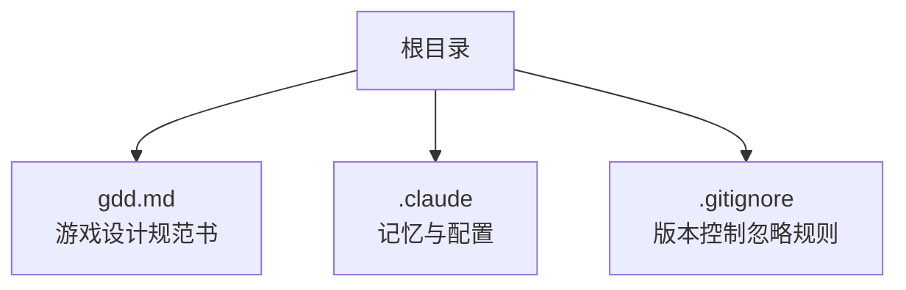
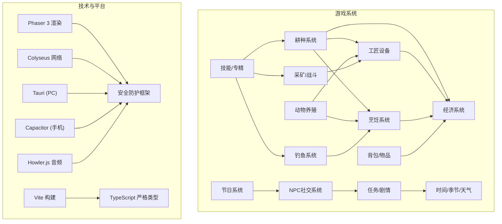
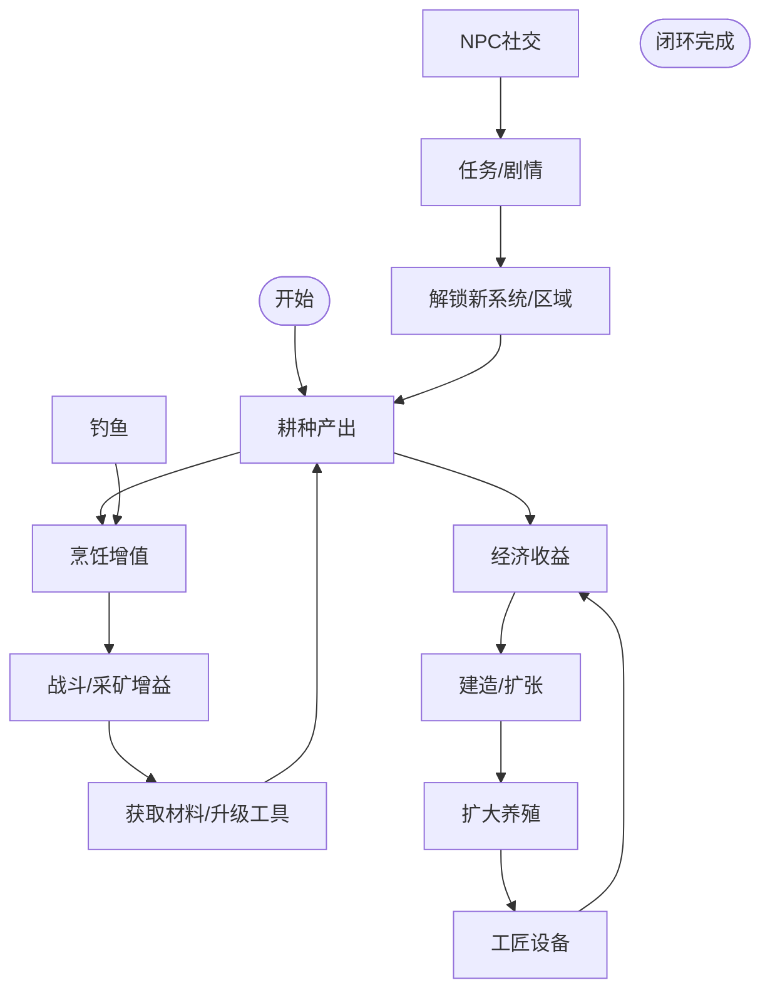
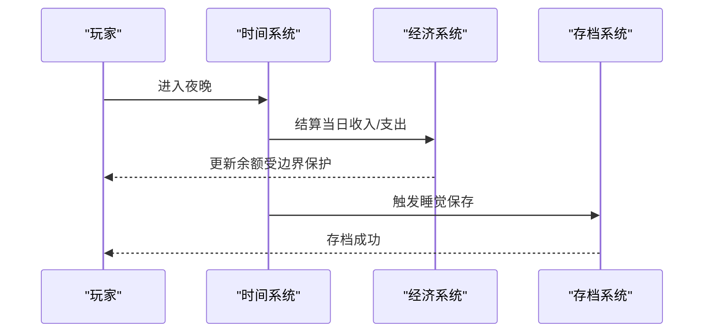
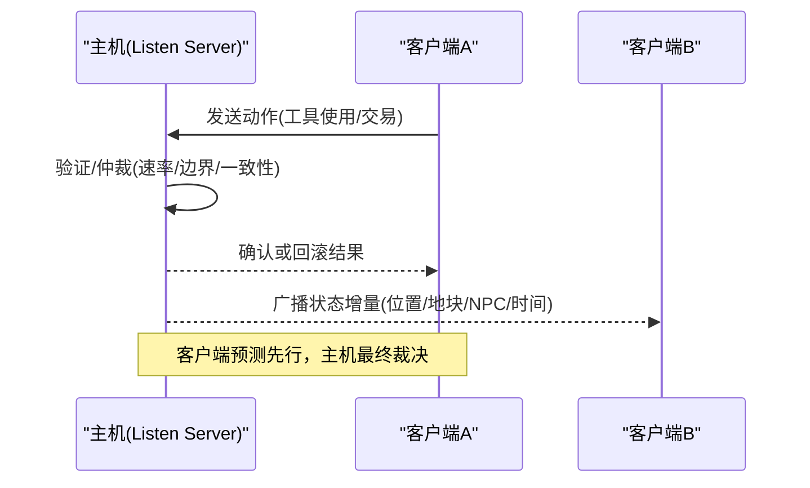
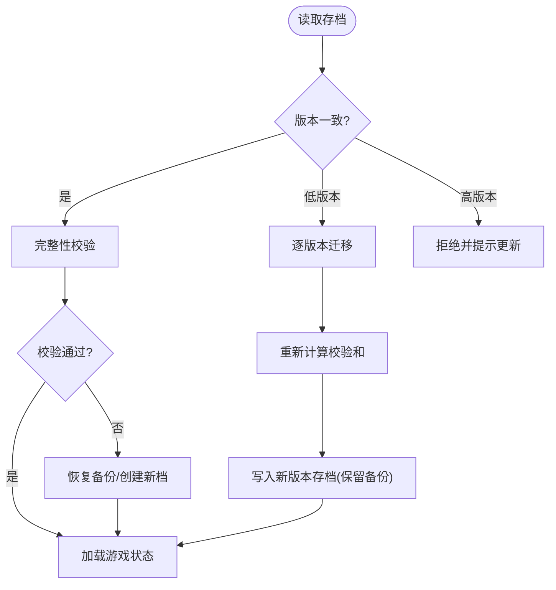
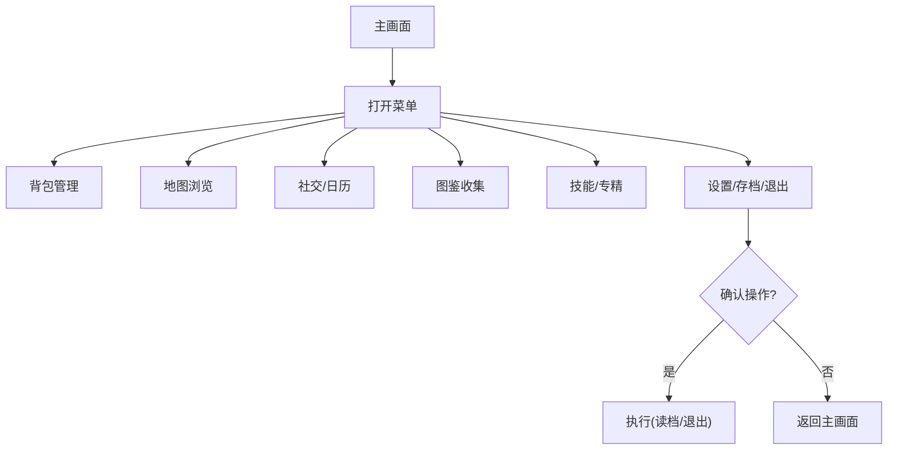
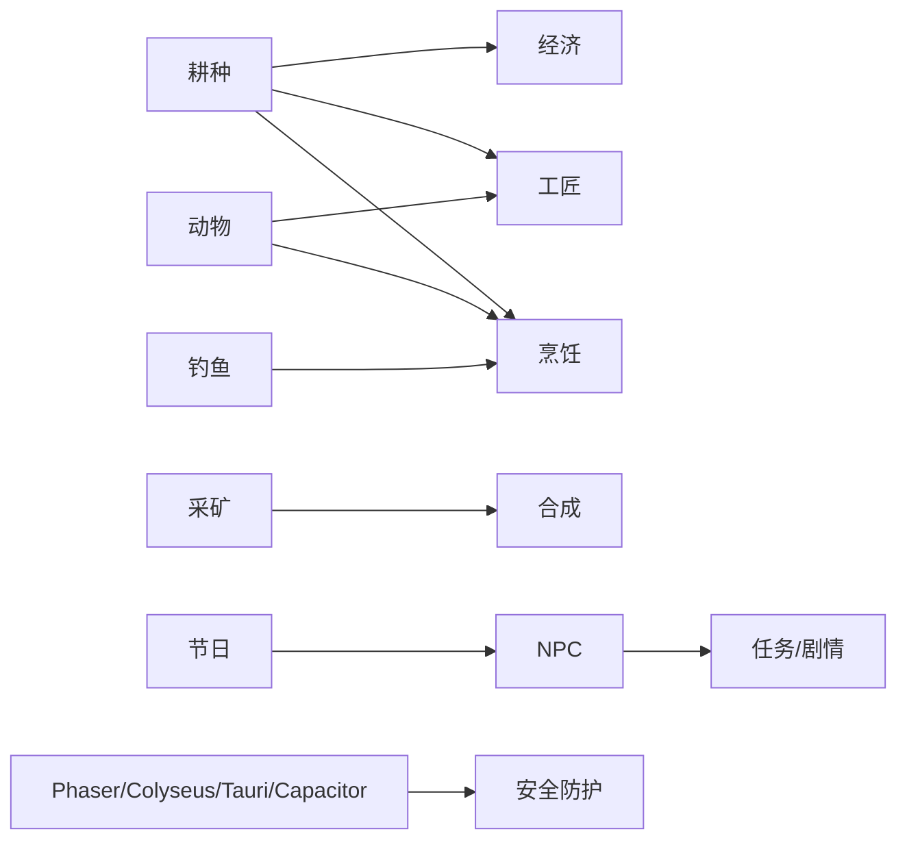

# 项目概述

<cite>
**本文引用的文件**   
- [gdd.md](file://gdd.md)
</cite>

## 目录
1. [引言](#引言)
2. [项目结构](#项目结构)
3. [核心组件](#核心组件)
4. [架构总览](#架构总览)
5. [详细组件分析](#详细组件分析)
6. [依赖关系分析](#依赖关系分析)
7. [性能与安全考量](#性能与安全考量)
8. [故障排查指南](#故障排查指南)
9. [结论](#结论)
10. [附录](#附录)

## 引言
《山野小村》是一款像素风格的乡村生活模拟游戏，玩家继承一座废弃农场，在田园小镇中种田、养殖、交友、探索，重建生活。文档以“舒适循环”为核心体验目标，强调内容密度优先与系统有机整合，确保每个系统都服务于整体体验并相互滋养。技术栈采用 Tauri + Capacitor 实现跨平台（PC/手机）统一代码库，联机采用 Listen Server 模式，配合客户端预测与主机仲裁保障公平一致体验。

本概述面向初学者提供清晰理解路径，同时为有经验的开发者给出技术深度信息，包括设计哲学、目标用户、技术架构、安全防护机制、联机架构、项目结构与主要功能特性等。

## 项目结构
仓库当前包含一份完整的游戏设计规范书（GDD），作为开发过程中的唯一设计参照，覆盖世界观、系统设计、UI/UX、音频、联机、存档、引导、技术架构、安全防护、可及性、排期里程碑与设计决策记录等内容。

**图表来源** 
- [gdd.md:1-20](file://gdd.md#L1-L20)

**章节来源**
- [gdd.md:1-20](file://gdd.md#L1-L20)

## 核心组件
- 设计与原则
  - 三条核心理念：舒适循环、内容密度优先、有机整合
  - 十项不可违背的设计原则：体验优先、渐进解锁、无强制失败、全平台可玩、质量与防护并重、联机不歧视、系统整合闭环、可及性优先等
- 目标玩家画像
  - 年龄 16-35，轻度到中度玩家；偏好 PC 为主、手机碎片时间；买断制付费意愿 20-40 元区间
- 设计边界（SCOPE）
  - P0 核心：耕种、季节/时间、工具升级、地图探索、NPC、主线剧情、多人联机、背包、存档、安全防护框架
  - P1 扩展：战斗、钓鱼、动物养殖、工匠设备、烹饪、节日、建造、通用合成、图鉴
  - 非功能不做：3D、实时 PvP、内购、云存档、成就、角色外观自定义、坐骑载具、动态光影
- 关键系统概览
  - 时间系统：每日 6:00-凌晨 2:00，每季 28 天，一年 112 天，睡觉自动保存
  - 经济系统：金币唯一货币，明确经济曲线与售价计算规则，通胀保护与数值上限
  - 体力系统：初始 270，升级+5，归零拒绝操作但不昏迷
  - 天气系统：四季概率矩阵，影响作物/NPC/钓鱼/采集/动物
  - 耕种系统：翻地→播种→浇水→生长→收获，肥料/洒水器/再生作物
  - NPC 社交：日程/好感度/对话/结婚，多套日程与状态机保护
  - 战斗系统：矿洞 60 层，随机生成，掉落与死亡惩罚温和
  - 钓鱼系统：能量条小游戏，区域分布与难度分级
  - 技能与专精：五维技能树，等级 5/10 二选一且不可重置
  - 工匠设备：蛋黄酱机/奶酪压机/腌菜桶/酿酒桶/蜂箱/织布机/油榨机
  - 建筑系统：鸡舍/畜棚/鱼塘/小屋等，房屋升级路径
  - 烹饪系统：30+ 食谱，恢复体力/增益属性/送礼
  - 通用合成：避雷针/炸弹/种子机/蟹笼/熔炉/箱子等
  - 背包系统：容量扩容、堆叠上限、分类与快速切换
  - 任务/剧情：社区中心修复为主线，支线/求助/收集并行
  - 节日系统：四季各一节日，参与奖+名次奖，联机同享
  - UI/UX：HUD 布局、菜单状态流转、交互反馈规范、通知系统
  - 音频：场景音乐风格、音效命名规范、动态混音与实例上限
  - 联机：Listen Server、最大 4 人、局域网/互联网房间码、Colyseus Schema 增量同步、平等原则、本地预测+主机仲裁
  - 存档：JSON+sha256 校验、原子写入、备份槽位、兼容性迁移
  - 引导：第一天流程与渐进式引导，尊重老手可跳过
  - 技术栈：Phaser 3、Colyseus、Vite、TypeScript、Tauri、Capacitor、Howler.js、Vitest
  - 安全防护：七维熔断保护（循环/渲染/网络/内存/数据/逻辑/I/O/联机专项）
  - 错误恢复：存档/网络/资源/渲染/任务/位置/时间异常恢复策略
  - 日志诊断：分级日志、安全通道默认开启、轮转策略
  - 可及性与本地化：色盲模式、键位重映射、字幕、震动、简体中文首发
  - 排期里程碑：P0 核心原型→P1 内容填充→P2 联机实现→P3 打磨发布
  - 设计禁令：禁止氪金/限时任务/强制多人/永久丢档/广告/过度复杂合成/非线性膨胀/孤岛系统等
  - 术语表与设计决策记录：统一术语、变更记录与变更流程

**章节来源**
- [gdd.md:22-46](file://gdd.md#L22-L46)
- [gdd.md:47-59](file://gdd.md#L47-L59)
- [gdd.md:60-104](file://gdd.md#L60-L104)
- [gdd.md:180-235](file://gdd.md#L180-L235)
- [gdd.md:237-332](file://gdd.md#L237-L332)
- [gdd.md:334-343](file://gdd.md#L334-L343)
- [gdd.md:345-373](file://gdd.md#L345-L373)
- [gdd.md:379-476](file://gdd.md#L379-L476)
- [gdd.md:478-515](file://gdd.md#L478-L515)
- [gdd.md:517-549](file://gdd.md#L517-L549)
- [gdd.md:551-711](file://gdd.md#L551-L711)
- [gdd.md:713-767](file://gdd.md#L713-L767)
- [gdd.md:768-818](file://gdd.md#L768-L818)
- [gdd.md:819-850](file://gdd.md#L819-L850)
- [gdd.md:851-862](file://gdd.md#L851-L862)
- [gdd.md:863-888](file://gdd.md#L863-L888)
- [gdd.md:889-963](file://gdd.md#L889-L963)
- [gdd.md:964-994](file://gdd.md#L964-L994)
- [gdd.md:995-1016](file://gdd.md#L995-L1016)
- [gdd.md:1017-1105](file://gdd.md#L1017-L1105)
- [gdd.md:1106-1173](file://gdd.md#L1106-L1173)
- [gdd.md:1298-1405](file://gdd.md#L1298-L1405)
- [gdd.md:1408-1448](file://gdd.md#L1408-L1448)
- [gdd.md:1451-1590](file://gdd.md#L1451-L1590)
- [gdd.md:1593-1676](file://gdd.md#L1593-L1676)
- [gdd.md:1679-1717](file://gdd.md#L1679-L1717)
- [gdd.md:1720-1771](file://gdd.md#L1720-L1771)
- [gdd.md:1772-1779](file://gdd.md#L1772-L1779)
- [gdd.md:1780-1888](file://gdd.md#L1780-L1888)
- [gdd.md:1890-1945](file://gdd.md#L1890-L1945)
- [gdd.md:1947-1969](file://gdd.md#L1947-L1969)
- [gdd.md:1971-1984](file://gdd.md#L1971-L1984)
- [gdd.md:1987-2009](file://gdd.md#L1987-L2009)
- [gdd.md:2011-2060](file://gdd.md#L2011-L2060)
- [gdd.md:2064-2094](file://gdd.md#L2064-L2094)
- [gdd.md:2097-2175](file://gdd.md#L2097-L2175)

## 架构总览
从设计到技术的双层架构：上层是游戏系统与玩法闭环，下层是跨平台与联机的工程化支撑。

**图表来源** 
- [gdd.md:1176-1271](file://gdd.md#L1176-L1271)
- [gdd.md:1720-1771](file://gdd.md#L1720-L1771)
- [gdd.md:1780-1888](file://gdd.md#L1780-L1888)

## 详细组件分析

### 系统整合与闭环设计
- 正向反馈链示例
  - 耕种→烹饪→战斗/采矿：作物→料理→属性增益→提升效率→获得高级材料→升级工具→更高效耕种
  - 动物→工匠→经济→建筑：动物产品→加工→高价出售→资金→更多建筑→扩大养殖
  - 采矿→合成→耕种/养殖：矿石→设施→自动化/辅助→释放时间做其他事
  - 战斗→合成：怪物材料→特殊设施→被动产出
  - 钓鱼→烹饪→NPC送礼：鱼类→料理→送礼→好感→解锁配方/帮助
  - NPC→玩家：好感提升→赠送配方/帮忙→效率提升→更多社交→更高好感
- 检查清单与门控
  - 每个系统至少与两个其他系统形成正向循环
  - 进度门控按季节推进，逐步解锁区域/系统/经济阶段

**图表来源** 
- [gdd.md:1222-1254](file://gdd.md#L1222-L1254)
- [gdd.md:1273-1295](file://gdd.md#L1273-L1295)

**章节来源**
- [gdd.md:1176-1295](file://gdd.md#L1176-L1295)

### 时间与经济系统
- 时间系统
  - 每日 6:00-凌晨 2:00，每季 28 天，一年 112 天，睡觉自动保存
  - 安全保护：帧时间限制、日分钟上限、无效值回退
- 经济系统
  - 唯一货币金币，初始 500g，经济曲线分阶段目标
  - 售价公式统一，受数值边界保护，防 NaN/Infinity
  - 通胀检查、单件价格上限、日收入上限、金钱封顶

**图表来源** 
- [gdd.md:180-235](file://gdd.md#L180-L235)
- [gdd.md:237-332](file://gdd.md#L237-L332)
- [gdd.md:1593-1676](file://gdd.md#L1593-L1676)

**章节来源**
- [gdd.md:180-235](file://gdd.md#L180-L235)
- [gdd.md:237-332](file://gdd.md#L237-L332)
- [gdd.md:1593-1676](file://gdd.md#L1593-L1676)

### 联机架构与平等原则
- 架构模式
  - Listen Server（主机兼玩家），最大 4 人，局域网自动发现，互联网房间码+NAT 穿透
  - Colyseus Schema 增量同步，主机掌控时间，可选共享/独立金钱模式
- 同步规则
  - 玩家位置 10Hz 增量，地块状态事件触发，物品/金钱可靠传输，NPC 2Hz，聊天可靠
- 平等原则
  - 客户端预测+主机仲裁，移动插值平滑，工具使用冲突回滚，钓鱼/战斗本地判定
- 安全专项
  - 速率限制、消息大小限制、连接超时、状态校验、作弊预防、主机负载保护

**图表来源** 
- [gdd.md:1451-1590](file://gdd.md#L1451-L1590)
- [gdd.md:1819-1828](file://gdd.md#L1819-L1828)
- [gdd.md:1879-1888](file://gdd.md#L1879-L1888)

**章节来源**
- [gdd.md:1451-1590](file://gdd.md#L1451-L1590)
- [gdd.md:1819-1828](file://gdd.md#L1819-L1828)
- [gdd.md:1879-1888](file://gdd.md#L1879-L1888)

### 存档与数据安全
- 规则
  - 睡觉自动保存，3 手动+1 自动槽位，JSON+sha256 校验，主机保存全部
- 数据结构
  - 玩家/农场/世界/联机字段齐全，含版本号与时间戳
- 兼容性与迁移
  - 低版本自动升级填充默认值，高版本拒绝提示更新，损坏恢复备份，原子写入保留原版

**图表来源** 
- [gdd.md:1593-1676](file://gdd.md#L1593-L1676)
- [gdd.md:1841-1857](file://gdd.md#L1841-L1857)

**章节来源**
- [gdd.md:1593-1676](file://gdd.md#L1593-L1676)
- [gdd.md:1841-1857](file://gdd.md#L1841-L1857)

### UI/UX 与交互反馈
- HUD 布局：时间/金钱/季节·日/天气/体力/生命值，底部工具栏与快捷菜单
- 菜单状态流转：背包/地图/社交/图鉴/技能/设置，支持读档/退出确认
- 交互反馈：视觉粒子/震动/音效优先级，通知系统分层显示
- 安全提示：可见与静默两类，避免打扰但保证可追溯

**图表来源** 
- [gdd.md:1298-1405](file://gdd.md#L1298-L1405)

**章节来源**
- [gdd.md:1298-1405](file://gdd.md#L1298-L1405)

### 音频设计
- 场景音乐：按区域/季节/事件区分风格与情绪，资源命名规范
- 音效命名：类别前缀+动作后缀，格式 .ogg
- 技术规范：交叉淡入淡出、环境音分层、动态混响、实例上限回收

**章节来源**
- [gdd.md:1408-1448](file://gdd.md#L1408-L1448)

### 引导与教程
- 第一天流程：信件→工具→翻地→播种→浇水→体力/时间→睡觉保存
- 渐进式引导：首次进小镇/砍树/采矿/钓鱼/战斗/动物/工匠设备/节日/等级5/社区中心

**章节来源**
- [gdd.md:1679-1717](file://gdd.md#L1679-L1717)

## 依赖关系分析
- 系统耦合与协同
  - 耕种驱动经济/工匠/烹饪；动物驱动工匠/经济；采矿驱动合成/工具；钓鱼驱动烹饪/NPC
  - NPC 社交贯穿任务/剧情/解锁；节日串联社交与经济
- 技术依赖
  - Phaser 3 负责渲染与 TileMap；Colyseus 负责网络与 Schema；Tauri/Capacitor 打包跨平台；Vite 构建；TypeScript 严格类型；Howler.js 音频
- 安全护栏
  - 循环/渲染/网络/内存/数据/逻辑/I/O/联机专项，覆盖所有关键路径

**图表来源** 
- [gdd.md:1176-1271](file://gdd.md#L1176-L1271)
- [gdd.md:1720-1771](file://gdd.md#L1720-L1771)
- [gdd.md:1780-1888](file://gdd.md#L1780-L1888)

**章节来源**
- [gdd.md:1176-1271](file://gdd.md#L1176-L1271)
- [gdd.md:1720-1771](file://gdd.md#L1720-L1771)
- [gdd.md:1780-1888](file://gdd.md#L1780-L1888)

## 性能与安全考量
- 性能目标
  - PC/手机均目标 60fps，加载时间 < 3s/< 5s，内存占用 < 500MB/< 200MB，包体 < 50MB
  - 优化方向：减少重绘、对象池复用、限制粒子/动画数量、延迟加载非关键资源
- 安全防护（七维熔断）
  - 游戏循环：单帧≤100ms、迭代上限、看门狗重启场景
  - 渲染：精灵上限、粒子上限、纹理内存限制、瓦片裁剪
  - 网络：速率限制、消息大小限制、连接超时、状态校验
  - 内存：场景切换清理、缓存上限、对象池上限
  - 数据：原子写入、完整性校验、数值边界、恢复策略
  - 逻辑：状态机保护、NPC 日程回退、任务一致性检查、ID 校验
  - I/O：文件大小/扩展名白名单、设置文件校验与恢复
  - 联机：人数上限、主机负载保护、消息队列保护、作弊预防

**章节来源**
- [gdd.md:1748-1779](file://gdd.md#L1748-L1779)
- [gdd.md:1780-1888](file://gdd.md#L1780-L1888)

## 故障排查指南
- 常见异常与恢复
  - 存档损坏：checksum 不匹配/解析错误/字段缺失 → 恢复备份/创建新档/提示用户
  - 网络断开：超时/心跳丢失/连接拒绝 → 自动重连/重试/离线继续
  - 资源加载失败：超时/HTTP 404/解码错误 → 占位替换/重试一次/回退纹理
  - 渲染崩溃：WebGL 上下文丢失/内存不足 → 重启渲染/降低画质/重载场景
  - 任务不一致：目标计数不符/前置缺失/完成标记缺失 → 自动修复/重置到检查点/标记失败
  - 玩家位置异常：越界/碰撞内/低于地面 → 传送出生点/最近安全点/推出墙体
  - 时间异常：时间倒退/跳跃超1小时/跳过一天 → 回退有效值/钳制范围/强制睡觉保存
- 日志与诊断
  - 分级日志（debug/info/warn/error/fatal），安全通道默认开启，轮转策略
  - 安全日志条目包含触发阈值、动作、系统快照

**章节来源**
- [gdd.md:1890-1969](file://gdd.md#L1890-L1969)

## 结论
《山野小村》以“舒适循环”为核心体验，坚持内容密度优先与系统有机整合，通过严谨的进度门控与闭环设计确保玩法自洽。技术层面采用 Phaser 3 + Colyseus + Tauri/Capacitor 的跨平台方案，结合七维安全防护与完善的错误恢复流程，保障稳定与公平体验。文档提供了从设计到工程的全面指引，既适合初学者循序渐进理解，也为资深开发者提供深入的技术细节与最佳实践。

## 附录
- 术语表
  - Tile/GDD/P0-P2/Listen Server/Colyseus/Schema/Client Prediction/LERP/Circuit Breaker/NPC/HUD/CRC
- 设计决策记录
  - 网络框架选择、渲染引擎选择、跨平台打包、首发作物/NPC/食谱/鱼类数量、安全机制引入、联机平等原则、系统整合闭环、交叉引用体系、错误恢复流程、风险清单等
- 变更流程
  - 提出评估→原则/闭环/安全检查→更新引用→记录决策→通知相关方

**章节来源**
- [gdd.md:2097-2175](file://gdd.md#L2097-L2175)